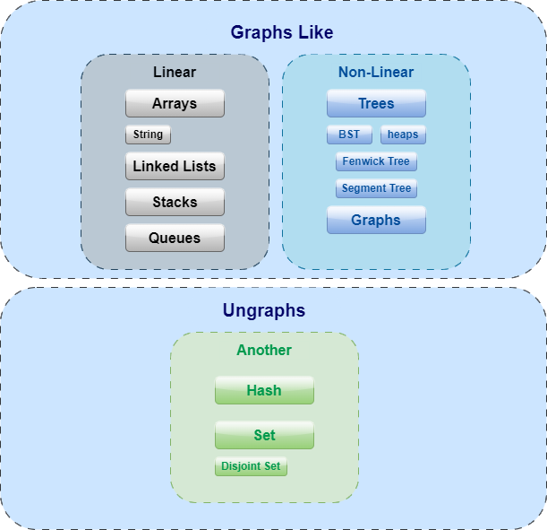
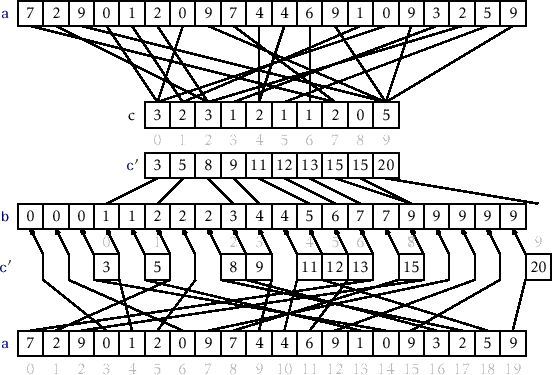
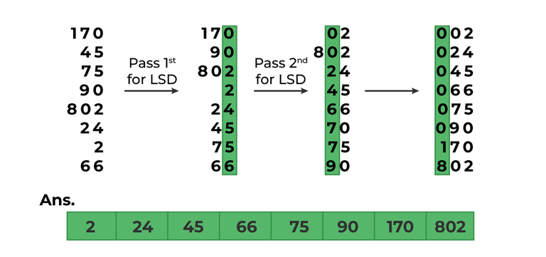

# Overviews
程序的核心构建块主要由两个方面组成：数据结构和算法

## Data Structure


### 图结构
基本线性结构为数组和链表，栈和队列可以视为受限数组结构，而字符串也算是一种特殊的数组。
非线性结构主要有树和图，线性表和树本质上都是受限的图结构

### 非图结构
其他则是非图结构的数据结构，常用的有哈希与集合。
部分算法需要的数据结构：单调栈，树状数组，堆（优先队列），合并集，字典树

## Algorithms

### 核心思想

如果问题具有贪心选择性质，并且每一步的最优选择能够导致全局最优解，可以考虑使用贪心算法。
如果问题可以划分为子问题，且子问题与原问题性质相同，可以考虑使用分治算法。
如果问题具有最优子结构性质，并且子问题的解可以被重复利用，可以考虑使用动态规划算法。
如果问题的解空间结构比较复杂，需要找到所有解，可以考虑使用回溯算法。


1. **贪心算法（Greedy）：**
   - **特点：**
     - 做出每一步的局部最优选择，希望通过一系列局部最优解达到全局最优解。
     - 不回溯，不考虑未来的情况。
   - **适用场景：**
     - 问题具有贪心选择性质，即局部最优解能够导致全局最优解。
     - 子问题间相互独立，不会影响彼此的解。

2. **分治算法（Divide and Conquer）：**
   - **特点：**
     - 将大问题分解成小问题，递归地解决小问题，然后将小问题的解合并起来得到大问题的解。
     - 通常包含三个步骤：分解、解决、合并。
   - **适用场景：**
     - 问题能够被划分为子问题，且子问题与原问题性质相同。

3. **动态规划算法（Dynamic Programming）：**
   - **特点：**
     - 通过记忆化存储中间结果，避免重复计算，将问题划分为重叠子问题。
     - 通常包含两个步骤：计算最优值（自底向上或自顶向下）和构造最优解。
   - **适用场景：**
     - 问题具有最优子结构性质，即问题的最优解可以通过子问题的最优解来构造。
     - 重叠子问题，即问题可以被划分为子问题，且这些子问题会被反复解决。

4. **回溯算法（Backtracking）：**
   - **特点：**
     - 通过逐步构建解决方案，当发现当前解决方案不能达到目标时，回退到之前的状态，尝试其他可能性。
     - 通常采用递归来实现。
   - **适用场景：**
     - 问题的解空间结构比较复杂，难以使用其他方法求解。
     - 需要找到所有解，而不仅仅是一个解。


### 排序
#### 冒泡/选择/插入
实现简单，不考虑复现

#### 快速

快速排序（QuickSort）是一种常用的排序算法，属于分治法的一种。它的基本思想是选择一个基准元素，将数组分成两个子数组，小于基准的放在左边，大于基准的放在右边，然后对子数组递归地应用相同的方法。

```python
#qs最简实现
def quicksort(arr):
    if len(arr) <= 1:
        return arr
    else:
        pivot = arr[0]
        less = [x for x in arr[1:] if x <= pivot]
        greater = [x for x in arr[1:] if x > pivot]
        return quicksort(less) + [pivot] + quicksort(greater)
```
```python
#qs双指针实现
array=[3, 6, 8, 10, 1, 2, 1]
def quicksort(begin, end):
    if begin < end:
        key = array[begin]
        i = begin
        j = end
        while i < j:
            while i < j and array[j] > key:
                j -= 1
            if i < j:
                array[i] = array[j]
                i += 1
            while i < j and array[i] < key:
                i += 1
            if i < j:
                array[j] = array[i]
                j -= 1
        array[i] = key
        quicksort(begin, i - 1)
        quicksort(i + 1, end)
quicksort(0, len(array) - 1)
```
#### 归并
```python
def merge_sort(arr):
    if len(arr) > 1:
        mid = len(arr) // 2
        left_half = arr[:mid]
        right_half = arr[mid:]

        merge_sort(left_half)
        merge_sort(right_half)

        i = j = k = 0

        while i < len(left_half) and j < len(right_half):
            if left_half[i] < right_half[j]:
                arr[k] = left_half[i]
                i += 1
            else:
                arr[k] = right_half[j]
                j += 1
            k += 1

        while i < len(left_half):
            arr[k] = left_half[i]
            i += 1
            k += 1

        while j < len(right_half):
            arr[k] = right_half[j]
            j += 1
            k += 1

```
#### 堆
使用编程自带工具类实现
```python
    import heapq  #全称 Heap Queue,内置模块，提供了对堆的支持。它实现了堆队列算法,默认最小堆

    nums = [3, 1, 4, 1, 5, 9, 2, 6, 5, 3, 5]
    q = [(-num, i) for i,num in enumreate(nums)] #最大堆的实现方法，对于元组默认使用第一个数据建堆
    heapq.heapify(q)
    data = (4, 7)#(data, index)
    # 堆操作
    heapq.heappush(q, data)
    heapq.heappop(q)
```

```Java
    PriorityQueue<int[]> pq = new PriorityQueue<int[]>(new Comparator<int[]>() {
        public int compare(int[] pair1, int[] pair2) {
            return pair1[0] != pair2[0] ? pair2[0] - pair1[0] : pair2[1] - pair1[1];
        }
    });
    
    pq.peek();
    pq.poll();
    pq.offer(new int[]{nums[i], i});

```


相关题：[滑动窗口最大值](https://leetcode.cn/problems/sliding-window-maximum/description/?envType=study-plan-v2&envId=top-100-liked)

#### 计数/基数/桶
相对特殊的排序方式，不考虑复现
 
Counting-Sort

Radix-Sort
 
Bucket-Sort

### 遍历

遍历分为深度遍历/广度遍历

只考虑图数据结构的遍历，非图结构基于本身特性特殊遍历，不做考虑

#### 线性表遍历
对于线性表深度遍历 = 广度遍历，即线性遍历

#### 树遍历

深度遍历：树的深度遍历基于访问时机分为先根遍历(访问时记录)与后根遍历(离开时遍历)，其中二叉树由于结构特殊性和泛用性分为前序(自左向右先根遍历)、后序(自左向右后根遍历)、中序(纯粹自左向右遍历，常用于BST)


广度遍历：层次遍历

#### 图遍历
广义上的深度遍历、广度遍历，没有特殊性，遍历方式由物理存储结构决定(矩阵与表)


### 其他
#### KMP
```python
'''
lps(Longest Proper Prefix which is Suffix)/next数组构造
i为遍历索引(不回退)/pin为记录索引记录lps数组数值
'''
def build_lps(pattern):
    m = len(pattern)
    lps = [0] * m
    pin = 0

    for i in range(1, m):
        while pin > 0 and pattern[i] != pattern[pin]:
            pin = lps[pin - 1]

        if pattern[i] == pattern[pin]:
            pin += 1

        lps[i] = pin

    return lps

'''
kmp_search
i为主串索引(不回退)/pin为子串索引
'''
def kmp_search(text, pattern):
    n = len(text)
    m = len(pattern)

    lps = build_lps(pattern)
    pin = 0

    for i in range(n):
        while pin > 0 and text[i] != pattern[pin]:
            pin = lps[pin - 1]

        if text[i] == pattern[pin]:
            pin += 1

        if pin == m:
            print("Pattern found at index:", i - pin + 1)
            pin = lps[pin - 1]

# Example usage:
text = "ABABDABACDABABCABAB"
pattern = "ABABCABAB"
kmp_search(text, pattern)
```

lps实现KMP本质是动态规划，构造lps是子串本身进行主子串匹配，子串search是对主子串进行lps构成，唯一区别是输出内容的差异。

核心代码：`while pin > 0 and text[i] != pattern[pin]: pin = lps[pin - 1]`


相关题：[字符串匹配](https://leetcode.cn/problems/find-the-index-of-the-first-occurrence-in-a-string/description/)
