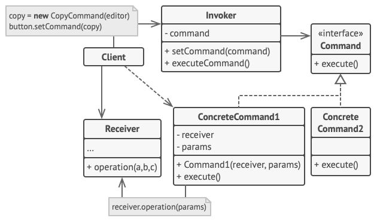
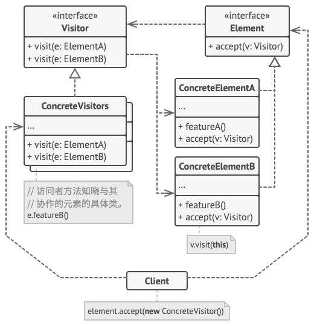

- [设计原则](#设计原则)
  - [单一职责原则(Single Responsibility Principle)](#单一职责原则single-responsibility-principle)
  - [依赖倒置原则(Dependence Inversion Principle,DI)](#依赖倒置原则dependence-inversion-principledi)
  - [开闭原则(The Open/Closed Principle, OCP)](#开闭原则the-openclosed-principle-ocp)
  - [接口隔离原则(Interface Segregation Principle,ISP)](#接口隔离原则interface-segregation-principleisp)
  - [里氏替换原则(Liskov Substitution Principle,LSP)](#里氏替换原则liskov-substitution-principlelsp)
  - [迪米特法则（Law of Demeter）](#迪米特法则law-of-demeter)
- [设计模式基础](#设计模式基础)
- [创建模式](#创建模式)
  - [工厂模式（factory pattern）](#工厂模式factory-pattern)
    - [简单工厂模式](#简单工厂模式)
    - [工厂方法模式(Factory Method)](#工厂方法模式factory-method)
      - [应用场景](#应用场景)
      - [特性](#特性)
    - [抽象工厂模式(Abstarct Factory)](#抽象工厂模式abstarct-factory)
      - [应用场景](#应用场景-1)
      - [特性](#特性-1)
  - [生成器模式(建造者模式、Builder)](#生成器模式建造者模式builder)
  - [原型模式（Prototype）](#原型模式prototype)
      - [应用场景](#应用场景-2)
      - [特性](#特性-2)
  - [单例模式（Singleton）](#单例模式singleton)
      - [特性](#特性-3)
- [结构模式](#结构模式)
  - [适配器模式(Wrapper、Adapter)](#适配器模式wrapperadapter)
      - [特性](#特性-4)
  - [桥接模式(Brige)](#桥接模式brige)
  - [组合模式(Composite)](#组合模式composite)
  - [装饰模式(Decorator)](#装饰模式decorator)
  - [外观模式(Facade)](#外观模式facade)
  - [享元模式(Cache、Flyweight)](#享元模式cacheflyweight)
  - [代理模式(Proxy)](#代理模式proxy)
- [行为模式](#行为模式)
  - [责任链模式(命令链、CoR、Chain of Command、Chain of Responsibility)](#责任链模式命令链corchain-of-commandchain-of-responsibility)
  - [命令模式(Action、Transaction、Command)](#命令模式actiontransactioncommand)
  - [迭代器模式(Iteator)](#迭代器模式iteator)
  - [观察者模式(监听者、Event-Subscriber、Listener、Observer)](#观察者模式监听者event-subscriberlistenerobserver)
  - [模板方法模式(Template Method)](#模板方法模式template-method)
  - [访问者模式(Visitor)](#访问者模式visitor)
  - [策略模式(Strategy)](#策略模式strategy)


[主要参考](https://refactoringguru.cn/)


# 设计原则
## 单一职责原则(Single Responsibility Principle)
核心思想：任何一个软件模块中，应该有且只有一个被修改的原因。

## 依赖倒置原则(Dependence Inversion Principle,DI)
核心思想：高层模块不应该依赖底层模块，二者都该依赖其抽象；抽象不应该依赖细节；细节应该依赖抽象；  
说明：高层模块就是调用端，低层模块就是具体实现类。抽象就是指接口或抽象类。细节就是实现类。  
通俗来讲：依赖倒置原则的本质就是通过抽象（接口或抽象类）使个各类或模块的实现彼此独立，互不影响，实现模块间的松耦合。模块之间交互应该依赖抽象，而非实现。优点：大幅提高了可扩展性，降低耦合度，使代码层次更加清晰。

## 开闭原则(The Open/Closed Principle, OCP) 
核心思想：软件实体应该「对扩展开放，对修改关闭」。

## 接口隔离原则(Interface Segregation Principle,ISP)
核心思想：多个特定的接口要好于一个宽泛用途的接口
通俗来讲：建立单一接口，不要建立庞大臃肿的接口，尽量细化接口，接口中的方法尽量少。也就是说，我们要为各个类建立专用的接口，而不要试图去建立一个很庞大的接口供所有依赖它的类去调用。

优点：将外部依赖减到最少。你只需要依赖你需要的东西。这样可以降低模块之间的耦合。注意：接口尽量小，但是要有限度。对接口进行细化可以提高程序设计灵活性，但是如果过小，则会造成接口数量过多，使设计复杂化。所以一定要适度。提高内聚，减少对外交互。使接口用最少的方法去完成最多的事

## 里氏替换原则(Liskov Substitution Principle,LSP)
核心思想：程序中的父类型都应该可以正确地被子类替换。  
原理：LSP 是继承复用的基石，只有当子类可以替换掉父类，且软件的功能不受到任何影响时，父类才能真正被复用，而子类也能够在父类的基础上增加新的行为。  
通俗来讲：只要有父类出现的地方，都可以使用子类来替代。而且不会出现任何错误或者异常。但是反过来却不行。子类出现的地方,不能使用父类来替代。例如：我喜欢动物，那我一定喜欢狗，因为狗是动物的子类；但是我喜欢狗，不能据此断定我喜欢动物，因为我并不喜欢老鼠，虽然它也是动物。优点：代码共享，减少创建类的工作量。提高代码的重用性，可扩展性。缺点：继承是侵入性的。只要继承，就必须拥有父类的所有属性和方法；增强了耦合性。当父类的常量、变量和方法被修改时，需要考虑子类的修改注意：如果子类不能完整地实现父类的方法，或者父类的某些方法在子类中已经发生“畸变”，则建议断开父子继承关系 采用依赖、聚合、组合等关系代替继承。最佳实践：我们最好将父类定义为抽象类，并定义抽象方法，让子类重新定义这些方法，当父类是抽象类时候，父类不能实例化


## 迪米特法则（Law of Demeter）
核心思想：一个实体应当尽量少地与其他实体之间发生相互作用，使得系统功能模块相对独立
法则强调了以下两点：

第一: 从被依赖者的角度来说：只暴露应该暴露的方法或者属性
第二: 从依赖者的角度来说：只依赖应该依赖的对象

# 设计模式基础
设计模式是软件设计中常见问题的典型解决方案。 它们就像能根据需求进行调整的预制蓝图， 可用于解决代码中反复出现的设计问题。

最基础的、 底层的模式通常被称为惯用技巧。 这类模式一般只能在一种编程语言中使用。

最通用的、 高层的模式是构架模式。 开发者可以在任何编程语言中使用这类模式。 与其他模式不同， 它们可用于整个应用程序的架构设计。


所有模式可以根据其意图或目的来分类。 主要的三种模式类别：

    创建型模式提供创建对象的机制， 增加已有代码的灵活性和可复用性。

    结构型模式介绍如何将对象和类组装成较大的结构， 并同时保持结构的灵活和高效。

    行为模式负责对象间的高效沟通和职责委派。


# 创建模式

## 工厂模式（factory pattern）

[](#简单工厂模式)
[](#工厂方法模式factory-method)
[](#抽象工厂模式abstarct-factory)

### 简单工厂模式
该模式对对象创建管理方式最为简单，因为其仅仅简单的对不同类对象的创建进行了一层薄薄的封装。该模式通过向工厂传递类型来指定要创建的对象

```Java
//Phone类：手机标准规范类(AbstractProduct)
public interface Phone {
    void make();
}

//MiPhone类：制造小米手机（Product1）
public class MiPhone implements Phone {
    public MiPhone() {
        this.make();
    }
    @Override
    public void make() {
        // TODO Auto-generated method stub
        System.out.println("make xiaomi phone!");
    }
}

//IPhone类：制造苹果手机（Product2）
public class IPhone implements Phone {
    public IPhone() {
        this.make();
    }
    @Override
    public void make() {
        // TODO Auto-generated method stub
        System.out.println("make iphone!");
    }
}

//PhoneFactory类：手机代工厂（Factory）
public class PhoneFactory {
    public Phone makePhone(String phoneType) {
        if(phoneType.equalsIgnoreCase("MiPhone")){
            return new MiPhone();
        }
        else if(phoneType.equalsIgnoreCase("iPhone")) {
            return new IPhone();
        }
        return null;
    }
}

//演示
public class Demo {
    public static void main(String[] arg) {
        PhoneFactory factory = new PhoneFactory();
        Phone miPhone = factory.makePhone("MiPhone");            // make xiaomi phone!
        IPhone iPhone = (IPhone)factory.makePhone("iPhone");    // make iphone!
    }
}
```


### 工厂方法模式(Factory Method)
和简单工厂模式中工厂负责生产所有产品相比，工厂方法模式将生成具体产品的任务分发给具体的产品工厂

```Java
//AbstractFactory类：生产不同产品的工厂的抽象类
public interface AbstractFactory {
    Phone makePhone();
}

//XiaoMiFactory类：生产小米手机的工厂（ConcreteFactory1）
public class XiaoMiFactory implements AbstractFactory{
    @Override
    public Phone makePhone() {
        return new MiPhone();
    }
}

//AppleFactory类：生产苹果手机的工厂（ConcreteFactory2）
public class AppleFactory implements AbstractFactory {
    @Override
    public Phone makePhone() {
        return new IPhone();
    }
}

//演示
public class Demo {
    public static void main(String[] arg) {
        AbstractFactory miFactory = new XiaoMiFactory();
        AbstractFactory appleFactory = new AppleFactory();
        miFactory.makePhone();            // make xiaomi phone!
        appleFactory.makePhone();        // make iphone!
    }
}
```


#### 应用场景
1. 当你在编写代码的过程中， 如果无法预知对象确切类别及其依赖关系时， 可使用工厂方法。  
◐工厂方法将创建产品的代码与实际使用产品的代码分离， 从而能在不影响其他代码的情况下扩展产品创建部分代码。

2. 如果你希望用户能扩展你软件库或框架的内部组件， 可使用工厂方法。  
◐继承可能是扩展软件库或框架默认行为的最简单方法。 但是当你使用子类替代标准组件时， 框架如何辨识出该子类？解决方案是将各框架中构造组件的代码集中到单个工厂方法中， 并在继承该组件之外允许任何人对该方法进行重写。

3. 如果你希望复用现有对象来节省系统资源， 而不是每次都重新创建对象， 可使用工厂方法。  
◐在处理大型资源密集型对象 （比如数据库连接、 文件系统和网络资源） 时， 你会经常碰到这种资源需求。


#### 特性
你可以避免创建者和具体产品之间的紧密耦合。
单一职责原则。 你可以将产品创建代码放在程序的单一位置， 从而使得代码更容易维护。
开闭原则。 无需更改现有客户端代码， 你就可以在程序中引入新的产品类型。
### 抽象工厂模式(Abstarct Factory)
抽象工厂模式通过在AbstarctFactory中增加创建产品的接口，并在具体子工厂中实现新加产品的创建，当然前提是子工厂支持生产该产品。否则继承的这个接口可以什么也不干。

```Java
//PC类：定义PC产品的接口(AbstractPC)
public interface PC {
    void make();
}

//MiPC类：定义小米电脑产品(MIPC)
public class MiPC implements PC {
    public MiPC() {
        this.make();
    }
    @Override
    public void make() {
        // TODO Auto-generated method stub
        System.out.println("make xiaomi PC!");
    }
}

//MAC类：定义苹果电脑产品(MAC)
public class MAC implements PC {
    public MAC() {
        this.make();
    }
    @Override
    public void make() {
        // TODO Auto-generated method stub
        System.out.println("make MAC!");
    }
}

//AbstractFactory类：增加PC产品制造接口

public interface AbstractFactory {
    Phone makePhone();
    PC makePC();
}

//XiaoMiFactory类：增加小米PC的制造（ConcreteFactory1）
public class XiaoMiFactory implements AbstractFactory{
    @Override
    public Phone makePhone() {
        return new MiPhone();
    }
    @Override
    public PC makePC() {
        return new MiPC();
    }
}

//AppleFactory类：增加苹果PC的制造（ConcreteFactory2）
public class AppleFactory implements AbstractFactory {
    @Override
    public Phone makePhone() {
        return new IPhone();
    }
    @Override
    public PC makePC() {
        return new MAC();
    }
}

//演示
public class Demo {
    public static void main(String[] arg) {
        AbstractFactory miFactory = new XiaoMiFactory();
        AbstractFactory appleFactory = new AppleFactory();
        miFactory.makePhone();            // make xiaomi phone!
        miFactory.makePC();                // make xiaomi PC!
        appleFactory.makePhone();        // make iphone!
        appleFactory.makePC();            // make MAC!
    }
}
```
#### 应用场景
 如果代码需要与多个不同系列的相关产品交互， 但是由于无法提前获取相关信息， 或者出于对未来扩展性的考虑， 你不希望代码基于产品的具体类进行构建， 在这种情况下， 你可以使用抽象工厂。

 抽象工厂为你提供了一个接口， 可用于创建每个系列产品的对象。 只要代码通过该接口创建对象， 那么你就不会生成与应用程序已生成的产品类型不一致的产品。

 如果你有一个基于一组抽象方法的类， 且其主要功能因此变得不明确， 那么在这种情况下可以考虑使用抽象工厂模式。

 在设计良好的程序中， 每个类仅负责一件事。 如果一个类与多种类型产品交互， 就可以考虑将工厂方法抽取到独立的工厂类或具备完整功能的抽象工厂类中。

#### 特性
你可以确保同一工厂生成的产品相互匹配。  
你可以避免客户端和具体产品代码的耦合。  
单一职责原则。 你可以将产品生成代码抽取到同一位置， 使得代码易于维护。 
开闭原则。 向应用程序中引入新产品变体时， 你无需修改客户端代码。  


## 生成器模式(建造者模式、Builder)
生成器模式是一种创建型设计模式， 使你能够分步骤创建复杂对象。 该模式允许你使用相同的创建代码生成不同类型和形式的对象。


[生成器模式](https://juejin.cn/post/7132034788609196046)

## 原型模式（Prototype）
用原型实例指定创建对象的种类，并且通过拷贝这些原型创建新的对象。
原型模式其实就是从一个对象再创建另外一个可定制的对象，而且不需知道任何创建的细节
简单说就是先创建一个原型类实例，然后通过克隆的方法来复制一个一样的新对象，这个对象和原来的对象相同或相似

核心：通过自带的Clone（）方法和ICloneable接口创建跟该对象相同的新对象，不需要知道具体的创建细节。


```Java
// 基础原型。
abstract class Shape is
    field X: int
    field Y: int
    field color: string

    // 常规构造函数。
    constructor Shape() is
        // ……

    // 原型构造函数。使用已有对象的数值来初始化一个新对象。
    constructor Shape(source: Shape) is
        this()
        this.X = source.X
        this.Y = source.Y
        this.color = source.color

    // clone（克隆）操作会返回一个形状子类。
    abstract method clone():Shape


// 具体原型。克隆方法会创建一个新对象并将其传递给构造函数。直到构造函数运
// 行完成前，它都拥有指向新克隆对象的引用。因此，任何人都无法访问未完全生
// 成的克隆对象。这可以保持克隆结果的一致。
class Rectangle extends Shape is
    field width: int
    field height: int

    constructor Rectangle(source: Rectangle) is
        // 需要调用父构造函数来复制父类中定义的私有成员变量。
        super(source)
        this.width = source.width
        this.height = source.height

    method clone():Shape is
        return new Rectangle(this)


class Circle extends Shape is
    field radius: int

    constructor Circle(source: Circle) is
        super(source)
        this.radius = source.radius

    method clone():Shape is
        return new Circle(this)


// 客户端代码中的某个位置。
class Application is
    field shapes: array of Shape

    constructor Application() is
        Circle circle = new Circle()
        circle.X = 10
        circle.Y = 10
        circle.radius = 20
        shapes.add(circle)

        Circle anotherCircle = circle.clone()
        shapes.add(anotherCircle)
        // 变量 `anotherCircle（另一个圆）`与 `circle（圆）`对象的内
        // 容完全一样。

        Rectangle rectangle = new Rectangle()
        rectangle.width = 10
        rectangle.height = 20
        shapes.add(rectangle)

    method businessLogic() is
        // 原型是很强大的东西，因为它能在不知晓对象类型的情况下生成一个与
        // 其完全相同的复制品。
        Array shapesCopy = new Array of Shapes.

        // 例如，我们不知晓形状数组中元素的具体类型，只知道它们都是形状。
        // 但在多态机制的帮助下，当我们在某个形状上调用 `clone（克隆）`
        // 方法时，程序会检查其所属的类并调用其中所定义的克隆方法。这样，
        // 我们将获得一个正确的复制品，而不是一组简单的形状对象。
        foreach (s in shapes) do
            shapesCopy.add(s.clone())

        // `shapesCopy（形状副本）`数组中包含 `shape（形状）`数组所有
        // 子元素的复制品。
```
#### 应用场景
1. 如果你需要复制一些对象， 同时又希望代码独立于这些对象所属的具体类， 可以使用原型模式。  
这一点考量通常出现在代码需要处理第三方代码通过接口传递过来的对象时。 即使不考虑代码耦合的情况， 你的代码也不能依赖这些对象所属的具体类， 因为你不知道它们的具体信息。

2. 原型模式为客户端代码提供一个通用接口， 客户端代码可通过这一接口与所有实现了克隆的对象进行交互， 它也使得客户端代码与其所克隆的对象具体类独立开来。  
如果子类的区别仅在于其对象的初始化方式， 那么你可以使用该模式来减少子类的数量。 别人创建这些子类的目的可能是为了创建特定类型的对象。
3. 在原型模式中， 你可以使用一系列预生成的、 各种类型的对象作为原型。

#### 特性
隐藏对象创建细节，提高性能：一般在初始化的信息不发生变化的情况下，克隆是最好的办法。这既隐藏了对象创建的细节，又对性能是大大的提高  
不用重新初始化对象，而是动态地获得对象运行时的状态  

根据实际应用需要涉及到深浅复制问题  
每一个类都需要一个Clone方法  
Clone方法位于类的内部，当对已有类进行改造的时候，需要修改代码，违背开闭原则


## 单例模式（Singleton）
单例模式是一种创建型设计模式， 让你能够保证一个类只有一个实例， 并提供一个访问该实例的全局节点。


```Java
//实现一个粗糙的单例非常简单。 你仅需隐藏构造函数并实现一个静态的构建方法即可。
public final class Singleton {
    private static Singleton instance;
    public String value;

    private Singleton(String value) {
        // The following code emulates slow initialization.
        try {
            Thread.sleep(1000);
        } catch (InterruptedException ex) {
            ex.printStackTrace();
        }
        this.value = value;
    }

    public static Singleton getInstance(String value) {
        if (instance == null) {
            instance = new Singleton(value);
        }
        return instance;
    }
}

//main
public class DemoSingleThread {
    public static void main(String[] args) {
        Singleton singleton = Singleton.getInstance("FOO");
        Singleton anotherSingleton = Singleton.getInstance("BAR");
        System.out.println(singleton.value);
        System.out.println(anotherSingleton.value);
    }
}

//结果
FOO
FOO
```
#### 特性
你可以保证一个类只有一个实例。  
你获得了一个指向该实例的全局访问节点。  
仅在首次请求单例对象时对其进行初始化。  

违反了单一职责原则。 该模式同时解决了两个问题。    
单例模式可能掩盖不良设计， 比如程序各组件之间相互了解过多等。  
该模式在多线程环境下需要进行特殊处理， 避免多个线程多次创建单例对象。  
单例的客户端代码单元测试可能会比较困难， 因为许多测试框架以基于继承的方式创建模拟对象。 由于单例类的构造函数是私有的， 而且绝大部分语言无法重写静态方法， 所以你需要想出仔细考虑模拟单例的方法。 


# 结构模式

## 适配器模式(Wrapper、Adapter)

适配器模式是一种结构型设计模式， 它能使接口不兼容的对象能够相互合作。
```Java
/**
 * Adapter allows fitting square pegs into round holes.
 */
public class SquarePegAdapter extends RoundPeg {
    private SquarePeg peg;

    public SquarePegAdapter(SquarePeg peg) {
        this.peg = peg;
    }

    @Override
    public double getRadius() {
        double result;
        // Calculate a minimum circle radius, which can fit this peg.
        result = (Math.sqrt(Math.pow((peg.getWidth() / 2), 2) * 2));
        return result;
    }
}
```

#### 特性
单一职责原则，你可以将接口或数据转换代码从程序主要业务逻辑中分离。  
开闭原则。 只要客户端代码通过客户端接口与适配器进行交互， 你就能在不修改现有客户端代码的情况下在程序中添加新类型的适配器。  
代码整体复杂度增加， 因为你需要新增一系列接口和类。 有时直接更改服务类使其与其他代码兼容会更简单。

## 桥接模式(Brige)
桥接模式是一种结构型设计模式， 可将一个大类或一系列紧密相关的类拆分为抽象和实现两个独立的层次结构， 从而能在开发时分别使用。

 


## 组合模式(Composite)
组合模式是一种结构型设计模式， 你可以使用它将对象组合成树状结构， 并且能像使用独立对象一样使用它们。


## 装饰模式(Decorator)
装饰模式是一种结构型设计模式， 允许你通过将对象放入包含行为的特殊封装对象中来为原对象绑定新的行为。


## 外观模式(Facade)

外观模式是一种结构型设计模式， 能为程序库、 框架或其他复杂类提供一个简单的接口。


## 享元模式(Cache、Flyweight)
享元模式是一种结构型设计模式， 它摒弃了在每个对象中保存所有数据的方式， 通过共享多个对象所共有的相同状态， 让你能在有限的内存容量中载入更多对象。

## 代理模式(Proxy)


```Java
// 远程服务接口。
interface ThirdPartyTVLib is
    method listVideos()
    method getVideoInfo(id)
    method downloadVideo(id)

// 服务连接器的具体实现。该类的方法可以向腾讯视频请求信息。请求速度取决于
// 用户和腾讯视频的互联网连接情况。如果同时发送大量请求，即使所请求的信息
// 一模一样，程序的速度依然会减慢。
class ThirdPartyTVClass implements ThirdPartyTVLib is
    method listVideos() is
        // 向腾讯视频发送一个 API 请求。

    method getVideoInfo(id) is
        // 获取某个视频的元数据。

    method downloadVideo(id) is
        // 从腾讯视频下载一个视频文件。

// 为了节省网络带宽，我们可以将请求结果缓存下来并保存一段时间。但你可能无
// 法直接将这些代码放入服务类中。比如该类可能是第三方程序库的一部分或其签
// 名是`final（最终）`。因此我们会在一个实现了服务类接口的新代理类中放入
// 缓存代码。当代理类接收到真实请求后，才会将其委派给服务对象。
class CachedTVClass implements ThirdPartyTVLib is
    private field service: ThirdPartyTVLib
    private field listCache, videoCache
    field needReset

    constructor CachedTVClass(service: ThirdPartyTVLib) is
        this.service = service

    method listVideos() is
        if (listCache == null || needReset)
            listCache = service.listVideos()
        return listCache

    method getVideoInfo(id) is
        if (videoCache == null || needReset)
            videoCache = service.getVideoInfo(id)
        return videoCache

    method downloadVideo(id) is
        if (!downloadExists(id) || needReset)
            service.downloadVideo(id)

// 之前直接与服务对象交互的 GUI 类不需要改变，前提是它仅通过接口与服务对
// 象交互。我们可以安全地传递一个代理对象来代替真实服务对象，因为它们都实
// 现了相同的接口。
class TVManager is
    protected field service: ThirdPartyTVLib

    constructor TVManager(service: ThirdPartyTVLib) is
        this.service = service

    method renderVideoPage(id) is
        info = service.getVideoInfo(id)
        // 渲染视频页面。

    method renderListPanel() is
        list = service.listVideos()
        // 渲染视频缩略图列表。

    method reactOnUserInput() is
        renderVideoPage()
        renderListPanel()

// 程序可在运行时对代理进行配置。
class Application is
    method init() is
        aTVService = new ThirdPartyTVClass()
        aTVProxy = new CachedTVClass(aTVService)
        manager = new TVManager(aTVProxy)
        manager.reactOnUserInput()
```

# 行为模式

## 责任链模式(命令链、CoR、Chain of Command、Chain of Responsibility)

责任链模式是一种行为设计模式， 允许你将请求沿着处理者链进行发送。 收到请求后， 每个处理者均可对请求进行处理， 或将其传递给链上的下个处理者。

 

## 命令模式(Action、Transaction、Command)

命令模式是一种行为设计模式， 它可将请求转换为一个包含与请求相关的所有信息的独立对象。 该转换让你能根据不同的请求将方法参数化、 延迟请求执行或将其放入队列中， 且能实现可撤销操作。




## 迭代器模式(Iteator)

迭代器模式是一种行为设计模式， 让你能在不暴露集合底层表现形式 （列表、 栈和树等） 的情况下遍历集合中所有的元素。


## 观察者模式(监听者、Event-Subscriber、Listener、Observer)
观察者模式是一种行为设计模式， 允许你定义一种订阅机制， 可在对象事件发生时通知多个 “观察” 该对象的其他对象。


## 模板方法模式(Template Method)

模板方法模式是一种行为设计模式， 它在超类中定义了一个算法的框架， 允许子类在不修改结构的情况下重写算法的特定步骤。


```Java
// 抽象类定义了一个模板方法，其中通常会包含某个由抽象原语操作调用组成的算
// 法框架。具体子类会实现这些操作，但是不会对模板方法做出修改。
class GameAI is
    // 模板方法定义了某个算法的框架。
    method turn() is
        collectResources()
        buildStructures()
        buildUnits()
        attack()

    // 某些步骤可在基类中直接实现。
    method collectResources() is
        foreach (s in this.builtStructures) do
            s.collect()

    // 某些可定义为抽象类型。
    abstract method buildStructures()
    abstract method buildUnits()

    // 一个类可包含多个模板方法。
    method attack() is
        enemy = closestEnemy()
        if (enemy == null)
            sendScouts(map.center)
        else
            sendWarriors(enemy.position)

    abstract method sendScouts(position)
    abstract method sendWarriors(position)

// 具体类必须实现基类中的所有抽象操作，但是它们不能重写模板方法自身。
class OrcsAI extends GameAI is
    method buildStructures() is
        if (there are some resources) then
            // 建造农场，接着是谷仓，然后是要塞。

    method buildUnits() is
        if (there are plenty of resources) then
            if (there are no scouts)
                // 建造苦工，将其加入侦查编组。
            else
                // 建造兽族步兵，将其加入战士编组。

    // ……

    method sendScouts(position) is
        if (scouts.length > 0) then
            // 将侦查编组送到指定位置。

    method sendWarriors(position) is
        if (warriors.length > 5) then
            // 将战斗编组送到指定位置。

// 子类可以重写部分默认的操作。
class MonstersAI extends GameAI is
    method collectResources() is
        // 怪物不会采集资源。

    method buildStructures() is
        // 怪物不会建造建筑。

    method buildUnits() is
        // 怪物不会建造单位。
```

## 访问者模式(Visitor)

访问者模式是一种行为设计模式， 它能将算法与其所作用的对象隔离开来。



## 策略模式(Strategy)