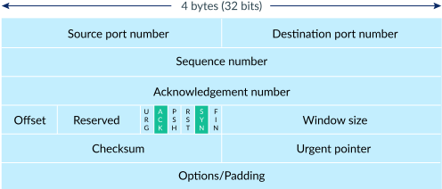
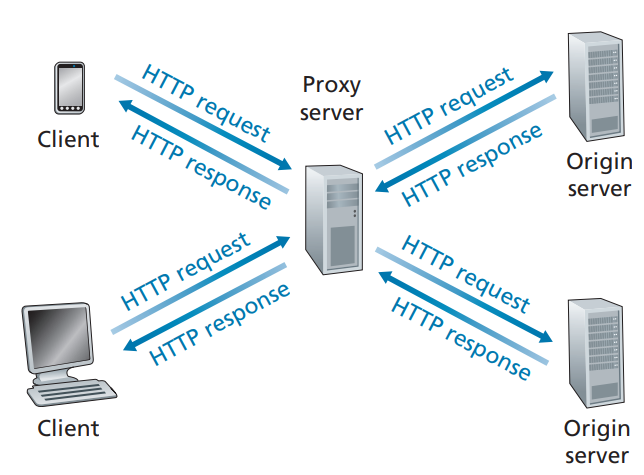
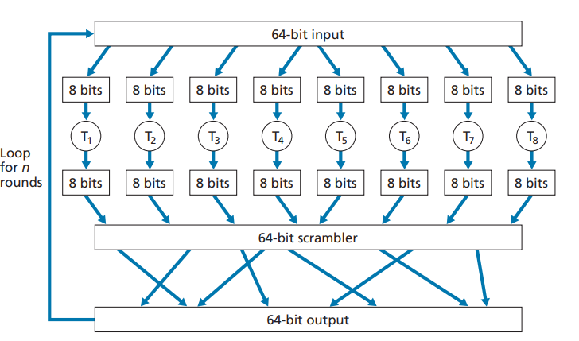

# Link Layer

## Link Layer Base
Link Layer services：
1. Framing
2. Link access. A medium access control (MAC) protocol specifies the rules by which a frame is transmitted onto the link.
3. Reliable delivery
4. Error detection and correction

The Ethernet capabilities are either integrated into the motherboard chipset or implemented via a low-cost dedicated Ethernet chip. For the most part, the link layer is implemented on a chip called **the network adapter**, also sometimes known as a **network interface controller (NIC)**. The network adapter implements many link layer services including framing, link access, error detection, and so on.

### Error-Detection and -Correction(EDC)
#### Parity check
In an even parity scheme, the sender simply includes one additional bit and chooses its value such that the total number of 1s in the d + 1 bits (the original information plus a parity bit) is even. For odd parity schemes, the parity bit value is chosen such that there is an odd number of 1s.

two-dimensional parity:


#### Checksumming Methods
In checksumming techniques, the d bits of data are treated as a sequence of k-bit integers. One simple checksumming method is to simply sum these k-bit integers and use the resulting sum as the error-detection bits. The Internet checksum is based on this approach—bytes of data are treated as 16-bit integers and summed. The 1s complement of this sum then forms the Internet checksum that is carried in the segment header.

#### Cyclic Redundancy Check (CRC)
\[D \cdot 2^r \oplus R = nG\]
\[D \cdot 2^r  = nG \oplus R\]

 modulo-2 arithmetic :
\[R = reminader \frac{D \cdot 2^r}{G}\]


## protocol
two types of network links:point-to-point links (the point-to-point protocol (PPP) and high-level data link control (HDLC)) and broadcast links (Ethernet and wireless LANs).

### Channel Partitioning Protocols
time-division multiplexing (TDM) and frequency-division multiplexing (FDM)
code division multiple access(CDMA)


### Random Access Protocols
#### ALOHA and Slotted ALOHA

maximum efficiency of the pure ALOHA protocol is 1/(2e)

maximum efficiency of the protocol is given by 1/e = 0.37

By retransmitting with probability p.
#### carrier sense multiple access(CSMA) 
##### CSMA with collision detection (CSMA/CD)

CSMA collision

CSMACD collision
binary exponential backoff:
when transmitting a frame that has already experienced n collisions, a node chooses the value of K at random from {0,1,2, . . . . 2n-1}. Thus, the more collisions experienced by a frame, the larger the interval from which K is chosen. For Ethernet, the actual amount of time a node waits is K * 512 bit times (i.e., K times the amount of time needed to send 512 bits into the Ethernet) and the maximum value that n can take is capped at 10.


##### CSMA with collision avoidance(CSMA/CA)reewewe 


If initially the station senses the channel idle, it transmits its frame after a short period of time known as the Distributed Inter-frame Space (DIFS); the station chooses a random backoff value using binary exponential backoff and counts down this value after DIFS when the channel is sensed idle. when the destination station receives a frame that passes the CRC, it waits a short period of time known as the Short Inter-frame Spacing (SIFS) and then sends back an acknowledgment frame. 
#### Taking-Turns Protocols
**polling protocol.** The polling protocol requires one of thenodes to be designated as a master node. The master node polls each of the nodes in a round-robin fashion. 

**token-passing protocol.** In this protocol there is no master node. A small, special-purpose frame known as a token is exchanged among the nodes in some fixed order.

#### EX:Data-Over-Cable Service Interface Specifications (DOCSIS) 


## ARP(Address Resolution Protocol)
###  MAC address(LAN address, physical address)

`MAC`:`8:0:20:3:f6:42`
`MAC broadcast address`:`FF-FF-FF-FF-FF-FF`
48bit

IEEE allocates the chunk of 24 addresses by fixing the first 24 bits of a MAC address and letting the company create unique combinations of the last 24 bits for each .adapter.

### ARP
ARP首次映射：
ARP发送一份称作ARP请求(ARP packet)的以太网数据帧进行广播。ARP请求数据帧中包含目的主机的IP地址。目的主机的ARP层收到这份广播报文后，识别出这是发送端在寻问它的IP地址，于是发送一个ARP应答。这个ARP应答包含IP地址及对应的硬件地址。收到ARP应答后，使ARP进行请求—应答交换的IP数据报现在就可以传送了。
10 
ARP高速缓存:
每个主机上都有一个ARP高速缓存。这个高速缓存存放了最近Internet地址到硬件地址之间的映射记录。高速缓存中每一项的生存时间一般为20分钟，起始时间从被创建时开始算起。


## Ethernet and IEEE 802.3 CSMA/CD (Ethernet)
Ethernet has pretty much taken over the wired LAN market.
All of the Ethernet technologies provide connectionless service and unreliable service to the network layer.


10BASE-T, 10BASE-2, 100BASE-T, 1000BASE-LX, 10GBASE-T and 40GBASE-T
10, 100, 1000, 10G or 40G, for 10 Megabit (per second), 100 Megabit, Gigabit, 10 Gigabit and 40 Gigibit Ethernet
“BASE” refers to baseband Ethernet, meaning that the physical media only carries Ethernet traffic; almost all of the 802.3 standards are for baseband Ethernet.
10BASE-2 and 10BASE-5 standards specify 10 Mbps Ethernet over two types of coaxial cable, each limited in length to 500 meters.copper wire (100BASE-T) and fiber (100BASE-FX, 100BASE-SX, 100BASE-BX)


Ethernet frame structure

**Preamble (8 bytes).** The Ethernet frame begins with an 8-byte preamble field. Each of the first 7 bytes of the preamble has a value of 10101010; the last byte is 10101011. The first 7 bytes of the preamble serve to “wake up” the receiving adapters and to synchronize their clocks to that of the sender’s clock. 

**Destination address (6 bytes).**

**Source address (6 bytes).**

**Type field (2 bytes).** The type field permits Ethernet to multiplex network-layer
protocols. For example, the ARP protocol has its own type number, and if the arriving frame contains an ARP packet (i.e., has a type field of 0806 hexadecimal), the ARP packet will be demultiplexed up to the ARP protocol.

**Data field (46 to 1,500 bytes).** This field carries the IP datagram. The maximum transmission unit (MTU) of Ethernet is 1,500 bytes.The minimum size of the data field is 46 bytes.This means that if the IP datagram is less than 46 bytes, the data field has to be “stuffed” to fill it out to 46 bytes.

**Cyclic redundancy check (CRC) (4 bytes)**

[RFC 894 封装格式](https://akaedu.github.io/book/ch36s02.html)

RFC 894定义了在以太网上传输IP数据包的方式，是以太网中常见的封装方式。

## Link-Layer Switches
Switches are plug-and-play devices

Filtering is the switch function that determines whether a frame should be forwarded to some interface or should just be dropped. Forwarding is the switch function that determines the interfaces to which a frame should be directed, and then moves the frame to those interfaces. Switch filtering and forwarding are done with a switch table.

HOW TO SWITCH:
suppose a frame withdestination address DD-DD-DD-DD-DD-DD arrives at the switch on interface x.The switch indexes its table with the MAC address DD-DD-DD-DD-DD-DD:
• There is no entry in the table for DD-DD-DD-DD-DD-DD. In this case, the switch forwards copies of the frame to the output buffers preceding all interfaces except for interface x. In other words, if there is no entry for the destination address, the switch broadcasts the frame.
• There is an entry in the table, associating DD-DD-DD-DD-DD-DD with interface x. In this case, the frame is coming from a LAN segment that contains adapter DD-DD-DD-DD-DD-DD. There being no need to forward the frame to any of the other interfaces, the switch performs the filtering function by discarding the frame.
• There is an entry in the table, associating DD-DD-DD-DD-DD-DD with interface y≠x. In this case, the frame needs to be forwarded to the LAN segment attached to interface y. The switch performs its forwarding.

self-learning:
The switch table is initially empty.
For each incoming frame received on an interface, the switch stores in its table (1) the MAC address in the frame’s source address field, (2) the interface from which the frame arrived, and (3) the current time. In this manner, the switch records in its table the LAN segment on which the sender resides. If every host in the LAN eventually sends a frame, then every host will eventually get recorded in the table.
The switch deletes an address in the table if no frames are received with that address as the source address after some period of time (the aging time). 

## Wireless Network and mobile


The signal-to-noise ratio (SNR) is a relative measure of the strength of the received signal (i.e., the information being transmitted) and this noise. The SNR is typically measured in units of decibels (dB). 
The bit error rate (BER), the probability that a transmitted bit is received in error at the receiver.

\[SNR_\text{dB} = 20 \log_{10} \left( \frac{A_\text{signal}}{A_\text{noise}} \right)\]


The fundamental building block of the 802.11 architecture is the basic service set (BSS). A BSS contains one or more wireless stations and a central base station, known as an access point (AP) in 802.11 parlance.
## PPP
[PPP 协议的帧格式](https://blog.51cto.com/u_14035463/5583827)

主要用于在点对点连接上进行通信，支持不同的网络层协议。

## Loopback Interface
允许运行在同一台主机上的客户程序和服务器程序通过TCP/IP进行通信。A类网络号127就是为环回接口预留的。根据惯例，大多数系统把IP地址`127.0.0.1`分配给这个接口，并命名为`localhost`。一个传给环回接口的IP数据报不能在任何网络上出现。


# Internet Layer
##  Internet Layer Base
Internet Layer have two function:
Forwarding(data plane) and Routing(control plane,is routing algorithms)

### Router Architecture
Overview

Input port

Output Port

## IP(Internet Protocol)
characteristics ：
unreliable/connectionless

IP provides logical communication between hosts.
The IP service model is a best-effort delivery service and unreliable service


`Header Length`  unit:`32-bit`
`type of service (ToS)`
`Datagram length` unit:`8-bit` 以太网的最小帧长为46字节
`Identifier, flags, fragmentation offset` IP fragmentation 相关
`TTL(Time to live)`:其初始值由源主机设置（通常为32或64）

### 路由选择
Router table:
- 目的IP地址。它既可以是一个完整的主机地址，也可以是一个网络地址。
- 下一跳路由器（next-hop router）的IP地址。
- 标志。其中一个标志指明目的IP地址是网络地址还是主机地址，另一个标志指明下一站路由器是否为真正的下一站路由器，还是一个直接相连的接口。
- 为数据报的传输指定一个网络接口。

### 广播/组播
- 受限广播：255.255.255.255
  该地址用于主机配置过程中IP数据报的目的地址，此时，主机可能还不知道它所在网络的网络掩码，甚至连它的IP地址也不知道。在任何情况下，路由器都不转发目的地址为受限的广播地址的数据报，这样的数据报仅出现在本地网络中。

- 指向网络的广播：主机号为全1的地址。如A类网络广播地址为netid.255.255.255，其中netid为A类网络的网络号。
    一个路由器必须转发指向网络的广播，但它也必须有一个不进行转发的选择。

- 指向子网的广播：主机号为全1且有特定子网号的地址。作为子网直接广播地址的IP地址需要了解子网的掩码。例如，如果路由器收到发往128.1.2.255的数据报，当B类网络128.1的子网掩码为255.255.255.0时，该地址就是指向子网的广播地址；但如果该子网的掩码为255.255.254.0，该地址就不是指向子网的广播地址。

- 指向所有子网的广播：也需要了解目的网络的子网掩码，以便与指向网络的广播地址区分开。指向所有子网的广播地址的子网号及主机号为全1。例如，如果目的子网掩码为255.255.255.0，那么IP地址128.1.255.255是一个指向所有子网的广播地址。然而，如果网络没有划分子网，这就是一个指向网络的广播。

### IGMP（Internet Group Management Protocol）
是一种用于在IP网络上进行组播（multicast）通信的协议。组播是一种一对多的通信模式，其中一个主机可以向一个组中的多个主机发送数据。IGMP用于管理主机加入或离开组播组。

### CIDR(Classless Inter-Domain Routing)
是一种用于分配和管理IP地址的方法。CIDR采用了一种更灵活的方式来表示IP地址和子网掩码，使网络更有效地利用IP地址空间。CIDR表示法使用斜杠（/）后面的数字来表示网络前缀的长度，例如，192.168.1.0/24表示一个包含256个IP地址的网络。
CIDR的使用使得IP地址分配更加灵活，并减少了地址浪费。它被广泛用于互联网路由和IP地址分配。

### Dynamic Host Configuration Protocol (DHCP) 
DHCP allows a host to obtain (be allocated) an IP address automatically. A network administrator can configure DHCP so that a given host receives the same IP address each time it connects to the network, or a host may be assigned a temporary IP address that will be different each time the host connects to the network. In addition to host IP address assignment, DHCP also allows a host to learn additional information, such as its subnet mask, the address of its first-hop router (often called the default gateway), and the address of its local DNS server. It is often referred to as a plug-and-play or zeroconf (zero-configuration) protocol.


DHCP step:
1. **DHCP server discovery.** The first task of a newly arriving host is to find a DHCP server with which to interact. This is done using a DHCP discover message, which a client sends within a UDP packet to port 67. And broadcasts information to the subnet.
2. **DHCP server offer(s).** A DHCP server receiving a DHCP discover message responds to the client with a DHCP offer message that is broadcast to all nodes. Since several DHCP servers can be present on the subnet, the client may find itself in the enviable position of being able to choose from among several offers. Each server offer message contains the transaction ID of the received discover message, the proposed IP address for the client, the network mask, and an IP address lease time.
3. **DHCP request.** The newly arriving client will choose from among one or more server offers and respond to its selected offer with a DHCP request message, echoing back the configuration parameters.
4. **DHCP ACK.** The server responds to the DHCP request message with a DHCP ACK message, confirming the requested parameters.
   
### NAT(Network Address Translation)

是一种网络技术，用于在不同网络之间转换IP地址。它通常用于连接私有网络,帮助解决IPv4地址短缺问题，同时提供了一些网络安全和灵活性的优势。


### Routing Algorithms
classify routing algorithms is according to whether they are centralized or
decentralized:
**centralized routing algorithm.** Algorithms with global state information are often referred to as link-state (LS) algorithms, since the algorithm must be aware of the cost of each link in the network.
**decentralized routing algorithm.** Such decentralized algorithms, with interactive message exchange between neighboring routers is perhaps more naturally suited to control planes where the routers interact directly with each other.The decentralized routing algorithm we are often referred to as distance-vector (DV) algorithm, because each node maintains a vector of estimates of the costs (distances) to all other nodes in the network.

Another classify: static routing algorithms and dynamic routing algorithms
load-sensitive algorithm and load-insensitive

**The Link-State (LS) Routing Algorithm .**base on Dijkstra’s algorithm
会发生Oscillations
**The Distance-Vector (DV) Routing Algorithm .**base on Bellman-Ford algorithm

#### Intra-AS Routing in the Internet: Open Shortest Path First (OSPF) 

OSPF is a link-state protocol that uses flooding of link-state information and a Dijkstra’s least-cost path algorithm. With OSPF, each router constructs a complete topological map (that is, a graph) of the entire autonomous system. Each router then locally runs Dijkstra’s shortest-path algorithm to determine a shortest-path tree to all subnets, with itself as the root node.
With OSPF, a router broadcasts routing information to all other routers in the autonomous system, not just to its neighboring routers. A router broadcasts link-state
information whenever there is a change in a link’s state (for example, a change in cost or a change in up/down status). It also broadcasts a link’s state periodically (at
least once every 30 minutes), even if the link’s state has not changed.

#### Routing Among the ISPs: BGP(border Gateway Protocol)
In BGP, pairs of routers exchange routing information over semi-permanent TCP connectionsusing port 179. Each such TCP connection, along with all the BGP messages sent over the connection, is called a BGP connection. Furthermore, a BGP connection that spans two ASs is called an external BGP (eBGP) connection, and a BGP session between routers in the same AS is called an internal BGP (iBGP) connection. 

each BGP route is written as a list with three components: NEXT-HOP; ASPATH; destination prefix.

such：
IP address of leftmost interface for router 2a; AS2 AS3; x
IP address of leftmost interface of router 3d; AS3; x

##### BGP Route-Selection Algorithm
1. A route is assigned a local preference value as one of its attributes (in addition to the AS-PATH and NEXT-HOP attributes). The local preference of a route could have been set by the router or could have been learned from another router in the same AS. The value of the local preference attribute is a policy decision that is left entirely up to the AS’s network administrator. (We will shortly discuss BGP policy issues in some detail.) The routes with the highest local preference values are selected.
2. From the remaining routes (all with the same highest local preference value), the route with the shortest AS-PATH is selected. If this rule were the only rule for route selection, then BGP would be using a DV algorithm for path determination, where the distance metric uses the number of AS hops rather than the number of router hops.
3. From the remaining routes (all with the same highest local preference value and the same AS-PATH length), hot potato routing is used, that is, the route with the closest NEXT-HOP router is selected.
4. If more than one route still remains, the router uses BGP identifiers to select the route;
## ICMP(Internet Control Message Protocol)
ICMP经常被认为是IP层的一个组成部分。它传递差错报文以及其他需要注意的信息。ICMP报文通常被IP层或更高层协议（TCP或UDP）使用。一些ICMP报文把差错报文返回给用户进程。


不会出现ICMP的情况：

    ICMP差错报文（但ICMP查询报文可能会产生ICMP差错报文）。

    目的地址是广播地址或多播地址（D类地址）的IP数据报。

    作为链路层广播的数据报。

    不是IP分片的第一片。

    源地址不是单个主机的数据报。这就是说，源地址不能为零地址、环回地址、广播地址或多播地址。


# Transport Layer
## UDP(User Datagram Protocol)
是一种面向无连接的传输层协议，它提供了简单的数据传输服务，但不保证可靠性和数据的顺序。

Aside from the multiplexing/demultiplexing function and some light error checking, it adds nothing to IP. In fact, if the application developer chooses UDP instead of TCP, then the application is almost directly talking with IP. 


## TCP(Transmission Control Protocol)
是一种面向连接、可靠的传输层协议。它提供了可靠的、有序的、全双工的字节流传输服务，被广泛用于互联网上的数据通信。



### connection
#### 握手
 

##### 不使用二次握手的原因
- 防止已失效的连接请求导致的混淆： 如果使用两次握手，假设客户端发送连接请求给服务器，但这个请求在网络中滞留了一段时间，而客户端认为连接已经建立，然后重新发送一个新的连接请求，这时服务器会接受这个请求，认为是一个新的连接。这样就可能导致之前滞留的请求最终建立连接，造成混淆。通过三次握手，可以减少这种混淆的可能性。

- 确保双方都能接收和发送数据： 三次握手可以确保客户端和服务器都能够正确地发送和接收数据。在握手的过程中，双方都确认了对方的能力，避免了潜在的通信问题。

- 建立可靠的连接： 三次握手提供了一种确保连接建立的可靠机制。通过在握手的过程中进行序列号的交换，确保了后续的数据传输能够按正确的顺序进行，增加了连接的可靠性。

- 防止资源的浪费：如果只有「两次握手」，如果客户端发送的 SYN 报文在网络中阻塞了，重复发送多次 SYN 报文，那么服务端在收到请求后就会建立多个冗余的无效链接，造成不必要的资源浪费。 
##### 握手消息丢失
- 第一次握手丢失(SYN)
  客户端触发超时重传
- 第二次握手丢失(SYN)
  服务端触发超时重传
- 第三次握手丢失(ACK)
  ACK 报文是不会有重传的，当 ACK 丢失了，就由对方重传对应的报文。服务端触发超时重传

##### SYN攻击处理
- SYN Cookies： 使用SYN Cookies是一种抵御SYN攻击的有效方式。SYN Cookies是一种在服务器端动态生成和验证的标记，用于验证客户端的SYN请求是否合法。这种方法可以降低服务器资源的消耗。

- 防火墙配置： 配置防火墙以限制对服务器的连接请求。可以根据源IP地址、目标端口和连接状态等条件进行过滤，阻止潜在的攻击流量。

- 入侵检测系统（IDS）： 使用入侵检测系统可以及早发现并响应SYN攻击。IDS可以监测网络流量，识别异常的连接行为，并采取相应的防御措施。

- 限制半开连接数量： 配置服务器，限制半开连接的数量。这可以通过操作系统的TCP连接参数或使用专门的网络设备来实现。

#### 挥手


##### 挥手消息丢失
- 第一次挥手丢失(FIN)
  客户端触发超时重传
- 第二次挥手丢失(ACK)
  ACK 丢失了，就由对方重传对应的报文。客户端触发超时重传
- 第三次挥手丢失(FIN)
  服务端触发超时重传
- 第四次握手丢失(ACK)
  ACK 丢失了，就由对方重传对应的报文。服务端触发超时重传

##### 为什么有 `TIME_WAIT` 以及等待时间为 2MSL

- 防止历史连接中的数据，被后面相同四元组的连接错误的接收
- 保证「被动关闭连接」的一方，能被正确的关闭:等待足够的时间以确保最后的 ACK 能让被动关闭方接收，从而帮助其正常关闭。

MSL 是 Maximum Segment Lifetime，报文最大生存时间，2MSL保证关闭前所有旧消息消失。

##### 已经建立了连接，但是客户端突然出现故障的处理
TCP 存在保活机制。

定义一个时间段，在这个时间段内，如果没有任何连接相关的活动，TCP 保活机制会开始作用，每隔一个时间间隔，发送一个探测报文，该探测报文包含的数据非常少，如果连续几个探测报文都没有得到响应，则认为当前的 TCP 连接已经死亡，系统内核将错误信息通知给上层应用程序。

在 Linux 内核可以有对应的参数可以设置保活时间、保活探测的次数、保活探测的时间间隔，以下都为默认值：
```shell
net.ipv4.tcp_keepalive_time=7200
net.ipv4.tcp_keepalive_intvl=75  
net.ipv4.tcp_keepalive_probes=9
```

##### 已经建立了连接，但是服务端的进程崩溃的处理
TCP 的连接信息是由内核维护的，所以当服务端的进程崩溃后，内核需要回收该进程的所有 TCP 连接资源，于是内核会发送第一次挥手 FIN 报文，后续的挥手过程也都是在内核完成，并不需要进程的参与，所以即使服务端的进程退出了，还是能与客户端完成 TCP 四次挥手的过程。

#### linux Socket 


服务端和客户端初始化 socket，得到文件描述符；
服务端调用 bind，将 socket 绑定在指定的 IP 地址和端口;
服务端调用 listen，进行监听；
服务端调用 accept，等待客户端连接；
客户端调用 connect，向服务端的地址和端口发起连接请求；
服务端 accept 返回用于传输的 socket 的文件描述符；
客户端调用 write 写入数据；服务端调用 read 读取数据；
客户端断开连接时，会调用 close，那么服务端 read 读取数据的时候，就会读取到了 EOF，待处理完数据后，服务端调用 close，表示连接关闭。


 

```linux
int listen (int socketfd, int backlog)
```
Linux内核中会维护两个队列：

半连接队列（SYN 队列）：接收到一个 SYN 建立连接请求，处于 SYN_RCVD 状态；
全连接队列（Accpet 队列）：已完成 TCP 三次握手过程，处于 ESTABLISHED 状态；

现在通常认为 backlog 是 accept 队列。

### reliable

| Mechanism | Use,Comments |
|-----------|-----|
| Checksum  | Used to detect bit errors in a transmitted packet. |
| Timer  | Used to timeout/retransmit a packet, possibly because the packet (or its ACK) was lost within the channel. Because timeouts can occur when a packet is delayed but not lost (premature timeout), or when a packet has been received by the receiver but the receiver-to-sender ACK has been lost, duplicate copies of a packet may be received by a receiver. |
| Sequence number | Used for sequential numbering of packets of data flowing from sender to receiver. Gaps in the sequence numbers of received packets allow the receiver to detect a lost packet. Packets with duplicate sequence numbers allow the receiver to detect duplicate copies of a packet. |
| Acknowledgment | Used by the receiver to tell the sender that a packet or set of packets has been received correctly. Acknowledgments will typically carry the sequence number of the packet or packets being acknowledged. Acknowledgments may be individual or cumulative, depending on the protocol. |
| Negative acknowledgment | Used by the receiver to tell the sender that a packet has not been received correctly. Negative acknowledgments will typically carry the sequence number of the packet that was not received correctly. |
| Window, pipelining | The sender may be restricted to sending only packets with sequence numbers that fall within a given range. By allowing multiple packets to be transmitted but not yet acknowledged, sender utilization can be increased over a stop-and-wait mode of operation. We'll see shortly that the window size may be set on the basis of the receiver's ability to receive and buffer messages, or the level of congestion in the network, or both. |
#### 重传机制
- 超时重传
  `RTO（Retransmission Timeout）`控制
  每当遇到一次超时重传的时候，都会将下一次超时时间间隔设为先前值的两倍。两次超时，就说明网络环境差，不宜频繁反复发送。

- 快速重传（Fast Retransmit）
  基本原理是，当发送端收到三个重复的确认时（即，接收端多次确认相同的序列号），它就会立即重传对应的未被确认的数据包，而不必等待超时。

- SACK（Selective Acknowledgment）选择性确认。
  这种方式需要在 TCP 头部「选项」字段里加一个 SACK 的东西，它可以将已收到的数据的信息发送给「发送方」，这样发送方就可以知道哪些数据收到了，哪些数据没收到，知道了这些信息，就可以只重传丢失的数据。

- D-SACK（Duplicate Selective Acknowledgment）
  在TCP中，正常情况下，接收端通过发送ACK（Acknowledgment）报文来确认已成功接收到的数据段。而D-SACK选项允许接收端在ACK报文中指示出已接收到的重复数据段的范围。

  D-SACK的主要目的是改进TCP在面对丢失的数据包时的表现。通过提供对已接收重复数据的明确反馈，发送端可以更精确地选择需要进行快速重传的数据包，而不是简单地等待超时并重传整个窗口。


#### 流量控制
TCP 提供一种机制可以让「发送方」根据「接收方」的实际接收能力控制发送的数据量，这就是所谓的流量控制。

##### 滑动窗口

If k is the number of bits in the packet sequence number field, the
range of sequence numbers is thus [0,2k - 1]. With a finite range of sequence numbers, all arithmetic involving sequence numbers must then be done using modulo 2k arithmetic. (That is, the sequence number space can be thought of as a ring of size 2k, where sequence number 2k - 1 is immediately followed by sequence number 0.)


`SND.WND`：表示发送窗口的大小（大小是由接收方指定的）；

`SND.UNA`（Send Unacknoleged）：是一个绝对指针，它指向的是已发送但未收到确认的第一个字节的序列号，也就是 #2 的第一个字节。

`SND.NXT`：也是一个绝对指针，它指向未发送但可发送范围的第一个字节的序列号，也就是 #3 的第一个字节。

- 缓存与滑窗
TCP 规定是不允许同时减少缓存又收缩窗口的，而是采用先收缩窗口，过段时间再减少缓存，这样就可以避免了丢包情况。
[ref](https://www.xiaolincoding.com/network/3_tcp/tcp_feature.html#%E6%93%8D%E4%BD%9C%E7%B3%BB%E7%BB%9F%E7%BC%93%E5%86%B2%E5%8C%BA%E4%B8%8E%E6%BB%91%E5%8A%A8%E7%AA%97%E5%8F%A3%E7%9A%84%E5%85%B3%E7%B3%BB)

- 窗口关闭
如果窗口大小为 0 时，就会阻止发送方给接收方传递数据，直到窗口变为非 0 为止，这就是窗口关闭。当发生窗口关闭时，接收方处理完数据后，会向发送方通告一个窗口非 0 的 ACK 报文，如果这个通告窗口的 ACK 报文在网络中丢失了,会导致发送方一直等待接收方的非 0 窗口通知，接收方也一直等待发送方的数据，如不采取措施，这种相互等待的过程，会造成了死锁的现象。

为了解决这个问题，TCP 为每个连接设有一个持续定时器，只要 TCP 连接一方收到对方的零窗口通知，就启动持续计时器。如果持续计时器超时，就会发送窗口探测 ( Window probe ) 报文，而对方在确认这个探测报文时，给出自己现在的接收窗口大小。

- 糊涂窗口综合症
如果接收方腾出几个字节并告诉发送方现在有几个字节的窗口，而发送方会义无反顾地发送这几个字节，这就是糊涂窗口综合症。 TCP + IP 头有 40 个字节，为了传输那几个字节的数据，要搭上这么大的开销，这太不经济了。

接受方：
当「窗口大小」小于 min( MSS，缓存空间/2 ) ，也就是小于 MSS 与 1/2 缓存大小中的最小值时，就会向发送方通告窗口为 0，也就阻止了发送方再发数据过来。

发送方:
Nagle 算法，该算法的思路是延时处理，只有满足下面两个条件中的任意一个条件，才可以发送数据：
条件一：要等到窗口大小 >= MSS 并且 数据大小 >= MSS；
条件二：收到之前发送数据的 ack 回包；
只要上面两个条件都不满足，发送方一直在囤积数据，直到满足上面的发送条件。

接收方得满足「不通告小窗口给发送方」+ 发送方开启 Nagle 算法，才能避免糊涂窗口综合症

###### Go-Back-N (GBN) AND Selective Repeat (SR)
演示
https://computerscience.unicam.it/marcantoni/reti/applet/GoBackProtocol/goback.html
https://www2.tkn.tu-berlin.de/teaching/rn/animations/gbn_sr/

![GBN[Computer Networking, EBook, Global Edition - P247]](./source/GBN.png)
![GBN[Computer Networking, EBook, Global Edition - P252]](./source/SR.png)

#### 拥塞控制
在网络出现拥堵时，如果继续发送大量数据包，可能会导致数据包时延、丢失等，这时 TCP 就会重传数据，但是一重传就会导致网络的负担更重，于是会导致更大的延迟以及更多的丢包。于是，就有了拥塞控制，控制的目的就是避免「发送方」的数据填满整个网络。

拥塞窗口 cwnd是发送方维护的一个的状态变量，它会根据网络的拥塞程度动态变化的。
发送窗口 swnd 和接收窗口 rwnd 是约等于的关系，那么由于加入了拥塞窗口的概念后，此时发送窗口的值是swnd = min(cwnd, rwnd)，也就是拥塞窗口和接收窗口中的最小值。

拥塞窗口 cwnd 变化的规则：
只要网络中没有出现拥塞，cwnd 就会增大；
但网络中出现了拥塞，cwnd 就减少；

拥塞控制主要是四个算法：

- 慢启动
  当发送方每收到一个 ACK，拥塞窗口 cwnd 的大小就会加 1
  慢启动门限 `ssthresh （slow start threshold`）状态变量
  当 cwnd < ssthresh 时，使用慢启动算法。
  当 cwnd >= ssthresh 时，就会使用「拥塞避免算法」

- 拥塞避免
  每当收到一个 ACK 时，cwnd 增加 1/cwnd


- 超时重传拥塞发生算法
  `ssthresh` 设为` cwnd/2`，
  `cwnd` 重置为 1 （是恢复为 `cwnd` 初始化值，我这里假定 `cwnd` 初始化值 1）

- 快速重传拥塞发生算法

  `cwnd` = `cwnd/2` ，也就是设置为原来的一半;
  `ssthresh` = `cwnd`;

  进入快速恢复算法:

      拥塞窗口 cwnd = ssthresh + 3 （ 3 的意思是确认有 3 个数据包被收到了）；
      重传丢失的数据包；
      如果再收到重复的 ACK，那么 cwnd 增加 1；
      如果收到新数据的 ACK 后，把 cwnd 设置为第一步中的 ssthresh 的值，原因是该 ACK 确认了新的数据，说明从 duplicated ACK 时的数据都已收到，该恢复过程已经结束，可以回到恢复之前的状态了，也即再次进入拥塞避免状态；


### TCP延迟确认
是一种TCP协议的优化技术，它通过推迟对接收到的数据包的确认（ACK）的发送，以提高网络通信的效率。正常情况下，接收端会立即发送ACK以确认已成功接收到的数据包，但通过延迟确认，可以在一定程度上减少ACK报文的发送次数，从而减小网络上的额外开销。

延迟确认的主要原理是：

等待一段时间： 接收端在接收到数据包后不立即发送确认，而是等待一段时间，通常是等待200毫秒左右。在这个时间窗口内，接收端会尝试收集是否有其他需要确认的数据包，以减少ACK报文的发送次数。

合并多个ACK： 如果在等待的时间内接收到了其他数据包，接收端可以一起确认多个数据包，而不是为每个数据包都发送一个ACK。

提高效率： 通过延迟确认，可以减少网络上的ACK报文的数量，提高网络的效率。在某些情况下，尤其是对于短时延的应用，这种优化可以显著降低通信的延迟。

### 其他特性
#### TCP优化

#### 粘包
粘包的问题出现是因为不知道一个用户消息的边界在哪，如果知道了边界在哪，接收方就可以通过边界来划分出有效的用户消息。

一般有三种方式分包的方式：

固定长度的消息；
特殊字符作为边界；
自定义消息结构
#### 已建立连接的TCP，收到SYN会发生什么
1. 客户端的 SYN 报文里的端口号与历史连接不相同
   
        如果客户端恢复后发送的 SYN 报文中的源端口号跟上一次连接的源端口号不一样，此时服务端会认为是新的连接要建立，于是就会通过三次握手来建立新的连接。

        那旧连接里处于 Established 状态的服务端最后会怎么样呢？

        如果服务端发送了数据包给客户端，由于客户端的连接已经被关闭了，此时客户的内核就会回 RST 报文，服务端收到后就会释放连接。

        如果服务端一直没有发送数据包给客户端，在超过一段时间后，TCP 保活机制就会启动，检测到客户端没有存活后，接着服务端就会释放掉该连接。`


2. 客户端的 SYN 报文里的端口号与历史连接相同

        处于 Established 状态的服务端，如果收到了客户端的 SYN 报文（注意此时的 SYN 报文其实是乱序的，因为 SYN 报文的初始化序列号其实是一个随机数），会回复一个携带了正确序列号和确认号的 ACK 报文，这个 ACK 被称之为 Challenge ACK。

        接着，客户端收到这个 Challenge ACK，发现确认号（ack num）并不是自己期望收到的，于是就会回 RST 报文，服务端收到后，就会释放掉该连接。

### UDP编程

```python
#  UDPClient.py
from socket import *
serverName = 'hostname'
serverPort = 12000
clientSocket = socket(AF_INET, SOCK_DGRAM)
message = input('Input lowercase sentence:')
clientSocket.sendto(message.encode(),(serverName, serverPort))
modifiedMessage, serverAddress = clientSocket.recvfrom(2048)
print(modifiedMessage.decode())
clientSocket.close()
```

```python
#  UDPServer.py
from socket import *
serverPort = 12000
serverSocket = socket(AF_INET, SOCK_DGRAM)
serverSocket.bind(('', serverPort))
print(”The server is ready to receive”)
while True:
 message, clientAddress = serverSocket.recvfrom(2048)
 modifiedMessage = message.decode().upper()
 serverSocket.sendto(modifiedMessage.encode(),
clientAddress)
```
### TCP编程


During the three-way handshake, the client process knocks on the welcoming door of the server process. When the server “hears” the knocking, it creates a
new door—more precisely, a new socket that is dedicated to that particular client.
In our example below, the welcoming door is a TCP socket object that we call
serverSocket; the newly created socket dedicated to the client making the connection is called connectionSocket. Students who are encountering TCP sockets for the first time sometimes confuse the welcoming socket (which is the initial
point of contact for all clients wanting to communicate with the server), and each
newly created server-side connection socket that is subsequently created for communicating with each client.


```python
#  TCPClient.py
from socket import *
serverName = 'servername'
serverPort = 12000
clientSocket = socket(AF_INET, SOCK_STREAM)
clientSocket.connect((serverName,serverPort))
sentence = input('Input lowercase sentence:')
clientSocket.send(sentence.encode())
modifiedSentence = clientSocket.recv(1024)
print('From Server: ', modifiedSentence.decode()) 
clientSocket.close()
```

```python
#  TCPServer.py
from socket import *
serverPort = 12000
serverSocket = socket(AF_INET,SOCK_STREAM)
serverSocket.bind(('',serverPort))
serverSocket.listen(1)
print('The server is ready to receive')
while True:
 connectionSocket, addr = serverSocket.accept()
 sentence = connectionSocket.recv(1024).decode()
 capitalizedSentence = sentence.upper()
 connectionSocket.send(capitalizedSentence.encode()) 
 connectionSocket.close()
```
# Application Layer

## Application conception
### Network Appliation Architectures
#### client-server architecture
#### peer-to-peer architecture
### Transport Services Available to Applications
#### Reliable Data Tranfer
One important service that a transport-layer protocol can potentially provide to an application is process-to-process reliable data transfer. When a transport protocol provides this service, the sending process can just pass its data into the socket and know with complete confidence that the data will arrive without errors at the receiving process.
#### Throughput
#### Timing
#### Security
### Application Protocols
| Application                | Application-Layer Protocol        | Underlying Transport Protocol | default port |
|----------------------------|------------------------------------|-------------------------------|------------------------------------|
| Electronic mail            | SMTP [RFC 5321]                    | TCP                           |
| Remote terminal access     | Telnet [RFC 854]                   | TCP                           |
| Web                        | HTTP 1.1 [RFC 7230]                | TCP                           | HTTP-80|
| File transfer              | FTP [RFC 959]                      | TCP                           | FTP-21|
| Streaming multimedia       | HTTP (e.g., YouTube), DASH         | TCP                           |
| Internet telephony         | SIP [RFC 3261], RTP [RFC 3550], or proprietary (e.g., Skype) | UDP or TCP                   |
| DNS         | Berkeley Internet Name Domain (BIND) [BIND 2020] | UDP                    |


| Application | Application-Layer Protocol | Underlying Transport Protocol |
| :--- | :--- | :--- |
| Electronic mail | SMTP | TCP |
| Remote terminal access | Telnet | TCP |
| Secure remote terminal access | SSH | TCP |
| Web | HTTP, HTTP/3 | TCP (for HTTP), UDP (for HTTP/3) |
| File transfer | FTP | TCP |
| Remote file server | NFS | Typically UDP |
| Streaming multimedia | DASH | Typically UDP |
| Internet telephony | Typically proprietary | Typically UDP |
| Network management | SNMP | Typically UDP |
| Name translation | DNS | Typically UDP |
## HTTP(HyperText Transfer Protocol)
### Common Status Codes


### 常见的HTTP字段
#### typical HTTP request message:
```HTTP
GET /somedir/page.html HTTP/1.1
Host: www.someschool.edu
Connection: close
User-agent: Mozilla/5.0
Accept-language: fr
```
#### typical HTTP response message
```HTTP
HTTP/1.1 200 OK
Connection: close
Date: Tue, 18 Aug 2015 15:44:04 GMT
Server: Apache/2.2.3 (CentOS)
Last-Modified: Tue, 18 Aug 2015 15:11:03 GMT
Content-Length: 6821
Content-Type: text/html
```
请求头（Request Headers）
Host: 指定请求的目标主机和端口号。
User-Agent: 标识客户端的应用程序类型、操作系统、软件厂商或版本号。
Accept: 指定客户端能够处理的媒体类型。
Accept-Language: 指定客户端能够处理的自然语言。
Accept-Encoding: 指定客户端能够处理的内容编码。
Connection: 控制是否保持连接打开或关闭。
Referer (Origin): 包含了当前请求页面的URL，用于指示请求是从哪个页面链接过来的。
Cookie: 包含了先前由服务器通过 Set-Cookie 头部设置的任何 Cookie。
Authorization: 包含了客户端提供给服务器，以便对其进行身份验证的凭据。

响应头（Response Headers）
Date: 指定响应被创建的日期和时间。
Server: 包含关于服务器的信息，如服务器名称和版本。
Content-Type: 指定响应体的媒体类型。
Content-Length: 指定响应体的长度（以字节为单位）。
Content-Encoding: 指定响应体的内容编码。
Cache-Control: 控制缓存行为，指定是否允许缓存以及缓存的有效期等。
Location: 用于重定向，指定客户端应该跳转到的新位置。
Set-Cookie: 用于在客户端存储 Cookie，服务器通过该字段向客户端发送 Cookie。
WWW-Authenticate: 提示客户端进行身份验证，并提供所需的认证方法。
### Cookie


cookie technology components:
a cookie file kept on the user’s end system and managed by
the user’s browser;
a back-end database at the Web site
### Web Caching(Proxy server)


Why use a proxy server? 
Firstly, Web caching can substantially reduce response time for client requests.
Secondly, Web caching can substantially reduce traffic.
#### conditional GET
base on `If-Modified-Since` and `Last-Modified` ,refer to part of Browser cache


### Browser cache
#### 强制缓存
强缓存指的是只要浏览器判断缓存没有过期，则直接使用浏览器的本地缓存，决定是否使用缓存的主动性在于浏览器这边。

强制缓存是利用Response Header字段实现的，它们都用来表示资源在客户端缓存的有效期：
`Cache-Control`， 是一个相对时间；
`Expires`，是一个绝对时间；
如果 HTTP 响应头部同时有 `Cache-Control` 和 `Expires` 字段的话，`Cache-Control` 的优先级高于 `Expires` 。
`Cache-control` 选项更多一些，设置更加精细，所以建议使用 `Cache-Control` 来实现强缓存。具体的实现流程如下：

当浏览器第一次请求访问服务器资源时，服务器会在返回这个资源的同时，在 `Response` 头部加上 `Cache-Control`，`Cache-Control` 中设置了过期时间大小；
浏览器再次请求访问服务器中的该资源时，会先通过请求资源的时间与 `Cache-Control` 中设置的过期时间大小，来计算出该资源是否过期，如果没有，则使用该缓存，否则重新请求服务器；
服务器再次收到请求后，会再次更新 `Response` 头部的 `Cache-Control`

#### 协商缓存
协商缓存就是与服务端协商之后，通过协商结果来判断是否使用本地缓存。

强制缓存是利用Response Header字段实现的，它们都用来表示资源在客户端缓存的有效期：

第一种：请求头部中的 `If-Modified-Since` 字段与响应头部中的 `Last-Modified` 字段实现，这两个字段的意思是：

响应头部中的 `Last-Modified`：标示这个响应资源的最后修改时间；
请求头部中的 `If-Modified-Since`：当资源过期了，发现响应头中具有 `Last-Modified` 声明，则再次发起请求的时候带上 `Last-Modified` 的时间，服务器收到请求后发现有 `If-Modified-Since` 则与被请求资源的最后修改时间进行对比（`Last-Modified`），如果最后修改时间较新（大），说明资源又被改过，则返回最新资源，HTTP 200 OK；如果最后修改时间较旧（小），说明资源无新修改，响应 HTTP 304 走缓存。


第二种：请求头部中的 `If-None-Match` 字段与响应头部中的 `ETag` 字段，这两个字段的意思是：

响应头部中 `Etag：唯一标识响应资源；`
请求头部中的 `If-None-Match`：当资源过期时，浏览器发现响应头里有 Etag，则再次向服务器发起请求时，会将请求头 `If-None-Match` 值设置为 `Etag` 的值。服务器收到请求后进行比对，如果资源没有变化返回 304，如果资源变化了返回 200。
第一种实现方式是基于时间实现的，第二种实现方式是基于一个唯一标识实现的，相对来说后者可以更加准确地判断文件内容是否被修改，避免由于时间篡改导致的不可靠问题。

如果 `ETag` 和 `Last-Modified` 都有，`Etag` 的优先级更高
协商缓存这两个字段都需要配合强制缓存中 `Cache-Control` 字段来使用，只有在未能命中强制缓存的时候，才能发起带有协商缓存字段的请求。


### HTTP/1.1
跨平台，无状态，明文传输，队头阻塞，长连接
### HTTP/2
The primary goals for HTTP/2 are to reduce perceived latency by enabling request
and response multiplexing over a single TCP connection, provide request prioritization
and server push, and provide efficient compression of HTTP header fields. HTTP/2
does not change HTTP methods, status codes, URLs, or header fields. Instead, HTTP/2
changes how the data is formatted and transported between the client and server.


### HTTP优化
减少重定向请求次数；
合并请求；
延迟发送请求；
### HTTP压缩
无损压缩
`Accept-Encoding: gzip, deflate, br`
有损压缩
`Accept: audio/*; q=0.2, audio/basic`


### HTTPS
HTTP+SSL/TLS

#### HTTPS RSA 握手
#### HTTPS ECDHE 握手 
#### HTTPS优化

## domain name system (DNS)
[](https://www.sistrix.com/ask-sistrix/technical-seo/site-structure/what-is-the-difference-between-a-url-domain-subdomain-hostname-etc)


### DNS structure
Root DNS servers. There are more than 1000 root servers instances scattered all
over the world, as shown in Figure 2.18. These root servers are copies of 13 different root servers, managed by 12 different organizations, and coordinated
through the Internet Assigned Numbers Authority [IANA 2020]. 

Top-level domain (TLD) servers. For each of the top-level domains—top-level
domains such as com, org, net, edu, and gov, and all of the country top-level
domains such as uk, fr, ca, and jp—there is TLD server (or server cluster).

Authoritative DNS servers. Every organization with publicly accessible hosts
(such as Web servers and mail servers) on the Internet must provide publicly
accessible DNS records that map the names of those hosts to IP addresses. 

local DNS server. A local DNS server does not strictly belong to
the hierarchy of servers but is nevertheless central to the DNS architecture. Each
ISP—such as a residential ISP or an institutional ISP—has a local DNS server (also
called a default name server).


## Mail

Simple Mail Transfer Protocol (SMTP)
Internet Mail Access Protocol (IMAP) 


https://www.xiaolincoding.com/network/2_http/http_interview.html#http-%E5%9F%BA%E6%9C%AC%E6%A6%82%E5%BF%B5


# secure
## Symmetric 
### Caesar Cipher
凱撒密碼是一種替換加密技術，明文中的所有字母都在字母表上向後（或向前）按照一個固定數目進行偏移後被替換成密文。


### Mono-Alphabetic Substitution Cipher
A mono-alphabetic cipher (aka simple substitution cipher) is a substitution cipher where each letter of the plain text is replaced with another letter of the alphabet. It uses a fixed key which consist of the 26 letters of a “shuffled alphabet”.


https://www.101computing.net/mono-alphabetic-substitution-cipher/

### Block Ciphers

DES uses 64-bit blocks with a 56-bit key. AES uses 128-bit blocks and can operate with keys that are 128, 192, and 256 bits long. 

### Cipher Block Chaining (CBC)

\[c(i) = K_s(m(i)⊕c(i - 1))\]
## Asymmetric
### RSA
同余
欧拉定理


## Message authentication code (MAC)


Message authentication code

## Authentication Protocol ap4.0
1. Alice sends the message “I am Alice” to Bob.
2. Bob chooses a nonce, R, and sends it to Alice.
3. Alice encrypts the nonce using Alice and Bob’s symmetric secret key, KA-B, and sends the encrypted nonce, KA-B (R), back to Bob. As in protocol ap3.1, it is the fact that Alice knows KA-B and uses it to encrypt a value that lets Bob know that the message he receives was generated by Alice. The nonce is used to ensure that Alice is live.
4. Bob decrypts the received message. If the decrypted nonce equals the nonce he sent Alice, then Alice is authenticated.
   


## Pretty Good Privacy (PGP)

uses symmetric key cyptography, public key cryptography, a hash function, and a digital signature
```
-----BEGIN PGP SIGNED MESSAGE-----
Hash: SHA1
Bob:
Can I see you tonight?
Passionately yours, Alice
-----BEGIN PGP SIGNATURE-----
Version: PGP for Personal Privacy 5.0
Charset: noconv
yhHJRHhGJGhgg/12EpJ+lo8gE4vB3mqJhFEvZP9t6n7G6m5Gw2
-----END PGP SIGNATURE-----
```

## Securing TCP Connections: Transport Layer Security (TLS)


 certificate -》 CA
 Master Secret (MS)


$E_B$ = session encryption key for data sent from Bob to Alice
$M_B$ = session HMAC key for data sent from Bob to Alice, where HMAC is a standardized hashed message authentication code (MAC).
$E_A$ = session encryption key for data sent from Alice to Bob
$M_A$ = session HMAC key for data sent from Alice to Bob

Data Tranfer : record+HMAC