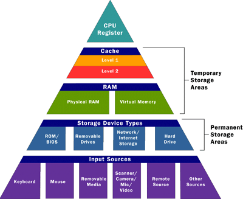
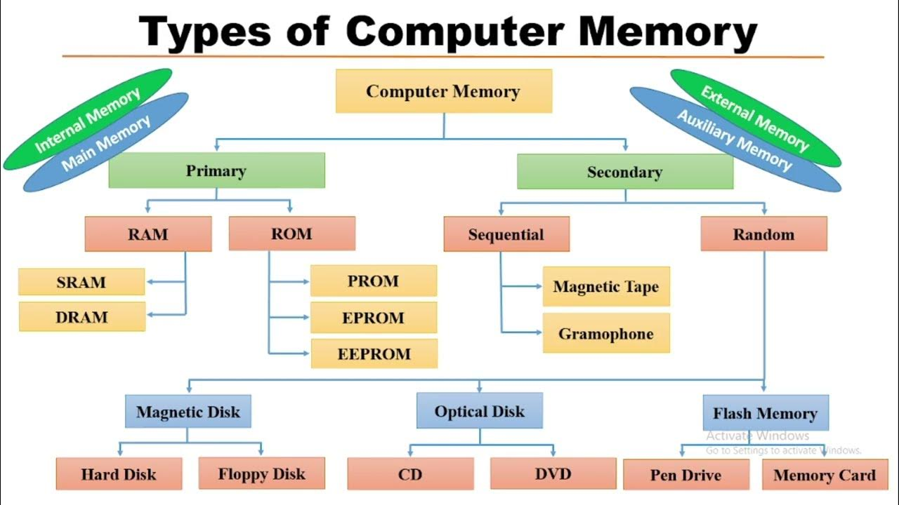

## Memory
 

### RAM(Random Access Memory)
volatile

#### static RAM (SRAM)
To stored in the state of a flip flop, and is primarily used for cache.

#### dynamic RAM (DRAM)
To stores data as a charge on a capacitor. Another widely used type of RAM is ROM, which uses a metal mask that can permanently disable or enable certain transistors, so no more data can be stored. This is also why DVD-ROMs and CD-ROMs cannot store any more data, and are commonly used for movie and music discs.

#### EEPROM (electrically erasable programmable read-only memory) 
Flash memory is also widely used as a non-volatile alternative to SRAM and DRAM, since they constantly need electricity to keep its data. Many new products, such as music players, scientific calculators, and mobile phones use this kind of technology to store their data