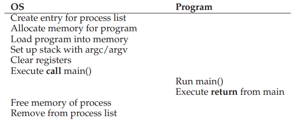
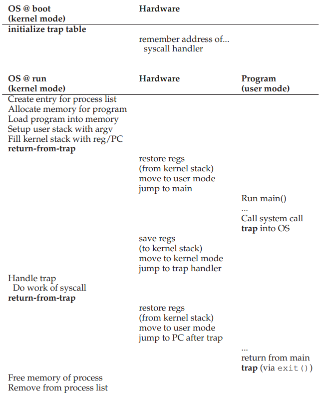
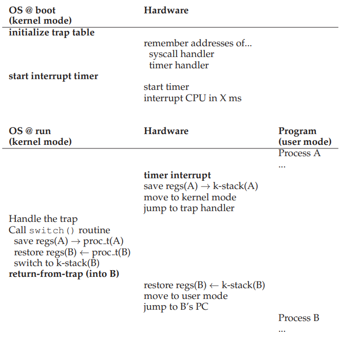
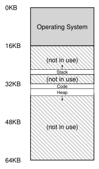
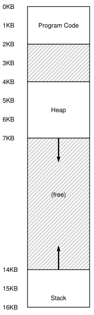
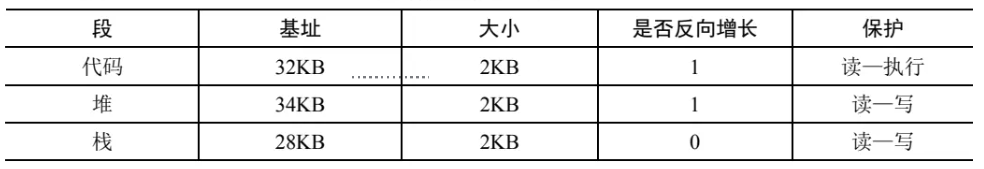

# Process
Process definition: running program

## Process API
- Create：操作系统必须包含一些创建新进程的方法。在shell 中键入命令 或双击应用程序图标时，会调用操作系统来创建新进程，运行指定的程序。
  
        操作系统运行程序必须做的第一件事是将代码和所有静态数据（例如初始化变量）load 到内存中，加载到进程的地址空间中
   
- Destroy：由于存在创建进程的接口，因此系统还提供了一个强制销毁进程的接口。当然，很多进程会在运行完成后自行退出。但是，如果它们不退出， 用户可能希望终止它们，因此停止失控进程的接口非常有用。 
  
- Wait：有时等待进程停止运行是有用的，因此经常提供某种等待接口。 
  
- Miscellaneous control ：除了杀死或等待进程外，有时还可能有其他控制。例如，大多数操作系统提供某种方法来暂停进程（停止运行一段时间）， 然后恢复（继续运行）。 
  
- Status ：通常也有一些接口可以获得有关 进程的状态信息，例如运行了多 长时间，或者处于什么状态。

## 系统调用API
### fork()

进程调用了 `fork()` 系统调用，这是操作系统提供的创建新进程的方法。新创建的进程几乎与调用进程完全一样，对操作系统来说，这谁看起来有两个完全一样的程序运行，并都从 `fork()` 系统调用中返回。新创建的进程称为子进程 (child) ， 原来的进程称为父进程 (parent) 。子进程会从 main() 函数开始执行 ，而是直接从 `fork()` 系统调用返回，就好像是它自己调用了 `fork()` 。 子进程非是完全拷贝了父进程。具体来说，虽然它拥有自己的地址空间（即拥有自己的私有内存）、寄存器、程序计数器等，但是它从 `fork()` 返回的值是不同的。父进程获得的返回值是新创建子进程的 PID ，而子进程获得的返回值是 0 。

### wait()/waitpid()
父进程调用 `wait()` ，延迟自己的执行，直到子进程执行完毕。当子进程结束时， `wait()` 才返回父进程。

### exec()
执行与父进程我同的程序
在 C 语言中，`exec()` 函数有几种变体，例如 `execl()`, `execv()`, `execle()`, `execve()`，等等。这些函数允许你以不同的方式指定参数，环境变量等。
```c
// Using execl() to execute the "ls -l" command
execl("/bin/ls", "ls", "-l", (char *)NULL);
```

## limited direct execution
### Direct execution

只需直接在CPU上运行程序即可。因此，当OS希望启动程序运行时，它会在进程列表中为其创建一个进程条目，为其分配一些内存，将程序代码从磁盘加载到内存中，找到程序入口，跳转到那里，并开始运行用户的代码。下图展示了这种基本的直接执行协议（没有任何限制），使用正常的调用并返回跳转到程序的`main()`，并在稍后回到内核。

### Limited execution
user mode
kernel mode
trap -> return-to-trap
用户模式下运行的代码会受到限制,trap内核模式可执行特权命令，return-to-trap返回用户模式

硬件通过提供不同的执行模式来协助操作系统。在用户模式下，应用程序不能完全访问硬件资源。
 

### Process switch
#### 协作方式：等待系统调用
过去某些系统采用协作方式。在这种风格下，操作系统相信系统的进程会合理运行。运行时间过长的进程被假定会定期放弃CPU，以便操作系统可以决定运行其他任务。然而，在协作方式中，当进程陷入无限循环时，唯一的办法就是重新启动计算机。

#### 非协作方式：操作系统进行控制
如果进程不协作，操作系统可以通过时钟中断获得CPU的控制权。时钟设备可以编程为每隔几毫秒产生一次中断。产生中断时，当前正在运行的进程停止，操作系统中预先配置的中断处理程序会运行。此时，操作系统重新获得CPU的控制权，因此可以停止当前进程，并启动另一个进程。需要注意的是，操作系统在启动时必须通知硬件哪些代码在发生时钟中断时运行。在启动过程中，操作系统也必须启动时钟（特权操作）。一旦时钟开始运行，操作系统就感到安全了，因为控制权最终会归还给它，因此操作系统可以自由运行用户程序。时钟也可以关闭（也是特权操作）。硬件在发生中断时有一定的责任，尤其是在中断发生时，要为正在运行的程序保存足够的状态，以便随后从陷阱返回指令能够正确恢复正在运行的程序。这一组操作与硬件在显式系统调用陷入内核时的行为非常相似，其中各种寄存器因此被保存（进入内核栈），因此从陷阱返回指令可以容易地恢复。

### Context switch


## Sheduling Policy
周转时间公式：\( T_{\text{周转时间}} = T_{\text{完成时间}} - T_{\text{到达时间}} \)
响应时间公式：\( T_{\text{响应时间}} = T_{\text{首次响应时间}} - T_{\text{提交时间}} \)


### FIFO
### SJF
### RR（Round-Robin）
RR 在一个时间片(time slice) 内运行一个工作，然后切换到运行队列中的下一个任务，而不是运行一个任务直 到结束。它反复执行，直到所有任务完成。因此， RR 有时被称为时间切片 (time-slicing)。 时间片长度必须是时钟中断周期的倍数。
### MLFQ (Multi-level Feedback Queue)
- 规则 1 ：如果 A 的优先级 > B 的优先级，运行 A （不运行 B ）。 
- 规则 2 ：如果 A 的优先级 = B 的优先级，轮转运行 A 和 B 。 
- 规则 3 ：工作进入系统时，放在最高优先级（最上层队列）。 
- 规则 4 ：一旦工作用完了其在某一层中的时间配额（无论中间主动放弃了多少次 CPU ），就降低其优先级（移入低一级队列）。 
- 规则 5 ：经过一段时间 S ，就将系统中所有工作重新加入最高优先级队列。 
  
        MLFQ 不需要对工作的运行方式有先验知识，而是通过观察工作的 运行来给出对应的优先级。通过这种方式， MLFQ 可以同时满足各种工作的需求：对于短 时间运行的交互型工作，获得类似于 SJF/STCF 的很好的全局性能，同时对长时间运行的 CPU 密集型负载也可以公平地、不断地稳步向前。因此，许多系统使用某种类型的 MLFQ 作为自己的基础调度程序， 包括类 BSD UNIX 系统 [LM+89 ， B86] 、 Solaris[M06] 以及 Windows NT 和其后的 Window 系列操作系统。


# Address space
操作系统需要提供一个易用的物理内存抽象。这个抽象叫作地址空间（address space） ，是运行的程序看到的系统中的内存。

## Virtual Memory execution
### Virtual Memory的目标
- transparency：操作系统实现虚拟内存的方式，应该让运行的程序看不见。
- efficiency
- protection：操作系统应确保进程受到保护， 不会受其他进程影响，操作系统本身也不会受进程影响。

### 内存类型
- 栈内存：它的申请和 释放操作是编译器来隐式管理的，所以有时也称为自动（ automatic ）内存。
C 中申请栈内存很容易。比如，假设需要在 func() 函数中为一个整形变量 x 申请空间。 为了声明这样的一块内存，只需要这样做： `void func() { int x; // declares an integer on the stack ... } `编译器完成剩下的事情，确保在你进入 func() 函数的时候，在栈上开辟空间。当你从 该函数退出时，编译器释放内存。

- 堆内存：其中所有的申请和释放操作都由程序员显式地完成。下面的例子展示了如何在堆上分配一个整数，得到指向它的指针： `void func() { int * x = (int * ) malloc(sizeof(int)); ... }` 关于这一小段代码有两点说明。首先，栈和堆的分配都发生在这一行： 首先编译器看到指针的声明` (int * x) ` 时，为一个整型指针分配栈空间，随后，当程序调用malloc() 时，它会在堆上请求整数的空间，函数返回这样一个整数的地址（成功时，失败则返回 NULL ） ，然后将其存储在栈中以供程序使用。 x 指针本身可能位于栈上（因为它是一个局部变量），但它指向的内存块是在堆上分配的。[free(x); 用于释放malloc的空间]

分配地址均为逻辑地址
  

### dynamic relocation（base and bound）

动态重定位，用于转换逻辑地址与物理地址，`physical address = virtual address + base`

每个 CPU 需要两个硬件寄存器：基址（ base ）寄存器和界限（ bound ）寄存 器，有时称为限制（ limit ）寄存器。这组基址和界限寄存器，让我们能够将地址空间放在物 理内存的任何位置，同时又能确保进程只能访问自己的地址空间。

## segmention
分段:在 MMU 中引入不止一个基址和界限寄存器对，而是给地址空间内的每个逻辑段一对。一个段只是地址空间里的一个连续定长的区域，在典型的地址空间里有 3 个逻辑不同的段：代码、栈 和堆。分段的机制使得操作系统能够将不同的段放到不同的物理内存区域，从而避免了虚拟地址空间中的未使用部分占用物理内存。

 



反向增长用于处理栈。在物理内存中。如：它始于28KB， 增长回到26KB，相应虚拟地址从 16KB 到 14KB。
protection bit用于支持共享，优化进程间交互
## free-space management
空闲空间链表管理，用于解决外部碎片

常见策略：
- best fit
- worse fit
- first fit
  
        找到第一个足够大的块，将请求的空间返回给用户。首次匹配有速度优势（不需要遍历所有空闲块） ，但有时会让空闲列表开头的部分有很多小块。因此，分配程序如何管理空闲列表的 顺序就变得很重要。一种方式是基于地址排序（ address-based ordering ） 。通过保持空闲块按内存地址有序，合并操作会很容易，从而减少了内存碎片。

- next fit
  
        相比first fit多维护一个指针， 指向上一次查找结束的位置。其想法是将对空闲空间的查找操作扩散到整个列表中去，避免对列表开头频繁的分割。
## page
为了记录地址空间的每个虚拟页放在物理内存中的位置，操作系统通常为每个进程保存一个数据结构，称为页表（page table）。页表存在于计算机系统的主存（RAM）中。页表是一种数据结构，主要作用是为地址空间的每个虚拟页面保存地址转换（address translation），从而让我们知道每个页在物理内存中的位置。

### The Translation Lookaside Buffer (TLB)
A hardware cache that stores a mapping between virtual addresses and physical addresses. It is part of the memory management unit (MMU) in a computer's CPU. The TLB is used to speed up virtual-to-physical address translation by caching recently used translations.

```c
// Step 1: Extract virtual page number (VPN)
N = (VirtualAddress & VPN_MASK) >> SHIFT;

// Step 2: TLB Lookup
(Success, TlbEntry) = TLB_Lookup(VPN);

// Step 3: TLB Hit
if (Success == True) {
    // Step 4: Check Access Permissions
    if (CanAccess(TlbEntry.ProtectBits) == True) {
        // Step 5: Calculate Offset
        Offset = VirtualAddress & OFFSET_MASK;

        // Step 6: Calculate Physical Address
        PhysAddr = (TlbEntry.PFN << SHIFT) | Offset;

        // Step 7: Access Memory
        AccessMemory(PhysAddr);
    } else {
        // Step 9: Raise Protection Fault Exception
        RaiseException(PROTECTION_FAULT);
    }
} else { // TLB Miss
    // Step 11: Calculate PTE Address
    PTEAddr = PTBR + (VPN * sizeof(PTE));

    // Step 12: Retrieve PTE from Memory
    PTE = AccessMemory(PTEAddr);

    // Step 13: Check PTE Validity
    if (PTE.Valid == False) {
        // Step 14: Raise Segmentation Fault Exception
        RaiseException(SEGMENTATION_FAULT);
    } else if (CanAccess(PTE.ProtectBits) == False) {
        // Step 16: Raise Protection Fault Exception
        RaiseException(PROTECTION_FAULT);
    } else {
        // Step 18: TLB Insert
        TLB_Insert(VPN, PTE.PFN, PTE.ProtectBits);

        // Step 19: Retry Instruction
        RetryInstruction();
    }
}
```

### TLB manager
#### context switch
当上下文切换发生时，一种方法是简单地清空（flush）TLB，使得在新进程运行之前TLB变为空的状态。在软件管理TLB的系统中，可以通过一条显式（特权）指令在上下文切换时完成此操作。如果是硬件管理TLB，可以在页表基址寄存器内容发生变化时清空TLB。需要注意的是，在上下文切换时，操作系统必须改变页表基址寄存器（PTBR）的值。无论哪种情况，清空操作都是将全部有效位（valid）置为0，本质上清空了TLB。尽管在上下文切换时清空TLB是一个可行的解决方案，确保进程不会读取到错误的地址映射，但是这种方法存在一定的开销。每次进程运行时，访问数据和代码页都会触发TLB未命中。如果操作系统频繁地切换进程，这种开销会变得很高。

为了减少这种开销，一些系统增加了硬件支持，实现了跨上下文切换的TLB共享。例如，有的系统在TLB中添加了一个地址空间标识符（Address Space Identifier，ASID）。ASID可以被看作是进程标识符（Process Identifier，PID），但通常位数较少（PID一般为32位，ASID一般为8位）。如果两个进程共享同一物理页（例如代码段的页）,可以共享代码页（以二进制或共享库的方式），因为它减少了物理页的使用，从而减少了内存开销。
#### replace
LRU
RANDOM
### multi-level page table
将页表分成页大小的单元。然后，如果整页的页表项（ PTE ）无效，就完全不分配该页的页表。为了追踪页表的页是否有效（以及如果有效，它在内存中的位置） ，使用了名为页目录（ page directory ）的新结构。页目录因此可以告诉你页表的页在哪里，或者页表的整个页不包含有效页。

一些系统将这样的页表放入内核虚拟内存（ kernel virtual memory ） ，从 而允许系统在内存压力较大时，将这些页表中的一部分交换（ swap ）到磁盘。

## swap

硬盘上开辟一部分空间用于物理页的移入和移出一般这样的空间称为swap space ，因为我们将内存中的页交换到swap当中，并在需要的时候又交换回去。因此，我们会假设操作系统能够以页大小为单元读写swap。 为了达到这个目的， 操作系统需要记住给定页的硬盘地址。交换空间的大小是非常重要的，它决定了系统在某一时刻能够使用的最大内存页数。 

#### page fault
在硬件在PTE中查找时，可能会发现页不在物理内存中。硬件（或在软件管理TLB时的操作系统）判断页是否在内存中的方法是通过页表项中的一项新信息，即存在位（present bit）。如果存在位被设置为1，表示该页存在于物理内存中，并且所有内容都按照上述方式进行。如果存在位被设置为零，则页不在内存中，而在硬盘上。访问不在物理内存中的页，这种行为通常被称为页错误（page fault）。

使用swap时，操作系统可以使用PTE中的某些位来存储硬盘地址，这些位通常用于存储像页的PFN这样的数据。当操作系统接收到页错误时，它会在PTE中查找地址，并将请求发送到硬盘，将页读取到内存中。当硬盘I/O完成时，操作系统会更新页表，将此页标记为存在，更新页表项（PTE）的PFN字段以记录新获取页的内存位置，并重试指令。

下一次重新访问TLB仍然未命中，但这次因为页在内存中，所以会将页表中的地址更新到TLB中（也可以在处理页错误时更新TLB以避免此步骤）。最后的重试操作会在TLB中找到转换映射，从已转换的内存物理地址获取所需的数据或指令。

请注意，在I/O运行时，进程将处于阻塞（blocked）状态。因此，当页错误正常处理时，操作系统可以自由地运行其他可执行的进程。由于I/O操作是昂贵的，一个进程进行I/O（页错误）时会执行另一个进程，这种交叠（overlap）是多道程序系统充分利用硬件的一种方式。

为了保证有少量的空闲内存，大多数操作系统会设置高水位线（High Watermark，HW）和低水位线（Low Watermark，LW），来帮助决定何时从内存中清除页。原理是这样：当操作系统发现有少于LW个页可用时，后台负责释放内存的线程会开始运行，直到有HW个可用的物理页。这个后台线程有时称为交换守护进程（swap daemon）或页守护进程（page daemon），它然后会很开心地进入休眠状态，因为它毕竟为操作系统释放了一些内存。

#### replacement policy
##### FIFO
##### Random
##### LRU/LFU
##### Clock
LRU成本较高，故设计的类LRU策略

系统中的所有页都放在一个循环列表中。时钟指针（clock hand）开始时指向某个特定的页（哪个页不重要）。

当必须进行页替换时，操作系统检查当前指向的页P的使用位是1还是0。如果是1，则意味着页面P最近被使用，因此不适合被替换。然后，P的使用位设置为0，时钟指针递增到下一页（P + 1）。该算法一直持续到找到一个使用位为0的页，使用位为0意味着这个页最近没有被使用过（在最坏的情况下，所有的页都已经被使用了，那么就将所有页的使用位都设置为0）。


## 其他
### zombie process
一个进程可以处于已退出但尚未清理的最终（ final ）状态（在基于 UNIX 的系统中，这称为僵尸状 态 ① ） 。这个最终状态非常有用，因为它允许其他进程（通常是创建进程的父进程）检查进 程的返回代码，并查看刚刚完成的进程是否成功执行（通常，在基于 UNIX 的系统中，程 序成功完成任务时返回零，否则返回非零） 。完成后，父进程将进行最后一次调用（例如， wait() ） ，以等待子进程的完成，并告诉操作系统它可以清理这个正在结束的进程的所有相关 数据结构。
### 外部碎片
管理物理内存的空闲空 间。新的地址空间被创建时，操作系统 需要在物理内存中为它的段找到空间。之前， 我们假设所有的地址空间大小相同，物理内 存可以被认为是一些槽块，进程可以放进去。 现在，每个进程都有一些段，每个段的大小 也可能不同。 一般会遇到的问题是，物理内存很快充满了许 多空闲空间的小洞，因而很难分配给新 的段，或扩大已有的段。这种问题被称为外部碎片（ external fragmentation ）

### CISC(Complex Instruction Set Computing) and RISC (Reduced Instruction Set Computing)
在20世纪80年代，计算机体系结构领域爆发了一场激烈的辩论，主要涉及两种不同的设计理念：CISC（复杂指令集计算）和RISC（精简指令集计算）[PS81]。代表CISC阵营的是拥有许多强大指令的架构，而RISC阵营则以Berkeley的David Patterson和Stanford的John Hennessy为代表（他们撰写了一些非常著名的书[HP06]）。虽然后来John Cocke凭借他在RISC上的早期工作[CM00]获得了图灵奖。

CISC指令集通常包含大量功能强大的指令。举例来说，你可能会遇到一个字符串拷贝指令，接受两个指针和一个长度参数，将一些字节从源拷贝到目标。CISC的思想是，指令应该是高级原语，使得汇编语言更易于使用，生成的代码更为紧凑。

与之相反，RISC指令集的核心观点是，指令集实际上是编译器的最终目标。所有编译器实际上只需少量简单的原语，就足以生成高性能的代码。因此，RISC的支持者主张尽可能地从硬件中去除不必要的复杂性（特别是微代码），让剩下的部分保持简单、一致且高效。

早期的RISC芯片产生了巨大的影响，因为它们在性能上明显更快[BC91]。人们发表了许多论文，一些相关的公司也相继成立，例如MIPS和Sun公司。然而，随着时间的推移，像Intel这样的CISC芯片制造商纷纷采纳了许多RISC芯片的优点，例如引入了早期流水线阶段，将复杂的指令转换为一系列微指令，以便以类似RISC的方式运行。这些创新，再加上每个芯片中晶体管数量的增长，使得CISC保持了竞争力。争论最终平息，现在两种类型的处理器都能够取得很快的运行速度。

### thrashing
当内存面临超额请求时，即运行中的进程的内存需求超过了可用的物理内存时，系统将陷入不断的换页操作，这种状态有时被称为抖动（thrashing）。

早期的一些操作系统采用了相当复杂的机制来检测和处理抖动。例如，给定一组进程，系统可以选择不运行其中的一部分，希望减少这些进程的工作集（它们活跃使用的页面），从而取得一些进展。这种方法通常被称为准入控制（admission control），它表明，有时候少做一些工作比试图一次性完成所有任务更为明智，这在现实生活和现代计算机系统中经常遇到（令人遗憾）。

一些现代系统采用更为严格的方法来处理内存过载。例如，在内存超额请求时，某些版本的Linux会运行“内存不足的杀手程序（out-of-memory killer）”。这个守护进程选择一个内存密集型的进程并终止它，以一种直截了当但不太委婉的方式减轻内存压力。虽然成功地缓解了内存压力，但这种方法可能会引发问题，比如如果它终止了X服务器，将导致所有需要显示的应用程序不可用。

## ref
https://www.cnblogs.com/shuo-ouyang/p/12736927.html