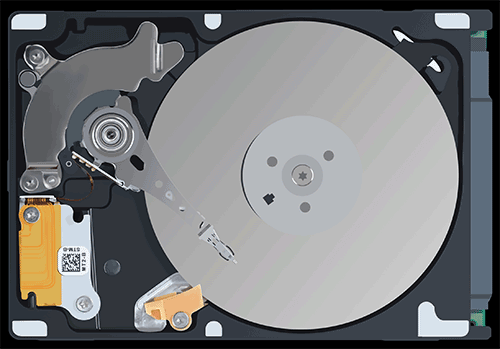
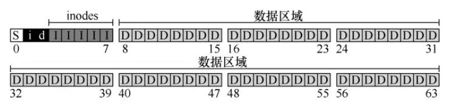

# Persistnece

## I/O
### standard protocol
status register 
command register
data register

第一步，操作系统通过反复读取状态寄存器等待设备进入可以接收命令的就绪状态。这个过程我们称之为轮询（`polling`），基本上就是在询问设备当前在做什么。

第二步，操作系统将数据下发到数据寄存器。以磁盘为例，可能需要多次写入操作，将一个磁盘块（比如4KB）传递给设备。如果主CPU参与数据移动（就像这个示例协议一样），我们就称之为编程的I/O（programmed I/O）。

第三步，操作系统写入命令到命令寄存器。这样设备就知道数据已经准备好了，应该开始执行命令。最后一步，操作系统再次通过不断轮询设备(可以通过[中断](https://www.jianshu.com/p/f797db36c7f4)、[二阶段处理](https://ls8sck0zrg.feishu.cn/wiki/wikcny12ru0m4BJpPZBi7i0ohxe)减小开销)，等待并判断设备是否执行完成命令，可能得到一个指示成功或失败的错误码。

### DMA（Direct Memory Access）
优化PIO:
DMA引擎是系统中的一个特殊设备，它能够协调完成内存和设备间的数据传递，而无需CPU介入。DMA的工作过程如下：为了将数据传送给设备，操作系统通过编程告诉DMA引擎数据在内存的位置、要拷贝的大小以及要拷贝到哪个设备。在此之后，操作系统就可以处理其他请求了。当DMA的任务完成后，DMA控制器会抛出一个中断来告诉操作系统自己已经完成数据传输。

### OS与外设通讯
1. 明确的I/O指令规定了操作系统将数据发送到特定设备寄存器的方法，从而允许构造上文提到的协议。执行这个指令就可以实现期望的行为。这些指令通常是特权指令，只有操作系统才能直接与设备进行交互。如果任意程序都可以直接读写磁盘，会导致混乱，因为任何用户程序都可以利用这个漏洞来获取计算机的全部控制权。

2. 内存映射I/O（memory-mapped I/O）。通过这种方式，硬件将设备寄存器作为内存地址提供。当需要访问设备寄存器时，操作系统将数据加载（读取）或存储（写入）到该内存地址；然后硬件将加载/存储传送到设备上，而不是物理内存。两种方法都没有一种具备极大的优势。内存映射I/O的好处是不需要引入新指令来实现设备交互。

### device drivers
将每个设备纳入操作系统需要制定一种标准的接口，以便操作系统能够与各种设备进行通信和控制。这通常通过设备驱动程序（device drivers）来实现。设备交互的细节都封装在device drivers中。

    这种封装方式也存在一些不足之处。举例而言，某些设备可能拥有许多特殊功能，但为了与大多数操作系统兼容，不得不提供一个通用接口。这导致设备的特殊功能无法充分利用。这种情况在使用 SCSI 设备的 Linux 操作系统中就曾经发生过。SCSI 设备提供丰富的错误报告信息，而其他块设备（如 ATA/IDE）只提供简单的错误处理，因此在发生错误时，上层软件只能接收到一个通用的 EIO 错误码（通常表示 IO 错误），而无法报告 SCSI 可能提供的其他附加信息。

    有趣的是，由于所有需要连接到系统的设备都需要安装相应的驱动程序，因此驱动程序的代码在整个内核代码中所占比例逐渐增大。在 Linux 内核代码中，超过 70% 的代码是各种驱动程序。在 Windows 系统中，情况也是类似的。因此，当有人提到操作系统包含上百万行代码时，实际上指的是包含上百万行驱动程序代码。

    当然，需要注意的是，并非所有安装在操作系统中的驱动程序都是激活状态的，因为只有在系统启动时需要连接的设备才需要驱动程序的激活。更加令人沮丧的是，由于驱动程序的开发者大多数是“业余的”（不是全职内核开发者），他们更容易引入缺陷，因此成为内核崩溃的主要贡献者。


## hard disk

[](https://3ring.me/hdd)

驱动器由大量扇区（512字节块）组成，每个扇区都可以读取或写入。在具有n个扇区的磁盘上，扇区从0到n-1编号。因此，我们可以将磁盘视为一组扇区，0到n-1是驱动器的地址空间（address space）。多扇区操作是可能的。实际上，许多文件系统一次读取或写入4KB（或更多）。但是，在更新磁盘时，驱动器制造商唯一保证的是单个512字节的写入 atomic。

### 物理运作
一个盘片（platter）是一个圆形坚硬的表面，通过引入磁性变化来永久存储数据。磁盘可能有一个或多个盘片，每个盘片都有两个面，每个面称为表面。这些盘片通常由一些硬质材料（如铝）制成，然后涂上薄薄的磁性层，即使驱动器断电，也能持久存储数据位。

所有盘片都围绕主轴（spindle）连接在一起，主轴连接到一个电机，以一个恒定的速度旋转盘片（当驱动器接通电源时）。旋转速率通常以每分钟转数（Rotations Per Minute，RPM）来测量，典型的现代数值在7200到15000 RPM范围内。请注意，我们经常会对单次旋转的时间感兴趣，例如，以10000 RPM旋转的驱动器意味着一次旋转需要大约6ms。

数据在扇区的同心圆中的每个表面上被编码。我们称这样的同心圆为一个磁道（track）。一个表面包含数以千计的磁道，紧密地排在一起，数百个磁道只有头发的宽度。

要从表面进行读写操作，我们需要一种机制，使我们能够感应（即读取）磁盘上的磁性图案，或者让它们发生变化（即写入）。读写过程由磁头（disk head）完成；驱动器的每个表面有一个这样的磁头。磁头连接到单个磁盘臂（disk arm）上，磁盘臂在表面上移动，将磁头定位在期望的磁道上。

其他特性：磁道倾斜 stack stew、多区域磁盘mutli-zone、磁道缓冲区track buffer

### 运作参数
#### 单磁道延迟：旋转延迟(rotational delay)
访问某个扇区时必须等待期望的扇区旋转到磁头下。这种等待在现代驱动器中经常发生，并且是I/O服务时间的重要组成部分。完整的旋转延迟是R，那么磁盘产生为R/2的旋转延迟期望。
#### 多磁道：寻道时间
当读取其他磁道的信息时，驱动器必须首先将磁盘臂移动到正确的磁道，通过一个所谓的寻道（seek）过程。寻道以及旋转，是最昂贵的磁盘操作之一。

应该指出的是，寻道有许多阶段：首先是磁盘臂移动时的加速阶段。然后随着磁盘臂全速移动而惯性滑动。然后随着磁盘臂减速而减速。最后，在磁头小心地放置在正确的磁道上时停下来。停放时间（settling time）通常不小，例如0.5到2ms，因为驱动器必须确定找到正确的磁道。

当需要读取的扇区经过磁盘磁头时，I/O的最后阶段将发生，称为传输（transfer），数据从表面读取或写入表面。因此，我们得到了完整的I/O时间：首先寻道，然后等待转动延迟，最后传输。

#### I/O时间
I/O时间表示为3个主要部分之和：\[TI_{\text{I/O}} = T_{\text{寻道}} + T_{\text{旋转}} + T_{\text{传输}} \]


#### SCSI与SATA
SCSI（Small Computer System Interface）和SATA（Serial ATA）都是计算机系统中用于连接和传输数据的接口标准，但它们在设计、用途和性能上有一些不同之处。

**SCSI（Small Computer System Interface）:**

1. **设计：** SCSI是一种并行接口，最初设计用于连接多种设备，包括磁盘驱动器、打印机、光驱等。它的设计目标是支持多任务处理和连接多个设备。

2. **性能：** SCSI通常提供更高的性能和更多的功能，适用于需要高性能和高可靠性的应用，如服务器和专业工作站。

3. **连接方式：** SCSI设备之间可以采用链路连接（daisy chaining）的方式，使得多个设备可以通过一个SCSI总线连接在一起。

4. **设备支持：** SCSI支持多个设备的连接，允许在一个SCSI总线上连接多个设备，每个设备都有唯一的SCSI地址。

**SATA（Serial ATA）:**

1. **设计：** SATA是一种串行接口，设计用于连接主要的存储设备，如硬盘驱动器、光盘驱动器等。它的设计目标是提供高速、简化布线结构、降低功耗。

2. **性能：** SATA通常提供足够的性能来满足个人计算机和消费电子设备的需求。

3. **连接方式：** SATA设备之间使用点对点连接，每个设备都有独立的连接线，这样可以简化布线结构。

4. **设备支持：** SATA更适用于连接单个设备，例如连接单个硬盘驱动器。

**比较：**

- **应用领域：** SCSI更适用于高性能、多设备连接的环境，如服务器系统。而SATA更适用于个人计算机和消费电子设备。--------------------------------------------------------------------q@@!!!!!!!!!!!!!!!!!!!!!!!!!!!!!!!!!!!!!!!!!!!!!!!!!!!!!!!!!!!!!!!!!!!!!!!!!!!!!!!!!!!!!

- **物理连接：** SCSI使用并行连接，而SATA使用串行连接，因此SATA在物理布线上更简洁。

- **成本：** 一般来说，SATA设备的成本较低，适用于大多数个人计算机和家用设备。 SCSI设备通常更昂贵，主要面向专业和高性能市场。

- **性能：** 在绝大多数情况下，SCSI提供更高的性能。然而，对于许多普通应用来说，SATA提供的性能已经足够。
- 
|           | Cheetah(SCSI)   | Barracuda (SATA)   |
|-----------|--------------|--------------|
| R I/O 随机  | 0.66MB/s     | 0.31MB/s     |
| R I/O 顺序  | 125MB/s      | 105MB/s      |

### 磁盘调度
#### SJF
#### SSTF Shortest-Seek-Time-First
会导致starvation
#### SCAN/SCAN-C
SCAN 重置 `while(1):0-n->0-n`
SCAN-C 掉头  `while(1):0-n->n-0`
#### SPTF Shortest Positioning Time First
SSTF改进，不仅依靠寻道还依靠旋转


### RAID,Redundant Array of Inexpensive Disks
这种技术利用多个磁盘协同工作，构建更快、更大、更可靠的磁盘系统。许多研究人员同时提出了使用多个磁盘来改进存储系统的基本思想。从外部观察，RAID就像是一个磁盘，提供了一组可读写的块。而在内部，RAID则是一个复杂的系统，由多个磁盘、内存（包括易失性和非易失性内存）以及一个或多个处理器组成，用于系统的管理。

硬件RAID类似于一个专门设计用于管理一组磁盘的计算机系统。相较于单个磁盘，RAID具有多方面的优势。性能方面，通过并行使用多个磁盘可以显著提高I/O速度。容量方面，对于大型数据集，需要大容量的磁盘，而RAID提供了解决方案。此外，RAID还能提高系统的可靠性。在没有RAID技术的情况下，数据在多个磁盘上传输可能导致数据容易受到单个磁盘故障的影响。通过实施某种形式的冗余机制，RAID能够允许损失一个磁盘并保持正常运行，就像没有发生错误一样。

#### RAID 0 级：条带化
第一个RAID级别实际上并不算是RAID级别，因为它没有冗余。然而，RAID 0级（也称为条带化或striping）因为其更为广为人知，常被用作性能和容量的卓越选择。


| 磁盘 0 | 磁盘 1 | 磁盘 2 | 磁盘 3 |
|--------|--------|--------|--------|
|   0    |   1    |   2    |   3    |
|   4    |   5    |   6    |   7    |
|   8    |   9    |  10    |  11    |
|  12    |  13    |  14    |  15    |


以轮转方式将磁盘阵列的块分布在磁盘上。这种方法的目的是在对数组的连续块进行请求时，从阵列中获取最大的并行性（例如，在一个大的顺序读取中）。我们将同一行中的块称为条带，因此，上面的块 0、1、2和3在相同的条带中。

##### 大块大小(chunk size)
| 磁盘 0 | 磁盘 1 | 磁盘 2 | 磁盘 3 |
|--------|--------|--------|--------|
|   0    |   2    |   4    |   6    |
|   1    |   3    |   5    |   7    |
|   8    |  10    |  12    |  14    |
|   9    |  11    |  13    |  15    |

一方面，大块大小主要影响阵列的性能。例如，较小的大块大小意味着许多文件将跨越多个磁盘进行条带化，从而提高对单个文件的读取和写入的并行性。但是，跨越多个磁盘进行块的定位会增加，因为整个请求的定位时间受到所有驱动器上请求的最大定位时间的影响。

另一方面，较大的大块大小减少了文件内的并行性，因此依赖于多个并发请求来实现高吞吐量。然而，较大的大块大小降低了定位时间。例如，如果一个文件放在一个块中并放置在单个磁盘上，那么访问它时发生的定位时间将仅为单个磁盘的定位时间。

#### RAID 1 级：镜像
对于镜像系统，我们只需生成系统中每个块的多个副本。每个副本应该放置在一个单独的磁盘上，从而容许磁盘故障。在一个典型的镜像系统中，我们将假设对于每个逻辑块，RAID保留两个物理副本。

有多种不同的方法可以在磁盘上放置块的副本。上述的排列是常见的排列，有时称为RAID-10（或RAID 1+0），因为它使用镜像对（RAID-1），然后在其上使用条带化（RAID-0）。另一种常见的排列是RAID-01（或RAID 0+1），它包含两个大型条带化（RAID-0）阵列，然后是镜像（RAID-1）。

#### RAID 4 级：通过奇偶校验节省空间

我们现在展示一种向磁盘阵列添加冗余的不同方法，称为奇偶校验（parity）。基于奇偶校验的方法试图使用较少的容量，从而克服由镜像系统付出的巨大空间损失。然而，这样做的代价是性能。

对于每一条数据，我们都添加了一个奇偶校验（parity）块，用于存储该条块的冗余信息。例如，奇偶校验块 P1 具有从块 4、5、6 和 7 计算出的冗余信息。

| 磁盘 0 | 磁盘 1 | 磁盘 2 | 磁盘 3 | 磁盘 4 |
|--------|--------|--------|--------|--------|
|   0    |   1    |   2    |   3    |   P0   |
|   4    |   5    |   6    |   7    |   P1   |
|   8    |   9    |  10    |  11    |   P2   |
|  12    |  13    |  14    |  15    |   P3   |

这个表格表示了一个具有奇偶校验的磁盘阵列，其中P0、P1、P2和P3分别是用于存储奇偶校验信息的冗余块。

#### RAID 5 级：旋转奇偶校验
为了解决小写入问题（至少部分解决），Patterson、Gibson和Katz推出了RAID-5。RAID-5的工作原理与RAID-4几乎完全相同，只是它将奇偶校验块跨驱动器旋转。

| 磁盘 0 | 磁盘 1 | 磁盘 2 | 磁盘 3 | 磁盘 4 |
|--------|--------|--------|--------|--------|
|   0    |   1    |   2    |   3    |   P0   |
|   5    |   6    |   7    |   P1   |   4    |
|   10   |   11   |   P2   |   8    |   9    |
|   15   |   P3   |   12   |   13   |   14   |
|   P4   |   16   |   17   |   18   |   19   |

RAID-5的大部分分析与RAID-4相同。例如，两级的有效容量和容错能力是相同的。顺序读写性能也是如此。单个请求（无论是读还是写）的延迟也与RAID-4相同。随机读取性能稍好一点，因为我们可以利用所有的磁盘。最后，RAID-5的随机写入性能明显提高，因为它允许跨请求进行并行处理。想象一下写入块1和写入块10。这将变成对磁盘1和磁盘4（对于块1及其奇偶校验）的请求以及对磁盘0和磁盘2（对于块10及其奇偶校验）的请求。因此，它们可以并行进行。


#### 总结
|      | RAID-0 | RAID-1 | RAID-4      | RAID-5      |
|------|--------|--------|------------|------------|
| 容量 | N      | N/2    | N−1        | N−1        |
| 可靠性 | 0      | 1 （肯定） | N/2 （如果走运） | N/2 （如果走运） |
| 顺序读 | N · S  | N · S  | N (N − 1) · S | N (N − 1) · S |
| 顺序写 | N · S  | N · S  | N (N − 1) · S | N (N − 1) · S |
| 随机读 | N · R  | N · R  | N (N − 1) · R | N · R      |
| 随机写 | N · R  | N/2 · R | 1/2 · R     | N/4 · R    |
| 读延迟 | T      | T      | T          | T          |
| 写延迟 | T      | T      | 2T         | 2T         |

## 文件系统
存储虚拟化的演进带来了两个关键的抽象。

第一个是文件（file）。文件可以看作是一个线性字节数组，每个字节都可以读取或写入。每个文件都有某种低级名称（low-level name），通常是某种数字。用户通常并不了解这个名字。由于历史原因，文件的低级名称通常被称为inode号（inode number）。


第二个抽象是目录（directory）。与文件类似，目录也有一个低级名字（即inode号），但其内容更为具体：它包含一个（用户可读名字，低级名字）对的列表。目录中的每个条目都指向文件或其他目录。通过将目录放入其他目录中，用户可以构建任意的目录树（directory tree，或目录层次结构，directory hierarchy），在该目录树下存储所有文件和目录。
### 文件API
#### open()
在Linux系统中，`open()` 函数是一个系统调用（system call），用于打开或创建文件。


以下是一些常见的 `flags` 和它们的含义：

- `O_RDONLY`: 以只读方式打开文件。
- `O_WRONLY`: 以只写方式打开文件。
- `O_RDWR`: 以读写方式打开文件。
- `O_CREAT`: 如果文件不存在，则创建文件。
- `O_TRUNC`: 如果文件存在且以写入方式打开，将其长度截断为0。
- `O_APPEND`: 在文件末尾追加数据。
- `O_EXCL`: 与 `O_CREAT` 一起使用，如果文件已存在，则 `open()` 失败。

```c
//创建文件
int fd = open("foo", O_CREAT | O_WRONLY | O_TRUNC);
```

`open()` 的一个重要方面是它的返回值：文件描述符（file descriptor）。文件描述符是一个整数，每个进程私有，在 UNIX 系统中用于访问文件。（文件描述符为-1时表示文件打开失败）因此，一旦文件被打开，你就可以使用文件描述符来读取或写入文件，前提是你有权这样做。这样，一个文件描述符就是一种权限（capability），即一个不透明的句柄，它可以让你执行某些操作。另一种看待文件描述符的方法，是将它作为指向文件类型对象的指针。一旦你有这样的对象，就可以调用其他“方法”来访问文件，比如 `read()` 和 `write()`。

#### creat()
`creat()` 系统调用是创建文件的旧方法，用法如下：

```c
int fd = creat("foo");
```

你可以将 `creat()` 视为使用 `open()` 的一种简化形式，具体来说，它相当于以下标志的 `open()` 调用：`O_CREAT | O_WRONLY | O_TRUNC`。

由于 `open()` 本身已经能够创建文件，因此`creat()` 的使用方式在实际编程中逐渐失宠。实际上，`creat()` 可能被实现为对 `open()` 的一个库调用。然而，在 UNIX 的历史中，`creat()` 仍然占据了一席之地。有趣的是，当有人问 Ken Thompson 如果他重新设计 UNIX，会有什么不同时，他回答说：“我在拼写 creat 时会加上 e”。


#### cat
组合，使用strace查询

#### lseek()
`lseek()` 是一个用于设置文件偏移量（file offset）的系统调用，通常用于移动文件指针位置。文件偏移量是文件中下一个要读取或写入的位置。

`lseek()` 的原型如下：

```c
#include <unistd.h>

off_t lseek(int fd, off_t offset, int whence);
```

其中，`fd` 是文件描述符，`offset` 是偏移量，`whence` 指定了偏移量的参考位置。返回值是新的文件偏移量。

- 如果 `whence` 是 `SEEK_SET`，则将文件偏移量设置为 `offset`。
- 如果 `whence` 是 `SEEK_CUR`，则将文件偏移量增加 `offset`。
- 如果 `whence` 是 `SEEK_END`，则将文件偏移量设置为文件末尾加上 `offset`。

#### fsync()
大多数情况下，当程序调用 `write()` 时，实际上是在告诉文件系统：“请在将来的某个时刻，将这些数据写入持久存储。”为了提高性能，文件系统会将这些写入操作在内存中缓冲一段时间（例如5秒或30秒）。在稍后的某个时间点，这些写入将被实际发送到存储设备。

从调用应用程序的角度来看，写入操作似乎很快就完成了，而且只有在极少数情况下（例如，在 `write()` 调用之后但写入磁盘之前，机器崩溃的情况下）数据可能会丢失。这种缓冲机制使得写入操作对于应用程序而言是高效的，因为它们可以继续执行而无需等待实际的磁盘写入完成。然而，这也意味着在某些情况下，可能会发生数据丢失的风险。

当进程针对特定文件描述符调用 `fsync()` 时， 文件系统通过强制将所有脏（ dirty ）数据（即尚未写入的）写入磁盘来响应，针对指定文件 描述符引用的文件。一旦所有这些写入完成， `fsync()` 例程就会返回。

#### link/unlink

使用 `ln` 只是在要创建链接的目录中创建了另一个名称，并将其指向原有文件的相同 inode 号（即低级别名称）。这意味着文件并没有以任何方式复制。相反，我们现在有了两个人类可读的名称（`file` 和 `file2`），它们都指向同一个文件。通过打印每个文件的 inode 号，我们甚至可以在目录中看到这一点：

```bash
$ ln file file2
$ ls -i
112233 file
112233 file2
```

在这个示例中，`112233` 是文件的 inode 号，它表明 `file` 和 `file2` 都指向同一个文件。硬链接提供了一种方式，可以在文件系统中创建多个指向相同数据的文件名，这些文件名具有相同的 inode 号。


要删除一个文件，我们调用 `unlink()`后仍然可以毫无困难地访问该文件：

```bash
$ rm file
removed 'file'
$ cat file2
hello
```
这样的结果是因为当文件系统取消链接文件时，它会检查 inode 号中的引用计数（reference count）。引用计数（有时称为链接计数，link count）允许文件系统跟踪有多少不同的文件名已链接到这个 inode。调用 `unlink()` 时，会删除人类可读的名称（正在删除的文件）与给定 inode 号之间的“链接”，并减少引用计数。只有当引用计数达到零时，文件系统才会释放 inode 和相关数据块，从而真正“删除”该文件。这样的机制确保在没有任何链接指向文件时，文件系统才会释放相关资源。
#### 其他
- rename(char * old, char * new)
- stat() 或 fstat()
  查看文件metadata
- rm/mkdir/rmdir
- opendir() / readdir() / closedir()

#### 创建并挂载文件系统
为了创建一个文件系统，大多数文件系统提供了一个工具，通常叫做 `mkfs`（发音为 "make fs"），它的任务是在给定设备上创建一个空的文件系统。具体来说，你需要提供一个设备（例如磁盘分区，如 `/dev/sda1`）、文件系统类型（例如 `ext3`），然后 `mkfs` 就会在该磁盘分区上写入一个空文件系统，从根目录开始。

一旦创建了文件系统，需要通过 `mount` 程序将其挂载到文件系统树中的特定位置。`mount` 的作用是将新的文件系统添加到目录树的某个点上，该点称为挂载点。

举个例子，假设有一个未挂载的 `ext3` 文件系统，存储在设备分区 `/dev/sda1` 中，其内容包括根目录，包含两个子目录 `a` 和 `b`，每个子目录下有一个名为 `foo` 的文件。如果我们想要在挂载点 `/home/users` 上挂载这个文件系统，我们可以执行以下命令：

```bash
$ mount -t ext3 /dev/sda1 /home/users
```

如果成功，`mount` 就使得新的文件系统在 `/home/users` 下可用。现在，我们可以通过路径名 `/home/users/` 来访问新挂载目录的根。例如：

```bash
$ ls /home/users/
a  b
```

路径名 `/home/users/a` 和 `/home/users/b` 分别用于访问文件 `a` 和 `b`。此外，可以通过 `/home/users/a/foo` 和 `/home/users/b/foo` 来访问这两个文件。

`mount` 的美妙之处在于，它将所有文件系统统一到一个树中，而不是拥有多个独立的文件系统，这使得命名更加统一和方便。

要查看系统上挂载的内容和挂载位置，可以运行 `mount` 命令。它会显示类似下面的内容：

```bash
/dev/sda1 on / type ext3 (rw)
proc on /proc type proc (rw)
sysfs on /sys type sysfs (rw)
/dev/sda5 on /tmp type ext3 (rw)
/dev/sda7 on /var/vice/cache type ext3 (rw)
tmpfs on /dev/shm type tmpfs (rw)
AFS on /afs type afs (rw)
```

这个示例展示了许多不同的文件系统，包括 `ext3`（标准的基于磁盘的文件系统）、`proc` 文件系统（用于访问当前进程信息的文件系统）、`tmpfs`（仅用于临时文件的文件系统）和 `AFS`（分布式文件系统）。所有这些文件系统都被“粘贴”到这台机器的文件系统树上。

### 文件系统实现
#### 整体架构


- 超级块 superblock ( S )
    S区域
    文件系统中的关键数据结构之一。超级块包含有关文件系统结构和属性的关键信息，使操作系统能够正确地管理和访问文件系统中的文件和目录，例如文件系统中有多少个 inode 和数据块，inode 表的开始位置等。在一个文件系统中，通常只有一个超级块，它保存着关于整个文件系统的元数据。

- inode 位图（ i ）和数据位图（ d ） 

- inode(I)
    inode是元数据（metadata）的关键部分，用于记录诸如文件包含哪些数据块（在数据区域中）、文件的大小、所有者和访问权限、访问和修改时间等类似信息。为了存储这些信息，文件系统通常使用一个叫做 inode 的数据结构。
    使用 inode 的方式有助于提高文件系统的效率，因为它允许文件系统直接查找文件的元数据，而无需遍历整个文件系统。这样，文件系统可以更快速地定位文件并进行相关操作，如读取、写入或更改文件属性。
    总体而言，inode 是文件系统中用于存储文件元数据的关键数据结构。
- data(D)

#### inode
pass

#### 优化