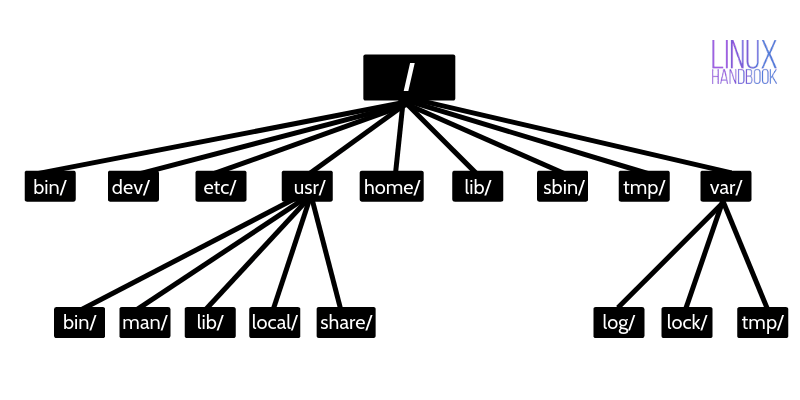

## linux分类

### Redhat

<b>Redhat</b> , 应该称为 Redhat 系列 , 包括 <b>RHEL (Redhat Enterprise Linux</b> , 也就是所谓的 Redhat Advance Server , 收费版本) , <b>Fedora Core</b> (由原来的 Redhat 桌面版本发展而来 , 免费版本) , <b>CentOS</b> (RHEL的社区克隆版本 , 免费) ;

Redhat 应该说是在国内使用人群最多的 Linux 版本 ,  所以这个版本的特点就是使用人群数量大 , 资料非常多 ;

Redhat 系列的包管理方式采用的是基于 `RPM` 包的 `YUM` 包管理方式 , 包分发方式是编译好的二进制文件 ; 稳定性方面 RHEL 和 CentOS 的稳定性非常好 , 适合于服务器使用 , 但是 Fedora Core 的稳定性较差 , 最好只用于桌面应用 ;

### Debian

<b>Debian</b> , 或者称 Debian 系列 , 包括 <b>Debian</b> 和 <b>Ubuntu</b> 等 ; Debian 是社区类 Linux 操作系统的典范 , 是迄今为止最遵循 GNU 规范的 Linux系统 ;

Ubuntu 严格来说不能算一个独立的发行版本 , Ubuntu 是基于 Debian 的 unstable 版本加强而来 , 可以这么说 , Ubuntu 就是一个拥有 Debian 所有的优点 , 以及自己所加强的优点的近乎完美的 Linux 桌面系统 ;

根据选择的桌面系统不同 , 有三个版本可供选择 , 基于 Gnome 的 Ubuntu , 基于 KDE 的 Kubuntu 以及基于 Xfc 的 Xubuntu ; 特点是界面非常友好容易上手 , 对硬件的支持非常全面 , 是最适合做桌面系统的Linux发行版本 ;

Debian 最具特色的是 `apt-get/dpkg` 包管理方式 , 其实 Redhat 的 YUM 也是在模仿 Debian 的 APT 方式 , 但在二进制文件发行方式中 , APT 应该是最好的了 ; Debian 的资料也很丰富 , 有很多支持的社区 , 有问题求教也有地方可去 ;

### 分支

| distribution   | 软件管理机制 | 使用指令          | 在线升级机制 (指令)    |
|:-------------- |:------ |:------------- |:-------------- |
| Red Hat/Fedora | RPM    | rpm, rpmbuild | YUM (yum, dnf) |
| Debian/Ubuntu  | DPKG   | dpkg          | APT (apt-get)  |

| 家族/体系          | 代表发行版                                                      | 包管理格式          | 包管理工具                    | 特点                                    |
|:-------------- |:---------------------------------------------------------- |:-------------- |:------------------------ |:------------------------------------- |
| **Red Hat 家族** | Red Hat Enterprise Linux (RHEL), Fedora, CentOS, AlmaLinux | `.rpm`         | `rpm`, `yum`, `dnf`      | 企业级稳定 (RHEL) 或 新技术试验田 (Fedora)        |
| **Debian 家族**  | Debian, Ubuntu, Linux Mint, Kali Linux                     | `.deb`         | `dpkg`, `apt`, `apt-get` | 社区驱动稳定 (Debian) 或 易用性/流行度 (Ubuntu)    |
| **Arch 家族**    | **Arch Linux**, Manjaro, EndeavourOS, ArcoLinux            | `.pkg.tar.zst` | **`pacman`**, `makepkg`  | **滚动更新** (Rolling Release), 极简主义, DIY |

```text
[Debian] ---> [Ubuntu] ---> [Linux Mint, Kali, Pop!_OS...]

[Red Hat] ---> [Fedora] ---> [RHEL] ---> [CentOS Stream, AlmaLinux, Rocky...]

[Arch Linux] ---> [Manjaro, EndeavourOS, ArcoLinux...]
```

### About

| 用户类型         | 推荐发行版                          | 理由                     |
|:------------ |:------------------------------ |:---------------------- |
| **Linux 新手** | Linux Mint, Ubuntu             | 上手简单，社区教程多，驱动支持好。      |
| **软件开发者**    | Ubuntu, Fedora, WSL            | 工具链完善，容器支持好，云端一致。      |
| **系统管理员**    | Debian, RHEL, Rocky Linux      | 极度稳定，长期支持(LTS)，安全更新及时。 |
| **游戏玩家**     | SteamOS, Pop!_OS, CachyOS      | 显卡驱动优化，Proton兼容层支持好。   |
| **极客/老手**    | Arch Linux, Gentoo, CachyOS    | 高度可定制，滚动更新，性能极致。       |
| **老旧电脑**     | MX Linux, Lubuntu, Puppy Linux | 资源占用极低，能让老机器焕发新生。      |

## 系统

### 开机流程

1. 硬件阶段：加载 BIOS / UEFI 的硬件信息与进行自我测试，并依据设置取得第一个可开机的设备；
2. 系统启动阶段：这个阶段大致又分两种机制，一种是使用传统 BIOS 读取设备，一种是通过 UEFI 读取设备：
   - BIOS：根据设置，读取并运行第一个开机设备内 MBR 的 boot Loader (亦即是 grub2, spfdisk 等程序)；
   - UEFI：搜索系统内的开机分区 (分区 System ID 为 EF00, 文件系统 FAT)，读取内部的开机 loader
3. 依据 boot loader 的设置加载 Kernel ，Kernel 会开始侦测硬件与加载驱动程序；
   - 加载 kernel file 与 initramfs 文件在内存内解压缩
   - initramfs 会在内存仿真出系统根目录，提供 kernel 相关的驱动程序模块
   - 内核设备驱动程序完整的驱动硬件
4. 在硬件驱动成功后，Kernel 会主动调用 systemd 程序，并以 default.target 流程开机；
   - systemd 运行 sysinit.target 初始化系统及 basic.target 准备操作系统；
   - systemd 启动 multi-user.target 下的本机与服务器服务；
   - systemd 运行 multi-user.target 下的 /etc/rc.d/rc.local 文件；
   - systemd 运行 multi-user.target 下的 getty.target 及登录服务；
   - systemd 运行 graphical 需要的服务


### 目录系统



#### FHS（Filesystem Hierarchy Standard）根目录文件

| 目录      | 全称              | 描述                                                                                                                                                                                                  |
| ------- | --------------- | --------------------------------------------------------------------------------------------------------------------------------------------------------------------------------------------------- |
| /bin/   | Binaries        | 存放系统命令，普通用户和 root 都可以执行。放在 /bin 下的命令在单用户模式下也可以执行                                                                                                                                                    |
| /boot/  | Boot            | 系统启动目录，保存与系统启动相关的文件，如内核文件和启动引导程序（grub）文件等                                                                                                                                                           |
| /dev/   | Devices         | 设备文件保存位置                                                                                                                                                                                            |
| /etc/   | Etcetera        | 配置文件保存位置。系统内所有采用默认安装方式（rpm 安装）的服务配置文件全部保存在此目录中，如用户信息、服务的启动脚本、常用服务的配置文件等                                                                                                                             |
| /home/  | Home            | 普通用户的主目录（也称为家目录）。在创建用户时，每个用户要有一个默认登录和保存自己数据的位置，就是用户的主目录，所有普通用户的主目录是在 /home/ 下建立一个和用户名相同的目录。如用户 liming 的主目录就是 /home/liming                                                                           |
| /lib/   | Libraries       | 系统调用的函数库保存位置                                                                                                                                                                                        |
| /media/ | Media           | 挂载目录。系统建议用来挂载媒体设备，如软盘和光盘                                                                                                                                                                            |
| /mnt/   | Mount           | 挂载目录。早期 Linux 中只有这一个挂载目录，并没有细分。系统建议这个目录用来挂载额外的设备，如 U 盘、移动硬盘和其他操作系统的分区                                                                                                                               |
| /misc/  | Miscellaneous   | 挂载目录。系统建议用来挂载 NFS 服务的共享目录。虽然系统准备了三个默认挂载目录 /media/、/mnt/、/misc/，但是到底在哪个目录中挂载什么设备可以由管理员自己决定。例如，笔者在接触 Linux 的时候，默认挂载目录只有 /mnt/，所以养成了在 /mnt/ 下建立不同目录挂载不同设备的习惯，如 /mnt/cdrom/ 挂载光盘、/mnt/usb/ 挂载 U 盘，都是可以的 |
| /opt/   | Optional        | 第三方安装的软件保存位置。这个目录是放置和安装其他软件的位置，手工安装的源码包软件都可以安装到这个目录中。不过笔者还是习惯把软件放到 /usr/local/ 目录中，也就是说，/usr/local/ 目录也可以用来安装软件                                                                                     |
| /root/  | Root            | root 的主目录。普通用户主目录在 /home/ 下，root 主目录直接在“/”下                                                                                                                                                         |
| /sbin/  | System Binaries | 保存与系统环境设置相关的命令，只有 root 可以使用这些命令进行系统环境设置，但也有些命令可以允许普通用户查看                                                                                                                                            |
| /srv/   | Service         | 服务数据目录。一些系统服务启动之后，可以在这个目录中保存所需要的数据                                                                                                                                                                  |
| /tmp/   | Temporary       | 临时目录。系统存放临时文件的目录，在该目录下，所有用户都可以访问和写入。建议此目录中不能保存重要数据，最好每次开机都把该目录清空                                                                                                                                    |

#### 非FHS（Filesystem Hierarchy Standard）根目录文件

| 一级目录         | 全称             | 功能（作用）                                                                                                                                                               |
| ------------ | -------------- | -------------------------------------------------------------------------------------------------------------------------------------------------------------------- |
| /lost+found/ | Lost and Found | 当系统意外崩溃或意外关机时，产生的一些文件碎片会存放在这里。在系统启动的过程中，fsck 工具会检查这里，并修复已经损坏的文件系统。这个目录只在每个分区中出现，例如，/lost+found 就是根分区的备份恢复目录，/boot/lost+found 就是 /boot 分区的备份恢复目录                      |
| /proc/       | Process        | 虚拟文件系统。该目录中的数据并不保存在硬盘上，而是保存到内存中。主要保存系统的内核、进程、外部设备状态和网络状态等。如 /proc/cpuinfo 是保存 CPU 信息的，/proc/devices 是保存设备驱动的列表的，/proc/filesystems 是保存文件系统列表的，/proc/net 是保存网络协议信息的... |
| /sys/        | System         | 虚拟文件系统。和 /proc/ 目录相似，该目录中的数据都保存在内存中，主要保存与内核相关的信息                                                                                                                     |

#### Linux /usr目录

usr，全称为 `Unix Software Resource`，此目录用于存储系统软件资源。FHS 建议所有开发者，应把软件产品的数据合理的放置在 /usr 目录下的各子目录中，而不是为他们的产品创建单独的目录。
Linux 系统中，所有系统默认的软件都存储在 /usr 目录下，/usr 目录类似 Windows 系统中 C:\Windows\ + C:\Program files\ 两个目录的综合体。

| 子目录          | 功能（作用）                                                                                                |
| ------------ | ----------------------------------------------------------------------------------------------------- |
| /usr/bin/    | 存放系统命令，普通用户和超级用户都可以执行。这些命令和系统启动无关，在单用户模式下不能执行                                                         |
| /usr/sbin/   | 存放根文件系统不必要的系统管理命令，如多数服务程序，只有 root 可以使用。                                                               |
| /usr/lib/    | 应用程序调用的函数库保存位置                                                                                        |
| /usr/XllR6/  | 图形界面系统保存位置                                                                                            |
| /usr/local/  | 手工安装的软件保存位置。我们一般建议源码包软件安装在这个位置                                                                        |
| /usr/share/  | 应用程序的资源文件保存位置，如帮助文档、说明文档和字体目录                                                                         |
| /usr/src/    | 源码包保存位置。我们手工下载的源码包和内核源码包都可以保存到这里。不过笔者更习惯把手工下载的源码包保存到 /usr/local/src/ 目录中，把内核源码保存到 /usr/src/linux/ 目录中 |
| /usr/include | C/C++ 等编程语言头文件的放置目录                                                                                   |

#### Linux /var 目录

/var 目录用于存储动态数据，例如缓存、日志文件、软件运行过程中产生的文件等。通常，此目录下建议包含如表 4 所示的这些子目录。
| /var子目录     | 功能（作用）                                                                                                                                                                |
|--------------|---------------------------------------------------------------------------------------------------------------------------------------------------------------------------|
| /var/lib/    | 程序运行中需要调用或改变的数据保存位置。如 MySQL 的数据库保存在 /var/lib/mysql/ 目录中                                                                                    |
| /var/log/    | 登陆文件放置的目录，其中所包含比较重要的文件如 /var/log/messages, /var/log/wtmp 等。                                                                                   |
| /var/run/    | 一些服务和程序运行后，它们的 PID（进程 ID）保存位置                                                                                                                       |
| /var/spool/  | 里面主要都是一些临时存放，随时会被用户所调用的数据，例如 /var/spool/mail/ 存放新收到的邮件，/var/spool/cron/ 存放系统定时任务。                                       |
| /var/www/    | RPM 包安装的 Apache 的网页主目录                                                                                                                                         |
| /var/nis 和 /var/yp | NIS 服务机制所使用的目录，nis 主要记录所有网络中每一个 client 的连接信息；yp 是 linux 的 nis 服务的日志文件存放的目录                                              |
| /var/tmp     | 一些应用程序在安装或执行时，需要在重启后使用的某些文件，此目录能将该类文件暂时存放起来，完成后再行删除                                                                      |

## 命令

### bash 多进程管理

- command & ：直接将 command 丢到背景中运行，若有输出，最好使用数据流重导向输出到其他文件
- [ctrl]+z ：将目前正在前景中的工作丢到背景中暂停
- jobs [-l]：列出目前的工作信息
- fg %n ：将第 n 个在背景当中的工作移到前景来操作
- bg %n ：将第 n 个在背景当中的工作变成运行中

### 用户管理

#### 创建

```bash
# 标准创建（自动创建家目录 -m，指定 shell 为 bash -s）
sudo useradd -m -s /bin/bash newusername

# 设置密码（useradd 不会提示你设密码，需单独执行）
sudo passwd newusername
```

**常用参数详解 (`useradd`)：**
| 参数 | 含义 | 示例 |
| :--- | :--- | :--- |
| `-m` | **强制创建家目录** (`/home/username`) | `useradd -m user1` |
| `-s` | 指定登录 Shell | `useradd -s /bin/zsh user1` |
| `-g` | 指定**主用户组** (GID 或组名) | `useradd -g developers user1` |
| `-G` | 指定**附加用户组** (多个组用逗号分隔) | `useradd -G sudo,docker user1` |
| `-d` | 自定义家目录路径 | `useradd -d /opt/myuser user1` |
| `-e` | 设置账户过期日期 (YYYY-MM-DD) | `useradd -e 2026-12-31 user1` |

---

#### 赋予管理员权限 (Sudo Access)

创建用户后，如果需要让他能使用 `sudo`，需要将其加入 `sudo` 组 (Debian/Ubuntu) 或 `wheel` 组 (CentOS/RHEL)。

* **Ubuntu/Debian:**
  
  ```bash
  sudo usermod -aG sudo newusername
  ```

* **CentOS/RHEL/Fedora:**
  
  ```bash
  sudo usermod -aG wheel newusername
  ```
  
  *注：`-aG` 意思是 "append to Groups"（追加到组），如果不加 `-a` 会把用户从其他附加组中移除。*

---

#### 修改用户信息 (Modify User)

使用 `usermod` 命令修改已有用户的属性。

```bash
# 修改用户名 (旧名 -> 新名)
sudo usermod -l newname oldname

# 修改家目录路径 (同时移动文件)
sudo usermod -d /home/newdir -m newname

# 锁定用户 (禁止登录)
sudo usermod -L newname

# 解锁用户
sudo usermod -U newname

# 设置账户过期时间
sudo usermod -e 2026-01-01 newname
```

#### 删除用户 (Delete User)

* **仅删除用户，保留家目录：**
  
  ```bash
  sudo userdel newusername
  ```

* **删除用户及其家目录和邮件池 (常用)：**
  
  ```bash
  sudo userdel -r newusername
  ```
  
  *注：`-r` (remove) 会连同 `/home/newusername` 一起删掉，数据不可恢复，请谨慎操作。*

---

#### 查看用户信息 (View Info)

* **查看用户基本信息：**
  
  ```bash
  id newusername
  # 输出示例：uid=1001(newusername) gid=1001(newusername) groups=1001(newusername),27(sudo)
  ```

* **查看用户所属组：**
  
  ```bash
  groups newusername
  ```

* **查看用户详细信息 (家目录、Shell 等)：**
  
  ```bash
  getent passwd newusername
  ```

* **查看当前登录用户：**
  
  ```bash
  whoami
  ```

#### 快速操作流程图

如果你想要**快速创建一个能 sudo 的普通用户**，可以直接复制这一套组合拳：

```bash
# 1. 创建用户并指定 bash 和家目录
sudo useradd -m -s /bin/bash dev_user

# 2. 设置密码 (回车后输入两次密码)
sudo passwd dev_user

# 3. 加入 sudo 组 (根据系统选择 sudo 或 wheel)
sudo usermod -aG sudo dev_user 
# 如果是 CentOS/RHEL 用: sudo usermod -aG wheel dev_user

# 4. 验证
id dev_user
```

### 权限与文件属性

| 文件属性与chmod                                    |
| --------------------------------------------- |
| -uuugggooo (u,owner)(g,group)(o,other)(a,all) |
| +(加入) -(除去) =(设定)                             |
| drwxrwxrwx (r,read)(w,write)(x,execute)       |
| -421421421                                    |

| 命令    | 全称                     | 参数                | 语法                                                                                   | 备注                                                              |
| ----- | ---------------------- | ----------------- | ------------------------------------------------------------------------------------ | --------------------------------------------------------------- |
| id    |                        |                   |                                                                                      | 知道帐号信息与所属的群组                                                    |
| chgrp | change group ownership | `-R,--recursive)` | `chgrp [OPTION]... GROUP FILE...`                                                    | -                                                               |
| chown | change owner           | `-R`              | `chown [OPTION]... [OWNER][:[GROUP]] FILE...`                                        | 修改所有者                                                           |
| chmod | change mode            | `-R`              | `chmod [OPTION]... MODE[,MODE]... FILE...`<br>`chmod [OPTION]... OCTAL-MODE FILE...` | 修改用户的权限,举例`chmod u=rwx,g=rx,o=r .bashrc`<br>`chmod 777 .bashrc` |

### 基本处理

| 命令    | 全称                   | 参数                                                                                                                                                                                                                                                                                                | 语法                               | 备注          |
| ----- | -------------------- | ------------------------------------------------------------------------------------------------------------------------------------------------------------------------------------------------------------------------------------------------------------------------------------------------- | -------------------------------- | ----------- |
| ls    | list files           | `-R`<br>`-a,--all`<br>`-l,--list`<br>`-d,--directory`<br>`-s,--size`:print the allocated size of each file, in blocks<br>`-k,--kibibytes`:default to 1024-byte blocks for disk usage                                                                                                              | `ls [OPTION]... [FILE]...`       | 列出目录及文件名    |
| cd    | change directory     | -                                                                                                                                                                                                                                                                                                 | `cd [DIRECTORY]`                 | 切换目录        |
| pwd   | print work directory | -                                                                                                                                                                                                                                                                                                 | `pwd`                            | 显示目前的目录     |
| mkdir | make directory       | `-m,--mode`:set file mode (as in chmod), not a=rwx - umask<br>`-p,--parents`:no error if existing, make parent directories as needed<br>`-v,--verbose`:print a message for each created directory                                                                                                 | `mkdir [OPTION]... DIRECTORY...` | 创建一个新的目录    |
| rmdir | remove directory     | `-p`                                                                                                                                                                                                                                                                                              | `rmdir [OPTION]... DIRECTORY...` | 删除一个空的目录    |
| cp    | copy file            | `-R(r)`<br>`-f, --force`<br>`-i, --interactive`:prompt before overwrite<br>`-l,--link`:hard link files<br>`--s, --symbolic-link`:symbolic link files<br>`-d`:same as --no-dereference --preserve=links<br>`-p`:same as --preserve=mode,ownership,timestamps<br>`-a`:same as -pdr<br>`-u,--update` | `cp [OPTION]... SOURCE... DEST`  | 复制文件或目录     |
| rm    | remove               | `-irf`                                                                                                                                                                                                                                                                                            | `rm [OPTION]... FILE...`         | 删除文件或目录     |
| mv    | move                 | `-irf`                                                                                                                                                                                                                                                                                            | `mv [OPTION]... SOURCE... DEST`  | 移动/重命名文件或目录 |

### 文件内容处理

| 命令   | 全称                                  | 参数                                                                                                                                                                                                                                                                                                                                                                        | 语法                           | 备注                                                                                                                                |
| ---- | ----------------------------------- | ------------------------------------------------------------------------------------------------------------------------------------------------------------------------------------------------------------------------------------------------------------------------------------------------------------------------------------------------------------------------- | ---------------------------- | --------------------------------------------------------------------------------------------------------------------------------- |
| cat  | concatenate and display             | `-b, --number-nonblank`: Number nonempty output lines, overrides -n.<br>`-E, --show-ends`: Display $ at the end of each line.<br>`-n, --number`: Number all output lines.<br>`-s, --squeeze-blank`: Suppress repeated empty output lines.<br>`-T, --show-tabs`: Display TAB characters as ^I.<br>`-v, --show-nonprinting`: Use ^ and M- notation, except for LFD and TAB. | `cat [OPTION]... [FILE]...`  | 由第一行开始显示文件内容                                                                                                                      |
| tac  | concatenate and display in reverse  | `-b, --before`:attach the separator before instead of after                                                                                                                                                                                                                                                                                                               | `tac [OPTION]... [FILE]...`  | 从最后一行开始显示，可以看出 tac 是 cat 的倒着写,与cat参数不同                                                                                            |
| nl   | number lines of files               | `-b, --body-numbering=STYLE`:use STYLE for numbering body lines<br>`-f                                                                                                                                                                                                                                                                                                    | `nl [OPTION]... [FILE]...`   | 显示的时候，顺道输出行号！格式繁杂详见 man                                                                                                           |
| more | file perusal filter for crt viewing | `+n`:display next n lines (default is 1)                                                                                                                                                                                                                                                                                                                                  | `more [options] [file]...`   | 一页一页的显示文件内容，操作指令h or ?   Help: display a summary of  these  commands.   If  you forget all the other commands, remember this one. |
| less | opposite of more                    | `-N`:line numbers (default off)                                                                                                                                                                                                                                                                                                                                           | `less [options] [file]...`   | 与 more 类似，但是比 more 更好的是，他可以往前翻页！                                                                                                  |
| head | output the first part of files      | `-c, --bytes=[-]K`print the first K bytes of each  file;  with  the  leading  '-',print all but the last K bytes of each file<br>`-n, --lines=[-]K` print the first K lines instead of the first 10; with the leading '-', print all but the last K lines of each file                                                                                                    | `head [OPTION]... [FILE]...` | 只看头几行                                                                                                                             |
| tail | output the last part of files       | `-c, --bytes=K` output the last K bytes; or use -c +K to output  bytes  starting with the Kth of each file<br>`-n, --lines=K` output the last K lines, instead of the last 10; or use -n +K to output starting with the Kth                                                                                                                                               | `tail [OPTION]... [FILE]...` | 只看尾几行                                                                                                                             |

### 打包与压缩

| 命令        | 全称           | 参数                                                                                                                                                                                                                                                                                                  | 语法                                       | 备注                                                                |
|:--------- |:------------ |:--------------------------------------------------------------------------------------------------------------------------------------------------------------------------------------------------------------------------------------------------------------------------------------------------- |:---------------------------------------- |:----------------------------------------------------------------- |
| **gzip**  | GNU Zip      | `-c, --stdout`: 输出到标准输出 (保留原文件)<br>`-d, --decompress`: 解压 (同 `gunzip`)<br>`-r, --recursive`: 递归处理目录<br>`-v, --verbose`: 显示详细信息<br>`-#, --fast, --best`: 压缩等级 (1-9, 默认6)                                                                                                                             | `gzip [OPTION]... [FILE]...`             | 生成 `.gz` 文件。**压缩后原文件会被删除**。只能压缩单个文件，不能打包目录 (需配合 `tar`)。           |
| **zip**   | Zip          | `-r, --recurse-paths`: 递归压缩目录<br>`-d, --delete`: 从压缩包删除文件<br>`-u, --update`: 仅更新变化的文件<br>`-v, --verbose`: 显示详细信息<br>`-e, --encrypt`: 加密 (旧式)<br>`-P, --password`: 指定密码                                                                                                                              | `zip [OPTION]... [FILE.zip] [FILE]...`   | 生成 `.zip` 文件。**Windows 兼容性最好**。与 Unix 工具不同，它**默认保留原文件**且支持直接压缩目录。 |
| **unzip** | UnZip        | `-l, --list`: 列出压缩包内容 (不解压)<br>`-d, --directory`: 指定解压目录<br>`-o, --overwrite`: 覆盖现有文件 (不提示)<br>`-n, --never-overwrite`: 不覆盖现有文件<br>`-v, --verbose`: 显示详细信息<br>`-x`: 排除指定文件                                                                                                                          | `unzip [OPTION]... [FILE.zip] [FILE]...` | 专门用于解压 `.zip` 文件。功能比 `zip -d` 更丰富，是解压 zip 的标准工具。                  |
| **tar**   | Tape Archive | `-c, --create`: 创建归档 (打包)<br>`-x, --extract`: 解压归档 (解包)<br>`-t, --list`: 列出内容<br>`-f, --file`: 指定文件名 (**必须放在参数最后**)<br>`-z, --gzip`: 通过 gzip 过滤 (`.tar.gz`)<br>`-j, --bzip2`: 通过 bzip2 过滤 (`.tar.bz2`)<br>`-J, --xz`: 通过 xz 过滤 (`.tar.xz`)<br>`-v, --verbose`: 显示过程<br>`-C, --directory`: 指定解压/创建目录 | `tar [OPTION]... [FILE]...`              | **打包工具** (本身不压缩，需配合 `-z/-j/-J`)。Linux 下备份目录的标准工具。能保留文件权限、所有者等元数据。 |

#### 核心区别

1. **打包 vs 压缩**：
   
   * `zip`：打包 + 压缩 一步完成。
   * `tar`：只是**打包** (把多个文件变成一个文件)，必须配合 `-z` (gzip), `-j` (bzip2), 或 `-J` (xz) 才能**压缩**。
   * `gzip/bzip2/xz`：只能压缩**单个文件**，不能处理目录 (除非先用 tar 打包)。

2. **原文件去留**：
   
   * `gzip/bzip2/xz`：默认**删除**原文件 (为了省空间)。想保留请加 `-k` (bzip2/xz) 或用 `gzip -c > file.gz`。
   * `zip/tar`：默认**保留**原文件。

3. **常用组合 (Tar)**：
   
   * **打包并压缩 (.tar.gz)**: `tar -czvf archive.tar.gz folder/` (**c**reate, **z**ip, **v**erbose, **f**ile)
   * **解压 (.tar.gz)**: `tar -xzvf archive.tar.gz` (**x**tract, **z**ip, **v**erbose, **f**ile)
   * **解压 (.tar.bz2)**: `tar -xjvf archive.tar.bz2` (把 **z** 换成 **j**)
   * **解压 (.tar.xz)**: `tar -xJvf archive.tar.xz` (把 **z** 换成 **J**, 注意大写)

4. **查看内容不解压**：
   
   * Zip: `unzip -l file.zip`
   * Tar: `tar -tf file.tar.gz` (加 `-z` 或直接 `tar -tf` 通常能自动识别)

### 进程管理

| 命令          | 全称                 | 参数                                                                                                                                                                            | 语法                                 | 备注                                                               |
|:----------- |:------------------ |:----------------------------------------------------------------------------------------------------------------------------------------------------------------------------- |:---------------------------------- |:---------------------------------------------------------------- |
| **ps**      | process status     | `-e, --all`: 显示所有进程<br>`-f`: 全格式显示（包含 UID, PID, PPID, C, STIME, TTY, TIME, CMD）<br>`-l` :详细进程状态<br>`-u user`: 显示指定用户的进程<br>`-aux`: BSD 风格常用组合（a 显示所有终端，u 显示用户详情，x 显示无控制终端的进程） | `ps [OPTION]...`                   | 查看当前瞬间的进程静态快照。常与 `grep` 配合使用查找特定进程（如 `ps -ef \| grep nginx`）。    |
| **top**     | table of processes | `-d`: 指定刷新间隔秒数<br>`-p`: 监控指定 PID 的进程<br>`-u`: 监控指定用户的进程<br>**交互命令**:<br>`P`: 按 CPU 使用率排序<br>`M`: 按内存使用率排序<br>`k`: 杀死进程<br>`q`: 退出                                             | `top [OPTION]...`                  | 实时动态查看系统进程资源占用情况（类似任务管理器）。显示负载、CPU、内存及进程列表。                      |
| **kill**    | kill               | `-l`: 列出所有信号名称<br>`-9`: 发送 SIGKILL 信号（强制杀死，无法被捕获或忽略）<br>`-15`: 发送 SIGTERM 信号（默认，请求进程正常终止）                                                                                     | `kill [OPTION]... <PID>...`        | 向指定进程 ID (PID) 发送信号以终止或控制进程。需配合 `ps` 或 `top` 获取 PID。             |
| **killall** | kill all           | `-i`: 交互式确认<br>`-e`: 精确匹配进程名<br>`-9`: 强制杀死<br>`-u`: 仅杀死指定用户的进程                                                                                                                | `killall [OPTION]... <name>...`    | 通过**进程名称**而不是 PID 来杀死进程。例如 `killall nginx` 会杀死所有名为 nginx 的进程。    |
| **pkill**   | process kill       | `-f`: 根据完整命令行参数匹配<br>`-u`: 仅匹配指定用户<br>`-9`: 强制杀死<br>`-t`: 根据终端匹配                                                                                                              | `pkill [OPTION]... <pattern>`      | `killall` 的增强版，支持正则表达式匹配进程名或参数。例如 `pkill -f "python script.py"`。 |
| **pgrep**   | process grep       | `-l`: 同时显示进程名和 PID<br>`-u`: 仅匹配指定用户<br>`-f`: 匹配完整命令行<br>`-n`: 仅显示最新启动的进程                                                                                                      | `pgrep [OPTION]... <pattern>`      | 用于查找符合条件的进程 PID，常作为 `kill` 或 `pkill` 的前置查询命令。                    |
| **htop**    | human top          | `-d`: 延迟时间<br>`-u`: 监控指定用户<br>`-p`: 监控指定 PID<br>**交互命令**:<br>`F1-F10`: 帮助与功能键<br>`F9`: 杀死进程<br>`F6`: 排序选择                                                                     | `htop [OPTION]...`                 | `top` 的增强版，提供彩色界面、鼠标支持、树状视图和更直观的条形图，需单独安装。                       |
| **nice**    | nice               | `-n`: 调整优先级数值（范围 -20 到 19，数值越大优先级越低）                                                                                                                                          | `nice -n <adjustment> <command>`   | 以修改后的优先级**启动**新进程。普通用户只能降低优先级（增加 nice 值）。                        |
| **renice**  | re-nice            | `-n`: 新的优先级数值<br>`-p`: 指定 PID<br>`-u`: 指定用户<br>`-g`: 指定进程组                                                                                                                    | `renice -n <priority> -p <PID>...` | 修改**正在运行**的进程的优先级。通常需要 root 权限才能提高优先级（减小 nice 值）。                |
| **pstree**  | process tree       | `-p`: 显示 PID<br>`-u`: 显示用户<br>`-a`: 显示完整命令行参数<br>`-c`: 不折叠相同的子进程树                                                                                                             | `pstree [OPTION]... [PID or user]` | 以树状结构显示进程间的父子关系，便于理解进程启动链路。                                      |

#### ps -l

- F (flag)：代表进程的总结旗标，常见为 4 代表 root 特权进程、0 应为一般进程、1 为拷贝 (forked) 但未运行 (exec) 的进程。
- S (stat)：状态栏，主要的分类项目有：
  - R ：(running/runnable/run queue) 正在运行或可运行的进程，或者在可运行队列中的进程
  - S ：(interruptible sleep) 该程序目前正在睡眠状态，但可以被其他事件唤醒来运作进程
  - D ：(uninterruptible sleep) 不可被唤醒的睡眠状态，通常这支程序可能在等待 I/O 的情况(ex>打印)
  - T ：(stop by job control)，可能是在工作控制(背景暂停)状态；
  - t ：(stop by debugger)，可能是在调试 (traced) 状态；
  - Z ：(Zombie) 僵尸状态，进程已经终止但却无法被移除至内存外。
- UID/PID/PPID：代表『此进程被该 UID 所拥有/进程的 PID 号码/此进程的父进程 PID 号码』
- C：代表 CPU 使用率，单位为百分比；
- PRI/NI：Priority/Nice 的缩写，代表此进程被 CPU 所运行的优先级，数值越小代表该进程越快被 CPU 运行。 不过，不同的输出格式其计算方法不同，因此，读者大概只要知道 NI (nice) 值即可。
- ADDR/SZ/WCHAN：都与内存有关，ADDR 是 kernel function，指出该进程在内存的哪个部分，如果是个 running 的进程，一般就会显示『 - 』 / SZ 代表此进程用掉多少内存(Kbytes) / WCHAN 表示目前进程是否运作中，同样的， 若为 - 表示正在运作中。
- TTY：登录者的终端机位置，若为远程登录则使用动态终端接口 (pts/n)；
- TIME：使用掉的 CPU 时间，注意，是此进程实际花费 CPU 运作的时间，而不是系统时间；
- CMD：就是 command 的缩写，造成此进程的触发程序之指令为何。

### 服务管理

| 命令             | 全称              | 参数                                                                                                                                                                                                                                                                                                                                                                                                                               | 语法                                                                                                                                                       | 备注                                                                                                                                            |
|:-------------- |:--------------- |:-------------------------------------------------------------------------------------------------------------------------------------------------------------------------------------------------------------------------------------------------------------------------------------------------------------------------------------------------------------------------------------------------------------------------------- |:-------------------------------------------------------------------------------------------------------------------------------------------------------- |:--------------------------------------------------------------------------------------------------------------------------------------------- |
| **systemctl**  | System Control  | **状态查询**:<br>`status`: 查看服务状态 (运行中/停止/失败)<br>`list-units`: 列出所有单元<br>`list-unit-files`: 列出所有可用服务文件<br>`is-active`: 检查是否运行 (返回码 0/3)<br>`is-enabled`: 检查是否开机自启<br><br>**服务控制**:<br>`start`: 启动服务<br>`stop`: 停止服务<br>`restart`: 重启服务<br>`reload`: 重载配置 (不中断服务)<br>`daemon-reload`: 重载 systemd 配置 (修改 .service 文件后必用)<br><br>**开机自启**:<br>`enable`: 设置开机自启<br>`disable`: 取消开机自启<br>`mask`: 彻底禁止启动 (链接到 /dev/null)<br>`unmask`: 解除禁止 | `systemctl [COMMAND] [UNIT]`<br><br>例:<br>`systemctl status nginx`<br>`systemctl restart sshd`<br>`systemctl enable docker`<br>`systemctl daemon-reload` | **现代 Linux 标准** (CentOS 7+, Ubuntu 16.04+, Debian 8+)。<br>管理对象称为 **Unit** (通常是 `.service` 后缀，可省略)。<br>`reload` 用于让服务重新读取配置文件，比 `restart` 更平滑。 |
| **service**    | Service Control | (无复杂参数，直接跟动作)<br>`start`: 启动<br>`stop`: 停止<br>`restart`: 重启<br>`reload`: 重载<br>`status`: 状态<br>`--status-all`: 列出所有服务状态                                                                                                                                                                                                                                                                                                          | `service [UNIT] [COMMAND]`<br><br>例:<br>`service nginx status`<br>`service mysql restart`                                                                | **传统 SysVinit 兼容命令**。<br>在现代系统中，它通常是一个指向 `systemctl` 的脚本/别名。<br>语法更简短，适合老用户习惯，但功能不如 `systemctl` 丰富 (如无法管理开机自启)。                               |
| **journalctl** | Journal Control | `-u, --unit`: 查看指定服务的日志<br>`-f, --follow`: 实时跟踪日志 (类似 tail -f)<br>`-n`: 显示最近 N 行<br>`--since`, `--until`: 按时间筛选<br>`-p, --priority`: 按优先级筛选 (err, warning, info)<br>`-e`: 跳转到日志末尾<br>`-b`: 仅显示本次启动的日志                                                                                                                                                                                                                            | `journalctl [OPTION]...`<br><br>例:<br>`journalctl -u nginx -f`<br>`journalctl -u sshd --since "1 hour ago"`<br>`journalctl -p err -b`                    | **Systemd 日志查看器**。<br>配合 `systemctl` 使用，是排查服务故障的神器。<br>所有 `systemd` 管理的服务日志都统一存放在这里，不再分散在 `/var/log/` 的各个文件中 (虽然通常会有 symlink)。                |

#### 💡 核心场景速查

##### 1. 服务日常管理 (三板斧)

```bash
# 1. 查看状态 (最常用，看是否 active (running))
systemctl status nginx

# 2. 重启服务 (修改配置后)
systemctl restart nginx

# 3. 重载配置 (修改配置后，希望不中断连接)
systemctl reload nginx
```

##### 2. 设置开机自启

```bash
# 启用自启 (下次重启生效)
systemctl enable nginx

# 禁用自启
systemctl disable nginx

# 检查是否已启用
systemctl is-enabled nginx
```

##### 3. 故障排查 (黄金组合)

当服务启动失败时，不要只看 `status`，要结合日志：

```bash
# 1. 看服务状态，关注 "Active: failed" 和下方的错误提示
systemctl status nginx

# 2. 查看该服务的详细日志 (实时跟踪)
journalctl -u nginx -f

# 3. 查看本次启动以来的所有错误日志
journalctl -p err -b
```

##### 4. 修改了 `.service` 文件后

如果你手动编辑了 `/etc/systemd/system/myservice.service`，**必须**执行：

```bash
systemctl daemon-reload
```

否则 system 不会感知到文件的变化，重启服务时仍使用旧配置。

### 磁盘

| 命令          | 全称                            | 参数                                                                                          | 语法                                        | 备注                                              |
|:----------- |:----------------------------- |:------------------------------------------------------------------------------------------- |:----------------------------------------- |:----------------------------------------------- |
| **df**      | disk free                     | `-h`: 人类可读格式 (K, M, G)<br>`-T`: 显示文件系统类型<br>`-i`: 显示 inode 使用情况<br>`-a`: 显示所有文件系统 (包括虚拟的)   | `df [OPTION]... [FILE]...`                | 查看磁盘空间占用情况。最常用的组合是 `df -hT`。                    |
| **du**      | disk usage                    | `-h`: 人类可读格式<br>`-s`: 汇总 (只显示总计)<br>`-c`: 显示总计行<br>`--max-depth=N`: 限制目录递归深度                | `du [OPTION]... [FILE]...`                | 查看文件或目录占用的磁盘空间。常用 `du -sh *` 查看当前目录下各文件/文件夹大小。  |
| **lsblk**   | list block devices            | `-f`: 显示文件系统信息 (UUID, TYPE, LABEL, MOUNTPOINT)<br>`-o`: 自定义输出列<br>`-t`: 显示拓扑信息              | `lsblk [OPTION]... [device]`              | 以树状图列出所有块设备及其挂载情况。比 `fdisk` 更直观，推荐首选使用。         |
| **fdisk**   | fixed disk                    | `n`: 新建分区<br>`d`: 删除分区<br>`p`: 打印分区表<br>`w`: 写入并退出<br>`q`: 不保存退出                            | `fdisk [device]`                          | 传统的分区工具，适用于 MBR 分区表。操作是交互式的，需谨慎使用 `w`。          |
| **mount**   | mount                         | `-t`: 指定文件系统类型<br>`-o`: 指定挂载选项 (如 `ro`, `rw`, `noexec`)<br>`-a`: 挂载 `/etc/fstab` 中定义的所有文件系统 | `mount [-t type] [-o options] device dir` | 将设备挂载到目录。不带参数时显示当前已挂载的文件系统。                     |
| **umount**  | unmount                       | `-l`: 懒卸载 (lazy unmount，立即断开，清理稍后)<br>`-f`: 强制卸载 (用于 NFS 等无响应情况)                            | `umount [OPTION]... dir_or_device`        | 卸载已挂载的文件系统。注意：不能在已挂载的目录内操作，需先退出该目录。             |
| **parted**  | partition editor              | `mklabel`: 创建分区表 (gpt/msdos)<br>`mkpart`: 创建分区<br>`print`: 打印信息<br>`resizepart`: 调整分区大小     | `parted [device] [command]`               | 支持 GPT 和 MBR，支持大于 2TB 的磁盘。既可交互也可命令行直接执行。        |
| **mkfs**    | make filesystem               | `-t`: 指定类型 (ext4, xfs, vfat 等)<br>(实际调用的是 `mkfs.ext4`, `mkfs.xfs` 等)                        | `mkfs -t type device`                     | 格式化分区创建文件系统。**警告：会清空设备上所有数据！**                  |
| **fsck**    | file system consistency check | `-y`: 自动修复所有问题 (yes)<br>`-f`: 强制检查 (即使文件系统标记为干净)<br>`-n`: 只读模式 (不修复)                        | `fsck [OPTION]... [device]`               | 检查并修复文件系统错误。**必须在卸载状态下运行**，否则可能导致数据损坏。          |
| **tune2fs** | tune ext2/ext3/ext4           | `-l`: 查看超级块信息<br>`-L`: 设置卷标 (Label)<br>`-m`: 调整保留给 root 的空间百分比<br>`-c`: 设置最大挂载次数            | `tune2fs [OPTION]... device`              | 专门用于调整 **ext** 系列文件系统的参数。XFS 对应命令是 `xfs_admin`。 |
| **blkid**   | block id                      | `-o`: 输出格式 (value, full, list)<br>`-s`: 只显示指定标签 (UUID, TYPE 等)                              | `blkid [OPTION]... [device]`              | 快速查看块设备的 UUID、文件系统类型和 Label。常用于配置 `/etc/fstab`。 |
| **findmnt** | find mounted filesystem       | `-t`: 按类型过滤<br>`-S`: 按源设备搜索<br>`-R`: 递归显示子挂载点<br>`-f`: 扫描 `/etc/fstab`                      | `findmnt [OPTION]... [target]`            | 以树状结构查找和显示已挂载的文件系统，输出格式比 `mount` 更易读。           |

#### 开机挂载

开机自动挂载的参数设置档写入在 /etc/fstab 当中，不过在编辑这个文件之前，管理员应该先知道系统挂载的限制：

- 根目录 / 是必须挂载的﹐而且一定要先于其它 mount point 被挂载进来。
- 其它 mount point 必须为已创建的目录﹐可任意指定﹐但一定要遵守必须的系统目录架构原则 (FHS)
- 所有 mount point 在同一时间之内﹐只能挂载一次。
- 所有 partition 在同一时间之内﹐只能挂载一次。

### vim

#### 命令行模式

| 指令           | 功能              |
|:------------ |:--------------- |
| `:w`         | 保存文件            |
| `:q`         | 退出文件            |
| `:wq` 或 `:x` | 保存并退出           |
| `:q!`        | **强制退出**（不保存修改） |
| `:wq!`       | 强制保存并退出（用于只读文件） |
| `:e 文件名`     | 打开/切换另一个文件      |
| `:set nu`    | 显示行号            |
| `:set nonu`  | 隐藏行号            |

#### 光标移动（正常模式）

| `gg` | 跳转到文件**第一行** |
| `G` | 跳转到文件**最后一行** |
| `5G` | 跳转到第 **5** 行（数字 + G） |
| `5方向键` | 跳转 **5** 行/列 |

#### 编辑与删除（正常模式）

| 指令         | 功能                  |
|:---------- |:------------------- |
| `x`        | 删除光标处的字符            |
| `dd`       | **删除整行**（剪切）        |
| `ndd`      | 删除 n 行（例如 `5dd`）    |
| `d$` 或 `D` | 删除从光标到行尾的内容         |
| `yy`       | **复制整行** (Yank)     |
| `nyy`      | 复制 n 行              |
| `yw`       | 复制一个单词              |
| `p`        | 在光标**后**粘贴          |
| `P`        | 在光标**前**粘贴          |
| `u`        | **撤销**上一步操作 (Undo)  |
| `Ctrl + r` | **重做** (Redo，撤销的撤销) |
| `.` (点)    | **重复**上一次修改操作       |

#### 查找与替换

- **查找**：
  
  - `/关键词`：向下搜索（按 `n` 跳转到下一个，`N` 跳转到上一个）。
  - `?关键词`：向上搜索。

- **替换**（格式：`:范围 s/旧内容/新内容/标志`）：
  
  - `:%s/old/new/g`：将全文所有的 `old` 替换为 `new`。
  - `:5,10s/old/new/g`：仅替换第 5 到 10 行的内容。
  - `:s/old/new/g`：仅替换**当前行**的所有匹配项。
  - `:s/old/new`：仅替换**当前行**的**第一个**匹配项。
  - **标志说明**：`g` 表示全局替换（一行多个），`c` 表示替换前确认 (`:s/old/new/gc`)。

#### 可视模式 (Visual Mode)

用于块级操作（类似鼠标选中）：

1. 按 `v` 进入字符可视模式，移动光标选中内容。
2. 按 `V` (大写) 进入行可视模式，整行选中。
3. 按 `Ctrl + v` 进入块可视模式，矩形区域选中。
4. 选中后，可直接按 `d` 删除、`y` 复制、`>` 缩进、`<` 取消缩进。

### Shell

系统所有合法的 shell 都在 /etc/shells 这个文件内，读者可以查找该文件的内容。在 /etc/shells 常见的合法 shell 如下：

- /bin/sh (已经被 /bin/bash 所取代)
- /bin/bash (就是 Linux 缺省的 shell)
- /bin/tcsh (集成 C Shell ，提供更多的功能)
- /bin/csh (已经被 /bin/tcsh 所取代)

#### Variable

define：

- 变量名称只能是英文本母与数字，但是开头字符不能是数字
- 变量内容若有空白字符可使用双引号『"』或单引号『'』将变量内容结合起来
- 承上，双引号内的特殊字符如 $ 等，可以保有原本的特性
- 承上，单引号内的特殊字符则仅为一般字符 (纯文本)
- 可用转义字符『 \ 』将特殊符号(如 [Enter], $, \, 空白字符, ' 等)变成一般字符
- 在一串指令的运行中，还需要借由其他额外的指令所提供的信息时，可以使用反单引号『`指令`』或 『$(指令)』。
- 若该变量为扩增变量内容时，则可用 "$变量名称" 或 ${变量} 累加内容
- 若该变量需要在其他子进程运行，则需要以 export 来使变量变成环境变量
- 通常大写字符为系统缺省变量，自行设置变量可以使用小写字符，方便判断 (纯粹依照用户兴趣与嗜好)
- 取消变量的方法为使用 unset ：『unset 变量名称』

#### Login shell

 login shell 读取设置档的流程是：

1. /etc/profile：这是系统整体的设置，你最好不要修改这个文件；
2. ~/.bash_profile 或 ~/.bash_login 或 ~/.profile (只会读 1 个，依据优先级决定)：属于用户个人设置，你要改自己的数据，就写入这里！

由于 ~/.bash_profile 也是读取 ~/.bashrc ，因此用户只需要将设置放置于家目录下的 .bashrc 就可以让两者读取了。

#### Source

| 特性          | **直接运行** (`./script.sh` 或 `bash script.sh`) | **Source 运行** (`source script.sh` 或 `. script.sh`) |
|:----------- |:------------------------------------------- |:-------------------------------------------------- |
| **执行环境**    | **新建子 Shell** (Sub-shell)                   | **当前 Shell** (Current Shell)                       |
| **环境变量**    | 脚本内定义的变量**不会**影响当前 Shell                    | 脚本内定义的变量**会保留**在当前 Shell                           |
| **函数定义**    | 脚本内的函数执行完即消失                                | 脚本内的函数**保留**在当前 Shell 可调用                          |
| **退出状态**    | 返回脚本的退出码 (`exit code`)                      | 返回脚本最后一条命令的退出码 (除非脚本中有 `return`)                   |
| **执行权限**    | 脚本文件必须有**执行权限** (`chmod +x`)                | **不需要**执行权限，只要有**读取权限**即可                          |
| **Shebang** | 依赖文件头部的 `#!/bin/bash` 决定解释器                 | 忽略 Shebang，强制使用**当前 Shell** 解释执行                   |
| **典型场景**    | 运行独立任务、工具、服务                                | 加载配置、激活虚拟环境、定义函数库                                  |

#### Symbol [](){}

##### 引号家族：控制“展开”与“转义”

这是最容易混淆的部分。核心区别在于：**Bash 是否会对内容进行特殊处理（如变量替换、命令执行）。**

| 符号      | 名称                      | 核心功能                                       | 变量 `$VAR` | 命令 `` `cmd` `` / `$(cmd)` | 转义字符 `\`                             | 典型场景                     |
|:------- |:----------------------- |:------------------------------------------ |:--------- |:------------------------- |:------------------------------------ |:------------------------ |
| **`'`** | **单引号** (Single Quotes) | **强引用**。内容被视为**纯文本**，禁止一切展开。               | ❌ 原样输出    | ❌ 原样输出                    | ❌ 无效                                 | 传递包含特殊字符的字符串（如密码、正则表达式）。 |
| **`"`** | **双引号** (Double Quotes) | **弱引用**。允许**变量展开**和**命令替换**，但保护空格和大部分特殊字符。 | ✅ 替换为值    | ✅ 执行命令                    | ✅ 有效 (仅限 `$`, `` ` ``, `"`, `\`, 换行) | 包含变量的路径、带空格的字符串。         |
| **无**   | **无引号**                 | **无保护**。Bash 会进行所有展开，并将空格视为参数分隔符。          | ✅ 替换      | ✅ 执行                      | ✅ 有效                                 | 简单命令、不需要保留空格的场景。         |

假设 `NAME="World"`，执行 `echo` 命令：

```bash
# 1. 单引号：原样输出，不替换变量
echo 'Hello $NAME'
# 输出: Hello $NAME

# 2. 双引号：替换变量，保留空格
echo "Hello $NAME"
# 输出: Hello World

# 3. 无引号：替换变量，但如果变量含空格，会被拆分成多个参数
echo Hello $NAME
# 输出: Hello World
```

---

##### 钱字号 `$`：变量与命令的触发器

`$` 是 Bash 中最重要的触发符，告诉 Shell“后面跟着的东西需要被计算或替换”。

| 语法                  | 功能                       | 示例                | 说明                                                |
|:------------------- |:------------------------ |:----------------- |:------------------------------------------------- |
| **`$VAR`**          | **变量引用**                 | `echo $HOME`      | 获取变量 `HOME` 的值。                                   |
| **`${VAR}`**        | **安全变量引用**               | `echo ${HOME}dir` | 当变量名紧贴其他字符时使用，避免歧义（如 `$HOMEdir` 会被视为一个新变量）。       |
| **`$(command)`**    | **命令替换 (推荐)**            | `echo $(date)`    | 执行括号内的命令，并将**输出结果**作为参数。现代写法，支持嵌套。                |
| **`` `command` ``** | **命令替换 (老旧)**            | `` echo `date` `` | 功能同上，但**不支持嵌套**，易读性差。反单引号在键盘上较难输入。**建议只用 `$()`**。 |
| **`$?`**            | **上一个命令的退出码**            | `echo $?`         | `0` 表示成功，非 `0` 表示失败。脚本判断逻辑的核心。                    |
| **`$$`**            | **当前 Shell 进程 ID (PID)** | `echo $$`         | 获取当前脚本或终端的 PID。                                   |
| **`$#`**            | **参数个数**                 | `echo $#`         | 脚本中获取传入参数的数量。                                     |
| **`$@`** / **`$*`** | **所有参数**                 | `echo "$@"`       | `$@` 保留每个参数的独立性（推荐）；`$*` 将所有参数视为一个字符串。            |

---

##### 括号：分组、子 Shell 与 扩展

##### 小括号 `()`

1. **子 Shell (Subshell)**：
   
   * `(command)` 会在一个新的子进程中执行命令。
   
   * **特点**：子 Shell 中的变量修改**不会**影响父 Shell。
   
   * **场景**：临时切换目录执行命令，而不改变当前目录。
     
     ```bash
     (cd /tmp && ls)  # 进入 /tmp 列出文件，但执行完后你仍在原目录
     pwd              # 验证：还在原目录
     ```

2. **命令分组**：
   
   * 将多个命令视为一个整体，常用于重定向或后台运行。
     
     ```bash
     (echo "Header"; cat file; echo "Footer") > output.txt
     ```

3. **数组索引**：
   
   * `array[0]` 访问数组元素。

##### 大括号 `{}`

1. **代码块 (Code Block)**：
   
   * `{ command; }` 在**当前 Shell** 执行（不是子 Shell）。
   
   * **注意**：`{` 后必须有空格，`}` 前必须有分号 `;` 或换行。
   
   * **场景**：变量修改会生效，常用于函数体或逻辑分组。
     
     ```bash
     { var=1; echo $var; }  # var 在此之后仍然是 1
     ```

2. **花括号展开 (Brace Expansion)**：
   
   * 生成序列或组合字符串，**发生在变量展开之前**。
     
     ```bash
     echo file{1,2,3}.txt
     # 输出: file1.txt file2.txt file3.txt
     
     echo {A..Z}
     # 输出: A B C ... Z
     ```

3. **变量边界界定**：
   
   * 见上文 `${VAR}`。

4. **参数扩展 (高级)**：
   
   * `${VAR:-default}`: 如果 VAR 为空，使用 default。
   * `${#VAR}`: 获取变量长度。
   * `${VAR:0:5}`: 截取字符串。

##### 中括号 `[]` 与 `[[ ]]`

1. **`[ ]` (test 命令)**：
   
   * 标准的条件测试命令（相当于 `test`）。
   
   * **注意**：括号内部**必须**有空格。
     
     ```bash
     if [ -f "file.txt" ]; then echo "存在"; fi
     ```

2. **`[[ ]]` (Bash 关键字)**：
   
   * Bash 的增强版条件测试。
   
   * **优势**：支持正则匹配 `=~`，逻辑运算符 `&&` `||` 更自然，防止单词拆分错误。
   
   * **推荐**：写 Bash 脚本时优先使用 `[[ ]]`。
     
     ```bash
     if [[ $name == "Admin" && $age -gt 18 ]]; then ...
     ```

3. **数组下标**：
   
   * `arr[0]=value`

---

##### 反斜杠 `\`：转义字符

* **功能**：取消紧随其后的字符的特殊含义，使其变成普通字符。

* **场景**：
  
  * 换行续写命令：
    
    ```bash
    ls -l \
       -h \
       /home
    ```
  
  * 输出特殊符号：
    
    ```bash
    echo "Price is \$100"  # 输出: Price is $100
    ```

---

##### 综合实战场景：嵌套与组合

理解这些符号如何**嵌套**工作是进阶的关键。

```bash
# 目标：输出 "当前用户是 root, 时间是 2023-..."
# 错误写法 (单引号内不展开):
echo 'User is $USER, time is $(date)' 

# 正确写法 (双引号允许展开):
echo "User is $USER, time is $(date)"
```

```bash
file="my report (2023).txt"

# 错误 (无引号，空格会切断参数):
ls $file 

# 正确 (双引号保护空格):
ls "$file"

# 正确 (单引号，但无法处理变量，除非拼接):
ls '$file'  # 错误，会找名为 $file 的文件
ls "${file}" # 最稳妥的写法
```

```bash
path="/usr/local/bin/script.sh"

# 获取文件名 (去掉目录前缀)
echo ${path##*/}  # 输出: script.sh

# 获取扩展名
echo ${path##*.}  # 输出: sh

# 替换扩展名
echo ${path%.sh}.bak # 输出: /usr/local/bin/script.bak
```

##### 🚀 速查总结表

| 符号       | 关键词      | 一句话口诀                            |
|:-------- |:-------- |:-------------------------------- |
| `' '`    | **死板**   | "我说什么就是什么，变量也不许动！"               |
| `" "`    | **灵活**   | "变量和命令可以动，但空格要保住。"               |
| `$`      | **触发**   | "后面跟着变量或命令，赶紧算出结果来。"             |
| `` ` ` ` | **老旧命令** | "执行命令（老写法），别用了，用 `$()` 吧。"       |
| `$( )`   | **现代命令** | "执行命令（新写法），结果替我在这里。"             |
| `( )`    | **分身**   | "开个新分身（子Shell）干活，别影响家里（父Shell）。" |
| `{ }`    | **本尊**   | "就在家里（当前Shell）干活，记得加空格和分号。"      |
| `[ ]`    | **测试**   | "老式条件判断，空格不能少。"                  |
| `[[ ]]`  | **增强测试** | "新式条件判断，支持正则和逻辑符。"               |
| `\`      | **逃跑**   | "让后面的特殊字符变回普通人。"                 |

#### Symbol &|;

- command1 && command2  
  当 command1 运行回传为 0 时(成功)，command2 才会运行，否则就不运行。

- command1 || command2  
  当 command1 运行回传为非 0 时(失败)，command2 才会运行，否则就不运行。

- command1 ; command2
  
  顺序执行

##### test与[判断式]

| 分类            | 标志/语法               | 代表意义                                     | 备注/英文全称                       |
|:------------- |:-------------------:|:---------------------------------------- |:----------------------------- |
| **1. 文件类型判断** | `-e`                | 该『文件名』**是否存在**？                          | 最常用 (Exist)                   |
|               | `-f`                | 该『文件名』是否存在且为**普通文件** (file)？             | 常用                            |
|               | `-d`                | 该『文件名』是否存在且为**目录** (directory)？          | 常用                            |
|               | `-b`                | 该『文件名』是否存在且为**块设备** (block device)？      | 如硬盘                           |
|               | `-c`                | 该『文件名』是否存在且为**字符设备** (character device)？ | 如终端                           |
|               | `-S`                | 该『文件名』是否存在且为 **Socket** 文件？              | 进程间通信                         |
|               | `-p`                | 该『文件名』是否存在且为 **FIFO (管道)** 文件？           | Named Pipe                    |
|               | `-L`                | 该『文件名』是否存在且为**符号链接** (link)？             | 软链接                           |
| **2. 文件权限侦测** | `-r`                | 是否存在且具有**可读** (read) 权限？                 | Root 用户通常例外                   |
|               | `-w`                | 是否存在且具有**可写** (write) 权限？                | -                             |
|               | `-x`                | 是否存在且具有**可执行** (execute) 权限？             | 对目录表示可进入                      |
|               | `-u`                | 是否存在且具有 **SUID** 属性？                     | 设置用户 ID                       |
|               | `-g`                | 是否存在且具有 **SGID** 属性？                     | 设置组 ID                        |
|               | `-k`                | 是否存在且具有 **Sticky bit** 属性？               | 如 `/tmp` 目录                   |
|               | `-s`                | 是否存在且为**非空白文件**？                         | 文件大小 > 0                      |
| **3. 文件比较**   | `-nt`               | 判断 file1 是否比 file2 **新**                 | **n**ewer **t**han            |
|               | `-ot`               | 判断 file1 是否比 file2 **旧**                 | **o**lder **t**han            |
|               | `-ef`               | 判断 file1 与 file2 是否为**同一文件**             | **e**qual **f**ile (inode 相同) |
| **4. 整数判定**   | `-eq`               | 两数值**相等**                                | **eq**ual                     |
|               | `-ne`               | 两数值**不等**                                | **n**ot **eq**ual             |
|               | `-gt`               | n1 **大于** n2                             | **g**reater **t**han          |
|               | `-lt`               | n1 **小于** n2                             | **l**ess **t**han             |
|               | `-ge`               | n1 **大于等于** n2                           | **g**reater than or **e**qual |
|               | `-le`               | n1 **小于等于** n2                           | **l**ess than or **e**qual    |
| **5. 字符串判定**  | `test -z string`    | 判定字符串是否为**空**？                           | 若长度为 0，返回 true                |
|               | `test -n string`    | 判定字符串是否**非空**？                           | 若长度不为 0，返回 true (`-n` 可省略)    |
|               | `test str1 == str2` | 判定 str1 是否**等于** str2                    | 相等返回 true                     |
|               | `test str1 != str2` | 判定 str1 是否**不等于** str2                   | 不等返回 true                     |
| **6. 多重条件**   | `-a`                | **与 (AND)**：两状况同时成立                      | 如 `test -r f -a -x f`         |
|               | `-o`                | **或 (OR)**：任一状况成立                        | 如 `test -r f -o -x f`         |
|               | `!`                 | **非 (NOT)**：反相状态                         | 如 `test ! -x f`               |

#### alias

```bash
alias
alias ll='ls -l --color=auto' 
```

#### read

`read` 是 Bash 脚本中**从标准输入（键盘、管道或文件）读取一行数据**并赋值给变量的内置命令

| 参数     | 全称/含义     | 作用描述                            | 典型示例                            |
|:------:|:---------:|:-------------------------------:|:-------------------------------:|
| **-p** | prompt    | **显示提示语**。在读取前打印字符串（不换行）。       | `read -p "请输入姓名: " name`        |
| **-t** | timeout   | **超时设置**。指定等待输入的秒数，超时后返回非零状态。   | `read -t 5 answer` (5秒内不输入则失效)  |
| **-s** | silent    | **静默模式**。输入时不显示字符（用于密码输入）。      | `read -s -p "密码: " pwd`         |
| **-n** | nchars    | **字符数限制**。读取指定数量的字符后自动返回，无需按回车。 | `read -n 1 key` (按任意键继续)        |
| **-r** | raw       | **原始模式**。禁止反斜杠转义（**强烈推荐默认加上**）。 | `read -r line` (防止路径中的 `\` 被吃掉) |
| **-a** | array     | **数组赋值**。将输入的单词依次存入数组。          | `read -a my_array`              |
| **-d** | delimiter | **自定义分隔符**。指定结束符（默认是换行符 `\n`）。  | `read -d $'\0' chunk` (读取直到空字符) |

##### 读取文件

这是处理文本文件最标准、最安全的方法。

```bash
while IFS= read -r line; do
    echo "当前行: $line"
done < filename.txt
```

* **`IFS=`**: 将内部字段分隔符设为空，防止行首/行尾的空格被_trim_掉。
* **`-r`**: **非常重要**！防止行尾的反斜杠 `\` 被解释为续行符而丢失。
* **`< filename.txt`**: 重定向文件内容给 `while` 循环

##### Tip

为什么 `while read` 必须加 `-r`？
如果不加 `-r`，反斜杠 `\` 会被当作转义字符。

* 文件内容：`C:\Users\Name`

* `read line` (无 -r): 变量内容为 `C:UsersName` (`\U` 和 `\N` 可能被转义或吃掉)。

* `read -r line`: 变量内容为 `C:\Users\Name` (原样保留)。

* **结论**：除非你明确需要转义功能，否则**永远加上 `-r`**。
  
  为什么 `while read` 最好加 `IFS=`？

默认情况下，`read` 会修剪（trim）行首和行尾的空格/Tab。

* 文件内容：`   Hello World   `
* `read line`: 变量内容为 `Hello World` (空格没了)。
* `IFS= read -r line`: 变量内容为 `   Hello World   ` (保留缩进，这对处理代码或配置文件很重要)。

在管道中使用的陷阱 (子进程问题)

```bash
# ❌ 错误示范
cat file.txt | while read line; do
    count=$((count + 1))
done
echo "总数: $count" 
# 输出: 总数: 0 
# 原因：管道符 | 创建了子 Shell，count 变量在子 Shell 中增加，主 Shell 看不到。
```

### data stream

#### > and <

- 标准输入　　(stdin) ：代码为 0 ，使用 < 或 << ；

- 标准输出　　(stdout)：代码为 1 ，使用 > 或 >> ；

- 标准错误输出(stderr)：代码为 2 ，使用 2> 或 2>> ；

- 1> ：以覆盖的方法将『正确的数据』输出到指定的文件或设备上；

- 1>>：以累加的方法将『正确的数据』输出到指定的文件或设备上；

- 2> ：以覆盖的方法将『错误的数据』输出到指定的文件或设备上；

- 2>>：以累加的方法将『错误的数据』输出到指定的文件或设备上；

```bash
find /etc -name '*passwd*' 2> ~/find_passwd2.txt 1>&2
find /etc -name '*passwd*' &> ~/find_passwd2.txt
```

- `2>&1`：将 **标准错误 (2)** 重定向到 **标准输出 (1) 当前指向的地方**。
  **顺序很重要**：必须先写 `> file`，再写 `2>&1`。如果反过来，2 会指向屏幕（因为那时 1 还指向屏幕），然后再把 1 指向文件，结果就是错误在屏幕，正常结果在文件。

- &> 是 Bash (以及 Zsh) 提供的快捷操作符。
  它的含义等同于 > file 2>&1。

#### standard input

```bash
cat > yourtype.txt << eof
```

#### 文本处理指令(grep,awk,sort,wc,uniq,tee,split)

##### quick search

常见的管线命令有：

- grep ：截取特殊关键字的功能

- awk '{print $N}' ：以空白为间隔，印出第 N 个字段的项目

- sort ：进行数据排序

- wc ：计算数据的行数、字数、字符数

- uniq ：数据依行为单位，进行重复数据的计算

- tee ：将数据转存一份到文件中

- split ：将数据依据行数或容量数切割成数份

- cut ：裁切数据，包括通过固定符号或者是固定字符位置

- 只要查找用 **`grep`**。

- 简单替换、删除、插入用 **`sed`**。

- 复杂逻辑、列运算、格式化报表用 **`awk`**。

| 命令        | 全称                               | 参数                                                                                                | 语法                                    | 备注                                                                           |
|:--------- |:-------------------------------- |:------------------------------------------------------------------------------------------------- |:------------------------------------- |:---------------------------------------------------------------------------- |
| **grep**  | Global Regular Expression Print  | `-i`: 忽略大小写<br>`-v`: 反向选择 (不包含)<br>`-n`: 显示行号<br>`-r`: 递归搜索目录<br>`-E`: 使用扩展正则表达式<br>`-c`: 仅统计匹配行数 | `grep [OPTION]... PATTERN [FILE]...`  | 强大的文本搜索工具。支持正则表达式，常与管道符配合过滤数据流。                                              |
| **awk**   | Aho, Weinberger, Kernighan (作者名) | `-F`: 指定字段分隔符 (默认空白)<br>`-v`: 定义变量<br>`'{print $N}'`: 打印第N列                                       | `awk [OPTION]... 'PROGRAM' [FILE]...` | 文本分析利器。不仅能打印列，还能进行数学运算、逻辑判断和格式化输出。                                           |
| **sort**  | sort                             | `-n`: 数值排序<br>`-r`: 反向排序 (降序)<br>`-k`: 指定排序列<br>`-t`: 指定分隔符<br>`-u`: 排序同时去重                       | `sort [OPTION]... [FILE]...`          | 默认按 ASCII 码排序。处理数字时务必加 `-n`，否则 "10" 会排在 "2" 前面。常与 `uniq` 连用。                 |
| **wc**    | word count                       | `-l`: 统计行数 (lines)<br>`-w`: 统计单词数 (words)<br>`-c`: 统计字节数 (bytes)<br>`-m`: 统计字符数 (chars)           | `wc [OPTION]... [FILE]...`            | 快速统计文件规模。不加参数时默认输出 行数、单词数、字节数 三列数据。                                          |
| **uniq**  | unique                           | `-c`: 显示重复次数 (count)<br>`-d`: 仅显示重复的行<br>`-u`: 仅显示唯一的行<br>`-i`: 忽略大小写                             | `uniq [OPTION]... [INPUT] [OUTPUT]`   | **重要**：只能去除**相邻**的重复行。使用前通常必须先通过 `sort` 排序，即 `sort file                      |
| **tee**   | tee (T型管道)                       | `-a`: 追加模式 (append)，不覆盖原文件<br>`-i`: 忽略中断信号                                                        | `tee [OPTION]... [FILE]...`           | 用于管道中间。将前一个命令的输出“分流”，一份显示在屏幕，一份写入文件。常用于调试或备份管道数据。                            |
| **split** | split                            | `-l`: 按行数切割<br>`-b`: 按文件大小切割 (如 100M)<br>`-d`: 使用数字后缀 (默认是字母)<br>`--additional-suffix`: 指定文件扩展名   | `split [OPTION]... [INPUT] [PREFIX]`  | 用于分割大文件。生成的文件默认名为 `xaa`, `xab`... 需指定前缀以便识别，如 `split -l 1000 big.log part_`。 |
| **cut**   | cut                              | `-d`: 指定分隔符 (默认Tab)<br>`-f`: 选择字段 (fields)<br>`-c`: 选择字符位置 (characters)<br>`-b`: 选择字节 (bytes)     | `cut [OPTION]... [FILE]...`           | 用于提取列数据。若不使用 `-d`，默认以 Tab 分隔；配合 `-f` 提取特定列，如 `cut -d: -f1 /etc/passwd`。      |

##### grep

`-i`: 忽略大小写  
`-v`: 反向选择 (不包含)  
`-n`: 显示行号  
`-r`: 递归搜索目录  
`-E`: 使用扩展正则表达式  
`-c`: 仅统计匹配行数

- **-A (After)**: 显示匹配行及其**后** N 行。
- **-B (Before)**: 显示匹配行及其**前** N 行。
- **-C (Context)**: 显示匹配行及其**前后**各 N 行。

```bash
# 显示匹配行及其后 5 行
grep -A 5 "Exception" log.txt
# 显示匹配行及其前后各 3 行
grep -C 3 "Exception" log.txt
```

##### sed

###### 核心工作原理

`sed` 的工作流程像一个流水线：

1. **读取**：从文件读取一行到**模式空间**（Pattern Space）。
2. **执行**：对模式空间中的内容执行指定的命令（如替换、删除）。
3. **输出**：将处理后的内容发送到标准输出（屏幕）。
4. **循环**：读取下一行，重复上述过程。

**重要特性**：

* **默认不修改原文件**：`sed` 默认只输出修改后的结果到屏幕，**原文件保持不变**。
* **修改原文件**：必须加上 `-i` 参数（In-place）。

###### 基础语法

```bash
sed [选项] '命令' 文件
```

* **命令**：通常是 `s` (替换), `d` (删除), `p` (打印), `a/i` (插入/追加) 等。
* **选项**：最常用的是 `-i` (直接修改), `-n` (静默模式), `-E` (扩展正则)。

###### 核心命令详解

**替换 (Substitute) - 最常用**

语法：`s/旧内容/新内容/标志`

| 示例                               | 描述                                    |
|:-------------------------------- |:------------------------------------- |
| `sed 's/old/new/' file`          | 只替换**每行第一个**匹配的 "old"。                |
| `sed 's/old/new/g' file`         | **全局替换** (`g` = global)，替换行内所有 "old"。 |
| `sed 's/old/new/gi' file`        | 全局替换且**忽略大小写** (`i` = ignore-case)。   |
| `sed '2s/old/new/' file`         | 只替换**第 2 行**的 "old"。                  |
| `sed '1,5s/old/new/' file`       | 只替换**第 1 到 5 行**的 "old"。              |
| `sed '/pattern/s/old/new/' file` | 只替换**包含 "pattern" 的行**中的 "old"。       |

**分隔符技巧**：如果内容中包含 `/` (如路径)，可以更换分隔符，避免转义：

```bash
# 替换路径 /usr/local/bin 为 /opt/bin
sed 's|/usr/local/bin|/opt/bin|g' file
# 或者用 #
sed 's#/usr/local/bin#/opt/bin#g' file
```

###### **删除 (Delete)**

语法：`d`

| 示例                       | 描述                                       |
|:------------------------ |:---------------------------------------- |
| `sed 'd' file`           | 删除**所有行**（输出为空）。                         |
| `sed '2d' file`          | 删除**第 2 行**。                             |
| `sed '2,5d' file`        | 删除**第 2 到 5 行**。                         |
| `sed '/pattern/d' file`  | 删除**包含 "pattern" 的行**。                   |
| `sed '/^$/d' file`       | 删除**空行** (`^$` 匹配空行)。                    |
| `sed '/pattern/!d' file` | 删除**不包含** "pattern" 的行（即只保留匹配行，类似 grep）。 |

###### **打印 (Print)** - 配合 `-n`

默认 `sed` 会打印所有行。如果只想看特定行，需加 `-n` 禁止默认输出，再用 `p` 打印。

| 示例                         | 描述                                  |
|:-------------------------- |:----------------------------------- |
| `sed -n '5p' file`         | 只打印**第 5 行** (类似 `head -5           |
| `sed -n '5,10p' file`      | 只打印**第 5 到 10 行**。                  |
| `sed -n '/pattern/p' file` | 只打印**包含 "pattern" 的行** (类似 `grep`)。 |
| `sed -n '$p' file`         | 只打印**最后一行** (`$` 代表最后一行)。           |

###### **插入 (Insert) 与 追加 (Append)**

* `i` (Insert)：在匹配行**之前**插入。
* `a` (Append)：在匹配行**之后**追加。

```bash
# 在第 3 行之前插入一行 "Header"
sed '3i Header' file

# 在包含 "ERROR" 的行之后追加一行 "Check this"
sed '/ERROR/a Check this' file
```

###### 关键选项

| 选项              | 含义                 | 说明                                        |
|:---------------:|:------------------:|:-----------------------------------------:|
| **-i**          | **In-place**       | **直接修改原文件**。⚠️ **危险操作**，建议先备份 (`-i.bak`)。 |
| **-n**          | **Quiet/Silent**   | 取消默认输出，只打印通过 `p` 命令指定的行。                  |
| **-E** (或 `-r`) | **Extended Regex** | 启用扩展正则表达式（支持 `+`, `?`, `                  |
| **-e**          | **Expression**     | 允许执行多个脚本命令（通常可省略，直接写多个 `-e` 或分号）。         |

###### 实战场景示例

**安全地修改配置文件 (替换)**

将 `nginx.conf` 中的 `80` 端口改为 `8080`，并自动备份原文件为 `nginx.conf.bak`。

```bash
sed -i.bak 's/80/8080/g' nginx.conf
```

* `-i.bak`：修改原文件，并生成 `.bak` 后缀的备份。
* `g`：全局替换，防止一行有多个 80 只改第一个。

**删除日志中的空行和注释行**

```bash
# 删除空行 (^$) 和 以 # 开头的行 (^#)
sed -e '/^$/d' -e '/^#/d' config.txt
# 或者用扩展正则
sed -E '/^$|^#/d' config.txt
```

###### **提取特定行范围**

提取 `access.log` 的第 100 到 200 行：

```bash
sed -n '100,200p' access.log
```

*比 `head -200 | tail -100` 效率更高，因为它读到 200 行就停止了。*

**批量修改变量名 (正则捕获)**

将代码中的 `var_name = value` 格式改为 `const var_name = value`。

```bash
# 使用扩展正则 -E，() 用于捕获分组，\1 代表第一个括号的内容
sed -E 's/^([a-zA-Z_]+) =/const \1 =/' code.js
```

**交换两列内容 (高级)**

假设文件是 `Name Age`，想变成 `Age Name`：

```bash
sed -E 's/([^ ]+) ([^ ]+)/\2 \1/' file.txt
# \1 是第一列，\2 是第二列
```

---

##### awk

核心工作原理
`awk` 逐行读取文件，对每一行执行以下操作：

1. **分割**：将行按指定的**分隔符**切分成多个**字段**（列）。
2. **匹配**：检查该行是否符合指定的**模式**（Pattern）。
3. **执行**：如果符合，执行对应的**动作**（Action）。

**基本语法**：

```bash
awk [选项] '模式 { 动作 }' 文件
```

* **模式**：可以是正则表达式、条件判断（如 `$1 > 100`），或者留空（表示匹配所有行）。
* **动作**：用 `{ }` 包裹的代码块，如 `print`, `sum+=` 等。

---

###### 核心内置变量

| 变量                 | 含义      | 说明                                                |
|:------------------:|:-------:|:-------------------------------------------------:|
| **$0**             | 整行内容    | 代表当前处理的完整一行。                                      |
| **$1, $2, ... $N** | 第 N 个字段 | `$1` 是第一列，`$2` 是第二列，以此类推。                         |
| **NF**             | 字段数量    | (Number of Fields) 当前行有多少列。                       |
| **NR**             | 行号      | (Number of Records) 当前是第几行（全局累加）。                 |
| **FNR**            | 文件行号    | 当前文件的第几行（处理多文件时，每个文件重新计数）。                        |
| **FS**             | 输入分隔符   | (Field Separator) 默认是空格或 Tab。可通过 `-F` 修改。         |
| **OFS**            | 输出分隔符   | (Output Field Separator) `print` 输出时列之间的间隔，默认是空格。 |
| **RS**             | 输入记录分隔符 | 默认是换行符 `\n`。                                      |
| **ORS**            | 输出记录分隔符 | 默认是换行符 `\n`。                                      |

###### 常用参数

| 参数     | 含义      | 示例                                         |
|:------:|:-------:|:------------------------------------------:|
| **-F** | 指定输入分隔符 | `awk -F: '{print $1}' /etc/passwd` (以冒号分隔) |
| **-v** | 定义变量    | `awk -v limit=100 '$1 > limit' data.txt`   |
| **-f** | 从文件读取脚本 | `awk -f script.awk data.txt` (适合复杂逻辑)      |

###### 实战场景示例

1. **条件过滤 (类似 grep 但更灵活)**

打印 `/etc/passwd` 中 UID (第3列) 大于 1000 的用户。

```bash
awk -F: '$3 > 1000 {print $1, $3}' /etc/passwd
```

* `$3 > 1000`：模式，只有满足此条件的行才会执行后面的动作。
* `print $1, $3`：打印用户名和 UID，中间默认用空格隔开。
2. **数学运算与统计**

计算某列的总和、平均值。
假设 `score.txt` 内容：

```text
Alice 80
Bob 90
Charlie 70
```

**求总分和平均分**：

```bash
awk '{sum += $2; count++} END {print "Total:", sum, "Average:", sum/count}' score.txt
```

* `{sum += $2; count++}`：对每一行，累加第2列到 `sum`，计数器 `count` 加 1。
* `END { ... }`：**END 块**在所有行处理完后执行一次，用于输出最终结果。
3. **格式化输出 (printf)**

`print` 自动换行且格式固定，`printf` 可以像 C 语言一样控制格式。

```bash
# 输出：Name=Alice, Score=80
awk '{printf "Name=%s, Score=%d\n", $1, $2}' score.txt
```

* `%s`: 字符串，`%d`: 整数，`\n`: 换行（printf 不会自动换行，需手动加）。
  
  ---
4. **处理复杂分隔符**

如果文件由多个空格或 Tab 混合分隔，默认 `awk` 会自动将它们视为一个分隔符（这是 `awk` 比 `cut` 强大的地方）。
如果分隔符是逗号：

```bash
awk -F, '{print $2}' data.csv
```

如果分隔符是多个字符（如 `::`）：

```bash
awk -F'::' '{print $1}' file.txt
```

5. **结合正则表达式**

打印包含 "error" 且第 3 列大于 50 的行：

```bash
awk '/error/ && $3 > 50 {print $0}' log.txt
```

* `/error/`：正则匹配，行中包含 "error"。
* `&&`：逻辑与。
6. **统计每行的列数**

```bash
awk '{print NR, "行有", NF, "列"}' file.txt
```

---

7. **进阶逻辑控制**

`awk` 支持 `if`, `while`, `for`, 函数等编程结构。

**示例：根据分数评级**

```bash
awk '{
    if ($2 >= 90) grade = "A";
    else if ($2 >= 80) grade = "B";
    else if ($2 >= 60) grade = "C";
    else grade = "D";

    print $1, $2, grade;
}' score.txt
```

**示例：只打印偶数行**

```bash
awk 'NR % 2 == 0' file.txt
```

* `NR % 2 == 0`：行号除以 2 余数为 0。省略了 `{print $0}`，默认动作就是打印。

---

##### sort

| 参数     | 全称/含义         | 作用描述                                         | 典型示例                           |
|:------:|:-------------:|:--------------------------------------------:|:------------------------------:|
| **-n** | numeric       | **数值排序**。将字符串视为数字大小进行排序（解决 "10" < "2" 的问题）。  | `sort -n numbers.txt`          |
| **-r** | reverse       | **反向排序**。默认是升序，加此参数变为降序。                     | `sort -rn data.txt` (数字降序)     |
| **-k** | key           | **指定列排序**。指定按第几列开始排序，格式 `-k M,N` 表示从第M列到第N列。 | `sort -k 2,2 file.txt` (按第2列排) |
| **-t** | separator     | **指定分隔符**。默认是空白字符，可用此指定如 `,` 或 `:`。          | `sort -t: -k 3 /etc/passwd`    |
| **-u** | unique        | **去重**。排序后去除完全重复的行（相当于 `sort` + `uniq`）。     | `sort -u list.txt`             |
| **-h** | human         | **人类可读数值**。识别 K, M, G 等单位进行排序（如 2K < 1M）。    | `sort -h sizes.txt`            |
| **-M** | month         | **月份排序**。识别 Jan, Feb, Mar 等月份缩写。             | `sort -M logs.txt`             |
| **-c** | check         | **检查**。检查文件是否已排序，若未排序则报错，不输出内容。              | `sort -c file.txt`             |
| **-o** | output        | **输出到文件**。直接将排序结果写入原文件（安全覆盖）。                | `sort -o file.txt file.txt`    |
| **-f** | ignore-case   | **忽略大小写**。排序时不区分大小写。                         | `sort -f names.txt`            |
| **-b** | ignore-blanks | **忽略前导空白**。排序时忽略行首的空格或 Tab。                  | `sort -b file.txt`             |

- 多关键字排序 (指定列)
  
  -  **语法**：`-k 起始列,结束列`
  
  - **场景**：有一个日志文件，第1列是IP，第2列是状态码，第3列是时间。想先按状态码排序，如果状态码相同，再按时间排序。

```bash
# -t ' ' (默认空格分隔), -k 2,2 (先按第2列), -k 3,3 (再按第3列)
sort -k 2,2 -k 3,3 log.txt
```

*注意：`-k 2` 表示从第2列一直到行尾；`-k 2,2` 表示仅针对第2列。通常建议写全范围。*

- 数值排序的陷阱

如果不加 `-n`，排序是基于字符的：

```text
1
10
2
20
```

加上 `-n` 后：

```text
1
2
10
20
```

- 处理带单位的大小 (如 df -h 的输出)

普通数值排序无法识别 `1K`, `500M`, `2G`。必须使用 `-h` (human-numeric)：

```bash
# 错误示范 (G 会排在 M 前面，因为字符 G > M)
sort -rn df_output.txt 

# 正确示范 (识别单位大小)
sort -hr df_output.txt
```

##### wc

默认情况下（不加参数），`wc` 会同时输出三列数据：

```bash
wc filename.txt
```

```text
  13  70 451 filename.txt
  ^   ^   ^      ^
  |   |   |      |
 行数 单词 字节   文件名
```

*顺序固定为：`行数` `单词数` `字节数` `文件名`*

支持多文件

```bash
wc *
 150  429 6334 PreInstallCleanup.ps1
  60  151 2629 Product.wxs
   8    8   27 test
 218  588 8990 total
```
