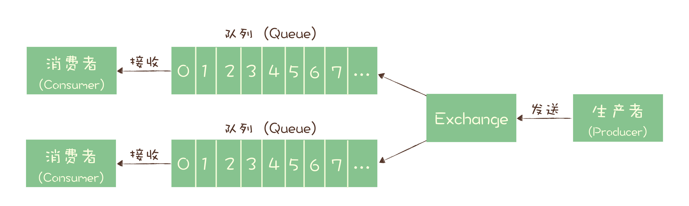
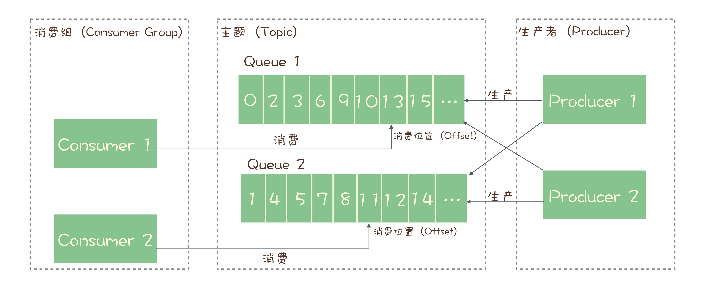
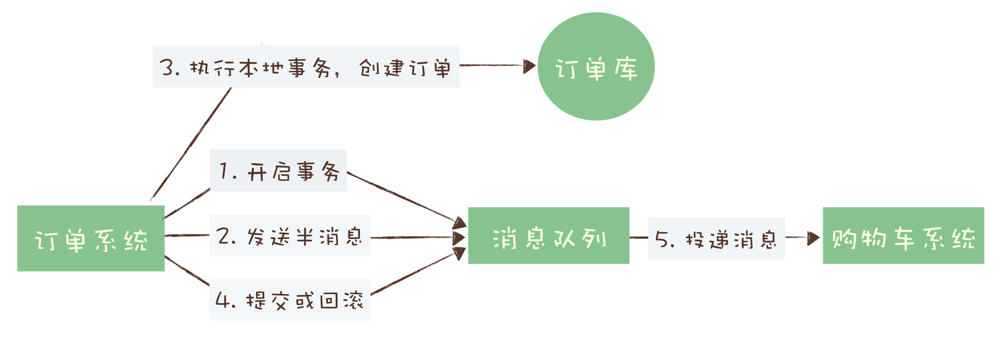

# Message Queue
##  功能
异步处理；  
流量控制；  
服务解耦；  
作为发布 / 订阅系统实现一个微服务级系统间的观察者模式；  
连接流计算任务和数据；  
用于将消息广播给大量接收者。

## 问题和局限性
引入消息队列带来的延迟问题；  
增加了系统的复杂度；  
可能产生数据不一致的问题。

## 消息队列产品
### RabbitMQ
    RabbitMQ 是使用一种比较小众的编程语言：Erlang 语言编写的，它最早是为电信行业系统之间的可靠通信设计的，也是少数几个支持 AMQP 协议的消息队列之一。

    RabbitMQ 是一个相当轻量级的消息队列，非常容易部署和使用。

    RabbitMQ 一个比较有特色的功能是支持非常灵活的路由配置，和其他消息队列不同的是，它在生产者（Producer）和队列（Queue）之间增加了一个 Exchange 模块，你可以理解为交换机。
    这个 Exchange 模块的作用和交换机也非常相似，根据配置的路由规则将生产者发出的消息分发到不同的队列中。路由的规则也非常灵活，甚至你可以自己来实现路由规则。基于这个 Exchange，可以产生很多的玩儿法，如果你正好需要这个功能，RabbitMQ 是个不错的选择。

----

    第一个问题是，RabbitMQ 对消息堆积的支持并不好，在它的设计理念里面，消息队列是一个管道，大量的消息积压是一种不正常的情况，应当尽量去避免。当大量消息积压的时候，会导致 RabbitMQ 的性能急剧下降。

    第二个问题是，RabbitMQ 的性能是我们介绍的这几个消息队列中最差的，根据官方给出的测试数据综合我们日常使用的经验，依据硬件配置的不同，它大概每秒钟可以处理几万到十几万条消息。其实，这个性能也足够支撑绝大多数的应用场景了，不过，如果你的应用对消息队列的性能要求非常高，那不要选择 RabbitMQ。

    最后一个问题是 RabbitMQ 使用的编程语言 Erlang，这个编程语言不仅是非常小众的语言，难以进行一些扩展和二次开发。

----
    RabbitMQ 中，Exchange 位于生产者和队列之间，生产者并不关心将消息发送给哪个队列，而是将消息发送给 Exchange，由 Exchange 上配置的策略来决定将消息投递到哪些队列中。同一份消息如果需要被多个消费者来消费，需要配置 Exchange 将消息发送到多个队列，每个队列中都存放一份完整的消息数据，可以为一个消费者提供消费服务。这也可以变相地实现新发布 - 订阅模型中，“一份消息数据可以被多个订阅者来多次消费”这样的功能。

### Kafka

    Kafka 最早是由 LinkedIn 开发，目前也是 Apache 的顶级项目。Kafka 最初的设计目的是用于处理海量的日志。

    Kafka 已经发展为一个非常成熟的消息队列产品，无论在数据可靠性、稳定性和功能特性等方面都可以满足绝大多数场景的需求。Kafka 与周边生态系统的兼容性是最好的没有之一，尤其在大数据和流计算领域，几乎所有的相关开源软件系统都会优先支持 Kafka。

    Kafka 使用 Scala 和 Java 语言开发，设计上大量使用了批量和异步的思想，这种设计使得 Kafka 能做到超高的性能。Kafka 的性能，尤其是异步收发的性能，是三者中最好的，但与 RocketMQ 并没有量级上的差异，大约每秒钟可以处理几十万条消息。
---
    Kafka 这种异步批量的设计带来的问题是，它的同步收发消息的响应时延比较高，因为当客户端发送一条消息的时候，Kafka 并不会立即发送出去，而是要等一会儿攒一批再发送，在它的 Broker 中，很多地方都会使用这种“先攒一波再一起处理”的设计。当你的业务场景中，每秒钟消息数量没有那么多的时候，Kafka 的时延反而会比较高。所以，Kafka 不太适合在线业务场景。
---
    Kafka 的消息模型和 RocketMQ 是完全一样的，我刚刚讲的所有 RocketMQ 中对应的概念，和生产消费过程中的确认机制，都完全适用于 Kafka。唯一的区别是，在 Kafka 中，队列这个概念的名称不一样，Kafka 中对应的名称是“分区（Partition）”，含义和功能是没有任何区别的
### RocketMQ

    RocketMQ 是阿里巴巴在 2012 年开源的消息队列产品，RocketMQ 有着不错的性能，稳定性和可靠性，具备一个现代的消息队列应该有的几乎全部功能和特性，并且它还在持续的成长中。

    RocketMQ 使用 Java 语言开发，它的贡献者大多数都是中国人，源代码相对也比较容易读懂，你很容易对 RocketMQ 进行扩展或者二次开发。

    RocketMQ 对在线业务的响应时延做了很多的优化，大多数情况下可以做到毫秒级的响应，如果你的应用场景很在意响应时延，那应该选择使用 RocketMQ。

    RocketMQ 的性能比 RabbitMQ 要高一个数量级，每秒钟大概能处理几十万条消息。
---
    RocketMQ 的一个劣势是，作为国产的消息队列，相比国外的比较流行的同类产品，在国际上还没有那么流行，与周边生态系统的集成和兼容程度要略逊一筹。
---
    RocketMQ 使用的消息模型是标准的发布 - 订阅模型。

    但是，在 RocketMQ 也有队列（Queue）这个概念，并且队列在 RocketMQ 中是一个非常重要的概念，那队列在 RocketMQ 中的作用是什么呢？这就要从消息队列的消费机制说起。

    几乎所有的消息队列产品都使用一种非常朴素的“请求 - 确认”机制，确保消息不会在传递过程中由于网络或服务器故障丢失。具体的做法也非常简单。在生产端，生产者先将消息发送给服务端，也就是 Broker，服务端在收到消息并将消息写入主题或者队列中后，会给生产者发送确认的响应。如果生产者没有收到服务端的确认或者收到失败的响应，则会重新发送消息；在消费端，消费者在收到消息并完成自己的消费业务逻辑（比如，将数据保存到数据库中）后，也会给服务端发送消费成功的确认，服务端只有收到消费确认后，才认为一条消息被成功消费，否则它会给消费者重新发送这条消息，直到收到对应的消费成功确认。这个确认机制很好地保证了消息传递过程中的可靠性，但是，引入这个机制在消费端带来了一个不小的问题。什么问题呢？为了确保消息的有序性，在某一条消息被成功消费之前，下一条消息是不能被消费的，否则就会出现消息空洞，违背了有序性这个原则。

    也就是说，每个主题在任意时刻，至多只能有一个消费者实例在进行消费，那就没法通过水平扩展消费者的数量来提升消费端总体的消费性能。为了解决这个问题，RocketMQ 在主题下面增加了队列的概念。

    每个主题包含多个队列，通过多个队列来实现多实例并行生产和消费。需要注意的是，RocketMQ 只在队列上保证消息的有序性，主题层面是无法保证消息的严格顺序的。

    RocketMQ 中，订阅者的概念是通过消费组（Consumer Group）来体现的。每个消费组都消费主题中一份完整的消息，不同消费组之间消费进度彼此不受影响，也就是说，一条消息被 Consumer Group1 消费过，也会再给 Consumer Group2 消费。

    消费组中包含多个消费者，同一个组内的消费者是竞争消费的关系，每个消费者负责消费组内的一部分消息。如果一条消息被消费者 Consumer1 消费了，那同组的其他消费者就不会再收到这条消息。

    在 Topic 的消费过程中，由于消息需要被不同的组进行多次消费，所以消费完的消息并不会立即被删除，这就需要 RocketMQ 为每个消费组在每个队列上维护一个消费位置（Consumer Offset），这个位置之前的消息都被消费过，之后的消息都没有被消费过，每成功消费一条消息，消费位置就加一。这个消费位置是非常重要的概念，我们在使用消息队列的时候，丢消息的原因大多是由于消费位置处理不当导致的。

## Transaction

订单系统给消息服务器发送一个“半消息”，这个半消息不是说消息内容不完整，它包含的内容就是完整的消息内容，半消息和普通消息的唯一区别是，在事务提交之前，对于消费者来说，这个消息是不可见的。

半消息发送成功后，订单系统就可以执行本地事务了，在订单库中创建一条订单记录，并提交订单库的数据库事务。然后根据本地事务的执行结果决定提交或者回滚事务消息。如果订单创建成功，那就提交事务消息，购物车系统就可以消费到这条消息继续后续的流程。如果订单创建失败，那就回滚事务消息，购物车系统就不会收到这条消息。这样就基本实现了“要么都成功，要么都失败”的一致性要求。

这个实现过程中，有一个问题是没有解决的。如果在第四步提交事务消息时失败了怎么办？对于这个问题，Kafka 和 RocketMQ 给出了 2 种不同的解决方案。

Kafka 的解决方案比较简单粗暴，直接抛出异常，让用户自行处理。我们可以在业务代码中反复重试提交，直到提交成功，或者删除之前创建的订单进行补偿。RocketMQ 会不断询问系统，直到得到回复。

## MQ可靠性
### 丢失检测
利用消息队列的有序性来验证是否有消息丢失。原理非常简单，在 Producer 端，我们给每个发出的消息附加一个连续递增的序号，然后在 Consumer 端来检查这个序号的连续性。

像 Kafka 和 RocketMQ 这样的消息队列，它是不保证在 Topic 上的严格顺序的，只能保证分区上的消息是有序的，所以我们在发消息的时候必须要指定分区，并且，在每个分区单独检测消息序号的连续性。

如果你的系统中 Producer 是多实例的，由于并不好协调多个 Producer 之间的发送顺序，所以也需要每个 Producer 分别生成各自的消息序号，并且需要附加上 Producer 的标识，在 Consumer 端按照每个 Producer 分别来检测序号的连续性。

Consumer 实例的数量最好和分区数量一致，做到 Consumer 和分区一一对应，这样会比较方便地在 Consumer 内检测消息序号的连续性。

### 可靠传递
#### Producer
你需要捕获消息发送的错误，并重发消息。
#### Broker
在存储阶段，你可以通过配置刷盘和复制相关的参数，让消息写入到多个副本的磁盘上，来确保消息不会因为某个 Broker 宕机或者磁盘损坏而丢失。
#### Consumer
不要在收到消息后就立即发送消费确认，而是应该在执行完所有消费业务逻辑之后，再发送消费确认。

### 重复消息
在 MQTT 协议中，给出了三种传递消息时能够提供的服务质量标准，这三种服务质量从低到高依次是：

    At most once: 至多一次。消息在传递时，最多会被送达一次。换一个说法就是，没什么消息可靠性保证，允许丢消息。一般都是一些对消息可靠性要求不太高的监控场景使用，比如每分钟上报一次机房温度数据，可以接受数据少量丢失。

    At least once: 至少一次。消息在传递时，至少会被送达一次。也就是说，不允许丢消息，但是允许有少量重复消息出现。

    Exactly once：恰好一次。消息在传递时，只会被送达一次，不允许丢失也不允许重复，这个是最高的等级。

这个服务质量标准不仅适用于 MQTT，对所有的消息队列都是适用的。我们现在常用的绝大部分消息队列提供的服务质量都是 At least once，包括 RocketMQ、RabbitMQ 和 Kafka 都是这样。也就是说，消息队列很难保证消息不重复。

#### 幂等化
幂等操作：其任意多次执行所产生的影响均与一次执行的影响相同

从对系统的影响结果来说：At least once + 幂等消费 = Exactly once。

那么如何实现幂等操作呢？最好的方式就是，从业务逻辑设计上入手，将消费的业务逻辑设计成具备幂等性的操

1. 利用数据库的唯一约束实现幂等
   利用唯一ID or `INSERT IF NOT EXIST` or `SETNX` 命令
2. 为更新的数据设置前置条件
    通用的方法是，给你的数据增加一个版本号属性，每次更数据前，比较当前数据的版本号是否和消息中的版本号一致，如果不一致就拒绝更新数据，更新数据的同时将版本号 +1，一样可以实现幂等更新。
3. 记录并检查操作
   可以用事务来实现，也可以用锁来实现，但是在分布式系统中，无论是分布式事务还是分布式锁都是比较难解决问题。

# REF
(https://learn.lianglianglee.com/%E4%B8%93%E6%A0%8F/%E6%B6%88%E6%81%AF%E9%98%9F%E5%88%97%E9%AB%98%E6%89%8B%E8%AF%BE/)