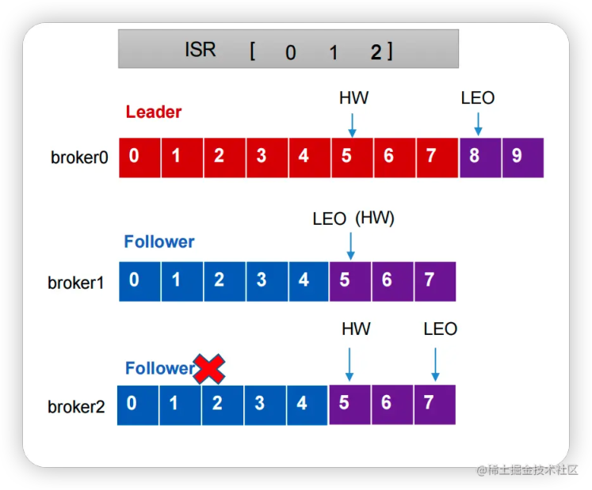
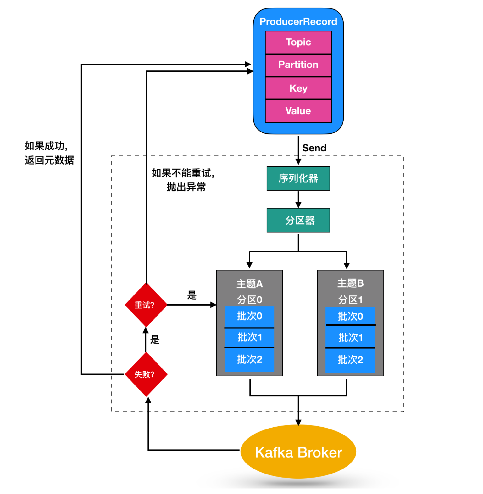

## Terms
- 消息：Record。Kafka是消息引擎，这里的消息就是指Kafka处理的主要对象。
- 主题：Topic。主题是承载消息的逻辑容器，在实际使用中多用来区分具体的业务。
- 分区：Partition。一个有序不变的消息序列。每个主题下可以有多个分区。
- 消息位移：Offset。表示分区中每条消息的位置信息，是一个单调递增且不变的值。
- LEO(LogEndOffset)：代表当前日志文件中下一条，指的是每个副本最大的offset
- HW(High Watermark)：所有副本中最小的LEO

  
- Replica、Leader 和 Follower：Replica。Kafka中同一条消息能够被拷贝到多个地方以提供数据冗余，这些地方就是所谓的副本。副本还分为领导者副本和追随者副本，各自有不同的角色划分。副本是在分区层级下的，即每个分区可配置多个副本实现高可用。
- AR（Assigned Replicas）：AR是指分区的所有副本，包括Leader副本和Follower副本。
- ISR（In-Sync Replicas）：ISR是指与Leader副本保持同步的副本集合。ISR中的副本与Leader副本保持同步，即它们已经复制了Leader副本中的所有数据，并且与Leader副本之间的数据差异不超过一定的阈值(默认是10s)。并且ISR副本集合是动态变化的，不是一成不变的。ISR中的副本可以被选举为新的Leader副本，以保证分区的正常运行。
- OSR（Out-of-Sync Replicas）：OSR是指与Leader副本不同步的副本集合。OSR中的副本与Leader副本之间的数据差异超过了一定的阈值，或者它们还没有复制Leader副本中的所有数据。OSR中的副本不能被选举为新的Leader副本，除非开启了Unclean选举。它们只能等待与Leader副本同步，或者被替换为新的副本。
- Coordinator
    在 Kafka 中，协调器（Coordinator）不是一个独立的消费者，而是由消费者组内的一个消费者实例充当。每个消费者组都有一个协调器，负责协调消费者实例之间的工作，包括分区的分配、重平衡、位移的提交和消费者分配。
  
- 生产者：Producer。向主题发布新消息的应用程序。
- 消费者：Consumer。从主题订阅新消息的应用程序。
- 消费者位移：Consumer Offset。表征消费者消费进度，每个消费者都有自己的消费者位移。
- 消费者组：Consumer Group。多个消费者实例共同组成的一个组，同时消费多个分区以实现高吞吐。
- 重平衡：Rebalance。消费者组内某个消费者实例挂掉后，其他消费者实例自动重新分配订阅主题分区的过程。Rebalance是Kafka消费者端实现高可用的重要手段。

## Broker parameters
### save
`log.dirs`：这是非常重要的参数，指定了Broker需要使用的若干个文件目录路径。这个参数是没有默认值的。
`log.dir`：注意这是dir，结尾没有s，说明它只能表示单个路径，它是补充上一个参数用的,一般不使用。
`log.retention.{hours|minutes|ms}`：这是个“三兄弟”，都是控制一条消息数据被保存多长时间。从优先级上来说ms设置最高、minutes次之、hours最低。
`log.retention.bytes`：这是指定Broker为消息保存的总磁盘容量大小。默认为-1，表示不限制保存占用
`message.max.bytes`：控制Broker能够接收的最大消息大小。

### ZooKeeper
ZooKeeper是一个分布式协调框架，负责协调管理并保存Kafka集群的所有元数据信息，比如集群都有哪些Broker在运行、创建了哪些Topic，每个Topic都有多少分区以及这些分区的Leader副本都在哪些机器上等信息。

`zookeeper.connect`是一个CSV格式的参数，比如我可以指定它的值为`zk1:2181,zk2:2181,zk3:2181`。2181是ZooKeeper的默认端口。

现在问题来了，如果我让多个Kafka集群使用同一套ZooKeeper集群，那么这个参数应该怎么设置呢？这时候chroot就派上用场了。这个chroot是ZooKeeper的概念，类似于别名。

如果你有两套Kafka集群，假设分别叫它们kafka1和kafka2，那么两套集群的zookeeper.connect参数可以这样指定：`zk1:2181,zk2:2181,zk3:2181/kafka1和zk1:2181,zk2:2181,zk3:2181/kafka2`。切记chroot只需要写一次，而且是加到最后的。我经常碰到有人这样指定：`zk1:2181/kafka1,zk2:2181/kafka2,zk3:2181/kafka3`，这样的格式是不对的。

### Broker connect
`broker.id`
每个 kafka broker 都有一个唯一的标识来表示，这个唯一的标识符即是 `broker.id`，它的默认值是 0。这个值在 kafka 集群中必须是唯一的，这个值可以任意设定.
`listeners` `<协议名称，主机名，端口号>`：学名叫监听器，其实就是告诉外部连接者要通过什么协议访问指定主机名和端口开放的Kafka服务。
`advertised.listeners`：和listeners相比多了个advertised。Advertised的含义表示宣称的、公布的，就是说这组监听器是Broker用于对外发布的。
`host.name/port`：列出这两个参数就是想说你把它们忘掉吧，压根不要为它们指定值，毕竟都是过期的参数了。

### Topic manage
`auto.create.topics.enable`：是否允许自动创建Topic。
`unclean.leader.election.enable`：是否允许Unclean Leader选举。
`auto.leader.rebalance.enable`：是否允许定期进行Leader选举。

### producer分配策略
Kafka提供了三种分配策略：轮询分区策略、随机分区策略、按key分区分配策略、自定义分区策略

### consumer分配策略
Kafka提供了三种分配策略：RangeAssignor、RoundRobinAssignor和StickyAssignor。 

    RangeAssignor：基于主题的分区分配策略，以数据顺序排列可用分区，以字典顺序排列消费者计算分配。   

    RoundRobinAssignor：轮询分区分配策略，将消息依次写入每个分区，实现负载均衡。   

    StickyAssignor：粘性分区分配策略，当消费者组中的第一个消费者加入或退出时，它会重新分配其订阅主题的分区，以确保每个主题都被均匀地分配给消费者组中的每个消费者。  

### 选举
OfflinePartition Leader 选举:每当有分区上线时，就需要执行 Leader 选举。所谓的分区上线，可能是创建了新分区，也可能是之前的下线分区重新上线，选项A正确。

ReassignPartition Leader 选举:当你手动运行 kafka-reassign-partitions 命令，或是调用Admin的alterPartitionReassignments 方法执行分区副本重分配时，可能触发此类选举。

PreferredReplicaPartition Leader 选举:当你手动运行 kafka-preferred-replica- election 命令，或自动触发了 Preferred Leader 选举时，该类策略被激活。

ControlledShutdownPartition Leader 选举:当 Broker 正常关闭时，该 Broker上的所有 Leader 副本都会下线，因此，需要为受影响的分区执行相应的 Leader 选举。

### Topic级别参数
`retention.ms`：规定了该Topic消息被保存的时长。默认是7天，即该Topic只保存最近7天的消息。一旦设置了这个值，它会覆盖掉Broker端的全局参数值。
`retention.bytes`：规定了要为该Topic预留多大的磁盘空间。和全局参数作用相似，这个值通常在多租户的Kafka集群中会有用武之地。当前默认值是-1，表示可以无限使用磁盘空间。
`max.message.bytes`：可接收的消息最大默认字节。 Kafka可以接收的最大消息默认为1MB。

## Kafka 机制

## 应用

### Kafka 中什么情况下会出现消息丢失的问题​

消息发送时

当 `acks = 0` 时，不和 Kafka 进行消息接收确认，可能会因为网络异常，缓冲区满的问题，导致消息丢失​
当 `acks = 1` 时，只有 leader 同步成功而 follower 尚未完成同步，如果 leader 挂了，就会造成数据丢失​

消息消费时​

当设置`enable.auto.commit` = `true` 时，消费者会在一定时间间隔对收到的消息进行commit。此时，可能存在消费者还没来得及消费就已经挂了的情况，下次消费时的数据就是 offset + 1 的位置，那么原先 offset 的数据就丢失了。​

### Kafka 如何保证消息不重复消费​

kafka出现消息重复消费的原因：​
消费者宕机、重启或者被强行kill进程，导致消费者消费的offset没有提交，恢复正常后可能会重复消费。​
由于消费者端处理业务时间长导致会话超时，那么就会触发reblance重平衡，此时可能存在消费者offset没提交，会导致重平衡后重复消费。​

解决方案：​
消费消息服务做幂等校验，比如 Redis 的set、MySQL 的主键等天然的幂等功能。这种方法最有效。​
开启Kafka的幂等生产者和事务型生产者，不过开启事务型生产者会增加系统的开销，需要根据实际业务决定是否开启事务型生产者。​
生产消息时增加消息唯一ID，将消息的标识保存到外部存储介质中，每次消费时判断是否处理过即可。​

### Kafka 如何保证消息的消费顺序​

1 个 Topic 只对应一个 Partition，但是这个方法破坏了Kafka设计partition的初衷。​

发送消息的时候指定 key/Partition，生产者发送 1 条消息的时候，可以指定 topic, partition, key,data（数据） 4 个参数。如果你发送消息的时候指定了 Partition 的话，所有消息都会被发送到指定的 Partition。并且，同一个 key 的消息可以保证只发送到同一个 partition，这个我们可以采用表/对象的 id 来作为 key从而保证消息的顺序性 。

### ZooKeeper
Broker 注册： Kafka Broker 在启动时会将自己注册到 ZooKeeper，以便消费者和其他 Broker 可以发现它们。

分区和副本管理： ZooKeeper 负责协调 Kafka 分区的分配和副本的分布，以实现高可用性和负载均衡。

消费者位移管理： ZooKeeper 用于存储和管理消费者的位移信息，以确保消费者可以从上次的位置继续消费消息。

### Kafka 中分区分配的原则​
指明Partition的情况下，直接将指明的值作为Partition值​

没有指明Partition值但有 key 的情况下，将 key 的 Hash 值与 topic 的Partition值进行取余得到Partition值​

既没有Partition值又没有 key 值的情况下，第一次调用时随机生成一个整数，将这个值与Topic可用的Partition总数取余得到Parittion值，后面每次调用在这个整数上自增

### Kafka 生产者运行流程

- 消息封装：
首先，生产者将待发送的消息封装成 ProducerRecord 对象，该对象包含了消息的主题、键、值等信息。

- 序列化处理：
消息需要被序列化，将其转换为字节流的形式。这通常是通过指定的序列化器（例如，StringSerializer）来完成的，可以使用默认的或自定义的序列化器。

- 分区处理：
生产者需要决定将消息发送到哪个主题的哪个分区。这可能涉及获取 Kafka 集群的元数据，以确定分区的信息。如果指定了分区，就不需要确定分区。

- 缓存区处理：
分好区的消息不会立即发送到服务器，而是先放入生产者的缓存区（Buffer）。
多条消息可能被封装成一个批次（Batch），以提高效率。批次大小默认为 16KB。缓冲区中累计的空闲等待时间间隔，默认0ms

- Sender 线程启动：
生产者的 Sender 线程会启动，负责将消息发送到 Kafka 服务器。

- 获取可发送的批次：
Sender 线程从缓存区获取可以发送的批次。这是为了提高效率，减少网络开销。

- 发送到服务端：
Sender 线程将获取到的批次发送到对应的 Kafka 服务器，进行网络传输。
如果消息发送成功，生产者可以选择等待确认（acknowledgement）。

- 分段发送：
大型批次可能需要分段发送，以适应网络传输的限制。

### 数据清理策略
日志删除(Log Deletion)：按照指定的策略直接删除不符合条件的日志。​ ◦ 基于日志大小：日志删除任务会检查各个日志文件的大小是否超过设定的阈值retentionSize来寻找可删除的日志分段的文件集合​ ◦ 基于时间：日志删除任务会检查各个日志文件中是否有保留时间超过设定的阈值retentionMs来寻找可删除的的日志分段文件集合​ ◦ 基于日志起始偏移量：某日志分段的下一个日志分段的baseOffset是否小于等于logStartOffset，若是则可以删除此日志分段。​ • 日志压缩(Log Compaction)：按照消息的key进行整合，有相同key的但有不同value值，只保留最后一个版本。

### 无消息丢失配置
不要使用`producer.send(msg)`，而要使用`producer.send(msg, callback)`。记住，一定要使用带有回调通知的send方法。

设置`acks = all`。acks是Producer的一个参数，代表了你对“已提交”消息的定义。如果设置成all，则表明所有副本Broker都要接收到消息，该消息才算是“已提交”。这是最高等级的“已提交”定义。

设置retries为一个较大的值。这里的retries同样是Producer的参数，对应前面提到的Producer自动重试。当出现网络的瞬时抖动时，消息发送可能会失败，此时配置了retries > 0的Producer能够自动重试消息发送，避免消息丢失。

设置`unclean.leader.election.enable = false`。这是Broker端的参数，它控制的是哪些Broker有资格竞选分区的Leader。如果一个Broker落后原先的Leader太多，那么它一旦成为新的Leader，必然会造成消息的丢失。故一般都要将该参数设置成false，即不允许这种情况的发生。

设置`replication.factor` >= 3。这也是Broker端的参数。其实这里想表述的是，最好将消息多保存几份，毕竟目前防止消息丢失的主要机制就是冗余。

设置`min.insync.replicas` > 1。这依然是Broker端参数，控制的是消息至少要被写入到多少个副本才算是“已提交”。设置成大于1可以提升消息持久性。在实际环境中千万不要使用默认值1。

确保`replication.factor` > `min.insync.replicas`。如果两者相等，那么只要有一个副本挂机，整个分区就无法正常工作了。我们不仅要改善消息的持久性，防止数据丢失，还要在不降低可用性的基础上完成。推荐设置成replication.factor = min.insync.replicas + 1。

确保消息消费完成再提交。Consumer端有个参数`enable.auto.commit`，最好把它设置成false，并采用手动提交位移的方式。就像前面说的，这对于单Consumer多线程处理的场景而言是至关重要的。