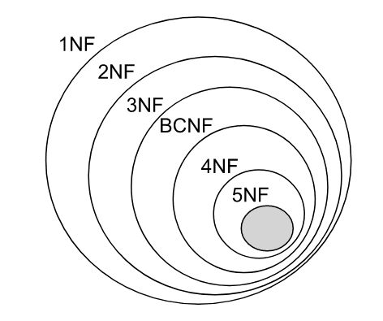

## 关系型数据库设计理论
### Base term

- 属性（attribute）：列的名字。
- 元组（tuple）：每一个行都是一个元组。
- 域（domain）：属性的数据类型，如string、integer等。
- 表（table）：由多个属性，以及众多元组所表示的各个实例组成。
---
- 依赖（relation）：列属性间存在的某种联系。
- 模式（schema）：这里我们指逻辑结构，如 学生信息（学号，姓名，班级，兴趣爱好，班主任，课程，授课主任，分数） 的笼统表述。
---
- 键/码（key）：由关系的一个或多个属性组成，任意两个键相同的元组，所有属性都相同。需要保证表示键的属性最少。一个关系可以存在好几种键，工程中一般从这些候选键中选出一个作为主键（primary key）。
- 候选键/候选码（candidate key）：由关系的一个或多个属性组成，候选键都具备键的特征，都有资格成为主键。
- 超键（super key）：包含键的属性集合，无需保证属性集的最小化。每个键也是超键。可以认为是键的超集。
- 外键（foreign key）：如果某一个关系A中的一个（组）属性是另一个关系B的键，则该（组）属性在A中称为外键。
- **主属性（prime attribute）：所有候选键所包含的属性都是主属性。
- **主键属性/主属性是主键中包含的属性，而主键是用于唯一标识关系中元组的属性集合。主属性通常指的是主键属性，因为它们是主键中的一部分。主属性的值在整个关系中是唯一的，用于区分不同的元组

**主键属性/主属性存在定义上歧义，一般情况下遵循第二条

---
- 投影（projection）：选取特定的列，如将关系学生信息投影为学号、姓名即得到仅包含学号、姓名的列
- 选择（selection）：按照一定条件选取特定元组，如选择上表中分数>80的元组。
- 笛卡儿积（交叉连接Cross join）：第一个关系每一行分别与第二个关系的每一行组合。
- 自然连接（natural join）：第一个关系中每一行与第二个关系的每一行进行匹配，如果得到有交叉部分则合并，若无交叉部分则舍弃。
- 连接（theta join）：即加上约束条件的笛卡儿积，先得到笛卡儿积，然后根据约束条件删除不满足的元组。
- 外连接（outer join）：执行自然连接后，将舍弃的部分也加入，并且匹配失败处的属性用NULL代替。
- 除法运算（division）：关系R除以关系S的结果为T，则T包含所有在R但不在S中的属性，且T的元组与S的元组的所有组合在R中。

### 依赖/完全依赖/传递依赖
记 A->B 表示 A 函数决定 B `(A 唯一确定 B)`，也可以说 B 函数依赖于 A。  
如果 {A1，A2，... ，An} 是关系的一个或多个属性的集合，该集合函数决定了关系的其它所有属性并且是最小的，那么该集合就称为键码`（键/码）`。  
对于 A->B，如果能找到 A 的真子集 A'，使得 A'-> B，那么 A->B 就是部分函数依赖，否则就是完全函数依赖。对于 A->B，B->C，则 A->C 是一个传递函数依赖。

### 范式
一种规范化的概念，旨在减少数据冗余和提高数据结构的一致性。

#### 1NF
属性不能再被分割，也就是这个字段都是原子的，不能再分为多个其他的字段了。

#### 2NF
消除了非主属性对于主属性的部分函数依赖。第二范式在第一范式的基础上增加了一个列，这个列称为主键，非主属性都依赖于主键。非主属性（即非主键属性）不能部分依赖于主属性，而必须完全依赖于主属性。

#### 3NF
消除了对主属性的传递依赖。这意味着非主属性不能传递依赖于其他非主属性。

    { BC->D, AC->BE, B->E }
    candidate key：{AC}
    BC->D
    B非候选键，D部份依赖B，符合2NF,不符合3NF

#### BCNF (Boyce-Codd Normal Form)
every functional dependency (X->Y), X is either the super key or the candidate key  
BCNF范式排除了任何属性(不光是非主属性，2NF和3NF所限制的都是非主属性)对候选键的传递依赖与部分依赖

    {AB ->C, C ->B, AB ->B}
    candidate key：{AB}
    C ->B
    C非super key or candidate key，属于3NF不属于BCNF

BCNF消除了删除异常、插入异常和更新异常

[BCNF](https://www.scaler.com/topics/bcnf-in-dbms/)

### ER/ERD(Entity Relationship Diagram)
提供了表示实体类型、属性和联系的方法。
实体：通常是现实世界的业务对象，当然使用一些逻辑对象也可以。比如对于一个校园管理系统，会涉及学生、教师、课程、班级等等实体。在 ER 图中，实体使用矩形框表示。  
属性：即某个实体拥有的属性，属性用来描述组成实体的要素，对于产品设计来说可以理解为字段。在 ER 图中，属性使用椭圆形表示。  
联系：即实体与实体之间的关系，在 ER 图中用菱形表示，这个关系不仅有业务关联关系，还能通过数字表示实体之间的数量对照关系。例如，一个班级会有多个学生就是一种实体间的联系。

### 其他

数据完整性分为三类：实体完整性（Entity Integrity）、参照完整性（Referential Integrity）、用户自定义完整性（User-definedIntegrity）。

实体完整性约束 
 
  实体完整性(Entity integrity)是指关系的主关键字不能重复也不能取“空值"。 
 
参照完整性约束 
 
  参照完整性(Referential Integrity)是定义建立关系之间联系的主关键字与外部关键字引用的约束条件。 涉及外键，外键应符合要求。
 
用户完整性约束 
 
  实体完整性和参照完整性适用于任何关系型数据库系统，它主要是针对关系的主关键字和外部关键字取值必须有效而做出的约束。用户定义完整性(user defined integrity)则是根据应用环境的要求和实际的需要，对某一具体应用所涉及的数据提出约束性条件。这一约束机制一般不应由应用程序提供，而应有由关系模型提供定义并检验 。
 
  用户定义完整性主要包括字段有效性约束和记录有效性。
  主要包括非空约束、唯一约束、检查约束、主键约束、外键约束。

规范设计的6个阶段按照规范设计的方法，考虑数据库及其应用系统开发全过程，将数据库设计分为以下6个阶段需求分析：
分析用户的需求，包括数据、功能和性能需求；
概念结构设计：主要采用E-R模型进行设计，包括画E-R图；
逻辑结构设计：通过将E-R图转换成表，实现从E-R模型到关系模型的转换；
数据库物理设计：主要是为所设计的数据库选择合适的存储结构和存取路径；
数据库的实施：包括编程、测试和试运行；
数据库运行与维护：系统的运行与数据库的日常维护

SQL执行顺序:
from -> on -> join ->  where -> group by -> having + 聚合 -> select  -> order by -> limit 

两段锁协议:
  指事务必须分成两个阶段对数据进行加锁和解锁 在释放一个封锁以后，事务不在申请获得其它封锁 

  两段锁的含义 
    第一段是获得封锁，也称扩展阶段 事务可以获得任何数据项上任何类型的锁，但是不能释放锁 
    第二段是释放封锁，也称收缩阶段 事务可以释放任何数据项上任何类型的锁，但是不能获得锁