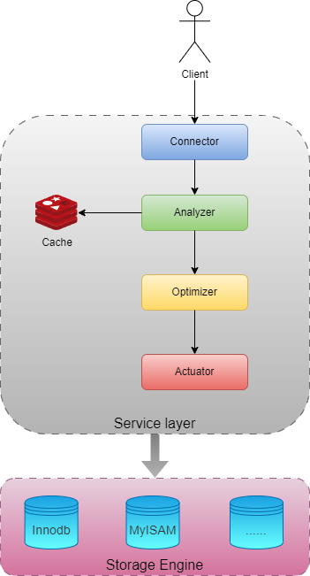
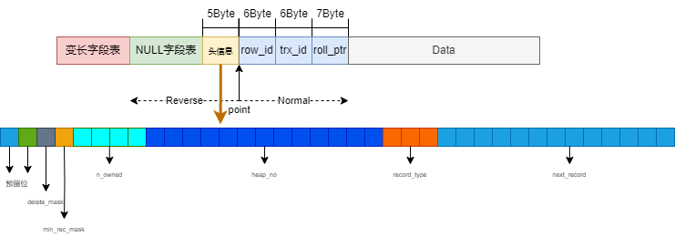
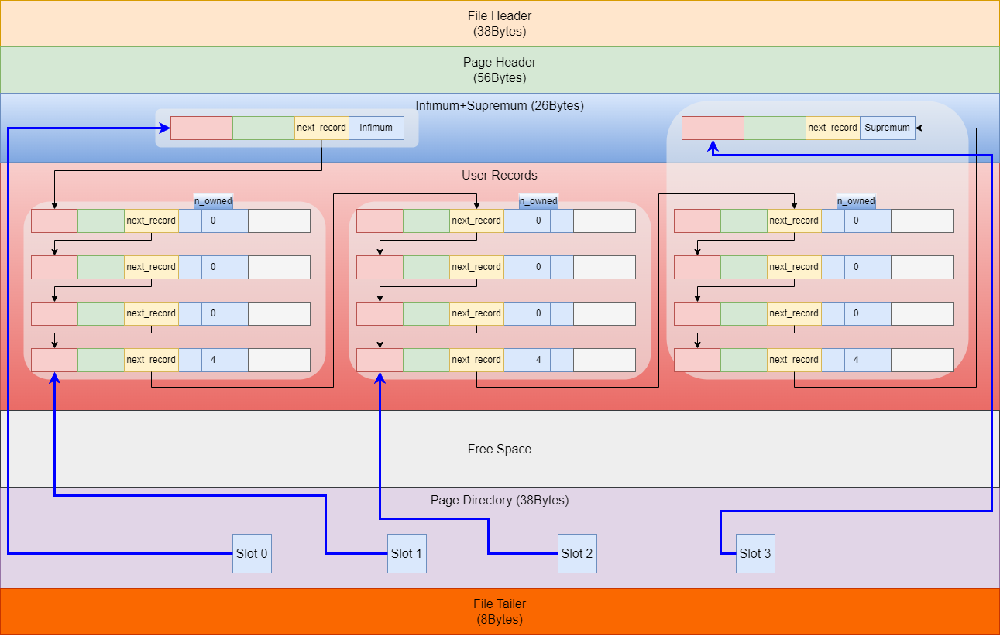

- [MySQL 的基本架构与运行](#mysql-的基本架构与运行)
    - [question](#question)
- [MySQL 物理存储](#mysql-物理存储)
  - [表空间](#表空间)
  - [行](#行)
    - [question](#question-1)
  - [页](#页)
    - [Inf+Supre\\User Record\\Page Diectory](#infsupreuser-recordpage-diectory)
    - [File Header](#file-header)
    - [Page Header](#page-header)
    - [File Tailer](#file-tailer)
    - [Reference](#reference)


# MySQL 的基本架构与运行

<p align="center">

</p>

1. 连接器：连接器负责跟客户端建立连接、获取权限、维持和管理连接。(TCP)

```
mysql -h$ip -P$port -u$user -p
```


* 查询缓存：MySQL 8.0 版本直接将查询缓存的整块功能删掉了

2. 分析器：进行词法分析与语法分析

3. 优化器：优化器是在表里面有多个索引的时候，决定使用哪个索引；或者在一个语句有多表关联（join）的时候，决定各个表的连接顺序。

4. 执行器：
    - 判断一下用户对这个表有没有执行查询的权限
    - 让存储引擎定位符合条件的第一条记录，判断是否将这条记录存在结果集中
    - 调用引擎接口取下一行，重复相同的判断逻辑
    - 执行器将上述遍历过程中所有满足条件的行组成的记录集作为结果集返回给客户端

---
### <span style="color:skyblue"><b>question
 - 空闲连接会一直占用着吗？  
当然不是了，MySQL 定义了空闲连接的最大空闲时长，由 wait_timeout 参数控制的，默认值是 8 小时（28880秒），如果空闲连接超过了这个时间，连接器就会自动将它断开。      
 - MySQL 的连接数有限制吗？  
MySQL 服务支持的最大连接数由 max_connections 参数控制，比如我的 MySQL 服务默认是 151 个,超过这个值，系统就会拒绝接下来的连接请求，并报错提示“Too many connections”。
 - 怎么解决长连接占用内存的问题？  
   - 第一种，定期断开长连接。既然断开连接后就会释放连接占用的内存资源，那么我们可以定期断开长连接。  
   - 第二种，客户端主动重置连接。MySQL 5.7 版本实现了 mysql_reset_connection() 函数的接口，注意这是接口函数不是命令，那么当客户端执行了一个很大的操作后，在代码里调用 mysql_reset_connection 函数来重置连接，达到释放内存的效果。这个过程不需要重连和重新做权限验证，但是会将连接恢复到刚刚创建完时的状态。
</b></span>


# MySQL 物理存储

## 表空间

表空间由<span style="color:#304ffe"><b>段（segment）、区（extent）、页（page）、行（row）</b></span>组成，InnoDB存储引擎的逻辑存储结构大致如下图：


- InnoDB 的数据是按「页」为单位来读写的，也就是说，当需要读一条记录的时候，并不是将这个行记录从磁盘读出来，而是以页为单位，将其整体读入内存。默认每个页的大小为<span style=color:red><b> 16KB</b></span>。

- 在表中数据量大的时候，为某个索引分配空间的时候就不再按照页为单位分配了，而是按照区（extent）为单位分配。每个区的大小为 1MB，对于 16KB 的页来说，连续的 64 个页会被划为一个区，这样就使得链表中相邻的页的物理位置也相邻，就能使用顺序 I/O 了。

- 段类别：
  - 索引段：存放 B + 树的非叶子节点的区的集合；
  - 数据段：存放 B + 树的叶子节点的区的集合；
  - 回滚段：存放的是回滚数据的区的集合，之前讲事务隔离 (opens new window)的时候就介绍到了 MVCC 利用了回滚段实现了多版本查询数据。

## 行
<p align="center">

</p>
行格式（row_format），就是一条记录的存储结构。

InnoDB 提供了 4 种行格式，分别是 Redundant(忽略)、Compact、Dynamic和 Compressed 行格式。

Redundant 是很古老的行格式了， MySQL 5.0 版本之前用的行格式，现在基本没人用了。
Compact 是一种紧凑的行格式，设计的初衷就是为了让一个数据页中可以存放更多的行记录，从 MySQL 5.1 版本之后，行格式默认设置成 Compact。
Dynamic 和 Compressed 两个都是紧凑的行格式，它们的行格式都和 Compact 差不多，因为都是基于 Compact 改进一点东西。从 MySQL5.7 版本之后，默认使用 Dynamic 行格式。

- 头记录信息
  - delete_mask	标记该记录是否被删除
  - min_rec_mask	B+树的每层非叶子节点中的最小记录都会添加该标记
  - n_owned	表示当前记录拥有的记录数
  - heap_no	表示当前记录在记录堆的位置信息，这个属性表示当前记录在本页中的位置，0与1分别表示最小/最大记录
  - record_type	表示当前记录的类型，0表示普通记录，1表示B+树非叶子节点记录，2表示最小记录，3表示最大记录
  - next_record	表示下一条记录的相对位置
  

- row_id  
如果我们建表的时候指定了主键或者唯一约束列，那么就没有 row_id 隐藏字段了。如果既没有指定主键，又没有唯一约束，那么 InnoDB 就会为记录添加 row_id 隐藏字段。row_id不是必需的，占用 6 个字节。
- trx_id  
事务id，表示这个数据是由哪个事务生成的。 trx_id是必需的，占用 6 个字节。
- roll_pointer  
这条记录上一个版本的指针。roll_pointer 是必需的，占用 7 个字节。

---
### <span style="color:skyblue"><b>question
- 为什么`变长字段长度列表`/`NULL 值列表`的信息要按照逆序存放？  
这个设计是有想法的，主要是因为「记录头信息」中指向下一个记录的指针，指向的是下一条记录的「记录头信息」和「真实数据」之间的位置，这样的好处是向左读就是记录头信息，向右读就是真实数据，比较方便。  
`变长字段长度列表`/`NULL 值列表`的信息之所以要逆序存放，是因为这样可以使得位置靠前的记录的真实数据和数据对应的字段长度信息可以同时在一个 CPU Cache Line 中，这样就可以提高 CPU Cache 的命中率。

- 每个数据库表的行格式都有`变长字段长度列表`/`NULL 值列表`吗？  
当数据表没有变长字段/或都定义成 NOT NULL的时候，表里的行格式就不会有了，因为没必要，不如去掉以节省空间。

- varchar(n) 中 n 最大取值为多少？  
行数据的最大字节数是 65535（不包含 TEXT、BLOBs 这种大对象类型），其中包含了 storage overhead  
如果有多个字段的话，要保证所有字段的长度 + 变长字段字节数列表所占用的字节数 + NULL值列表所占用的字节数 <= 65535。

- 行溢出后，MySQL 是怎么处理的？  
Compact发生行溢出，多的数据就会存到另外的「溢出页」中
Compressed 和 Dynamic 这两个行格式，主要的区别在于处理行溢出数据时有些区别。
这两种格式采用完全的行溢出方式，记录的真实数据处不会存储该列的一部分数据，只存储 20 个字节的指针来指向溢出页。


## 页

### Inf+Supre\User Record\Page Diectory 

<p align="center">

</p>


### File Header 
页的通用信息
- 在页目录中的槽数量
- 还未使用的空间最小地址
- 本页中的记录的数量（包括最小和最大记录以及标记为删除的记录）
- 第一个已经标记为删除的记录地址（各个已删除的记录通过next_record也会组成一个单链表，这个单链表中的记录可以被重新利用）
- 已删除记录占用的字节数
- 最后插入记录的位置
- 记录插入的方向
- 该页中记录的数量（不包括最小和最大记录以及被标记为删除的记录）
- 修改当前页的最大事务ID，该值仅在二级索引中定义
- 当前页在B+树中所处的层级
- 索引ID，表示当前页属于哪个索引
- ...

### Page Header
数据页专有的一些信息
- 页的校验和（checksum值）
- 页号
- 上下一个页的页号
- 2字节	该页的类型
- 页属于哪个表空间
- ...

### File Tailer
校验页是否完整


### Reference
页的详细信息可以查看[盛放记录的大盒子-InnoDB数据页结构](https://relph1119.github.io/mysql-learning-notes/#/mysql/05-%E7%9B%9B%E6%94%BE%E8%AE%B0%E5%BD%95%E7%9A%84%E5%A4%A7%E7%9B%92%E5%AD%90-InnoDB%E6%95%B0%E6%8D%AE%E9%A1%B5%E7%BB%93%E6%9E%84)