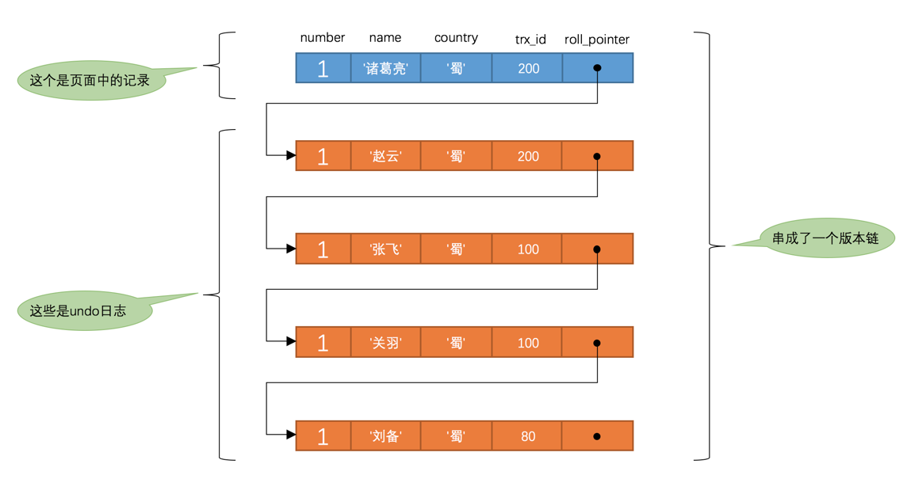

- [事务](#事务)
  - [事务特性(ACID)](#事务特性acid)
    - [原子性（Atomicity）](#原子性atomicity)
    - [一致性（Consistency）](#一致性consistency)
    - [隔离性（Isolation）](#隔离性isolation)
    - [持久性（Durability）](#持久性durability)
    - [执行](#执行)
  - [事务隔离](#事务隔离)
- [多版本并发控制 (Multi-Version Concurrency Control, MVCC)](#多版本并发控制-multi-version-concurrency-control-mvcc)
  - [Snap read / Current read](#snap-read--current-read)
    - [一致性非锁定读 (Consistent Nonlocking Reads)](#一致性非锁定读-consistent-nonlocking-reads)
    - [锁定读 (Locking Reads)](#锁定读-locking-reads)
  - [MVCC实现](#mvcc实现)
    - [版本链](#版本链)
    - [ReadView](#readview)
- [锁](#锁)
  - [全局锁](#全局锁)
    - [FTWRL (flush tables with read lock)](#ftwrl-flush-tables-with-read-lock)
  - [表级锁](#表级锁)
    - [表锁](#表锁)
    - [元数据锁（MDL）](#元数据锁mdl)
    - [意向锁(IS/IX)](#意向锁isix)
    - [AUTO-INC 锁](#auto-inc-锁)
  - [行级锁](#行级锁)
    - [Record Lock](#record-lock)
    - [Gap Lock](#gap-lock)
    - [Next-Key Lock](#next-key-lock)
    - [插入意向锁](#插入意向锁)
- [REF](#ref)


# 事务
## 事务特性(ACID)
### 原子性（Atomicity）
一个事务中的所有操作，要么全部完成，要么全部不完成，不会结束在中间某个环节，而且事务在执行过程中发生错误，会被回滚到事务开始前的状态，就像这个事务从来没有执行过一样，就好比买一件商品，购买成功时，则给商家付了钱，商品到手；购买失败时，则商品在商家手中，消费者的钱也没花出去。
### 一致性（Consistency）
是指事务操作前和操作后，数据满足完整性约束，数据库保持一致性状态。
### 隔离性（Isolation）
数据库允许多个并发事务同时对其数据进行读写和修改的能力，隔离性可以防止多个事务并发执行时由于交叉执行而导致数据的不一致，因为多个事务同时使用相同的数据时，不会相互干扰，每个事务都有一个完整的数据空间，对其他并发事务是隔离的。也就是说，消费者购买商品这个事务，是不影响其他消费者购买的。
### 持久性（Durability）
事务处理结束后，对数据的修改就是永久的，即便系统故障也不会丢失。

### 执行
持久性是通过 redo log （重做日志）来保证的；
原子性是通过 undo log（回滚日志） 来保证的；
隔离性是通过 MVCC（多版本并发控制） 或锁机制来保证的；
一致性则是通过持久性+原子性+隔离性来保证；

## 事务隔离

| 隔离级别       | 脏读 | 不可重复读 | 幻读 |
| -------------- | ---- | ---------- | ---- |
| READ-UNCOMMITTED | √    | √          | √    |
| READ-COMMITTED  | ×    | √          | √    |
| REPEATABLE-READ | ×    | ×          | √    |
| SERIALIZABLE    | ×    | ×          | ×    |


- MySQL默认为`Repeatable-Read`
- `READ COMMITTED` 每次读取数据前都生成一个ReadView
- `REPEATABLE READ` 在第一次读取数据时生成一个ReadView

 - `REPEATABLE-READ` 幻读的情况:
    - T1 时刻：事务 A 先执行「快照读语句」：select * from t_test where id > 100 得到了 3 条记录。
    - T2 时刻：事务 B 往插入一个 id= 200 的记录并提交；
    - T3 时刻：事务 A 再执行「当前读语句」 select * from t_test where id > 100 for update 就会得到 4 条记录，此时也发生了幻读现象。


# 多版本并发控制 (Multi-Version Concurrency Control, MVCC)

## Snap read / Current read
### 一致性非锁定读 (Consistent Nonlocking Reads)
MVCC就是对非锁定读的实现。如果读取的行正在执行 `DELETE` 或 `UPDATE` 操作，这时读取操作不会去等待行上锁的释放。相反地，InnoDB 存储引擎会去读取行的一个快照数据，对于这种读取历史数据的方式，我们叫它快照读 (snapshot read)在 `Repeatable Read` 和 `Read Committed`两个隔离级别下，如果是执行普通的 `SELECT` 语句,则会使用一致性非锁定读（MVCC）。并且在 Repeatable Read下 MVCC 实现了可重复读和防止部分幻读

### 锁定读 (Locking Reads)
锁定读（Locking Reads）即当前读（Current Reads）读取的是数据的最新版本
`SELECT ... lock in share mode`、`SELECT ... for update`、`INSERT`、`UPDATE`、`DELETE` 
- `SELECT ... lock in share mode`：对记录加 S 锁，其它事务也可以加S锁，如果加X锁则会被阻塞
- `SELECT ... for update`、`INSERT`、`UPDATE`、`DELETE`：对记录加X锁，且其它事务不能加任何锁 

`Repeatable Read`级别下，锁定读会使用锁进行并发处理。

## MVCC实现 
MVCC 的实现依赖于：Read View、undo log(版本链)。


InnoDB 通过数据行的DB_TRX_ID 和 Read View来判断数据的可见性，如不可见，则通过数据行的 DB_ROLL_PTR 找到 undo log 中的历史版本。每个事务读到的数据版本可能是不一样的，在同一个事务中，用户只能看到该事务创建 Read View 之前已经提交的修改和该事务本身做的修改。

### 版本链
<p align=""center>

</p>

- row字段
  - `trx_id`（6字节）：表示最后一次插入或更新该行的事务 id。此外，delete 操作在内部被视为更新，只不过会在记录头 Record header 中的 deleted_flag 字段将其标记为已删除
  - `roll_pointer`（7字节） 回滚指针，指向该行的 undo log 。如果该行未被更新，则为空
  
- 实现  
对该记录每次更新后，都会将旧值放到一条undo日志中，就算是该记录的一个旧版本，随着更新次数的增多，所有的版本都会被roll_pointer属性连接成一个链表，我们把这个链表称之为版本链，版本链的头节点就是当前记录最新的值。另外，每个版本中还包含生成该版本时对应的事务id。


### ReadView

- ReadView字段
  - `m_ids` ：指的是在创建 ReadView 时，当前数据库中「活跃事务」的事务 id 列表，注意是一个列表，“活跃事务”指的就是，启动了但还没提交的事务。
  - `min_trx_id` ：指的是在创建 ReadView 时，当前数据库中「活跃事务」中事务 id 最小的事务，也就是 `m_ids` 的最小值。
  - `max_trx_id` ：这个并不是 `m_ids` 的最大值，而是创建 ReadView 时当前数据库中应该给下一个事务的 id 值，也就是全局事务中最大的事务 id 值 + 1；
  - `creator_trx_id` ：指的是创建该 ReadView 的事务的事务 id。

- 实现  
  - 如果记录的 `trx_id` 值小于 ReadView 中的 `min_trx_id` 值，表示这个版本的记录是在创建 ReadView 前已经提交的事务生成的，所以该版本的记录对当前事务可见。  
  - 如果记录的 `trx_id` 值大于等于 ReadView 中的 `max_trx_id` 值，表示这个版本的记录是在创建 ReadView 后才启动的事务生成的，所以该版本的记录对当前事务不可见。  
  - 如果记录的 `trx_id` 值在 ReadView 的 `min_trx_id` 和 `max_trx_id` 之间，需要判断 `trx_id` 是否在 `m_ids` 列表中：
    - 如果记录的 `trx_id` 在 `m_ids` 列表中，表示生成该版本记录的活跃事务依然活跃着（还没提交事务），所以该版本的记录对当前事务不可见。
    - 如果记录的 `trx_id` 不在 `m_ids` 列表中，表示生成该版本记录的活跃事务已经被提交，所以该版本的记录对当前事务可见。

<b>这种通过「版本链」来控制并发事务访问同一个记录时的行为就叫 MVCC（多版本并发控制）。</b>


# 锁

## 全局锁

### FTWRL (flush tables with read lock)
```SQL
flush tables with read lock  --加锁 
unlock tables   --解锁
```
执行后，整个数据库就处于只读状态了，这时其他线程执行以下操作，都会被阻塞。  
全局锁主要应用于做全库逻辑备份，这样在备份数据库期间，不会因为数据或表结构的更新，而出现备份文件的数据与预期的不一样。

## 表级锁
### 表锁
```SQL
lock tables t_student read;-- 表级的共享锁
lock tables t_stuent write;-- 表级的独占锁
unlock tables   --解锁
```

### 元数据锁（MDL）
我们不需要显示的使用 MDL，因为当我们对数据库表进行操作时，会自动给这个表加上 MDL：  
对一张表进行 CRUD 操作时，加的是 MDL 读锁；  
对一张表做结构变更操作的时候，加的是 MDL 写锁；

### 意向锁(IS/IX)
在使用 InnoDB 引擎的表里对某些记录加上「共享锁/独占锁」之前，需要先在表级别加上一个「意向共享锁/意向独占锁」

意向共享锁和意向独占锁是表级锁，不会和行级的共享锁和独占锁发生冲突，而且意向锁之间也不会发生冲突，只会和共享表锁`lock tables ... read`和独占表锁`lock tables ... write`发生冲突。
意向锁的目的是为了快速判断表里是否有记录被加锁。

### AUTO-INC 锁
设定`AUTO_INCREMENT`之后可以在插入数据时，可以不指定主键的值，数据库会自动给主键赋值递增的值，这主要是通过 `AUTO-INC` 锁实现的。

`AUTO-INC` 锁是特殊的表锁机制，锁不是再一个事务提交后才释放，而是再执行完插入语句后就会立即释放。在插入数据时，会加一个表级别的 `AUTO-INC` 锁，然后为被 `AUTO_INCREMENT` 修饰的字段赋值递增的值，等插入语句执行完成后，才会把 `AUTO-INC` 锁释放掉。一个事务在持有 `AUTO-INC` 锁的过程中，其他事务的如果要向该表插入语句都会被阻塞，从而保证插入数据时，被 `AUTO_INCREMENT` 修饰的字段的值是连续递增的。

`AUTO-INC` 锁再对大量数据进行插入的时候，会影响插入性能，因为另一个事务中的插入会被阻塞。

因此， 在 MySQL 5.1.22 版本开始，InnoDB 存储引擎提供了一种轻量级的锁来实现自增。
一样也是在插入数据的时候，会为被 `AUTO_INCREMENT` 修饰的字段加上轻量级锁，然后给该字段赋值一个自增的值，就把这个轻量级锁释放了，而不需要等待整个插入语句执行完后才释放锁。
InnoDB 存储引擎提供了个 `innodb_autoinc_lock_mode` 的系统变量，是用来控制选择用 AUTO-INC 锁，还是轻量级的锁。

- 当 `innodb_autoinc_lock_mode` = 0，就采用 AUTO-INC 锁，语句执行结束后才释放锁；  
- 当 `innodb_autoinc_lock_mode` = 2，就采用轻量级锁，申请自增主键后就释放锁，并不需要等语句执行后才释放。  
- 当 `innodb_autoinc_lock_mode` = 1：
  - 普通 `insert` 语句，自增锁在申请之后就马上释放；
类似 `insert … select` 这样的批量插入数据的语句，自增锁还是要等语句结束后才被释放；
  - 当 `innodb_autoinc_lock_mode` = 2 是性能最高的方式，但是当搭配 binlog 的日志格式是 statement 一起使用的时候，在「主从复制的场景」中会发生数据不一致的问题。

当 `innodb_autoinc_lock_mode` = 2 时，并且 `binlog_format` = row，既能提升并发性，又不会出现数据一致性问题。([细节](https://xiaolincoding.com/mysql/lock/mysql_lock.html#%E6%84%8F%E5%90%91%E9%94%81))


## 行级锁
加锁的对象是索引，加锁的基本单位是 next-key lock  
[行级锁加锁细节](https://xiaolincoding.com/mysql/lock/how_to_lock.html#%E4%BB%80%E4%B9%88-sql-%E8%AF%AD%E5%8F%A5%E4%BC%9A%E5%8A%A0%E8%A1%8C%E7%BA%A7%E9%94%81)
### Record Lock
仅仅把一条记录锁上  
`[a]`
### Gap Lock
间隙锁，锁定一个范围，但是不包含记录本身  
`(a,b)`
### Next-Key Lock
Record Lock + Gap Lock 的组合，锁定一个范围，并且锁定记录本身。  
间隙锁有S锁与X锁但并没有区别，间隙锁之间是兼容的，即两个事务可以同时持有包含共同间隙范围的间隙锁，并不存在互斥关系。
`（a,b]`
### 插入意向锁
一个事务在插入一条记录的时候，需要判断插入位置是否已被其他事务加了间隙锁（next-key lock 也包含间隙锁）。
如果有的话，插入操作就会发生阻塞，直到拥有间隙锁的那个事务提交为止（释放间隙锁的时刻），在此期间会生成一个插入意向锁，表明有事务想在某个区间插入新记录，但是现在处于等待状态。


# REF
[MySQL 是怎样运行的：从根儿上理解 MySQL  24-25](https://relph1119.github.io/mysql-learning-notes/#/)  
[MySQL 有哪些锁？](https://xiaolincoding.com/mysql/lock/mysql_lock.html#%E5%85%A8%E5%B1%80%E9%94%81)