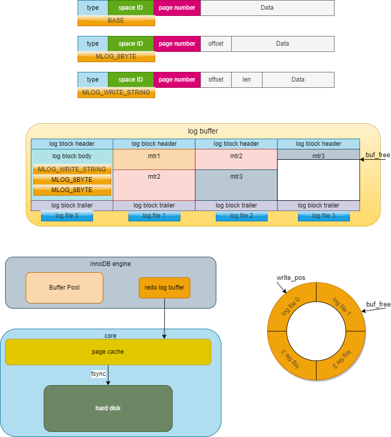

- [Log](#log)
  - [redo log](#redo-log)
    - [redo log特性](#redo-log特性)
    - [row](#row)
      - [简易redo log](#简易redo-log)
      - [复杂redo log](#复杂redo-log)
    - [redo log fsync](#redo-log-fsync)
  - [undo log](#undo-log)
    - [整体架构](#整体架构)
    - [INSERT undo log](#insert-undo-log)
    - [DELETE undo log](#delete-undo-log)
    - [UPDATE undo log](#update-undo-log)
      - [不更新主键的情况](#不更新主键的情况)
      - [更新主键的情况](#更新主键的情况)
  - [binlog](#binlog)
    - [binlog 与 redolog](#binlog-与-redolog)
    - [主从复制](#主从复制)
    - [binlog fsync](#binlog-fsync)
  - [两阶段提交](#两阶段提交)
    - [目的与原理](#目的与原理)
    - [异常处理](#异常处理)
    - [两阶段提交的问题](#两阶段提交的问题)
    - [组提交](#组提交)

# Log
undo log（回滚日志）：是 Innodb 存储引擎层生成的日志，实现了事务中的原子性，主要用于事务回滚和 MVCC  
redo log（重做日志）：是 Innodb 存储引擎层生成的日志，实现了事务中的持久性，主要用于掉电等故障恢复  
binlog （归档日志）：是 Server 层生成的日志，主要用于数据备份和主从复制  

## redo log
### redo log特性
redo log 是物理日志，记录了某个数据页做了什么修改。

在内存修改该 Undo 页面后，也需要记录对应的 redo log。

redo日志占用的空间非常小

redo日志是顺序写入磁盘的

redo log 也有自己的缓存—— redo log buffer，每当产生一条 redo log 时，会先写入到 redo log buffer，后续在持久化到磁盘。redo log buffer 默认大小 16 MB，可以通过 innodb_log_Buffer_size 参数动态的调整大小，增大它的大小可以让 MySQL 处理事务时不必写入磁盘，进而提升写 IO 性能。

### row
#### 简易redo log
改动量小时  
MLOG_1BYTE（type字段对应的十进制数字为1）：表示在页面的某个偏移量处写入1个字节的redo日志类型。
MLOG_2BYTE（type字段对应的十进制数字为2）：表示在页面的某个偏移量处写入2个字节的redo日志类型。
MLOG_4BYTE（type字段对应的十进制数字为4）：表示在页面的某个偏移量处写入4个字节的redo日志类型。
MLOG_8BYTE（type字段对应的十进制数字为8）：表示在页面的某个偏移量处写入8个字节的redo日志类型。
MLOG_WRITE_STRING（type字段对应的十进制数字为30）：表示在页面的某个偏移量处写入一串数据。
#### 复杂redo log
把一条记录插入到一个页面时需要更改的地方非常多时  
MLOG_REC_INSERT（对应的十进制数字为9）：表示插入一条使用非紧凑行格式的记录时的redo日志类型。  
MLOG_COMP_REC_INSERT（对应的十进制数字为38）：表示插入一条使用紧凑行格式的记录时的redo日志类型。  
MLOG_COMP_PAGE_CREATE（type字段对应的十进制数字为58）：表示创建一个存储紧凑行格式记录的页面的redo日志类型。  
MLOG_COMP_REC_DELETE（type字段对应的十进制数字为42）：表示删除一条使用紧凑行格式记录的redo日志类型。  
MLOG_COMP_LIST_START_DELETE（type字段对应的十进制数字为44）：表示从某条给定记录开始删除页面中的一系列使用紧凑行格式记录的redo日志类型。  
MLOG_COMP_LIST_END_DELETE（type字段对应的十进制数字为43）：与MLOG_COMP_LIST_START_DELETE类型的redo日志呼应，表示删除一系列记录直到MLOG_COMP_LIST_END_DELETE类型的redo日志对应的记录为止。

### redo log fsync

刷新redo log的时机：
- 事务提交：当事务提交时，log buffer 里的 redo log 会被刷新到磁盘（通过innodb_flush_log_at_trx_commit参数控制）。
- log buffer 空间不足时：log buffer 中缓存的 redo log 已经占满了 log buffer 总容量的大约一半左右，就需要把这些日志刷新到磁盘上。
- 事务日志缓冲区满：InnoDB 使用一个事务日志缓冲区（transaction log buffer）来暂时存储事务的重做日志条目。当缓冲区满时，会触发日志的刷新，将日志写入磁盘。Checkpoint（检查点）：InnoDB 定期会执行检查点操作，将内存中的脏数据（已修改但尚未写入磁盘的数据）刷新到磁盘，并且会将相应的重做日志一同刷新，以确保数据的一致性。
- 后台刷新线程：InnoDB 启动了一个后台线程，负责周期性（每隔 1 秒）地将脏页（已修改但尚未写入磁盘的数据页）刷新到磁盘，并将相关的重做日志一同刷新。
- 正常关闭服务器：MySQL 关闭的时候，redo log 都会刷入到磁盘里去。

innodb_flush_log_at_trx_commit 的值有 3 种：
- 0：设置为 0 的时候，表示每次事务提交时不进行刷盘操作。这种方式性能最高，但是也最不安全，因为如果 MySQL 挂了或宕机了，可能会丢失最近 1 秒内的事务。
- 1：设置为 1 的时候，表示每次事务提交时都将进行刷盘操作。这种方式性能最低，但是也最安全，因为只要事务提交成功，redo log 记录就一定在磁盘里，不会有任何数据丢失。
- 2：设置为 2 的时候，表示每次事务提交时都只把 log buffer 里的 redo log 内容写入 page cache（文件系统缓存）。page cache 是专门用来缓存文件的，这里被缓存的文件就是 redo log 文件。这种方式的性能和安全性都介于前两者中间。
  
刷盘策略innodb_flush_log_at_trx_commit 的默认值为 1。

InnoDB 存储引擎有一个后台线程，每隔1 秒，就会把 redo log buffer 中的内容写到文件系统缓存（page cache），然后调用 fsync 刷盘

## undo log

### 整体架构

undo log的结构与一般的SQL一致，使用段页机制

undo遵循
<b>按需分配，什么时候需要什么时候再分配，不需要就不分配。
不同事务执行过程中产生的undo日志需要被写入到不同的Undo页面链表中。</b>如trx 1和trx 2  

>1. 刚刚开启事务时，一个Undo页面链表也不分配。
当事务执行过程中向普通表中插入记录或者执行更新记录主键的操作之后，就会为其分配一个普通表的insert undo链表。    
>2. 当事务执行过程中删除或者更新了普通表中的记录之后，就会为其分配一个普通表的update undo链表。    
>3. 当事务执行过程中向临时表中插入记录或者执行更新记录主键的操作之后，就会为其分配一个临时表的insert undo链表。  
>4. 当事务执行过程中删除或者更新了临时表中的记录之后，就会为其分配一个临时表的update undo链表。

### INSERT undo log

### DELETE undo log

删除的过程需要经历两个阶段：
1. 仅仅将记录的 `delete_mask` 标识位设置为1，其他的不做修改（其实会修改记录的`trx_id`、`roll_pointer`这些隐藏列的值）。设计InnoDB的大佬把这个阶段称之为 `delete_mask` 。
正常记录链表中的最后一条记录的 `delete_mask` 值被设置为1，但是并没有被加入到垃圾链表。也就是此时记录处于一个中间状态。在删除语句所在的事务提交之前，被删除的记录一直都处于这种所谓的中间状态。(为了实现[MVCC](./Concurency.md/#多版本并发控制-multi-version-concurrency-control-mvcc))  
1. 当该删除语句所在的事务提交之后，会有专门的线程后来真正的把记录删除掉。所谓真正的删除就是把该记录从正常记录链表中移除，并且加入到垃圾链表中，然后还要调整一些页面的其他信息，比如页面中的用户记录数量`PAGE_N_RECS`、上次插入记录的位置`PAGE_LAST_INSERT`、垃圾链表头节点的指针`PAGE_FREE`、页面中可重用的字节数量`PAGE_GARBAGE`、还有页目录的一些信息等等。这个阶段称之为`purge`。

### UPDATE undo log

#### 不更新主键的情况

1. 就地更新（in-place update）  
 更新记录时，对于被更新的每个列来说，如果更新后的列和更新前的列占用的存储空间都一样大，那么就可以进行就地更新，也就是直接在原记录的基础上修改对应列的值。再次强调一边，是每个列在更新前后占用的存储空间一样大，有任何一个被更新的列更新前比更新后占用的存储空间大，或者更新前比更新后占用的存储空间小都不能进行就地更新。

2. 先删除掉旧记录，再插入新记录  
 这里所说的删除并不是`delete mark`操作，而是真正的删除掉，也就是把这条记录从正常记录链表中移除并加入到垃圾链表中，并且修改页面中相应的统计信息（比如`PAGE_FREE`、`PAGE_GARBAGE`等这些信息）。不过这里做真正删除操作的线程并不是在介绍`DELETE`语句中做`purge`操作时使用的另外专门的线程，而是由用户线程同步执行真正的删除操作，真正删除之后紧接着就要根据各个列更新后的值创建的新记录插入。  
 这里如果新创建的记录占用的存储空间大小不超过旧记录占用的空间，那么可以直接重用被加入到垃圾链表中的旧记录所占用的存储空间，否则的话需要在页面中新申请一段空间以供新记录使用，如果本页面内已经没有可用的空间的话，那就需要进行页面分裂操作，然后再插入新记录。

#### 更新主键的情况

将旧记录进行`delete mark`操作 (同`DELETE`)，根据更新后各列的值创建一条新记录，并将其插入到聚簇索引中（需重新定位插入的位置）。

## binlog

### binlog 与 redolog
1. 适用对象不同  
binlog 是 MySQL 的 Server 层实现的日志，所有存储引擎都可以使用；  
redo log 是 Innodb 存储引擎实现的日志；

2. 文件格式不同：
binlog 有 3 种格式类型，分别是 `STATEMENT`（默认格式）、`ROW`、 `MIXED` ，区别如下：
`STATEMENT`：每一条修改数据的 SQL 都会被记录到 binlog 中（相当于记录了逻辑操作，所以针对这种格式， binlog 可以称为逻辑日志），主从复制中 slave 端再根据 SQL 语句重现。但 `STATEMENT` 有动态函数的问题，比如你用了 uuid 或者 now 这些函数，你在主库上执行的结果并不是你在从库执行的结果，这种随时在变的函数会导致复制的数据不一致；  
`ROW`：记录行数据最终被修改成什么样了（这种格式的日志，就不能称为逻辑日志了），不会出现 `STATEMENT` 下动态函数的问题。但 `ROW` 的缺点是每行数据的变化结果都会被记录，比如执行批量 `update` 语句，更新多少行数据就会产生多少条记录，使 binlog 文件过大，而在 `STATEMENT` 格式下只会记录一个 `update` 语句而已；  
`MIXED`：包含了 `STATEMENT` 和 `ROW` 模式，它会根据不同的情况自动使用 ROW 模式和 `STATEMENT` 模式；  
redo log 是物理日志，记录的是在某个数据页做了什么修改；

3. 写入方式不同  
binlog 是追加写，写满一个文件，就创建一个新的文件继续写，不会覆盖以前的日志，保存的是全量的日志。  
redo log 是循环写，日志空间大小是固定，全部写满就从头开始，保存未被刷入磁盘的脏页日志。

4. 用途不同  
binlog 用于备份恢复、主从复制；  
redo log 用于掉电等故障恢复。  
整个数据库的数据被删除了,不可以使用 redo log 文件恢复，只能使用 binlog 文件恢复。

### 主从复制

MySQL 集群的主从复制过程梳理成 3 个阶段：  

    写入 Binlog：主库写 binlog 日志，提交事务，并更新本地存储数据。  
    同步 Binlog：把 binlog 复制到所有从库上，每个从库把 binlog 写到暂存日志中。  
    回放 Binlog：回放 binlog，并更新存储引擎中的数据。  

复制模型：  

    同步复制：MySQL 主库提交事务的线程要等待所有从库的复制成功响应，才返回客户端结果。这种方式在实际项目中，基本上没法用，原因有两个：一是性能很差，因为要复制到所有节点才返回响应；二是可用性也很差，主库和所有从库任何一个数据库出问题，都会影响业务。  
    异步复制（默认模型）：MySQL 主库提交事务的线程并不会等待 binlog 同步到各从库，就返回客户端结果。这种模式一旦主库宕机，数据就会发生丢失。  
    半同步复制：MySQL 5.7 版本之后增加的一种复制方式，介于两者之间，事务线程不用等待所有的从库复制成功响应，只要一部分复制成功响应回来就行，比如一主二从的集群，只要数据成功复制到任意一个从库上，主库的事务线程就可以返回给客户端。这种半同步复制的方式，兼顾了异步复制和同步复制的优点，即使出现主库宕机，至少还有一个从库有最新的数据，不存在数据丢失的风险。

### binlog fsync

MySQL提供一个 sync_binlog 参数来控制数据库的 binlog 刷到磁盘上的频率：

    sync_binlog = 0 的时候，表示每次提交事务都只 write，不 fsync，后续交由操作系统决定何时将数据持久化到磁盘；
    sync_binlog = 1 的时候，表示每次提交事务都会 write，然后马上执行 fsync；
    sync_binlog =N(N>1) 的时候，表示每次提交事务都 write，但累积 N 个事务后才 fsync。
在MySQL中系统默认的设置是 sync_binlog = 0

## 两阶段提交

### 目的与原理
MySQL 为了避免出现两份日志之间的逻辑不一致的问题，使用了「两阶段提交」

### 异常处理
如果 binlog 中没有当前内部 XA 事务的 XID，说明 redolog 完成刷盘，但是 binlog 还没有刷盘，则回滚事务。对应时刻 A 崩溃恢复的情况。
如果 binlog 中有当前内部 XA 事务的 XID，说明 redolog 和 binlog 都已经完成了刷盘，则提交事务。对应时刻 B 崩溃恢复的情况。

### 两阶段提交的问题
虽然保证了两个日志文件的数据一致性，但是性能很差，主要有两个方面的影响：

磁盘 I/O 次数高：对于“双1”配置，每个事务提交都会进行两次 fsync（刷盘），一次是 redo log 刷盘，另一次是 binlog 刷盘。

锁竞争激烈：两阶段提交虽然能够保证「单事务」两个日志的内容一致，但在「多事务」的情况下，却不能保证两者的提交顺序一致，因此，在两阶段提交的流程基础上，还需要加一个锁来保证提交的原子性，从而保证多事务的情况下，两个日志的提交顺序一致。

为什么两阶段提交的磁盘 I/O 次数会很高？

    binlog 和 redo log 在内存中都对应的缓存空间，binlog 会缓存在 binlog cache，redo log 会缓存在 redo log buffer，它们持久化到磁盘的时机分别由下面这两个参数控制。一般我们为了避免日志丢失的风险，会将这两个参数设置为 1：
    当 sync_binlog = 1 的时候，表示每次提交事务都会将 binlog cache 里的 binlog 直接持久到磁盘；
    当 innodb_flush_log_at_trx_commit = 1 时，表示每次事务提交时，都将缓存在 redo log buffer 里的 redo log 直接持久化到磁盘；
    可以看到，如果 sync_binlog 和 当 innodb_flush_log_at_trx_commit 都设置为 1，那么在每个事务提交过程中， 都会至少调用 2 次刷盘操作，一次是 redo log 刷盘，一次是 binlog 落盘，所以这会成为性能瓶颈。

为什么锁竞争激烈？

    在早期的 MySQL 版本中，通过使用 prepare_commit_mutex 锁来保证事务提交的顺序，在一个事务获取到锁时才能进入 prepare 阶段，一直到 commit 阶段结束才能释放锁，下个事务才可以继续进行 prepare 操作。
    通过加锁虽然完美地解决了顺序一致性的问题，但在并发量较大的时候，就会导致对锁的争用，性能不佳

### 组提交

MySQL 引入了 binlog 组提交（group commit）机制，当有多个事务提交的时候，会将多个 binlog 刷盘操作合并成一个，从而减少磁盘 I/O 的次数，如果说 10 个事务依次排队刷盘的时间成本是 10，那么将这 10 个事务一次性一起刷盘的时间成本则近似于 1。

引入了组提交机制后，prepare 阶段不变，只针对 commit 阶段，将 commit 阶段拆分为三个过程：

flush 阶段：多个事务按进入的顺序将 binlog 从 cache 写入文件（不刷盘）；  
sync 阶段：对 binlog 文件做 fsync 操作（多个事务的 binlog 合并一次刷盘）；  
commit 阶段：各个事务按顺序做 InnoDB commit 操作；  