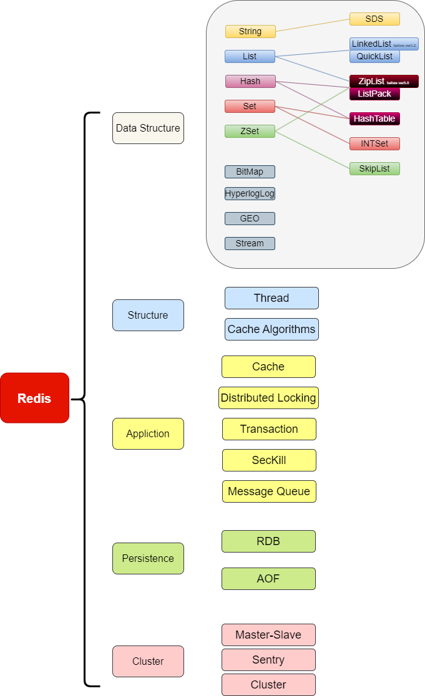
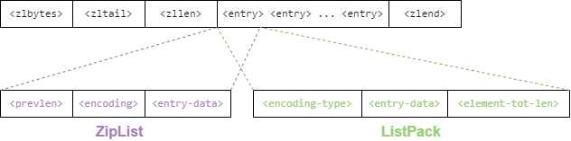
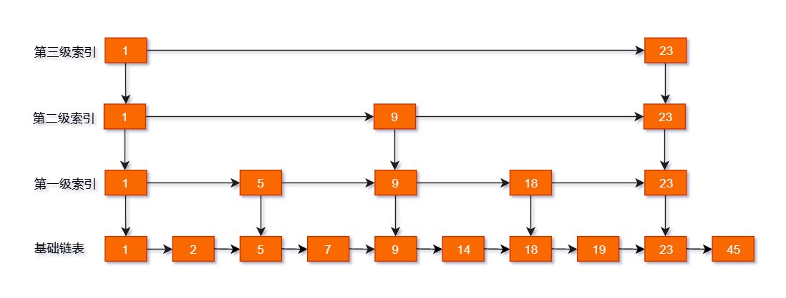
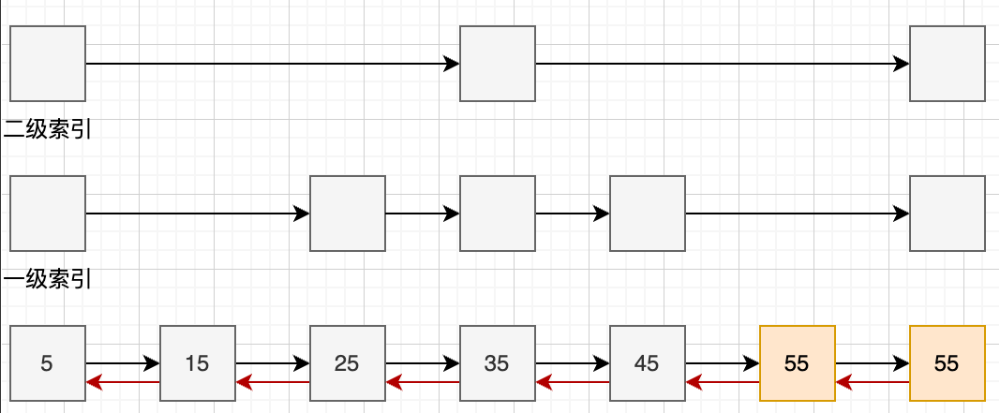

- [redisObject](#redisobject)
- [String](#string)
  - [1. SDS struct](#1-sds-struct)
  - [2.SDS encoding](#2sds-encoding)
  - [3. 记忆点](#3-记忆点)
- [List](#list)
  - [1.ZipList/ListPack](#1ziplistlistpack)
  - [2.QuickList](#2quicklist)
  - [3. 记忆点](#3-记忆点-1)
- [Set/Hash](#sethash)
  - [1.HashTable](#1hashtable)
  - [2.记忆点](#2记忆点)
- [ZSet](#zset)
  - [1. ZSet struct](#1-zset-struct)
  - [2.记忆点](#2记忆点-1)




## redisObject
```
struct redisObject {
    unsigned type:4;        //struct type
    unsigned encoding:4;    // 底层编码
    unsigned lru:LRU_BITS; /* LRU time (relative to global lru_clock) or
                            * LFU data (least significant 8 bits frequency
                            * and most significant 16 bits access time). */
    int refcount;           //引用计数
    void *ptr;
};
```

## String

### 1. SDS struct
sds have  
sdshdr5   
sdshdr8 sdshdr16 sdshdr32 sdshdr64
```
/* Note: sdshdr5 is never used, we just access the flags byte directly.
 * However is here to document the layout of type 5 SDS strings. */
struct __attribute__ ((__packed__)) sdshdr5 {
    unsigned char flags; /* 3 lsb of type, and 5 msb of string length */
    char buf[];
};

struct __attribute__ ((__packed__)) sdshdr8 {
    uint8_t len; /* used */
    uint8_t alloc; /* excluding the header and null terminator */
    unsigned char flags; /* 3 lsb of type, 5 unused bits */
    char buf[];
};
...
...
struct __attribute__ ((__packed__)) sdshdr64 {
    uint64_t len; /* used */
    uint64_t alloc; /* excluding the header and null terminator */
    unsigned char flags; /* 3 lsb of type, 5 unused bits */
    char buf[];
};
```

### 2.SDS encoding
字符串对象的内部编码（encoding）有 3 种 ：int、raw和 embstr。

embstr会通过一次内存分配函数来分配一块连续的内存空间来保存redisObject和SDS
raw编码会通过调用两次内存分配函数来分别分配两块空间来保存redisObject和SDS。

字符串对象为整数时，使用INT编码(8 Byte)
字符串对象为其他时，小于边界使用embstr，否则使用raw
embstr 编码和 raw 编码的边界在 redis 不同版本中是不一样的：
redis 2.+ 是 32 字节
redis 3.0-4.0 是 39 字节
redis 5.0 是 44 字节


<span style="color:#304ffe"><b>embstr编码的字符串对象实际上是只读的，redis没有为embstr编码的字符串对象编写任何相应的修改程序。当我们对embstr编码的字符串对象执行任何修改命令时，程序会先将对象的编码从embstr转换成raw，然后再执行修改命令。</span></b>

### 3. 记忆点
1. redis 5.0 raw和 embstr阈值是 44 字节  
  Redis是使用jemalloc内存分配器，Redis以64字节为阈值区分大小字符串。​
所以EMBSTR的边界数值，其实是受64这个阈值影响。​
redis对象占用的内存大小由redisObject和sdshdr这两部分组成，redisObject 16字节，sdshdr中已分配、已申请、标记三个字段固定占了3个字节，'\0'占了一个字节，能存放的数据就是 64-（16+4） = 44。

2. 一个Redis字符串最大为512MB，官网有明确注明。

3. 扩容：  
如果所需的 sds 长度小于 1 MB，那么最后的扩容是按照翻倍扩容来执行的，即 2 倍的newlen  
如果所需的 sds 长度超过 1 MB，那么最后的扩容长度应该是 newlen + 1MB。


## List

### 1.ZipList/ListPack



zlbytes：表示该ZIPLIST一共占了多少字节数，这个数字是包含zlbytes本身占据的字节的。​
zltail：ZIPLIST 尾巴节点 相对于 ZIPLIST 的开头（起始指针），偏移的字节数。通过这个字段可以快速定位到尾部节点。如果没有尾节点，就定位到 zlend​
zllen：表示有多少个数据节点，在本例中就有3个节点。​
zlend：一个特殊的entry节点，表示ZIPLIST的结束。

prevlen：表示上一个节点的数据长度。通过这个字段可以定位上一个节点的起始地址（或者说开头）也就是就是 p - prevlen 可以跳到前一个节点的开头位置，实现从后往前操作，所以压缩列表才可以从后往前遍历。​
如果前一节点的长度，也就是前一个ENTRY的大小，小于254字节， 那么prevlen属性需要用1字节长的空间来保存这个长度值，255是特殊字符，被zlend使用了​
如果前一节点的长度大于等于254字节，那么prevlen属性需要用5字节长的空间来保存这个长度值，注意5个字节中中第一个字节为11111110，也就是254，标志这是个5字节的prelen信息，剩下4字节来表示大小。​

element-tot-len存储整个节点除它自身之外的长度

encoding：编码类型。编码类型里还包含了一个entry的长度信息，可用于正向遍历​

entry-data：实际的数据。    

### 2.QuickList

LINKEDLIST原来是单个节点，只能存一个数据，现在单个节点存的是一个ZIPLIST，即多个数据。


### 3. 记忆点

1. 如果列表的元素个数小于 512 个（默认值，可由 list-max-ziplist-entries 配置），列表每个元素的值都小于 64 字节（默认值，可由 list-max-ziplist-value 配置），Redis 会使用压缩列表作为 List 类型的底层数据结构；  
这是LIST的限制，而不是ZIPLIST的限制；


## Set/Hash

### 1.HashTable
```
// from Redis 5.0.5​

/* This is our hash table structure. */​

typedef struct dictht {​

dictEntry **table;​

unsigned long size;​

unsigned long sizemask;​

unsigned long used;​

} dictht;
```
### 2.记忆点


1. Set如果集群元素都是整数，且元素数量不超过512个，就可以用INTSET编码。


2. Hash  
    1.Hash对象保存的所有值和键的长度都小于64字节；​
    2.Hash对象元素个数少于512个。​
    两个条件任何一条不满足，编码结构就用HASHTABLE。

3. 
    1.负载因子大于等于1，说明此时空间已经非常紧张。新数据是在链表上叠加的，越来越多的数据其实无法在O(1)时间复杂度找到，还需要遍历一次链表，如果此时服务器没有执行BGSAVE或BGREWRITEAOF这两个命令，就会发生扩容。复制命令对Redis的影响我们后面在原理篇再讲。​

    2.负载因子大于5，这时候说明HASHTABLE真的已经不堪重负了，此时即使是有复制命令在进行，也要进行Rehash扩容。

## ZSet




### 1. ZSet struct

```
// from Redis 7.0.8​

/* ZSETs use a specialized version of Skiplists */​

typedef struct zskiplistNode {​

sds ele;​

double score;​

struct zskiplistNode *backward;​

struct zskiplistLevel {​

struct zskiplistNode *forward;​

unsigned long span;​

} level[];​

} zskiplistNode;
```


### 2.记忆点
层次的决定，需要比较随机，才能在各个场景表现出较为平均的性能，这里Redis使用概率均衡的思路来确定新插入节点的层数：​

Redis 跳表决定每一个节点，是否能增加一层的概率为25%，而最大层数限制在Redis 5.0是64层，在Redis 7.0是32层。


如果满足如下规则，ZSet就用ZIPLIST编码：​

1.列表对象保存的所有字符串对象长度都小于64字节；​

2.列表对象元素个数少于128个。