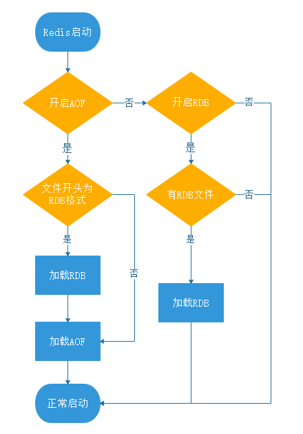

- [RDB(Redis DataBase)](#rdbredis-database)
  - [写时复制（Copy-On-Write, COW）](#写时复制copy-on-write-cow)
- [AOF(Append Only File)](#aofappend-only-file)
  - [写回触发](#写回触发)
  - [AOF重写](#aof重写)
- [混合](#混合)

## RDB(Redis DataBase)
RDB是将某一个时刻的内存快照（Snapshot），以二进制的方式写入磁盘的过程。

- 手动触发：
    - `save`：将阻塞主进程，调用主进程进行SnapShot，直到RDB完成
    - `bgsave`：将`fork()`一个子进程进行后台SnapShot

- 自动触发：
    - `save m n`：`save m n` 是指在 m 秒内，如果有 n 个键发生改变，则自动触发持久化。 当设置多个 save m n 命令时，满足任意一个条件都会触发持久化。 Redis默认`save 900 1` `save 300 10` `save 60 10000`
    当 900s 内如果有 1 次 Redis 键值发生改变，就会触发；如果 900s 内 Redis 的键值改变次数少于 1 次，那么 Redis 就会判断 300s 内，Redis 的键值是否至少被修改了10次，如果满足则会触发持久化....
    - `flushall`: 用于清空 Redis 数据库，在生产环境下一定慎用，当 Redis 执行了 flushall 命令之后，则会触发自动持久化。
    - 主从同步触发：在 Redis 主从复制中，当从节点执行全量复制操作时，主节点会执行 bgsave 命令，并将 RDB 文件发送给从节点，该过程会自动触发 Redis 持久化。

RDB 的内容为二进制的数据，占用内存更小，更紧凑，重启更快，更适合做为备份文件，并可以更快的传输到远程服务器进行 Redis 服务恢复；。

### 写时复制（Copy-On-Write, COW）
执行 bgsave 过程中，Redis 依然可以继续处理操作命令的，也就是数据是能被修改的。

执行 bgsave 命令的时候，会通过 fork() 创建子进程，此时子进程和父进程是共享同一片内存数据的，因为创建子进程的时候，会复制父进程的页表，但是页表指向的物理内存还是一个。
修改共享数据里的某一块数据（比如键值对 A）时，就会发生写时复制，于是这块数据的物理内存就会被复制一份（键值对 A'），然后主线程在这个数据副本（键值对 A'）进行修改操作。与此同时，bgsave 子进程可以继续把原来的数据（键值对 A）写入到 RDB 文件。
bgsave 快照过程中，如果主线程修改了共享数据，发生了写时复制后，RDB 快照保存的是原本的内存数据

## AOF(Append Only File) 

是一种保存写操作命令到日志的持久化方式，只会记录写操作命令，读操作命令是不会被记录。AOF默认不开启。AOF是文本日志文件（appendonly.aof）

特性，避免额外开销，不会阻塞当前进程的运行(可能会阻塞下一个进程的运行)

### 写回触发
在 `redis.conf` 配置文件中的 `appendfsync` 配置项可以有以下 3 种参数可填：

`Always`：每次写操作命令执行完后，同步将 AOF 日志数据写回硬盘；
`Everysec`：每次写操作命令执行完后，先将命令写入到 AOF 文件的内核缓冲区，然后每隔一秒将缓冲区里的内容写回到硬盘；
`No`：不由 Redis 控制写回硬盘的时机，转交给操作系统控制写回的时机，也就是每次写操作命令执行完后，先将命令写入到 AOF 文件的内核缓冲区，再由操作系统决定何时将缓冲区内容写回硬盘。

手动触发：`bgrewriteaof `

触发后调用`fsync()`，将page cache内容写入硬盘

### AOF重写
AOF 重写指的是它会直接读取 Redis 服务器当前的状态，并压缩保存为 AOF 文件。例如，我们增加了一个计数器，并对它做了 99 次修改，如果不做 AOF 重写的话，那么持久化文件中就会有 100 条记录执行命令的信息，而 AOF 重写之后，之后记录一条此计数器最终的结果信息，这样就去除了所有的无效信息。

- AOF 重写触发
触发 AOF 文件重写，要满足两个条件，这两个条件也是配置在 Redis 配置文件中的，它们分别：
auto-aof-rewrite-min-size：允许 AOF 重写的最小文件容量，默认是 64mb 。
auto-aof-rewrite-percentage：AOF 文件重写的大小比例，默认值是 100，表示 100%，也就是只有当前 AOF 文件，比最后一次（上次）的 AOF 文件大一倍时，才会启动 AOF 文件重写。

重写运用COW

## 混合
Redis 4.0 之后新增了混合持久化的方式。

在开启混合持久化的情况下，AOF 重写时会把 Redis 的持久化数据，以 RDB 的格式写入到 AOF 文件的开头，之后的数据再以 AOF 的格式化追加的文件的末尾。

如果只开启了 AOF 持久化，Redis 启动时只会加载 AOF 文件（appendonly.aof），进行数据恢复；
如果只开启了 RDB 持久化，Redis 启动时只会加载 RDB 文件（dump.rdb），进行数据恢复；
如果同时开启了 RDB 和 AOF 持久化，Redis 启动时只会加载 AOF 文件（appendonly.aof），进行数据恢复。
