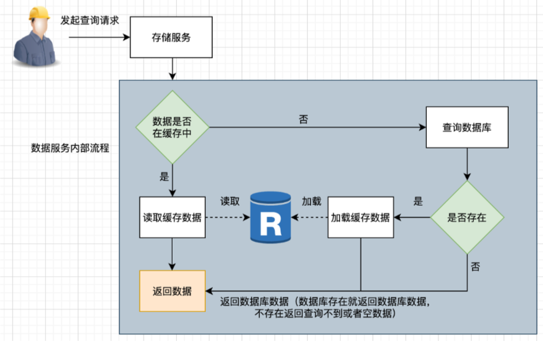
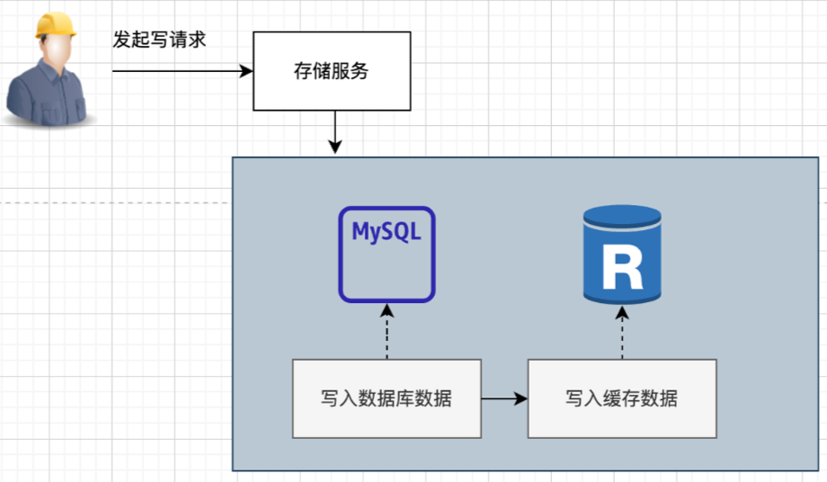
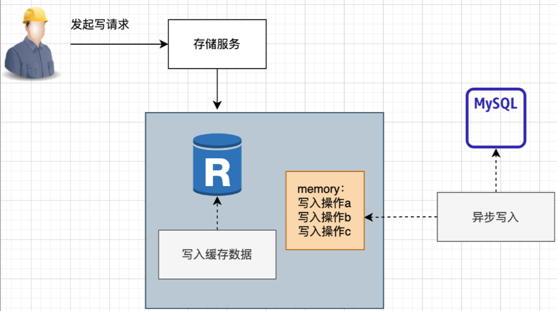
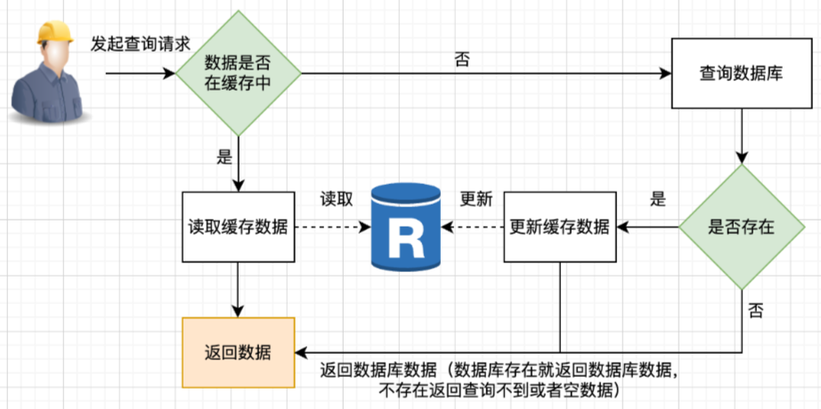
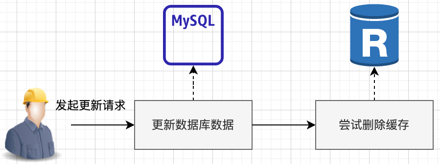
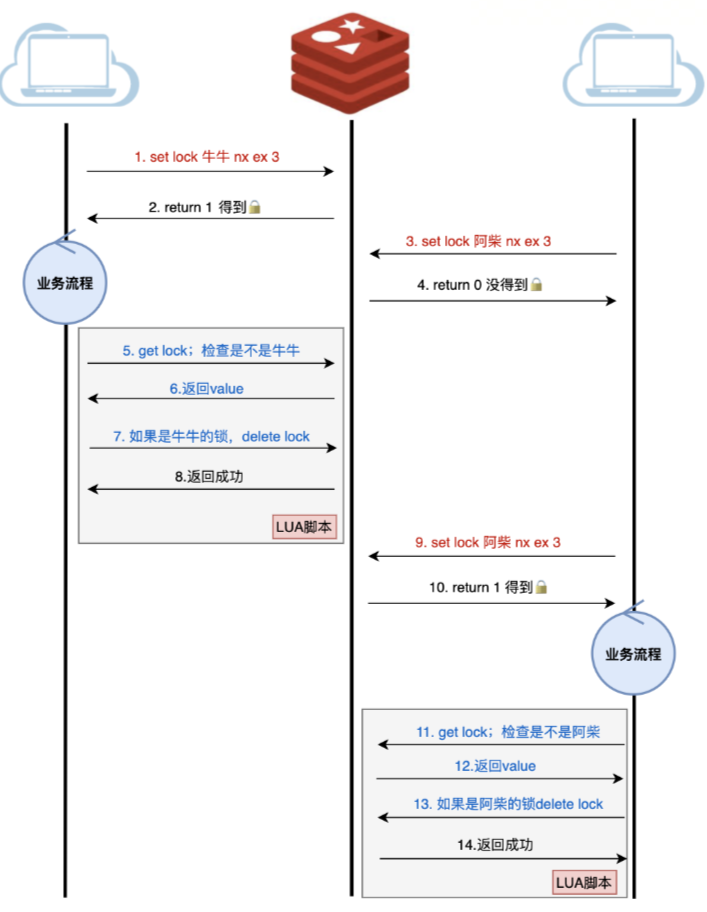

## 缓存基础

### Read Through Cache Pattern：读穿透模式

### Write Through Cache Pattern：写穿透模式

### Write Behind Pattern：又叫Write Back，异步缓存写入模式

### Cache-Aside Pattern：旁路缓存模式
Cache-Aside Pattern，旁路缓存模式是最常见，最易用的，在业务开发中，其他模式很少会用到

在写操作的时候，Cache Aside模式是一般是先更新数据库，然后直接删除缓存

为什么不直接更新呢？因为更新相比删除会更容易造成时序性问题，举个例子：​ thread1更新mysql为5 -> thread2更新mysql为3 -> thread2更新缓存为3 -> thread1更新缓存为5，最终正确的数据因为时序性被覆盖了。​ 

​ Cache Aside适用于读多写少的场景，比如用户信息、新闻报道等，一旦写入缓存，几乎不会进行修改。该模式的缺点是可能会出现缓存和数据库不一致的情况。

 

   

### 缓存异常

#### 缓存雪崩(Cache Avalance)
大量缓存数据在同一时间过期（失效）或者 Redis 故障宕机时，如果此时有大量的用户请求，都无法在 Redis 中处理，于是全部请求都直接访问数据库，从而导致数据库的压力骤增

发生缓存雪崩的原因：大量数据同时过期，Redis 故障宕机

##### 大量数据同时过期
解决方案：

均匀设置过期时间：（给这些数据的过期时间加上一个随机数）；

互斥锁；

后台更新缓存；

Use a cache warming strategy. This means that you will pre-populate the cache with frequently accessed items. This will reduce the number of requests that need to be made to the database when the cache is cold.

Use a cache-aside strategy. This means that you will only read from the cache if the item is present in the cache. If the item is not present in the cache, you will read from the database and then populate the cache with the item. This will help to prevent cache avalanche, but it will increase the number of requests that need to be made to the database.

##### Redis 故障宕机
解决方案：

使用熔断机制。当流量到达一定的阈值时，就直接返回“系统拥挤”之类的提示，防止过多的请求打在数据库上。至少能保证一部分用户是可以正常使用，其他用户多刷新几次也能得到结果。

提高数据库的容灾能力，可以使用分库分表，读写分离的策略。

为了防止Redis宕机导致缓存雪崩的问题，可以搭建Redis集群，提高Redis的容灾性。

#### 缓存击穿
Cache breakdown occurs when a hot item in the cache expires. This can cause a sudden increase in load on the database as all requests for that item are redirected to the database.

解决方案：
互斥锁方案，保证同一时间只有一个业务线程更新缓存，未能获取互斥锁的请求，要么等待锁释放后重新读取缓存，要么就返回空值或者默认值。
不给热点数据设置过期时间，由后台异步更新缓存，或者在热点数据准备要过期前，提前通知后台线程更新缓存以及重新设置过期时间；

#### 缓存穿透(Cache Penetration)
当用户访问的数据，既不在缓存中，也不在数据库中，导致请求在访问缓存时，发现缓存缺失，再去访问数据库时，发现数据库中也没有要访问的数据，没办法构建缓存数据，来服务后续的请求。那么当有大量这样的请求到来时，数据库的压力骤增。

解决方案：
非法请求的限制；
缓存空值或者默认值；
使用布隆过滤器快速判断数据是否存在，避免通过查询数据库来判断数据是否存在

### 分布式锁

利用 过期时间、owned、Lua
实现 对称性、安全性、互斥性