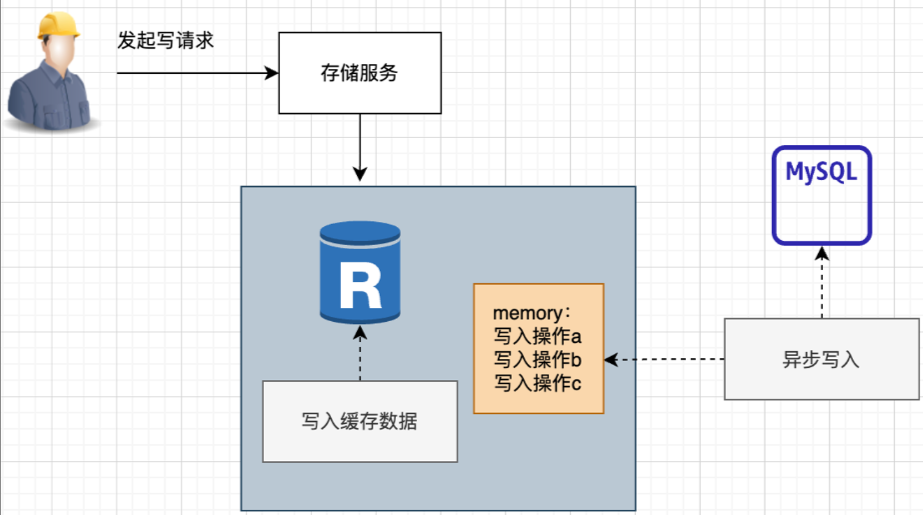
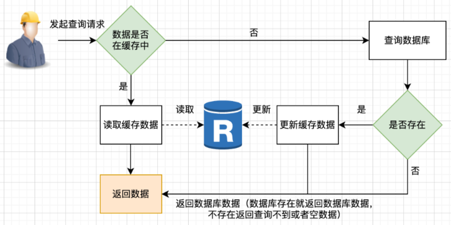
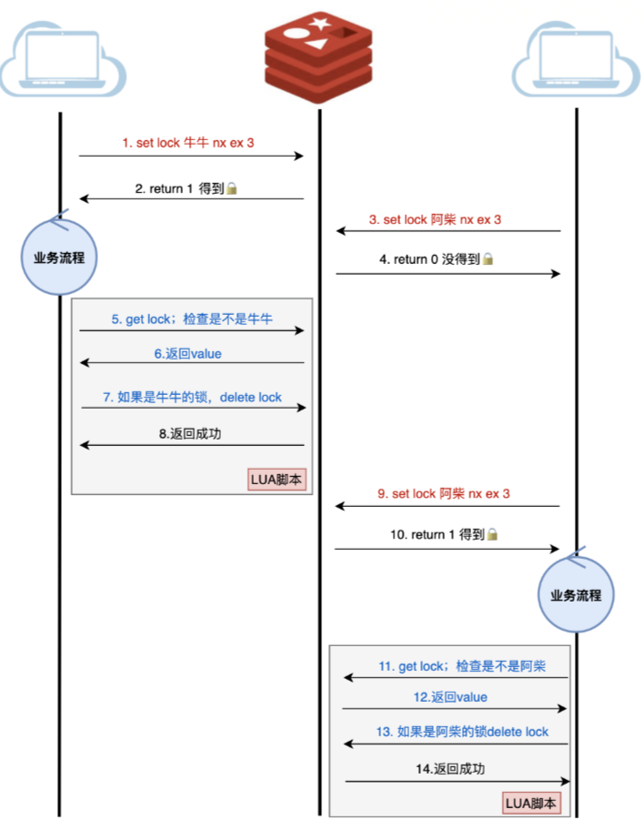

- [Redis线程基础](#redis线程基础)
- [I/O多路复用](#io多路复用)
- [业务多线程](#业务多线程)
- [发布订阅模式](#发布订阅模式)
  - [基于频道(Channel)的发布/订阅](#基于频道channel的发布订阅)
  - [基于模式(pattern)的发布/订阅](#基于模式pattern的发布订阅)
- [Redis事务](#redis事务)
- [缓存基础](#缓存基础)
  - [Read Through Cache Pattern：读穿透模式](#read-through-cache-pattern读穿透模式)
  - [Write Through Cache Pattern：写穿透模式](#write-through-cache-pattern写穿透模式)
  - [Write Behind Pattern：又叫Write Back，异步缓存写入模式](#write-behind-pattern又叫write-back异步缓存写入模式)
  - [Cache-Aside Pattern：旁路缓存模式](#cache-aside-pattern旁路缓存模式)
  - [缓存异常](#缓存异常)
    - [缓存雪崩(Cache Avalance)](#缓存雪崩cache-avalance)
      - [大量数据同时过期](#大量数据同时过期)
      - [Redis 故障宕机](#redis-故障宕机)
    - [缓存击穿（Cache Breakdown）](#缓存击穿cache-breakdown)
    - [缓存穿透(Cache Penetration)](#缓存穿透cache-penetration)
  - [分布式锁](#分布式锁)
- [对象共享](#对象共享)
- [引用计数](#引用计数)
- [过期删除策略](#过期删除策略)
  - [过期字典](#过期字典)
  - [Redis过期删除策略](#redis过期删除策略)
    - [定时删除](#定时删除)
    - [惰性删除](#惰性删除)
    - [定期删除](#定期删除)
- [内存淘汰策略](#内存淘汰策略)
  - [LRU淘汰池](#lru淘汰池)
  - [LFU衰减机制](#lfu衰减机制)
  - [qita](#qita)


## Redis线程基础
Redis的核心处理逻辑是单线程的，其它辅助模块也会有一些多线程、多进程的功能，比如：​ 复制模块用的多进程；​ 某些异步流程从4.0开始用的多线程，例如 UNLINK、FLUSHALL ASYNC、FLUSHDB ASYNC 等非阻塞的删除操作。​ 网络I/O解包从6.0开始用的是多线程。 


## I/O多路复用
有I/O操作触发的时候，就会产生通知，收到通知，再去处理通知对应的事件，针对I/O多路复用，Redis做了一层包装，叫Reactor模型。​ ​ 如下图，本质就是监听各种事件，当事件发生时，将事件分发给不同的处理器


## 业务多线程


Redis 6.0 多线程默认关闭，需要修改配置redis.conf


## 发布订阅模式
Redis 发布订阅(pub/sub)是一种消息通信模式：发送者(pub)发送消息，订阅者(sub)接收消息。

Redis有两种发布/订阅模式：

### 基于频道(Channel)的发布/订阅
``` shell
# publish
127.0.0.1:6379> publish channel:1 hi
(integer) 1

# subscriber
127.0.0.1:6379> subscribe channel:1
Reading messages... (press Ctrl-C to quit)
1) "subscribe" // 消息类型
2) "channel:1" // 频道
3) "hi" // 消息内容
unsubscribe channel:1
```
### 基于模式(pattern)的发布/订阅
```shell
#利用正则进行多层次订阅
127.0.0.1:6379> publish c m1

127.0.0.1:6379> psubscribe c? b* d?*

```

[Redis事件机制详解](https://pdai.tech/md/db/nosql-redis/db-redis-x-event.html)

## Redis事务
MUTLI EXEC WATCH DISCARD   
Redis 无法回滚，不具持久性  
一般使用Lua脚本替代  


## 缓存基础

### Read Through Cache Pattern：读穿透模式

### Write Through Cache Pattern：写穿透模式

### Write Behind Pattern：又叫Write Back，异步缓存写入模式


### Cache-Aside Pattern：旁路缓存模式
Cache-Aside Pattern，旁路缓存模式是最常见，最易用的，在业务开发中，其他模式很少会用到

在写操作的时候，Cache Aside模式是一般是先更新数据库，然后直接删除缓存

为什么不直接更新呢？因为更新相比删除会更容易造成时序性问题，举个例子：​ thread1更新mysql为5 -> thread2更新mysql为3 -> thread2更新缓存为3 -> thread1更新缓存为5，最终正确的数据因为时序性被覆盖了。​ 

​ Cache Aside适用于读多写少的场景，比如用户信息、新闻报道等，一旦写入缓存，几乎不会进行修改。该模式的缺点是可能会出现缓存和数据库不一致的情况。

 

   

### 缓存异常


#### 缓存雪崩(Cache Avalance)
大量缓存数据在同一时间过期（失效）或者 Redis 故障宕机时，如果此时有大量的用户请求，都无法在 Redis 中处理，于是全部请求都直接访问数据库，从而导致数据库的压力骤增

发生缓存雪崩的原因：大量数据同时过期，Redis 故障宕机

##### 大量数据同时过期
解决方案：

均匀设置过期时间：（给这些数据的过期时间加上一个随机数）；

互斥锁；

后台更新缓存；

Use a cache warming strategy. This means that you will pre-populate the cache with frequently accessed items. This will reduce the number of requests that need to be made to the database when the cache is cold.

Use a cache-aside strategy. This means that you will only read from the cache if the item is present in the cache. If the item is not present in the cache, you will read from the database and then populate the cache with the item. This will help to prevent cache avalanche, but it will increase the number of requests that need to be made to the database.

##### Redis 故障宕机
解决方案：

使用熔断机制。当流量到达一定的阈值时，就直接返回“系统拥挤”之类的提示，防止过多的请求打在数据库上。至少能保证一部分用户是可以正常使用，其他用户多刷新几次也能得到结果。

提高数据库的容灾能力，可以使用分库分表，读写分离的策略。

为了防止Redis宕机导致缓存雪崩的问题，可以搭建Redis集群，提高Redis的容灾性。


#### 缓存击穿（Cache Breakdown）
Cache breakdown occurs when a hot item in the cache expires. This can cause a sudden increase in load on the database as all requests for that item are redirected to the database.

解决方案：
互斥锁方案，保证同一时间只有一个业务线程更新缓存，未能获取互斥锁的请求，要么等待锁释放后重新读取缓存，要么就返回空值或者默认值。
不给热点数据设置过期时间，由后台异步更新缓存，或者在热点数据准备要过期前，提前通知后台线程更新缓存以及重新设置过期时间；

#### 缓存穿透(Cache Penetration)
当用户访问的数据，既不在缓存中，也不在数据库中，导致请求在访问缓存时，发现缓存缺失，再去访问数据库时，发现数据库中也没有要访问的数据，没办法构建缓存数据，来服务后续的请求。那么当有大量这样的请求到来时，数据库的压力骤增。

解决方案：
非法请求的限制；
缓存空值或者默认值；
使用布隆过滤器快速判断数据是否存在，避免通过查询数据库来判断数据是否存在


### 分布式锁


利用 过期时间、owned、Lua
实现 对称性、安全性、互斥性


## 对象共享
redis预分配的值对象如下：各种命令的返回值，比如成功时返回的OK，错误时返回的ERROR，命令入队事务时返回的QUEU    E，等等包括0 在内，小于REDIS_SHARED_INTEGERS的所有整数（REDIS_SHARED_INTEGERS的默认值是10000）

## 引用计数
redisObject中有refcount属性，是对象的引用计数，当对象的refcount降至0 时，这个RedisObject结构，以及它引用的数据结构的内存都会被释放


## 过期删除策略
### 过期字典


过期字典数据结构结构如下：

过期字典的 key 是一个指针，指向某个键对象；
过期字典的 value 是一个 long long 类型的整数，这个整数保存了 key 的过期时间；

字典实际上是哈希表，哈希表的最大好处就是让我们可以用 O(1) 的时间复杂度来快速查找。当我们查询一个 key 时，Redis 首先检查该 key 是否存在于过期字典中：

如果不在，则正常读取键值；
如果存在，则会获取该 key 的过期时间，然后与当前系统时间进行比对，如果比系统时间大，那就没有过期，否则判定该 key 已过期。

### Redis过期删除策略
Redis 选择「惰性删除+定期删除」这两种策略配和使用，以求在合理使用 CPU 时间和避免内存浪费之间取得平衡。

#### 定时删除
定时删除策略的做法是，在设置 key 的过期时间时，同时创建一个定时事件，当时间到达时，由事件处理器自动执行 key 的删除操作。  
CPU不友好，内存友好

Redis 的惰性删除策略由 `db.c` 文件中的 `expireIfNeeded` 函数实现

#### 惰性删除
惰性删除策略的做法是，不主动删除过期键，每次从数据库访问 key 时，都检测 key 是否过期，如果过期则删除该 key。  
CPU友好，内存不友好


#### 定期删除
定期删除策略的做法是，每隔一段时间「随机」从数据库中取出一定数量的 key 进行检查，并删除其中的过期key。  
中和策略

Redis 的定期删除的流程：

从过期字典中随机抽取 20 个 key；
检查这 20 个 key 是否过期，并删除已过期的 key；
如果本轮检查的已过期 key 的数量，超过 5 个，也就是「已过期 key 的数量」占比「随机抽取 key 的数量」大于 25%，则继续重复步骤 1；如果已过期的 key 比例小于 25%，则停止继续删除过期 key，然后等待下一轮再检查。

## 内存淘汰策略


### LRU淘汰池
维护一个全局链表，对Redis来说是巨大的成本，所以Redis选择采样的方式来做，也就是近似LRU算法。

Redis维护一个大小为16的候选池，池中的数据根据访问时间进行排序。第一次随机选取的key都会放入池中，然后淘汰掉最久未访问的，比如第一次选了5个，淘汰了1个，剩下4个继续留在池子里。​ ​ 随后每次随机选取的key只有活性比池子里活性最小的key还小时才会放入池中，当池子装满了，如果有新的key需要放入，则将池中活性最大的key移除。​ ​ ​ ​ 通过池子存储，在池子里的数据会越来越接近真实的活性最低，所以其表现也会非常接近真正的LRU。

### LFU衰减机制
Redis在LFU策略下复用lru字段，还是用它来表示LFU的信息，不过将24Bit拆解，高16Bit存储ldt(Last Decrement Time)，低8Bit存储logc(Logistic Counter)

第一步，计算次数衰减​ 因为无论是多快，相对于上次访问，一定有时间间隔，根据间隔，来计算你应该减少的次数。使用的函数就是LFUDecrAndReturn。

​第二步，一定概率增加访问计数​，`lfu-log-factor` 参数调节计数增加难度，参数越大，难度也越大，如果为0，那么每次必然+1，很快就能255，255 [10] -> 1111 1111 [2]，255就是最大值​ 默认是10，需要1M流量才能达到最大值。


### qita
Redis同时支持bytes和bit两种单位

当Redis以“includes”的方式引入其他配置文件时，如果同一个配置项在不同配置文件中都有定义，那么以最后面的配置项为准

在高并发情况下设置较低的tcp-backlog值以避免TCP的慢连接问题

Redis支持通过loglevel配置项设置日志等级，共分三级，即debug、notice、warning