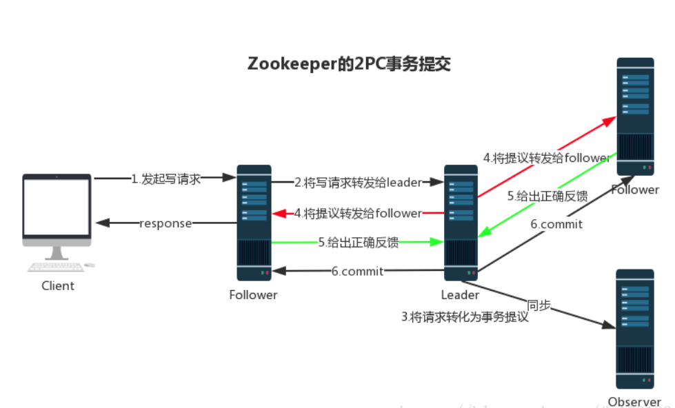
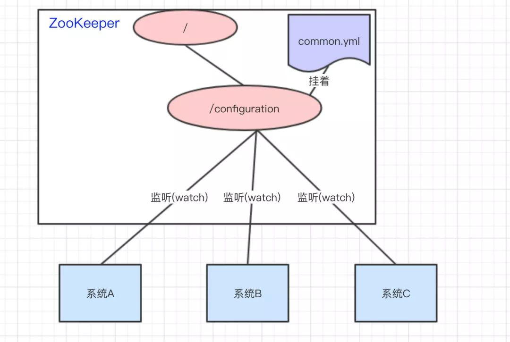
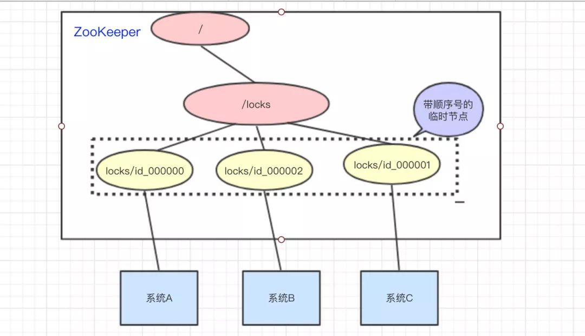

## Base
CAP 理论指出对于一个分布式计算系统来说，不可能同时满足以下三点：
一致性(Consistency)：在分布式环境中，一致性是指数据在多个副本之间是否能够保持一致的特性，等同于所有节点访问同一份最新的数据副本。在一致性的需求下，当一个系统在数据一致的状态下执行更新操作后，应该保证系统的数据仍然处于一致的状态。
可用性(Availability)：每次请求都能获取到正确的响应，但是不保证获取的数据为最新数据。

分区容错性(Partition tolerance)：分布式系统在遇到任何网络分区故障的时候，仍然需要能够保证对外提供满足一致性和可用性的服务，除非是整个网络环境都发生了故障。

## 
Zookeeper是一个开放源码的分布式服务协调组件，是Google Chubby的开源实现。 是一个高性能的分布式数据一致性解决方案。 他将那些复杂的、容易出错的分布式一致性服务封装起来，构成一个高效可靠的原语集， 并提供一系列简单易用的接口给用户使用。
它解决了分布式数据一致性问题，提供了顺序一致性、原子性、单一视图、可靠性、实时性等。

Zookeeper基于java,zookeeper=文件系统+通知机制     

ZooKeeper的数据结构，跟Unix文件系统非常类似，可以看做是一颗树，每个节点叫做ZNode。每一个节点可以通过路径来标识,，每个znode最多能存储1MB数据

ZooKeeper的节点我们称之为Znode，Znode分为两种类型：
短暂/临时(Ephemeral)：当客户端和服务端断开连接后，所创建的Znode(节点)会自动删除
持久(Persistent)：当客户端和服务端断开连接后，所创建的Znode(节点)不会删除

sessionID: 会话ID，用来唯一标识一个会话，每次客户端创建会话的时候，zookeeper 都会为其分配一个全局唯一的 sessionID。

## Zookeeper WATCHER流程

首先要有一个main（）线程

在main线程中创建Zookeeper客户端，这时就会创建两个线程，一个负责网络连接通信（connet），一个负责监听（listener）

通过connect线程将注册的监听事件发送给Zookeeper

在Zookeeper的注册监听器列表中将注册的监听事件添加到列表中

Zookeeper监听到有数据或路径变化，就会将这个消息发送给listener线程

## Zookeeper 数据同步流程
分类 Zookeeper 教程
在 Zookeeper 中，主要依赖 ZAB 协议来实现分布式数据一致性。

ZAB 协议分为两部分：

消息广播

崩溃恢复

1. 消息广播
Zookeeper 使用单一的主进程 Leader 来接收和处理客户端所有事务请求，并采用 ZAB 协议的原子广播协议，将事务请求以 Proposal 提议广播到所有 Follower 节点，当集群中有过半的Follower 服务器进行正确的 ACK 反馈，那么Leader就会再次向所有的 Follower 服务器发送commit 消息，将此次提案进行提交。这个过程可以简称为 2pc(Two-Phase Commit) 事务提交，整个流程可以参考下图，注意 Observer 节点只负责同步 Leader 数据，不参与 2PC 数据同步过程。

2. 崩溃恢复 
## 选举
若进行Leader选举，则至少需要两台机器，这里选取3台机器组成的服务器集群为例。在集群初始化阶段，当有一台服务器Server1启动时，其单独无法进行和完成Leader选举，当第二台服务器Server2启动时，此时两台机器可以相互通信，每台机器都试图找到Leader，于是进入Leader选举过程。选举过程如下
(1) 每个Server发出一个投票。由于是初始情况，Server1和Server2都会将自己作为Leader服务器来进行投票，每次投票会包含所推举的服务器的myid和ZXID，使用(myid, ZXID)来表示，此时Server1的投票为(1, 0)，Server2的投票为(2, 0)，然后各自将这个投票发给集群中其他机器。
(2) 接受来自各个服务器的投票。集群的每个服务器收到投票后，首先判断该投票的有效性，如检查是否是本轮投票、是否来自LOOKING状态的服务器。
(3) 处理投票。针对每一个投票，服务器都需要将别人的投票和自己的投票进行PK，PK规则如下
· 优先检查ZXID。ZXID比较大的服务器优先作为Leader。
 · 如果ZXID相同，那么就比较myid。myid较大的服务器作为Leader服务器。
对于Server1而言，它的投票是(1, 0)，接收Server2的投票为(2, 0)，首先会比较两者的ZXID，均为0，再比较myid，此时Server2的myid最大，于是更新自己的投票为(2, 0)，然后重新投票，对于Server2而言，其无须更新自己的投票，只是再次向集群中所有机器发出上一次投票信息即可。
(4) 统计投票。每次投票后，服务器都会统计投票信息，判断是否已经有过半机器接受到相同的投票信息，对于Server1、Server2而言，都统计出集群中已经有两台机器接受了(2, 0)的投票信息，此时便认为已经选出了Leader。
(5) 改变服务器状态。一旦确定了Leader，每个服务器就会更新自己的状态，如果是Follower，那么就变更为FOLLOWING，如果是Leader，就变更为LEADING。

## 场景应用

### 配置管理
应用中用到的一些配置信息放到ZK上进行集中管理。这类场景通常是这样：应用在启动的时候会主动来获取一次配置，同时，在节点上注册一个Watcher，这样一来，以后每次配置有更新的时候，都会实时通知到订阅的客户端，从来达到获取最新配置信息的目的。

### 负载均衡
每台工作服务器在启动时都会去zookeeper的servers节点下注册临时节点，每台客户端在启动时都会去servers节点下取得所有可用的工作服务器列表，并通过一定的负载均衡算法计算得出一台工作服务器，并与之建立网络连接。

### 服务注册与发现
服务提供者在启动的时候，向ZK上的指定节点/${serviceName}/providers目录下写入自己的URL地址，这个操作就完成了服务的注册。
服务消费者启动的时候，订阅/${serviceName}/providers目录下的提供者URL地址， 并向/${serviceName} /consumers目录下写入自己的URL地址。

### 分布式锁

①建立一个节点，假如名为：lock 。节点类型为持久节点（PERSISTENT）
②每当进程需要访问共享资源时，会调用分布式锁的lock()或tryLock()方法获得锁，这个时候会在第一步创建的lock节点下建立相应的顺序子节点，节点类型为临时顺序节点（EPHEMERAL_SEQUENTIAL），通过组成特定的名字name+lock+顺序号。
③在建立子节点后，对lock下面的所有以name开头的子节点进行排序，判断刚刚建立的子节点顺序号是否是最小的节点，假如是最小节点，则获得该锁对资源进行访问。
④假如不是该节点，就获得该节点的上一顺序节点，并给该节点是否存在注册监听事件。同时在这里阻塞。等待监听事件的发生，获得锁控制权。
⑤当调用完共享资源后，调用unlock（）方法，关闭zk，进而可以引发监听事件，释放该锁。
这种分布式锁是严格的按照顺序访问的并发锁，即时序性。

## ref
https://mp.weixin.qq.com/s?__biz=MzI4Njg5MDA5NA==&mid=2247485115&idx=1&sn=5d269f40f820c82b460993669ca6242e&chksm=ebd747badca0ceac9953f82e08b1d1a49498ebd4af77ec5d628a0682bb9f0ac5ab347411f654&token=1741918942&lang=zh_CN#rd

https://www.runoob.com/w3cnote/zookeeper-leader.html

https://maxwell.gitbook.io/way-to-architect/kuang-jia-huo-gong-ju/zookeeper/zookeeper-neng-gan-sha