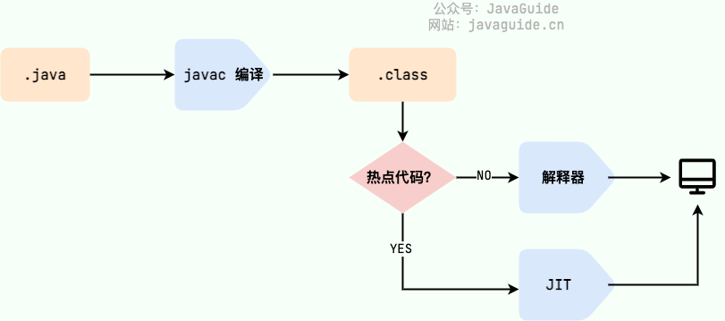
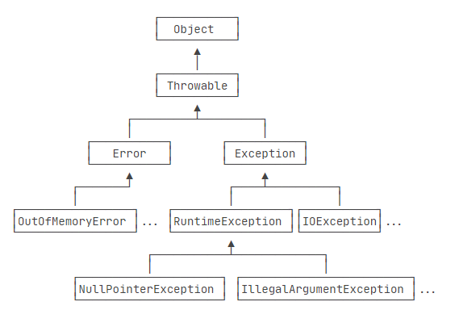
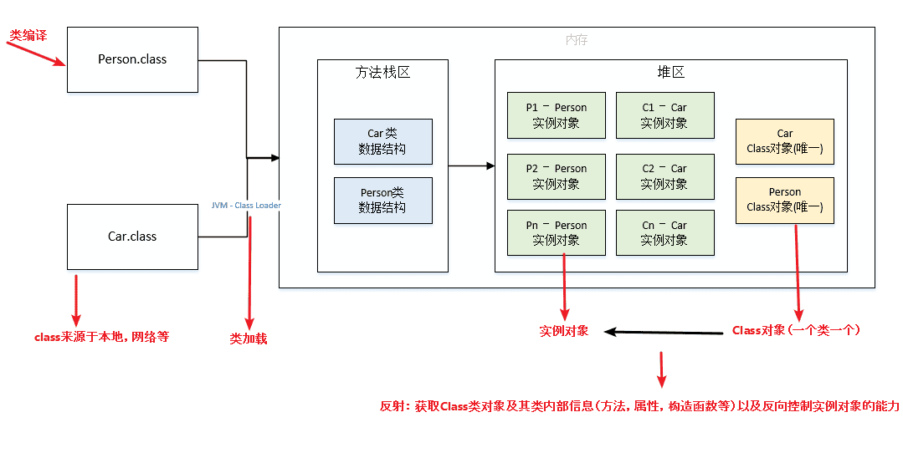

- [JavaBase](#javabase)
  - [Java特性](#java特性)
  - [Java架构](#java架构)
  - [Java Programing](#java-programing)
    - [Java 的编译与解释性](#java-的编译与解释性)
    - [JIT（Just in Time Compilation）](#jitjust-in-time-compilation)
  - [语法](#语法)
    - [包装类型与基本类型](#包装类型与基本类型)
    - [成员变量与局部变量  静态成员变量（类变量）与静态局部变量（类方法局部变量）](#成员变量与局部变量--静态成员变量类变量与静态局部变量类方法局部变量)
    - [static](#static)
    - [final](#final)
    - [类加载](#类加载)
    - [this() \& super()](#this--super)
    - [接口与抽象类](#接口与抽象类)
    - [深拷贝、浅拷贝与引用拷贝](#深拷贝浅拷贝与引用拷贝)
    - [\& and |](#-and-)
  - [String](#string)
    - [String、StringBuffer与StringBuilder](#stringstringbuffer与stringbuilder)
    - [字符串常量池](#字符串常量池)
    - [String.intern()](#stringintern)
  - [Object](#object)
    - [Object class](#object-class)
    - [== 和 equals()](#-和-equals)
    - [equals()和hashCode()](#equals和hashcode)
    - [toString()](#tostring)
- [异常](#异常)
  - [Error](#error)
  - [Exception](#exception)
  - [Throwable 类常用方法](#throwable-类常用方法)
  - [throw和throws](#throw和throws)
  - [try-catch-finally](#try-catch-finally)
  - [try-with-resource（Java 7）](#try-with-resourcejava-7)
- [反射](#反射)
- [注解](#注解)
- [泛型](#泛型)
- [SPI](#spi)
- [REF](#ref)

# JavaBase

## Java特性
封装，继承，多态

## Java架构
- JVM (Java Virtual Machine)  
  运行 Java 字节码的虚拟机

- JRE (Java Runtime Environment)  
  它是运行已编译 Java 程序所需的所有内容的集合，主要包括JVM、Java 基础类库（Class Library）。

- JDK (Java Development Kit)  
  功能齐全的 Java SDK (Software Development Kit)，是提供给开发者使用的，能够创建和编译 Java 程序。他包含了 JRE，同时还包含了编译 java 源码的编译器 javac 以及一些其他工具比如 javadoc（文档注释工具）、jdb（调试器）、jconsole（基于 JMX 的可视化监控⼯具）、javap（反编译工具）等等。

[](https://docs.oracle.com/javase/7/docs/)

## Java Programing
### Java 的编译与解释性
 Java 语言既具有编译型语言的特征，也具有解释型语言的特征。因为 Java 程序要经过先编译，后解释两个步骤，由 Java 编写的程序需要先经过编译步骤，生成字节码（.class 文件），这种字节码必须由 Java 解释器来解释执行。

### JIT（Just in Time Compilation）
 JIT 属于运行时编译。当 JIT 编译器完成第一次编译后，其会将字节码对应的机器码保存下来，下次可以直接使用。HotSpot 采用了惰性评估(Lazy Evaluation)的做法，根据二八定律，消耗大部分系统资源的只有那一小部分的代码（热点代码），而这也就是 JIT 所需要编译的部分。




## 语法
### 包装类型与基本类型
存储方式：基本数据类型的局部变量存放在虚拟机栈中的局部变量表中，基本数据类型的成员变量（未被 static 修饰 ）存放在虚拟机的堆中。包装类型属于对象类型，我们知道几乎所有对象实例都存在于堆中。  
占用空间：相比于包装类型（对象类型）， 基本数据类型占用的空间往往非常小。
默认值：成员变量包装类型不赋值就是 null ，而基本类型有默认值且不是 null。  
比较方式：对于基本数据类型来说，== 比较的是值。对于包装数据类型来说，== 比较的是对象的内存地址。所有整型包装类对象之间值的比较，全部使用 equals() 方法。

### 成员变量与局部变量  静态成员变量（类变量）与静态局部变量（类方法局部变量）
      成员变量：
        成员变量随着对象的建立而建立，随着对象的消失而消失，存在于对象所在的堆内存中。
        成员变量有默认初始化值。

      局部变量：
          局部变量存在于栈内存中，作用的范围结束，变量空间会自动释放。
          局部变量没有默认初始化值

      静态成员变量：
        静态成员变量是属于类的，类变量存在于方法区，被所有类的实例所共享。它们可以在类被加载时被赋值，并且只被初始化一次。静态成员变量不需要实例化对象即可被访问，可以通过类名和作用域限定符来访问。
---
      静态局部变量(限于cpp，Java中static不能修饰局部变量)：
        静态局部变量在方法被第一次调用时，静态局部变量被初始化，直到程序退出方法体的执行环境后才被销毁。与普通局部变量不同，静态局部变量可以在方法调用之间进行持久化状态的保存，以便于下一次调用时恢复它们的状态。静态局部变量不能用来共享数据，只能用来保存方法执行的状态或其他临时性的变量数据。

### static
  - static代码块  
  static块可以置于类中的任何地方，类中可以有多个static块。在类初次被加载的时候，会按照static块的顺序来执行每个static块，并且只会执行一次。
  - static方法
  - static变量  
  非静态方法中能够通过this访问静态成员变量

### final
　　当final变量是基本数据类型以及String类型时，如果在<span style=color:red>编译期间能知道它的确切值</span>，则编译器会把它当做编译期常量使用。也就是说在用到该final变量的地方，相当于直接访问的这个常量，不需要在运行时确定。这种和C语言中的宏替换有点像。
```Java
    final static int J = 1;
    final int[] a = {1,2,3,4};
    //非编译期常量
    Random r = new Random();
    final int k = r.nextInt();
    //k的值由随机数对象决定，所以不是所有的final修饰的字段都是编译期常量，只是k的值在被初始化后无法被更改。
```

引用变量被final修饰之后，虽然不能再指向其他对象，但是它指向的对象的内容是可变的。

一个既是static又是final 的字段只占据一段不能改变的存储空间，它必须在定义的时候进行赋值，否则编译器将不予通过。


### 类加载
静态块/静态变量(静态代码块和静态变量的执行顺序只跟代码中出现的顺序有关)——>成员变量——>构造方法——>静态方法  
1、静态代码块（只加载一次） 2、构造方法（创建一个实例就加载一次）3、静态方法需要调用才会执行

### this() & super()

调用super()必须写在子类构造方法的第一行, 否则编译不通过  
super从子类调用父类构造, this在同一类中调用其他构造均需要放在第一行  
尽管可以用this调用一个构造器, 却不能调用2个  
this和super不能出现在同一个构造器中, 否则编译不通过this()、super()都指的对象,不可以在static环境中使用  
本质this指向本对象的指针。super是一个关键字

### 接口与抽象类
- 一个子类只能继承一个抽象类, 但能实现多个接口  
- 抽象类可以有构造方法, 接口没有构造方法
- 抽象类可以有普通成员变量, 接口没有普通成员变量(只能有常量)
- 抽象类和接口都可有静态成员变量, 抽象类中静态成员变量访问类型任意，接口只能public static final(默认)
- 抽象类可以没有抽象方法, 抽象类可以有普通方法；接口在JDK8之前都是抽象方法，在JDK8可以有default方法，在JDK9中允许有私有普通方法
- 抽象类可以有静态方法；接口在JDK8之前不能有静态方法，在JDK8中可以有静态方法，且只能被接口类直接调用（不能被实现类的对象调用）
- 抽象类中的方法可以是public、protected; 
- 接口方法在JDK8之前只有public abstract，在JDK8可以有default方法，在JDK9中允许有private方法。

### 深拷贝、浅拷贝与引用拷贝
浅拷贝：浅拷贝会在堆上创建一个新的对象（区别于引用拷贝的一点），不过，如果原对象内部的属性是引用类型的话，浅拷贝会直接复制内部对象的引用地址，也就是说拷贝对象和原对象共用同一个内部对象。  
深拷贝：深拷贝会完全复制整个对象，包括这个对象所包含的内部对象。  
引用拷贝：两个不同的引用指向同一个对象


### & and |
    &符号通常用于位运算，但也可以用于逻辑运算，&&符号主要用于逻辑运算，他们两个最大的区别在于，&是用于非短路的，而&&是用于短路的，短路就是当运算符两边的表达式，第一个表达式为false则不再计算第二个表达式。（|与||一致。）

## String
### String、StringBuffer与StringBuilder
- 可变和适用范围  
  String对象是不可变的，而StringBuffer和StringBuilder是可变字符序列。每次对String的操作相当于生成一个新的String对象，而对StringBuffer和StringBuilder的操作是对对象本身的操作，而不会生成新的对象，所以对于频繁改变内容的字符串避免使用String，因为频繁的生成对象将会对系统性能产生影响。
  
- 线程安全  
  String由于有final修饰，是immutable的，安全性是简单而纯粹的。StringBuilder和StringBuffer的区别在于StringBuilder不保证同步，也就是说如果需要线程安全需要使用StringBuffer，不需要同步的StringBuilder效率更高。
- 性能
  每次对 String 类型进行改变的时候，都会生成一个新的 String 对象，然后将指针指向新的 String 对象。StringBuffer 每次都会对 StringBuffer 对象本身进行操作，而不是生成新的对象并改变对象引用。相同情况下使用 StringBuilder 相比使用 StringBuffer 仅能获得 10%~15% 左右的性能提升，但却要冒多线程不安全的风险。

      操作少量的数据: 适用 String
      单线程操作字符串缓冲区下操作大量数据: 适用 StringBuilder
      多线程操作字符串缓冲区下操作大量数据: 适用 StringBuffer

### 字符串常量池
字符串常量池 是 JVM 为了提升性能和减少内存消耗针对字符串（String 类）专门开辟的一块区域，主要目的是为了避免字符串的重复创建。  
[String s1 = new String("abc");这句话创建了几个字符串对象？
](https://javaguide.cn/java/basis/java-basic-questions-02.html#string-s1-new-string-abc-%E8%BF%99%E5%8F%A5%E8%AF%9D%E5%88%9B%E5%BB%BA%E4%BA%86%E5%87%A0%E4%B8%AA%E5%AD%97%E7%AC%A6%E4%B8%B2%E5%AF%B9%E8%B1%A1)

### String.intern()
String.intern() 是一个 native（本地）方法，其作用是将指定的字符串对象的引用保存在字符串常量池中，可以简单分为两种情况：如果字符串常量池中保存了对应的字符串对象的引用，就直接返回该引用。如果字符串常量池中没有保存了对应的字符串对象的引用，那就在常量池中创建一个指向该字符串对象的引用并返回。

## Object

### Object class
Modifier and Type | Method and Description
--- | ---
protected Object | `clone()`: Creates and returns a copy of this object.
boolean | `equals(Object obj)`: Indicates whether some other object is "equal to" this one.
protected void | `finalize()`: Called by the garbage collector on an object when garbage collection determines that there are no more references to the object.
Class<?> | `getClass()`: Returns the runtime class of this Object.
int | `hashCode()`: Returns a hash code value for the object.
void | `notify()`: Wakes up a single thread that is waiting on this object's monitor.
void | `notifyAll()`: Wakes up all threads that are waiting on this object's monitor.
String | `toString()`: Returns a string representation of the object.
void | `wait()`: Causes the current thread to wait until another thread invokes the notify() method or the notifyAll() method for this object.
void | `wait(long timeout)`: Causes the current thread to wait until either another thread invokes the notify() method or the notifyAll() method for this object, or a specified amount of time has elapsed.
void | `wait(long timeout, int nanos)`: Causes the current thread to wait until another thread invokes the notify() method or the notifyAll() method for this object, or some other thread interrupts the current thread, or a certain amount of real time has elapsed.

### == 和 equals() 
== 对于基本类型和引用类型的作用效果是不同的：
对于基本数据类型来说，== 比较的是值。
对于引用数据类型来说，== 比较的是对象的内存地址。

equals() 不能用于判断基本数据类型的变量，只能用来判断两个对象是否相等。  
Object中equals()使用`==` 。
String 中的 equals 方法是被重写过的，String 的 equals 方法比较的是对象的值。

### equals()和hashCode()
为什么在重写 equals 方法的时候需要重写 hashCode 方法?  
因为有强制的规范指定需要同时重写 hashcode 与 equals 是方法，许多容器类，如 HashMap、HashSet 都依赖于 hashcode 与 equals 的规定。

有没有可能两个不相等的对象有相同的 hashcode?  
有可能，两个不相等的对象可能会有相同的 hashcode 值，这就是为什么在 hashmap 中会有冲突。相等 hashcode 值的规定只是说如果两个对象相等，必须有相同的hashcode 值，但是没有关于不相等对象的任何规定。

两个相同的对象会有不同的 hashcode 吗?  
不能，根据 hashcode 的规定，这是不可能的。


### toString()
toString() 方法返回该对象的字符串，当程序输出一个对象或者把某个对象和字符串进行连接运算时，系统会自动调用该对象的 toString() 方法返回该对象的字符串表示。  
Object 类的 toString() 方法返回“运行时类名@十六进制哈希码”格式的字符串，但很多类都重写了 Object 类的 toString() 方法，用于返回可以表述该对象信息的字符串。


# 异常

[](https://www.liaoxuefeng.com/wiki/1252599548343744/1264734349295520)  

从继承关系可知：Throwable是异常体系的根，它继承自Object。Throwable有两个体系：Error和Exception。

## Error
Error属于程序无法处理的错误 ，我们没办法通过 catch 来进行捕获不建议通过catch捕获 。`OutOfMemoryError`、`NoClassDefFoundError`、`StackOverflowError`，这些异常发生时，Java 虚拟机（JVM）一般会选择线程终止。

## Exception
程序本身可以处理的异常，可以通过 catch 来进行捕获。Exception 又可以分为 Checked Exception (受检查异常，必须处理) 和 Unchecked Exception (不受检查异常，可以不处理)。除了RuntimeException（运行时异常）及其子类以外，其他的Exception类(编译时异常)及其子类都属于受检查异常 。

RuntimeException 及其子类都统称为非受检查异常常见的有：  
    `NullPointerException`(空指针错误)  
    `IllegalArgumentException`(参数错误比如方法入参类型错误)  
    `NumberFormatException`（字符串转换为数字格式错误，IllegalArgumentException的子类）  
    `ArrayIndexOutOfBoundsException`（数组越界错误）  
    `ClassCastException`（类型转换错误）  
    `ArithmeticException`（算术错误）  
    `SecurityException` （安全错误比如权限不够）  
    `UnsupportedOperationException` (不支持的操作错误比如重复创建同一用户)  

## Throwable 类常用方法
`String getMessage()`: 返回异常发生时的简要描述  
`String toString()`: 返回异常发生时的详细信息  
`String getLocalizedMessage()`: 返回异常对象的本地化信息。使用 Throwable 的子类覆盖这个方法，可以生成本地化信息。如果子类没有覆盖该方法，则该方法返回的信息与 `getMessage()`返回的结果相同
`void printStackTrace()`: 在控制台上打印 Throwable 对象封装的异常信息

## throw和throws
- throws(异常的声明)  
在Java中，当前执行的语句必属于某个方法，Java解释器调用main方法执行开始执行程序。若方法中存在检查异常，如果不对其捕获，那必须在方法头中显式声明该异常，以便于告知方法调用者此方法有异常，需要进行处理。 在方法中声明一个异常，方法头中使用关键字throws，后面接上要声明的异常。若声明多个异常，则使用逗号分割。
```Java
public static void method() throws IOException, FileNotFoundException{
    //something statements
}
```

- throw(异常的抛出)  
如果代码可能会引发某种错误，可以创建一个合适的异常类实例并抛出它，这就是抛出异常。如下所示：
```Java
public static double method(int value) {
    if(value == 0) {
        throw new ArithmeticException("参数不能为0"); //抛出一个运行时异常
    }
    return 5.0 / value;
}
```

## try-catch-finally 
- try块：用于捕获异常。其后可接零个或多个 catch 块，如果没有 catch 块，则必须跟一个 finally 块。
- catch块：用于处理 try 捕获到的异常。
- finally 块：无论是否捕获或处理异常，finally 块里的语句都会被执行。<span style=color:red><b>当在 try 块或 catch 块中遇到 return 语句时，finally 语句块将在方法返回之前被执行。当 try 语句和 finally 语句中都有 return 语句时，try 语句块中的 return 语句会被忽略。这是因为 try 语句中的 return 返回值会先被暂存在一个本地变量中，当执行到 finally 语句中的 return 之后，这个本地变量的值就变为了 finally 语句中的 return 返回值。</b></span>finally 中的代码一定会执行吗？在某些情况下，finally 中的代码不会被执行。
如 finally 之前虚拟机被终止运行的话，finally 中的代码就不会被执行。
```
try {
    System.out.println("Try to do something");
    throw new RuntimeException("RuntimeException");
} catch (Exception e) {
    System.out.println("Catch Exception -> " + e.getMessage());
    // 终止当前正在运行的Java虚拟机
    System.exit(1);
} finally {
    System.out.println("Finally");
}
```

## try-with-resource（Java 7）
如果你的资源实现了 AutoCloseable 接口或java.io.Closeable接口，你可以使用这个语法。大多数的 Java 标准资源都继承了这个接口。当你在 try 子句中打开资源，资源会在 try 代码块执行后或异常处理后自动关闭。
```Java
try (BufferedInputStream bin = new BufferedInputStream(new FileInputStream(new File("test.txt")));//可以处理多个资源
     BufferedOutputStream bout = new BufferedOutputStream(new FileOutputStream(new File("out.txt")))) {
    int b;
    while ((b = bin.read()) != -1) {
        bout.write(b);
    }
}
catch (IOException e) {
    e.printStackTrace();
}
```
# 反射

基于JVM类加载机制实现，理解上需要了解类加载
JAVA反射机制是在运行状态中，对于任意一个类，都能够知道这个类的所有属性和方法；对于任意一个对象，都能够调用它的任意一个方法和属性；这种动态获取的信息以及动态调用对象的方法的功能称为java语言的反射机制。应用于动态代理，注解等。。


| 方法名 | 描述 |
| ---- | ---- |
| forName() | (1)获取Class对象的一个引用，但引用的类还没有加载(该类的第一个对象没有生成)就加载了这个类。<br>(2)为了产生Class引用，forName()立即就进行了初始化。 |
| Object-getClass() | 获取Class对象的一个引用，返回表示该对象的实际类型的Class引用。 |
| getName() | 取全限定的类名(包括包名)，即类的完整名字。 |
| getSimpleName() | 获取类名(不包括包名)。 |
| getCanonicalName() | 获取全限定的类名(包括包名)。 |
| isInterface() | 判断Class对象是否是表示一个接口。 |
| getInterfaces() | 返回Class对象数组，表示Class对象所引用的类所实现的所有接口。 |
| getSupercalss() | 返回Class对象，表示Class对象所引用的类所继承的直接基类。应用该方法可在运行时发现一个对象完整的继承结构。 |
| newInstance() | 返回一个Oject对象，是实现“虚拟构造器”的一种途径。使用该方法创建的类，必须带有无参的构造器。 |
| getFields() | 获得某个类的所有的公共（public）的字段，包括继承自父类的所有公共字段。 类似的还有getMethods和getConstructors。 |
| getDeclaredFields() | 获得某个类的自己声明的字段，即包括public、private和protected，默认但是不包括父类声明的任何字段。类似的还有getDeclaredMethods和getDeclaredConstructors。 |
|invoke()|赋值操作，进行传参|


# 注解
注释会被编译器直接忽略，注解则可以被编译器打包进入class文件，因此，注解是一种用作标注的“元数据”。

注解是JDK1.5版本开始引入的一个特性，用于对代码进行说明，可以对包、类、接口、字段、方法参数、局部变量等进行注解。

它主要的作用有以下四方面：  
生成文档，通过代码里标识的元数据生成javadoc文档。  
编译检查，通过代码里标识的元数据让编译器在编译期间进行检查验证。  
编译时动态处理，编译时通过代码里标识的元数据动态处理，例如动态生成代码。  
运行时动态处理，运行时通过代码里标识的元数据动态处理，例如使用反射注入实例。

Java自带的标准注解，包括`@Override`、`@Deprecated`和`@SuppressWarnings`，分别用于标明重写某个方法、标明某个类或方法过时、标明要忽略的警告，用这些注解标明后编译器就会进行检查。元注解，元注解是用于定义注解的注解，包括`@Retention`、`@Target`、`@Inherited`、`@Documented`  
`@Retention`用于标明注解被保留的阶段  
`@Target`用于标明注解使用的范围  
`@Inherited`用于标明注解可继承  
`@Documented`用于标明是否生成javadoc文档自定义注解，可以根据自己的需求定义注解，并可用元注解对自定义注解进行注解。


# 泛型

# SPI
SPI（Service Provider Interface），是JDK内置的一种 服务提供发现机制，可以用来启用框架扩展和替换组件，主要是被框架的开发人员使用，比如java.sql.Driver接口，其他不同厂商可以针对同一接口做出不同的实现，MySQL和PostgreSQL都有不同的实现提供给用户，而Java的SPI机制可以为某个接口寻找服务实现。Java中SPI机制主要思想是将装配的控制权移到程序之外，在模块化设计中这个机制尤其重要，其核心思想就是解耦。


# REF
(https://javaguide.cn/java/basis/)
(https://www.cnblogs.com/dolphin0520/p/3799052.html)
(https://www.pdai.tech/md/interview/x-interview.html#_1-1-%E8%AF%AD%E6%B3%95%E5%9F%BA%E7%A1%80)