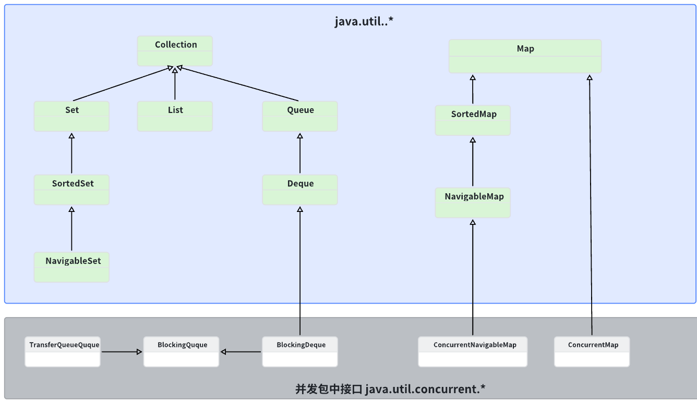
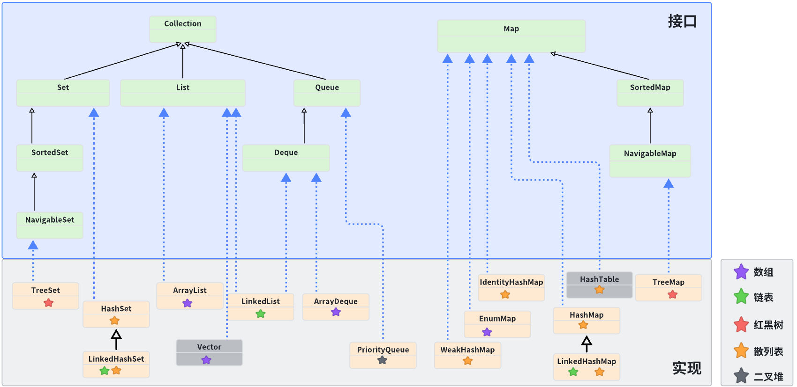

# Container






## Collection
### Collection code
```java
public interface Collection<E> extends Iterable<E> {
    //-------这些是查询相关的操作----------

   	//获取当前集合中的元素数量
    int size();

    //查看当前集合是否为空
    boolean isEmpty();

    //查询当前集合中是否包含某个元素
    boolean contains(Object o);

    //返回当前集合的迭代器，我们会在后面介绍
    Iterator<E> iterator();

    //将集合转换为数组的形式
    Object[] toArray();

    //支持泛型的数组转换，同上
    <T> T[] toArray(T[] a);

    //-------这些是修改相关的操作----------

    //向集合中添加元素，不同的集合类具体实现可能会对插入的元素有要求，
  	//这个操作并不是一定会添加成功，所以添加成功返回true，否则返回false
    boolean add(E e);

    //从集合中移除某个元素，同样的，移除成功返回true，否则false
    boolean remove(Object o);


    //-------这些是批量执行的操作----------

    //查询当前集合是否包含给定集合中所有的元素
  	//从数学角度来说，就是看给定集合是不是当前集合的子集
    boolean containsAll(Collection<?> c);

    //添加给定集合中所有的元素
  	//从数学角度来说，就是将当前集合变成当前集合与给定集合的并集
  	//添加成功返回true，否则返回false
    boolean addAll(Collection<? extends E> c);

    //移除给定集合中出现的所有元素，如果某个元素在当前集合中不存在，那么忽略这个元素
  	//从数学角度来说，就是求当前集合与给定集合的差集
  	//移除成功返回true，否则false
    boolean removeAll(Collection<?> c);

    //Java8新增方法，根据给定的Predicate条件进行元素移除操作
    default boolean removeIf(Predicate<? super E> filter) {
        Objects.requireNonNull(filter);
        boolean removed = false;
        final Iterator<E> each = iterator();   //这里用到了迭代器，我们会在后面进行介绍
        while (each.hasNext()) {
            if (filter.test(each.next())) {
                each.remove();
                removed = true;
            }
        }
        return removed;
    }

    //只保留当前集合中在给定集合中出现的元素，其他元素一律移除
  	//从数学角度来说，就是求当前集合与给定集合的交集
  	//移除成功返回true，否则false
    boolean retainAll(Collection<?> c);

    //清空整个集合，删除所有元素
    void clear();


    //-------这些是比较以及哈希计算相关的操作----------

    //判断两个集合是否相等
    boolean equals(Object o);

    //计算当前整个集合对象的哈希值
    int hashCode();

    //与迭代器作用相同，但是是并行执行的，我们会在下一章多线程部分中进行介绍
    @Override
    default Spliterator<E> spliterator() {
        return Spliterators.spliterator(this, 0);
    }

    //生成当前集合的流，我们会在后面进行讲解
    default Stream<E> stream() {
        return StreamSupport.stream(spliterator(), false);
    }

    //生成当前集合的并行流，我们会在下一章多线程部分中进行介绍
    default Stream<E> parallelStream() {
        return StreamSupport.stream(spliterator(), true);
    }
}
```

### List
#### List code
```Java
//List是一个有序的集合类，每个元素都有一个自己的下标位置
//List中可插入重复元素
//针对于这些特性，扩展了Collection接口中一些额外的操作
public interface List<E> extends Collection<E> {
    ...
   	
    //将给定集合中所有元素插入到当前结合的给定位置上（后面的元素就被挤到后面去了，跟我们之前顺序表的插入是一样的）
    boolean addAll(int index, Collection<? extends E> c);

    ...

   	//Java 8新增方法，可以对列表中每个元素都进行处理，并将元素替换为处理之后的结果
    default void replaceAll(UnaryOperator<E> operator) {
        Objects.requireNonNull(operator);
        final ListIterator<E> li = this.listIterator();  //这里同样用到了迭代器
        while (li.hasNext()) {
            li.set(operator.apply(li.next()));
        }
    }

    //对当前集合按照给定的规则进行排序操作，这里同样只需要一个Comparator就行了
    @SuppressWarnings({"unchecked", "rawtypes"})
    default void sort(Comparator<? super E> c) {
        Object[] a = this.toArray();
        Arrays.sort(a, (Comparator) c);
        ListIterator<E> i = this.listIterator();
        for (Object e : a) {
            i.next();
            i.set((E) e);
        }
    }

    ...

    //-------- 这些是List中独特的位置直接访问操作 --------

   	//获取对应下标位置上的元素
    E get(int index);

    //直接将对应位置上的元素替换为给定元素
    E set(int index, E element);

    //在指定位置上插入元素，就跟我们之前的顺序表插入是一样的
    void add(int index, E element);

    //移除指定位置上的元素
    E remove(int index);


    //------- 这些是List中独特的搜索操作 -------

    //查询某个元素在当前列表中的第一次出现的下标位置
    int indexOf(Object o);

    //查询某个元素在当前列表中的最后一次出现的下标位置
    int lastIndexOf(Object o);


    //------- 这些是List的专用迭代器 -------

    //迭代器我们会在下一个部分讲解
    ListIterator<E> listIterator();

    //迭代器我们会在下一个部分讲解
    ListIterator<E> listIterator(int index);

    //------- 这些是List的特殊转换 -------

    //返回当前集合在指定范围内的子集
    List<E> subList(int fromIndex, int toIndex);

    ...
}
```
#### ArrayList
##### ArrayList code
```Java
public class ArrayList<E> extends AbstractList<E>
        implements List<E>, RandomAccess, Cloneable, java.io.Serializable
{
		
    //默认的数组容量
    private static final int DEFAULT_CAPACITY = 10;

    ...

    //存放数据的底层数组，这里的transient关键字我们会在后面I/O中介绍用途
    transient Object[] elementData;

    //记录当前数组元素数的
    private int size;

   	//这是ArrayList的其中一个构造方法
    public ArrayList(int initialCapacity) {
        if (initialCapacity > 0) {
            this.elementData = new Object[initialCapacity];   //根据初始化大小，创建当前列表
        } else if (initialCapacity == 0) {
            this.elementData = EMPTY_ELEMENTDATA;
        } else {
            throw new IllegalArgumentException("Illegal Capacity: "+
                                               initialCapacity);
        }
    }
  
  	...
      
   	public boolean add(E e) {
        ensureCapacityInternal(size + 1);  // 这里会判断容量是否充足，不充足需要扩容
        elementData[size++] = e;
        return true;
    }
  	
  	...
    
    //默认的列表最大长度为Integer.MAX_VALUE - 8
    //JVM都C++实现中，在数组的对象头中有一个_length字段，用于记录数组的长
    //度，所以这个8就是存了数组_length字段（这个只做了解就行）
		private static final int MAX_ARRAY_SIZE = Integer.MAX_VALUE - 8;
  	
  	private void grow(int minCapacity) {
        int oldCapacity = elementData.length;
        int newCapacity = oldCapacity + (oldCapacity >> 1);   //扩容规则跟我们之前的是一样的，也是1.5倍
        if (newCapacity - minCapacity < 0)    //要是扩容之后的大小还没最小的大小大，那么直接扩容到最小的大小
            newCapacity = minCapacity;
        if (newCapacity - MAX_ARRAY_SIZE > 0)   //要是扩容之后比最大的大小还大，需要进行大小限制
            newCapacity = hugeCapacity(minCapacity);  //调整为限制的大小
        elementData = Arrays.copyOf(elementData, newCapacity);   //使用copyOf快速将内容拷贝到扩容后的新数组中并设定为新的elementData底层数组
    }
}
```
##### 特性
ArrayList 是基于动态数组实现的 List 接口。与数组类似，ArrayList 的操作也具有以下特点：
- 查找效率高，支持快速随机访问。
- 在数组中间插入或删除元素效率低，需要前后挪动数据。

ArrayList 的属性：
- size：当前数组实际存储的元素个数；
- capacity：表示数组能容纳的元素个数，初始默认值是 10；

当插入新元素时，ArrayList 会先校验数组大小是否足够，如果不够时则需要扩容。扩容会创建一个新的数组，将现有数组数据拷贝到新数组。ArrayList 的扩容大小通常是其原容量的 1.5 倍。由于扩容的代价很高，因此在实际使用时，我们应该尽量避免数组容量的扩张。一种方法是在构造 ArrayList 实例时，就指定其容量，另一种方法是通过调用 `ensureCapacity()` 方法手动增加 ArrayList 实例的容量，以减少递增式再分配的次数。

由于底层采用 Object 数组存储数据，ArrayList 能容纳任何类型的对象，包括`null`。同时，ArrayList 是线程不安全的。

##### 构造
```Java
private static final int DEFAULT_CAPACITY = 10;
private static final Object[] DEFAULTCAPACITY_EMPTY_ELEMENTDATA = {};
/**
 * 默认构造函数，使用初始容量10构造一个空列表(无参数构造)
 */
public ArrayList() {
    this.elementData = DEFAULTCAPACITY_EMPTY_ELEMENTDATA;
}

/**
 * 带初始容量参数的构造函数。（用户自己指定容量）
 */
public ArrayList(int initialCapacity) {
    if (initialCapacity > 0) {//初始容量大于0
        //创建initialCapacity大小的数组
        this.elementData = new Object[initialCapacity];
    } else if (initialCapacity == 0) {//初始容量等于0
        //创建空数组
        this.elementData = EMPTY_ELEMENTDATA;
    } else {//初始容量小于0，抛出异常
        throw new IllegalArgumentException("Illegal Capacity: " + initialCapacity);
    }
}

/**
 *构造包含指定collection元素的列表，这些元素利用该集合的迭代器按顺序返回
 *如果指定的集合为null，throws NullPointerException。
 */
public ArrayList(Collection<? extends E> c) {
    elementData = c.toArray();
    if ((size = elementData.length) != 0) {
        // c.toArray might (incorrectly) not return Object[] (see 6260652)
        if (elementData.getClass() != Object[].class)
            elementData = Arrays.copyOf(elementData, size, Object[].class);
    } else {
        // replace with empty array.
        this.elementData = EMPTY_ELEMENTDATA;
    }
}
```

以无参数构造方法创建 ArrayList 时，实际上初始化赋值的是一个空数组。当真正对数组进行添加元素操作时，才真正分配容量。即向数组中添加第一个元素时，数组容量扩为 10。

##### 扩容
JDK11之前，ArrayList 每次扩容之后容量都会变为原来的 1.5 倍左右（oldCapacity 为偶数就是 1.5 倍，否则是 1.5 倍左右，位运算导致）

JDK11之后，改为了按照一定比例增加容量，该比例为元素数量与数组容量之比。具体来说，当 `ArrayList` 容量不够用时，会先计算出增量为当前容量的 1/2，向上取整的值。然后将新容量设置为当前容量加上增量。如果新容量加上元素数量小于等于 `Integer.MAX_VALUE`，则使用这个新容量；否则新容量设置为 `Integer.MAX_VALUE`

#### LinkedList

LinkedList 是基于双向链表实现的 List 接口。它的特点是：

- 头尾指针：LinkedList 维护了两个指针，分别指向头和尾。当链表为空时，这两支针指向 `null`。由于可以快速找到头尾元素，因此 LinkedList 也可以用作栈、队列和双向队列。
- 节点：列表中的所有元素都包装成 `Node` 节点存入链表中。由于是双向链表，因此每个节点都有一个向前、一个向后的指针。头节点的向前指针和尾节点的向后指针都指向 `null`。
- 性能：下标相关的操作都是线性时间，而在头部或尾部删除元素只需要常数时间。

由于 LinkedList 的插入和删除操作只需调整节点的指针，而不需要像数组那样复制移动数据，因此效率较高。

与 ArrayList 类似，LinkedList 也是线程不安全的。如果需要多个线程并发访问，可以采用 `Collections.synchronizedList()` 方法对其进行包装，以实现线程安全。

## Set
### TreeSet​ 
基于红黑树实现​，使用二叉树原理，对元素进行排序。插入元素时需要调整树的结构，将元素放到指定位置。支持自然顺序访问，但是添加、删除、包含等操作要相对低效（log(n) 时间）。因为需要排序，所以必须具备比较大小的能力。基础包装类Integer，String等可以默认支持排序。如果自定义类，则需要实现Comparable接口，定义出两个自定义类的对象如何比较大小。
### HashSet
### LinkedHashSet

## Queue​ 
### PriorityQueue
基于堆结构实现，可以用它来实现优先队列。特性与堆结构类似。
## Map
### HashMap
HashMap 主要用来存放键值对，它基于哈希表的 Map 接口实现，进行 put 或者 get 操作，可以达到常数时间的性能，是常用的 Java 集合之一，是非线程安全，元素之间没有顺序性。HashMap 可以存储 null 的 key 和 value，但 null 作为键只能有一个，null 作为值可以有多个JDK1.8 之前 HashMap 由 数组+链表 组成的，数组是 HashMap 的主体，链表则是主要为了解决哈希冲突而存在的（“拉链法”解决冲突）。 JDK1.8 以后的 HashMap 在解决哈希冲突时有了较大的变化，当链表长度大于等于阈值（默认为 8）（将链表转换成红黑树前会判断，如果当前数组的长度小于 64，那么会选择先进行数组扩容，而不是转换为红黑树）时，将链表转化为红黑树，以减少搜索时间。HashMap 默认的初始化大小为 16。之后每次扩充，容量变为原来的 2 倍。并且， HashMap 总是使用 2 的幂作为哈希表的大小。

loadFactor：  
  负载因子loadFactor 负载因子是控制数组存放数据的疏密程度，loadFactor 越趋近于 1，那么 数组中存放的数据(entry)也就越多，也就越密，也就是会让链表的长度增加，loadFactor 越小，也就是趋近于 0，数组中存放的数据(entry)也就越少，也就越稀疏。loadFactor 太大导致查找元素效率低，太小导致数组的利用率低，存放的数据会很分散。loadFactor 的默认值为 0.75f 是官方给出的一个比较好的临界值。给定的默认容量为 16，负载因子为 0.75。Map 在使用过程中不断的往里面存放数据，当数量超过了 16 * 0.75 = 12 就需要将当前 16 的容量进行扩容，而扩容这个过程涉及到 rehash、复制数据等操作，所以非常消耗性能。

threshold：  
  threshold = capacity * loadFactor，当 Size>threshold的时候，那么就要考虑对数组的扩增了，也就是说，这个的意思就是 衡量数组是否需要扩增的一个标准。

### TreeMap
基于红黑树实现的一种提供顺序访问的Map。​  
实现SortedMap接口，能够把元素根据键Key排序。默认是升序列，使用Iterator遍历时会拿到一个升序的记录序列。​  
因为需要排序，所以键Key需要定义比较大小的逻辑，具体顺序可以由指定的 Comparator 来决定，或者根据键的自然顺序来判断。  


## Collections 

```Java
void reverse(List list)//反转
void shuffle(List list)//随机排序
void sort(List list)//按自然排序的升序排序
void sort(List list, Comparator c)//定制排序，由Comparator控制排序逻辑
void swap(List list, int i , int j)//交换两个索引位置的元素
void rotate(List list, int distance)//旋转。当distance为正数时，将list后distance个元素整体移到前面。当distance为负数时，将 list的前distance个元素整体移到后面
```

```Java
int binarySearch(List list, Object key)//对List进行二分查找，返回索引，注意List必须是有序的
int max(Collection coll)//根据元素的自然顺序，返回最大的元素。 类比int min(Collection coll)
int max(Collection coll, Comparator c)//根据定制排序，返回最大元素，排序规则由Comparatator类控制。类比int min(Collection coll, Comparator c)
void fill(List list, Object obj)//用指定的元素代替指定list中的所有元素
int frequency(Collection c, Object o)//统计元素出现次数
int indexOfSubList(List list, List target)//统计target在list中第一次出现的索引，找不到则返回-1，类比int lastIndexOfSubList(List source, list target)
boolean replaceAll(List list, Object oldVal, Object newVal)//用新元素替换旧元素

```

## Comparable 和 Comparator 
Comparable 接口和 Comparator 接口都是 Java 中用于排序的接口，它们在实现类对象之间比较大小、排序等方面发挥了重要作用：Comparable 接口实际上是出自java.lang包 它有一个 compareTo(Object obj)方法用来排序Comparator接口实际上是出自 java.util 包它有一个compare(Object obj1, Object obj2)方法用来排序一般我们需要对一个集合使用自定义排序时，我们就要重写compareTo()方法或compare()方法，当我们需要对某一个集合实现两种排序方式，比如一个 song 对象中的歌名和歌手名分别采用一种排序方法的话，我们可以重写compareTo()方法和使用自制的Comparator方法或者以两个 Comparator 来实现歌名排序和歌星名排序，第二种代表我们只能使用两个参数版的 Collections.sort()
