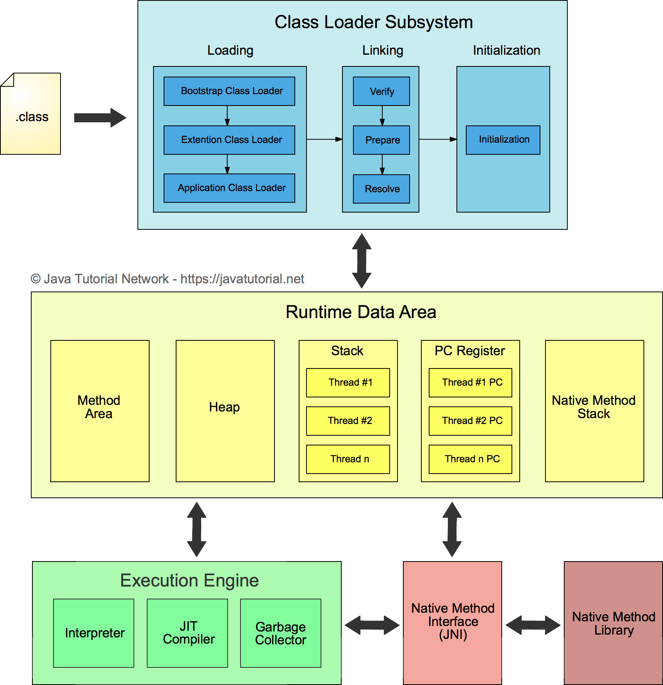
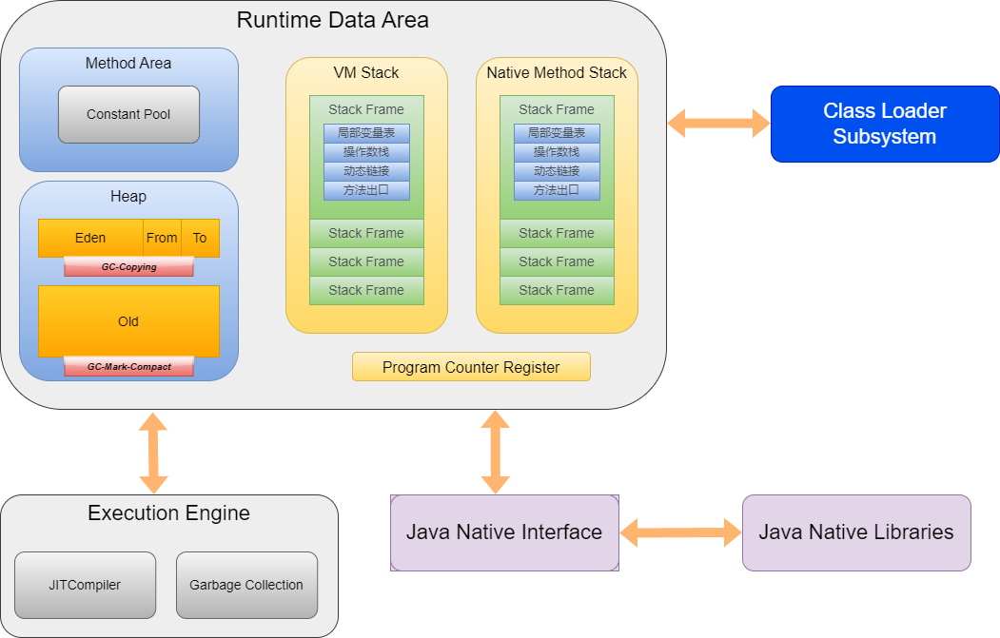
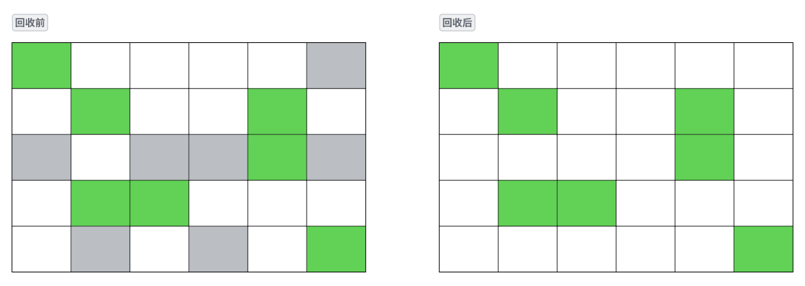
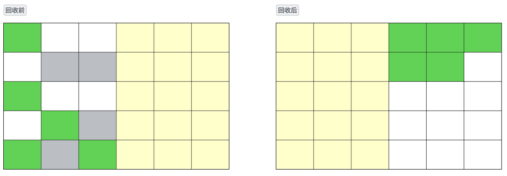
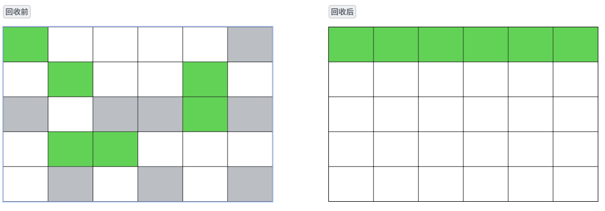
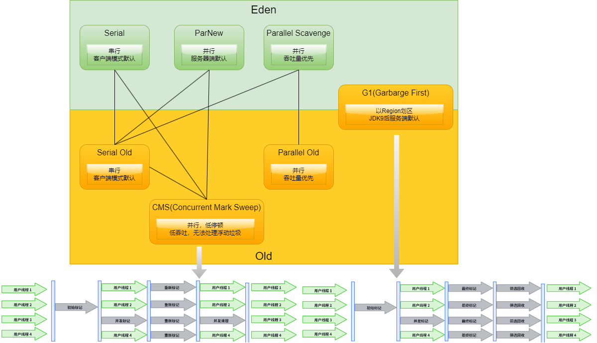

- [JVM](#jvm)
  - [.class 编译](#class-编译)
  - [类加载机制](#类加载机制)
    - [类的生命周期](#类的生命周期)
      - [加载](#加载)
      - [连接](#连接)
        - [验证](#验证)
        - [准备](#准备)
        - [解析](#解析)
      - [初始化](#初始化)
      - [使用](#使用)
      - [卸载](#卸载)
    - [类加载器](#类加载器)
      - [加载器类型](#加载器类型)
    - [类加载方式](#类加载方式)
      - [双亲委派](#双亲委派)
  - [Cahce Area](#cahce-area)
    - [PC](#pc)
    - [虚拟机栈](#虚拟机栈)
      - [局部变量表](#局部变量表)
      - [操作数栈](#操作数栈)
      - [动态链接（指向运行时常量池的方法引用）](#动态链接指向运行时常量池的方法引用)
      - [方法返回地址（return address）](#方法返回地址return-address)
      - [本地方法栈（Native Method Stack）](#本地方法栈native-method-stack)
    - [堆内存](#堆内存)
      - [内存划分](#内存划分)
        - [年轻代 (Young Generation)](#年轻代-young-generation)
        - [老年代(Old Generation)](#老年代old-generation)
        - [元空间](#元空间)
      - [堆中储存机制](#堆中储存机制)
      - [Minor GC、Major GC、Full GC](#minor-gcmajor-gcfull-gc)
    - [方法区（Method Area）](#方法区method-area)
      - [运行时常量池](#运行时常量池)
  - [GC](#gc)
    - [GC判断](#gc判断)
    - [引用](#引用)
    - [垃圾回收算法](#垃圾回收算法)
    - [垃圾收集器](#垃圾收集器)
    - [G1](#g1)
    - [内存分配回收策略](#内存分配回收策略)

# JVM



## .class 编译

class文件本质上是一个以8位字节为基础单位的二进制流，各个数据项目严格按照顺序紧凑的排列在class文件中。jvm根据其特定的规则解析该二进制数据，从而得到相关信息。Class文件采用一种伪结构来存储数据，它有两种类型：无符号数和表。

[类字节码详解](https://www.pdai.tech/md/java/jvm/java-jvm-class.html)


## 类加载机制
 <h3 style="color:skyblue">.class ->cache</h3>

 - 加载：类放入运行时数据区
 - 连接
   - 验证：确保 Class 文件的字节流符合约束
   - 准备：为类静态变量分配内存并设置零值
   - 解析：将常量池内的符号引用替换为直接引用
 - 初始化：直到该阶段 JVM 才开始执行类中编写的代码。准备阶段时变量赋过零值，初始化阶段会根据程序员的编码去初始化类变量和其他资源。
  
### 类的生命周期
#### 加载
加载时类加载过程的第一个阶段，在加载阶段，虚拟机需要完成以下三件事情:通过一个类的全限定名来获取其定义的二进制字节流。将这个字节流所代表的静态存储结构转化为方法区的运行时数据结构。在Java堆中生成一个代表这个类的java.lang.Class对象，作为对方法区中这些数据的访问入口。


相对于类加载的其他阶段而言，加载阶段(加载阶段获取类的二进制字节流的动作)是可控性最强的阶段(`从本地系统中直接加载通过网络下载.class文件从zip，jar等归档文件中加载.class文件从专有数据库中提取.class文件将Java源文件动态编译为.class文件`)，因为开发人员既可以使用系统提供的类加载器来完成加载，也可以自定义自己的类加载器来完成加载。加载阶段完成后，虚拟机外部的二进制字节流就按照虚拟机所需的格式存储在方法区之中，而且在Java堆中也创建一个java.lang.Class类的对象，这样便可以通过该对象访问方法区中的这些数据。类加载器并不需要等到某个类被“首次主动使用”时再加载它，JVM规范允许类加载器在预料某个类将要被使用时就预先加载它，如果在预先加载的过程中遇到了.class文件缺失或存在错误，类加载器必须在程序首次主动使用该类时才报告错误(LinkageError错误)如果这个类一直没有被程序主动使用，那么类加载器就不会报告错误。

#### 连接
##### 验证
   确保被加载的类的正确性验证是连接阶段的第一步，这一阶段的目的是为了确保Class文件的字节流中包含的信息符合当前虚拟机的要求，并且不会危害虚拟机自身的安全。
   
   - 文件格式验证: 验证字节流是否符合Class文件格式的规范；例如: 是否以0xCAFEBABE开头、主次版本号是否在当前虚拟机的处理范围之内、常量池中的常量是否有不被支持的类型。
   
   - 元数据验证: 对字节码描述的信息进行语义分析(注意: 对比javac编译阶段的语义分析)，以保证其描述的信息符合Java语言规范的要求；例如: 这个类是否有父类，除了java.lang.Object之外。
   
   - 字节码验证: 通过数据流和控制流分析，确定程序语义是合法的、符合逻辑的。
   
   - 符号引用验证: 确保解析动作能正确执行。

##### 准备

   为类的静态变量分配内存，并将其初始化为默认值准备阶段是正式为类变量分配内存并设置类变量初始值的阶段，这些内存都将在方法区中分配。
   
   - 这时候进行内存分配的仅包括类变量(`static`)，而不包括实例变量，实例变量会在对象实例化时随着对象一块分配在Java堆中。
   - 这里所设置的初始值通常情况下是数据类型默认的零值(如0、0L、null、false等)，而不是被在Java代码中被显式地赋予的值。假设一个类变量的定义为: public static int value = 3；那么变量value在准备阶段过后的初始值为0，而不是3，因为这时候尚未开始执行任何Java方法，而把value赋值为3的put static指令是在程序编译后，存放于类构造器<clinit>()方法之中的，所以把value赋值为3的动作将在初始化阶段才会执行。
   - 对基本数据类型来说，对于类变量(static)和全局变量，如果不显式地对其赋值而直接使用，则系统会为其赋予默认的零值，而对于局部变量来说，在使用前必须显式地为其赋值，否则编译时不通过。
   - 对于同时被static和final修饰的常量，必须在声明的时候就为其显式地赋值，否则编译时不通过,static final常量在编译期就将其结果放入了调用它的类的常量池中；只被final修饰的常量则既可以在声明时显式地为其赋值，也可以在类初始化时显式地为其赋值，总之，在使用前必须为其显式地赋值，系统不会为其赋予默认零值。
   - 对于引用数据类型reference来说，如数组引用、对象引用等，如果没有对其进行显式地赋值而直接使用，系统都会为其赋予默认的零值，即null。
   - 如果在数组初始化时没有对数组中的各元素赋值，那么其中的元素将根据对应的数据类型而被赋予默认的零值。


##### 解析
    把类中的符号引用转换为直接引用解析阶段是虚拟机将常量池内的符号引用替换为直接引用的过程，解析动作主要针对类或接口、字段、类方法、接口方法、方法类型、方法句柄和调用点限定符7类符号引用进行。
    
    符号引用就是一组符号来描述目标，可以是任何字面量。
    
    直接引用就是直接指向目标的指针、相对偏移量或一个间接定位到目标的句柄。

#### 初始化
初始化，为类的静态变量赋予正确的初始值，JVM负责对类进行初始化，主要对类变量进行初始化。在Java中对类变量进行初始值设定有两种方式:声明类变量是指定初始值使用静态代码块为类变量指定初始值

JVM初始化步骤: 假如这个类还没有被加载和连接，则程序先加载并连接该类假如该类的直接父类还没有被初始化，则先初始化其直接父类假如类中有初始化语句，则系统依次执行这些初始化语句

类初始化时机: 只有当对类的主动使用的时候才会导致类的初始化，类的主动使用包括以下六种
  - 创建类的实例，也就是new的方式
  - 访问某个类或接口的静态变量，或者对该静态变量赋值
  - 调用类的静态方法
  - 反射(如Class.forName("com.pdai.jvm.Test"))
  - 初始化某个类的子类，则其父类也会被初始化
  - Java虚拟机启动时被标明为启动类的类(Java Test)，直接使用java.exe命令来运行某个主类

#### 使用
类访问方法区内的数据结构的接口， 对象是Heap区的数据。

#### 卸载
Java虚拟机将结束生命周期的几种情况:
- 执行了System.exit()方法
- 程序正常执行结束
- 程序在执行过程中遇到了异常或错误而异常终止
- 由于操作系统出现错误而导致Java虚拟机进程终止

### 类加载器
#### 加载器类型


启动类加载器: Bootstrap ClassLoader，负责加载存放在JDK\jre\lib(JDK代表JDK的安装目录，下同)下，或被-Xbootclasspath参数指定的路径中的，并且能被虚拟机识别的类库(如rt.jar，所有的java.*开头的类均被Bootstrap ClassLoader加载)。启动类加载器是无法被Java程序直接引用的。

扩展类加载器: Extension ClassLoader，该加载器由sun.misc.Launcher$ExtClassLoader实现，它负责加载JDK\jre\lib\ext目录中，或者由java.ext.dirs系统变量指定的路径中的所有类库(如javax.*开头的类)，开发者可以直接使用扩展类加载器。

应用程序类加载器: Application ClassLoader，该类加载器由sun.misc.Launcher$AppClassLoader来实现，它负责加载用户类路径(ClassPath)所指定的类，开发者可以直接使用该类加载器，如果应用程序中没有自定义过自己的类加载器，一般情况下这个就是程序中默认的类加载器。

应用程序都是由这三种类加载器互相配合进行加载的，如果有必要，我们还可以加入自定义的类加载器。

### 类加载方式

- 全盘负责，当一个类加载器负责加载某个Class时，该Class所依赖的和引用的其他Class也将由该类加载器负责载入，除非显示使用另外一个类加载器来载入
- 父类委托，先让父类加载器试图加载该类，只有在父类加载器无法加载该类时才尝试从自己的类路径中加载该类
- 缓存机制，缓存机制将会保证所有加载过的Class都会被缓存，当程序中需要使用某个Class时，类加载器先从缓存区寻找该Class，只有缓存区不存在，系统才会读取该类对应的二进制数据，并将其转换成Class对象，存入缓存区。这就是为什么修改了Class后，必须重启JVM，程序的修改才会生效
- 双亲委派机制, 如果一个类加载器收到了类加载的请求，它首先不会自己去尝试加载这个类，而是把请求委托给父加载器去完成，依次向上，因此，所有的类加载请求最终都应该被传递到顶层的启动类加载器中，只有当父加载器在它的搜索范围中没有找到所需的类时，即无法完成该加载，子加载器才会尝试自己去加载该类。

#### 双亲委派
一个类加载器收到了类加载请求，它不会自己去尝试加载，而将该请求委派给父加载器，每层的类加载器都是如此，因此所有加载请求最终都应该传送到启动类加载器，只有当父加载器反馈无法完成请求时，子加载器才会尝试。​ 类跟随它的加载器一起具备了有优先级的层次关系，确保某个类在各个类加载器环境中都是同一个，保证程序的稳定性。

    双亲委派的优势：
    系统类防止内存中出现多份同样的字节码
    保证Java程序安全稳定运行
 <h3 style="color:skyblue">
启动类加载器 <- 扩展类加载器 <- 应用类加载器 <- 自定义类加载器</h3>


## Cahce Area
<p align="center">

</p>


### PC
### 虚拟机栈
Java 虚拟机栈(Java Virtual Machine Stacks)。每个线程在创建的时候都会创建一个虚拟机栈，其内部保存一个个的栈帧 (Stack Frame），对应着一次次 Java 方法调用，是线程私有的，生命周期和线程一致。 

作用：主管 Java 程序的运行，它保存方法的局部变量、部分结果，并参与方法的调用和返回。

特点：栈是一种快速有效的分配存储方式，访问速度仅次于程序计数器JVM 直接对虚拟机栈的操作只有两个：每个方法执行，伴随着入栈（进栈/压栈），方法执行结束出栈栈不存在垃圾回收问题

栈中可能出现的异常：Java 虚拟机规范允许 Java虚拟机栈的大小是动态的或者是固定不变的如果采用固定大小的 Java 虚拟机栈，那每个线程的 Java 虚拟机栈容量可以在线程创建的时候独立选定。如果线程请求分配的栈容量超过 Java 虚拟机栈允许的最大容量，Java 虚拟机将会抛出一个 StackOverflowError 异常如果 Java 虚拟机栈可以动态扩展，并且在尝试扩展的时候无法申请到足够的内存，或者在创建新的线程时没有足够的内存去创建对应的虚拟机栈，那 Java 虚拟机将会抛出一个OutOfMemoryError异常

可以通过参数`-Xss`来设置线程的最大栈空间，栈的大小直接决定了函数调用的最大可达深度。

#### 局部变量表
主要用于存储方法参数和定义在方法体内的局部变量，包括编译器可知的各种 Java 虚拟机基本数据类型（boolean、byte、char、short、int、float、long、double）、对象引用（reference类型，它并不等同于对象本身，可能是一个指向对象起始地址的引用指针，也可能是指向一个代表对象的句柄或其他与此相关的位置）和 returnAddress 类型（指向了一条字节码指令的地址，已被异常表取代）。局部变量表所需要的容量大小是编译期确定下来的，并保存在方法的 Code 属性的 maximum local variables 数据项中。在方法运行期间是不会改变局部变量表的大小的方法嵌套调用的次数由栈的大小决定。一般来说，栈越大，方法嵌套调用次数越多。


局部变量表最基本的存储单元是 Slot（变量槽，32Bit），局部变量将会按照顺序被复制到局部变量表中的每一个 Slot 上，每一个 Slot 都分配一个访问索引，而访问局部变量表中一个 64bit 的局部变量值时，只需要使用前一个索引即可，栈帧中的局部变量表中的槽位是可以重用的，局部变量表中的变量也是重要的垃圾回收根节点，只要被局部变量表中直接或间接引用的对象都不会被回收
#### 操作数栈
操作数栈，主要用于保存计算过程的中间结果，同时作为计算过程中变量临时的存储空间，如果被调用的方法带有返回值的话，其返回值将会被压入当前栈帧的操作数栈中

栈顶缓存（Top-of-stack-Cashing）：由于操作数是存储在内存中的，因此频繁的执行内存读/写操作必然会影响执行速度。为了解决这个问题，HotSpot JVM 设计者们提出了栈顶缓存技术，将栈顶元素全部缓存在物理 CPU 的寄存器中，以此降低对内存的读/写次数，提升执行引擎的执行效率。

#### 动态链接（指向运行时常量池的方法引用）
动态链接的作用就是为了将符号引用转换为调用方法的直接引用

静态链接：当一个字节码文件被装载进 JVM 内部时，如果被调用的目标方法在编译期可知，且运行期保持不变时。这种情况下将调用方法的符号引用转换为直接引用的过程称之为静态链接

动态链接：如果被调用的方法在编译期无法被确定下来，也就是说，只能在程序运行期将调用方法的符号引用转换为直接引用，由于这种引用转换过程具备动态性，因此也就被称之为动态链接


#### 方法返回地址（return address）
用来存放调用该方法的 PC 寄存器的值。

执行引擎遇到任意一个方法返回的字节码指令，会有返回值传递给上层的方法调用者，简称正常完成出口

在方法执行的过程中遇到了异常，并且这个异常没有在方法内进行处理，也就是只要在本方法的异常表中没有搜索到匹配的异常处理器，就会导致方法退出。简称异常完成出口

异常完成出口退出的不会给他的上层调用者产生任何的返回值

#### 本地方法栈（Native Method Stack）
本地方法区和 Java Stack 作用类似 , 区别是虚拟机栈为执行 Java 方法服务 , 而 本地方法栈则为 Native 方法服务。

本地方法可以通过本地方法接口来访问虚拟机内部的运行时数据区，它甚至可以直接使用本地处理器中的寄存器，直接从本地内存的堆中分配任意数量的内存并不是所有 JVM 都支持本地方法。在 Hotspot JVM 中，直接将本地方法栈和虚拟机栈合二为一
### 堆内存
#### 内存划分

此内存区域的唯一目的就是存放对象实例，几乎所有的对象实例以及数据都在这里分配内存。为了进行高效的垃圾回收，虚拟机把堆内存逻辑上划分成三块区域（分代的唯一理由就是优化 GC 性能）：  
新生代：新对象和没达到一定年龄的对象都在新生代  
老年代：被长时间使用的对象，老年代的内存空间应该要比年轻代更大  
元空间（JDK1.8 之前叫永久代）：像一些方法中的操作临时对象等，JDK1.8 之前是占用 JVM 内存，JDK1.8 之后直接使用物理内存

Java 虚拟机规范规定，Java 堆可以是处于物理上不连续的内存空间中，只要逻辑上是连续的即可，像磁盘空间一样。实现时，既可以是固定大小，也可以是可扩展的，主流虚拟机都是可扩展的（通过 -Xmx 和 -Xms 控制），如果堆中没有完成实例分配，并且堆无法再扩展时，就会抛出 OutOfMemoryError 异常。

堆的大小在 JVM 启动的时候就确定了，我们可以通过 -Xmx 和 -Xms 来设定 
  -Xms 用来表示堆的起始内存，等价于 -XX:InitialHeapSize
  -Xmx 用来表示堆的最大内存，等价于 -XX:MaxHeapSize
  
如果堆的内存大小超过 -Xmx 设定的最大内存， 就会抛出 OutOfMemoryError 异常。我们通常会将 -Xmx 和 -Xms 两个参数配置为相同的值，其目的是为了能够在垃圾回收机制清理完堆区后不再需要重新分隔计算堆的大小，从而提高性能默认情况下，初始堆内存大小为：电脑内存大小/64默认情况下，最大堆内存大小为：电脑内存大小/4可以通过代码获取到我们的设置值。


##### 年轻代 (Young Generation)
年轻代是所有新对象创建的地方。当填充年轻代时，执行垃圾收集。这种垃圾收集称为 Minor GC。年轻一代被分为三个部分——伊甸园（Eden Memory）和两个幸存区（Survivor Memory，被称为from/to或s0/s1），默认比例是8:1:1大多数新创建的对象都位于 Eden 内存空间中当 Eden 空间被对象填充时，执行Minor GC，并将所有幸存者对象移动到一个幸存者空间中Minor GC 检查幸存者对象，并将它们移动到另一个幸存者空间。所以每次，一个幸存者空间总是空的经过多次 GC 循环后存活下来的对象被移动到老年代。通常，这是通过设置年轻一代对象的年龄阈值来实现的，然后他们才有资格提升到老一代


##### 老年代(Old Generation)
旧的一代内存包含那些经过许多轮小型 GC 后仍然存活的对象。通常，垃圾收集是在老年代内存满时执行的。老年代垃圾收集称为 主GC（Major GC），通常需要更长的时间。大对象直接进入老年代（大对象是指需要大量连续内存空间的对象）。这样做的目的是避免在 Eden 区和两个Survivor 区之间发生大量的内存拷贝


##### 元空间
不管是 JDK8 之前的永久代，还是 JDK8 及以后的元空间，都可以看作是 Java 虚拟机规范中方法区的实现。虽然 Java 虚拟机规范把方法区描述为堆的一个逻辑部分，但是它却有一个别名叫 Non-Heap（非堆），目的应该是与 Java 堆区分开。

#### 堆中储存机制


当创建一个对象时，对象会被优先分配到新生代的 Eden 区 此时 JVM 会给对象定义一个对象年轻计数器（`-XX:MaxTenuringThreshold`）当 Eden 空间不足时，JVM 将执行新生代的垃圾回收（Minor GC） JVM 会把存活的对象转移到 Survivor 中，并且对象年龄 +1对象在 Survivor 中同样也会经历 Minor GC，每经历一次 Minor GC，对象年龄都会+1如果分配的对象超过了`-XX:PetenureSizeThreshold`，对象会直接被分配到老年代


其他见[内存分配回收策略](#内存分配回收策略)


#### Minor GC、Major GC、Full GC

JVM 在进行 GC 时，并非每次都对堆内存（新生代、老年代；方法区）区域一起回收的，大部分时候回收的都是指新生代。针对 HotSpot VM 的实现，它里面的 GC 按照回收区域又分为两大类：部分收集（Partial GC），整堆收集（Full GC）部分收集：不是完整收集整个 Java 堆的垃圾收集。其中又分为： 新生代收集（Minor GC/Young GC）：只是新生代的垃圾收集老年代收集（Major GC/Old GC）：只是老年代的垃圾收集 目前，只有 CMS GC 会有单独收集老年代的行为很多时候 Major GC 会和 Full GC 混合使用，需要具体分辨是老年代回收还是整堆回收混合收集（Mixed GC）：收集整个新生代以及部分老年代的垃圾收集 目前只有 G1 GC 会有这种行为整堆收集（Full GC）：收集整个 Java 堆和方法区的垃圾


### 方法区（Method Area）

方法区（method area）只是 JVM 规范中定义的一个概念，用于存储类信息、常量池、静态变量、JIT编译后的代码等数据，并没有规定如何去实现它，不同的厂商有不同的实现。而永久代（PermGen）是 Hotspot 虚拟机特有的概念， Java8 的时候又被元空间取代了，永久代和元空间都可以理解为方法区的落地实现。永久代物理是堆的一部分，和新生代，老年代地址是连续的（受垃圾回收器管理），而元空间存在于本地内存（我们常说的堆外内存，不受垃圾回收器管理），这样就不受 JVM 限制了，也比较难发生OOM（都会有溢出异常）。

#### 运行时常量池
字节码文件包含常量池表（Constant Pool Table），常量池表包含各种字面量和对类型、域和方法的符号引用。一个 Java 源文件中的类、接口，编译后产生一个字节码文件。而 Java 中的字节码需要数据支持，通常这种数据会很大以至于不能直接存到字节码里，换另一种方式，可以存到常量池，这个字节码包含了指向常量池的引用。在动态链接的时候用到的就是运行时常量池。
常量池可以看作是一张表，虚拟机指令根据这张常量表找到要执行的类名、方法名、参数类型、字面量等类型。

在加载类和结构到虚拟机后，就会创建对应的运行时常量池常量池表（Constant Pool Table）是 Class 文件的一部分，用于存储编译期生成的各种字面量和符号引用，这部分内容将在类加载后存放到方法区的运行时常量池中JVM 为每个已加载的类型（类或接口）都维护一个常量池。池中的数据项像数组项一样，是通过索引访问的


## GC
### GC判断
- 引用计数算法  
  给对象添加一个引用计数器，当对象增加一个引用时计数器加 1，引用失效时计数器减 1。引用计数为 0 的对象可被回收。两个对象出现循环引用的情况下，此时引用计数器永远不为 0，导致无法对它们进行回收。正因为循环引用的存在，因此 Java 虚拟机不使用引用计数算法。

- 可达性分析算法   
  通过 GC Roots 作为起始点进行搜索，能够到达到的对象都是存活的，不可达的对象可被回收。Java 虚拟机使用该算法来判断对象是否可被回收，在 Java 中 GC Roots 一般包含以下内容:虚拟机栈中引用的对象、本地方法栈中引用的对象、方法区中类静态属性引用的对象、方法区中的常量引用的对象

- 方法区的回收

  因为方法区主要存放永久代对象，而永久代对象的回收率比新生代低很多，因此在方法区上进行回收性价比不高。主要是对常量池的回收和对类的卸载。在大量使用反射、动态代理、CGLib 等 ByteCode 框架、动态生成 JSP 以及 OSGi 这类频繁自定义 ClassLoader 的场景都需要虚拟机具备类卸载功能，以保证不会出现内存溢出。类的卸载条件很多，需要满足以下三个条件，并且满足了也不一定会被卸载:该类所有的实例都已经被回收，也就是堆中不存在该类的任何实例。加载该类的 ClassLoader 已经被回收。该类对应的 Class 对象没有在任何地方被引用，也就无法在任何地方通过反射访问该类方法。可以通过 -Xnoclassgc 参数来控制是否对类进行卸载。
 
- finalize()
  当一个对象可被回收时，如果需要执行该对象的 finalize() 方法，那么就有可能通过在该方法中让对象重新被引用，从而实现自救。自救只能进行一次，如果回收的对象之前调用了 finalize() 方法自救，后面回收时不会调用 finalize() 方法

### 引用
1. 强引用：是最常见的引用类型，比如Object obj=new Object()这种new产生的引用就是强引用，一个对象如果还有强引用，那么垃圾回收器绝不会回收它。（用途：对象的一般状态）
```
Object object = new Object();​ 
String str = "StrongReference";
```

2. 软引用：软引用来表示对象是有用的，但不是必须的。如果一个对象只有软引用了，那么当内存不足，准备抛出内存溢出异常以前，会先把这些软引用的对象进行回收了，如果回收之后内存还是不够，这时才实际抛出内存溢出异常。（用途：对象缓存）​ ​ 
```
Java public class Main {​ 
    public static void main(String[] args) throws InterruptedException {​ 
        Obj obj = new Obj();​ 
            SoftReference<Obj> sr = new SoftReference<Obj>(obj);​ 
            System.out.println(sr.get().getObjName());​ 
    }​ ​ 
}​ ​ 
class Obj {​ 
    String objName ;​ 
    public Obj(){​ 
        objName = "test";​ 
    }​ 
    public String getObjName(){
        ​ return objName;​ 
    }​ 
}​ ​ 
```
3. 弱引用：弱引用就更低一级，用来描述一些非必须的对象。当一个对象只有弱引用的时候，只要发生垃圾回收gc，就会被回收。所以弱引用对象活不过下一次gc; （用途：对象缓存）​ ​ 
   
```
Java public class Main {​ 
    public static void main(String[] args) throws InterruptedException{​                   
        WeakReference<String> sr = new WeakReference<>(new String("hello"));​ 
        System.out.println(sr.get());​ 
        System.gc(); //通知JVM的gc进行垃圾回收​ 
        System.out.println(sr.get());​ 
    }​ 
}​ ​ // 输出​ hello​ null​ ​ 
```

4. 虚引用：最弱的一种引用，形同虚设。一个对象是否有虚引用的存在，完全不会对其生存时间构成影响，也无法通过虚引用来取得一个对象实例。为一个对象设置虚 引用关联的唯一目的只是为了能在这个对象被收集器回收时收到一个系统通知。虚引用必须和引用队列关联使用，当垃圾回收器准备回收一个对象时，如果发现它还有虚引用，就会把这个虚引用加入到与之关联的引用队列中。（用途：未知）

### 垃圾回收算法
<p align="center">

Mark-Sweep
Copying
Mark-Compact  


</p>


新生代使用: 复制算法  
老年代使用: 标记 - 整理

### 垃圾收集器

<p align="center">

</p>


### G1
G1的设计原则是"首先收集尽可能多的垃圾(Garbage First)"。因此，G1并不会等内存耗尽(串行、并行)或者快耗尽(CMS)的时候开始垃圾收集，而是在内部采用了启发式算法，在老年代找出具有高收集收益的分区进行收集。同时G1可以根据用户设置的暂停时间目标自动调整年轻代和总堆大小，暂停目标越短年轻代空间越小、总空间就越大；G1采用内存分区(Region)的思路，将内存划分为一个个相等大小的内存分区，回收时则以分区为单位进行回收，存活的对象复制到另一个空闲分区中。由于都是以相等大小的分区为单位进行操作，因此G1天然就是一种压缩方案(局部压缩)；G1虽然也是分代收集器，但整个内存分区不存在物理上的年轻代与老年代的区别，也不需要完全独立的survivor(to space)堆做复制准备。G1只有逻辑上的分代概念，或者说每个分区都可能随G1的运行在不同代之间前后切换；G1的收集都是STW的，但年轻代和老年代的收集界限比较模糊，采用了混合(mixed)收集的方式。即每次收集既可能只收集年轻代分区(年轻代收集)，也可能在收集年轻代的同时，包含部分老年代分区(混合收集)，这样即使堆内存很大时，也可以限制收集范围，从而降低停顿。

### 内存分配回收策略
1. 对象优先在 Eden 区分配：
   - 大多数情况下对象在新生代 Eden 区分配，当 Eden 没有足够空间时将发起一次 Minor GC。​
2. 大对象直接进入老年代
   - 大对象指需要大量连续内存空间的对象，典型是很长的字符串或数量庞大的数组。大对象容易导致内存还有不少空间就提前触发垃圾收集以获得足够的连续空间。
   - ​HotSpot 提供了 -XX:PretenureSizeThreshold 参数，大于该值的对象直接在老年代分配，避免在 Eden 和 Survivor 间来回复制。​ 
3. 长期存活对象进入老年代
   - 虚拟机给每个对象定义了一个对象年龄计数器，存储在对象头。如果经历过第一次 Minor GC 仍然存活且能被 Survivor 容纳，该对象就会被移动到 Survivor 中并将年龄设置为 1。对象在 Survivor 中每熬过一次 Minor GC 年龄就加 1 ，当增加到一定程度（默认15）就会被晋升到老年代。对象晋升老年代的阈值可通过 -XX:MaxTenuringThreshold 设置。​ 
4. 动态对象年龄判定​
    - 为了适应不同内存状况，虚拟机不要求对象年龄达到阈值才能晋升老年代，如果在 Survivor 中相同年龄所有对象大小的总和大于 Survivor 的一半，年龄不小于该年龄的对象就可以直接进入老年代。​ 
5. 空间分配担保​ 
   - MinorGC 前虚拟机必须检查老年代最大可用连续空间是否大于新生代对象总空间，如果满足则说明这次 Minor GC 确定安全。
   - 如果不满足，虚拟机会查看 -XX:HandlePromotionFailure 参数是否允许担保失败，如果允许会继续检查老年代最大可用连续空间是否大于历次晋升老年代对象的平均大小，如果满足将冒险尝试一次 Minor GC，否则改成一次 FullGC。​ 
   - 冒险是因为新生代使用复制算法，为了内存利用率只使用一个 Survivor，大量对象在 Minor GC 后仍然存活时，需要老年代进行分配担保，接收 Survivor 无法容纳的对象。


