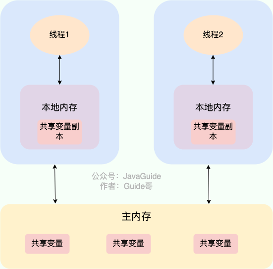
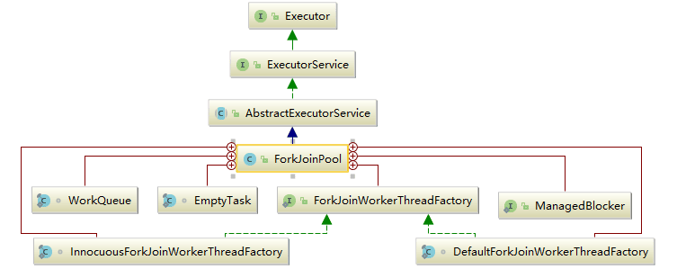

- [并发理论](#并发理论)
  - [并发功能](#并发功能)
  - [并发三大特性](#并发三大特性)
  - [JMM(Java Memory Model)](#jmmjava-memory-model)
    - [JMM  Overview](#jmm--overview)
    - [重排序](#重排序)
    - [volatile与内存屏障](#volatile与内存屏障)
  - [happens-before](#happens-before)
  - [as-if-serial](#as-if-serial)
- [线程基础](#线程基础)
  - [线程构造](#线程构造)
  - [线程操作](#线程操作)
    - [Interrupt/Stop](#interruptstop)
    - [start/run](#startrun)
    - [Thread.sleep()、Object.wait()、Condition.await()、LockSupport.park()](#threadsleepobjectwaitconditionawaitlocksupportpark)
    - [线程优先级](#线程优先级)
    - [yield()](#yield)
    - [join()](#join)
    - [InterruptedException/interrupted()](#interruptedexceptioninterrupted)
    - [wait() notify() notifyAll()组](#wait-notify-notifyall组)
    - [await() signal() signalAll()组](#await-signal-signalall组)
    - [Synchronized](#synchronized)
      - [使用方式](#使用方式)
      - [偏向锁](#偏向锁)
      - [轻量级锁（mutex）](#轻量级锁mutex)
      - [重量级锁​](#重量级锁)
  - [QA](#qa)
    - [Java是怎么解决并发问题的?](#java是怎么解决并发问题的)
    - [线程安全有哪些实现思路?](#线程安全有哪些实现思路)
    - [Synchronized使得同时只有一个线程可以执行，性能比较差，有什么提升的方法?](#synchronized使得同时只有一个线程可以执行性能比较差有什么提升的方法)
    - [Synchronized和Lock的对比，和选择?](#synchronized和lock的对比和选择)
- [J.U.C(java.util.concurrent)](#jucjavautilconcurrent)
  - [锁性质](#锁性质)
    - [乐观锁/悲观锁](#乐观锁悲观锁)
    - [自旋锁/自适应自旋锁](#自旋锁自适应自旋锁)
    - [公平/非公平锁](#公平非公平锁)
    - [互斥/共享锁](#互斥共享锁)
    - [可重入锁(递归锁)](#可重入锁递归锁)
  - [JUC原子类](#juc原子类)
    - [CAS (Compare-And-Swap)](#cas-compare-and-swap)
    - [Unsafe](#unsafe)
    - [Atomic类](#atomic类)
      - [原子基本类型](#原子基本类型)
      - [原子更新数组](#原子更新数组)
      - [原子更新引用类型](#原子更新引用类型)
      - [原子更新字段类](#原子更新字段类)
  - [JUC锁](#juc锁)
    - [LockSupport](#locksupport)
      - [park函数](#park函数)
      - [unpark函数](#unpark函数)
    - [AQS(AbstractQueuedSynchronizer)](#aqsabstractqueuedsynchronizer)
      - [AQScore](#aqscore)
      - [CLH](#clh)
      - [AQSNode](#aqsnode)
      - [Condition](#condition)
    - [ReentrantLock](#reentrantlock)
    - [ReadWriteReentrantLock](#readwritereentrantlock)
  - [JUC Collection](#juc-collection)
    - [concurrentHashMap](#concurrenthashmap)
    - [CopyOnWriteArrayList](#copyonwritearraylist)
    - [ConcurrentLinkedQueue](#concurrentlinkedqueue)
    - [BlockingQueue](#blockingqueue)
      - [BlockingQueue](#blockingqueue-1)
      - [BlockingDeque](#blockingdeque)
  - [ThreadPool](#threadpool)
    - [FutureTask](#futuretask)
    - [Executor框架](#executor框架)
    - [ThreadPoolExecutor](#threadpoolexecutor)
      - [线程池状态](#线程池状态)
      - [ThreadPoolExecutor参数](#threadpoolexecutor参数)
      - [线程池配置](#线程池配置)
      - [execute() / submit()](#execute--submit)
      - [shutdown()/shutdownNow()](#shutdownshutdownnow)
      - [isTerminated() / isShutdown()](#isterminated--isshutdown)
      - [任务处理Code](#任务处理code)
        - [任务执行](#任务执行)
        - [任务提交](#任务提交)
      - [内置线程池](#内置线程池)
        - [FixedThreadPool](#fixedthreadpool)
        - [SingleThreadExecutor](#singlethreadexecutor)
        - [CachedThreadPool](#cachedthreadpool)
        - [ScheduledThreadPool](#scheduledthreadpool)
        - [线程池如何实现动态修改](#线程池如何实现动态修改)
    - [ScheduledThreadPoolExecutor](#scheduledthreadpoolexecutor)
      - [内部类ScheduledFutureTask](#内部类scheduledfuturetask)
    - [Fork/Join框架](#forkjoin框架)
  - [JUC工具类](#juc工具类)
    - [CountDownLatch](#countdownlatch)
    - [CycliBarrier](#cyclibarrier)
    - [Semaphore](#semaphore)
  - [ThreadLocal](#threadlocal)
    - [ThreadLocal实现](#threadlocal实现)
    - [内存泄漏](#内存泄漏)
    - [ThreadLocal应用场景](#threadlocal应用场景)


# 并发理论
## 并发功能
CPU、内存、I/O 设备的速度是有极大差异的，为了合理利用 CPU 的高性能，平衡这三者的速度差异，计算机体系结构、操作系统、编译程序都做出了贡献，主要体现为:  
CPU 增加了缓存，以均衡与内存的速度差异；// 导致 可见性问题  
操作系统增加了进程、线程，以分时复用 CPU，进而均衡 CPU 与 I/O 设备的速度差异；// 导致 原子性问题    
编译程序优化指令执行次序，使得缓存能够得到更加合理地利用。// 导致 有序性问题  

## 并发三大特性

- 原子性
一次操作或者多次操作，要么所有的操作全部都得到执行并且不会受到任何因素的干扰而中断，要么都不执行。在 Java 中，可以借助synchronized、各种 Lock 以及各种原子类实现原子性。synchronized 和各种 Lock 可以保证任一时刻只有一个线程访问该代码块，因此可以保障原子性。各种原子类是利用 CAS (compare and swap) 操作（可能也会用到 volatile或者final关键字）来保证原子操作。
- 可见性
当一个线程对共享变量进行了修改，那么另外的线程都是立即可以看到修改后的最新值。在 Java 中，可以借助synchronized、volatile 以及各种 Lock 实现可见性。如果我们将变量声明为 volatile ，这就指示 JVM，这个变量是共享且不稳定的，每次使用它都到主存中进行读取。
- 有序性
由于指令重排序问题，代码的执行顺序未必就是编写代码时候的顺序。我们上面讲重排序的时候也提到过：指令重排序可以保证串行语义一致，但是没有义务保证多线程间的语义也一致 ，所以在多线程下，指令重排序可能会导致一些问题。在 Java 中，volatile 关键字可以禁止指令进行重排序优化。

## JMM(Java Memory Model)

### JMM  Overview
JMM 看作是 Java 定义的并发编程相关的一组规范，除了抽象了线程和主内存之间的关系之外，其还规定了从 Java 源代码到 CPU 可执行指令的这个转化过程要遵守哪些和并发相关的原则和规范，其主要目的是为了简化多线程编程，增强程序可移植性的。

Java 线程之间的通信由 JMM控制，JMM 决定一个线程对共享变量的写入何时对另一个线程可见。从抽象的角度来看，JMM 定义了线程和主内存之间的抽象关系：线程之间的共享变量存储在主内存（main memory）中，每个线程都有一个私有的本地内存（local memory），本地内存中存储了该线程以读 / 写共享变量的副本。本地内存是 JMM 的一个抽象概念，并不真实存在。它涵盖了缓存，写缓冲区，寄存器以及其他的硬件和编译器优化





JAVA是怎么解决并发问题: 
JMM本质上可以理解为，Java 内存模型规范了 JVM 如何提供按需禁用缓存和编译优化的方法。具体来说，这些方法包括：volatile、synchronized 和 final 三个关键字Happens-Before 规则

### 重排序

为了提升执行速度/性能，计算机在执行程序代码的时候，会对指令进行重排序。  
重排序分三种类型：  
- 编译器优化的重排序：编译器（包括 JVM、JIT 编译器等在不改变单线程程序语义的前提下，可以重新安排语句的执行顺序。
- 指令级并行的重排序：现代处理器采用了指令级并行技术（Instruction-Level Parallelism， ILP）来将多条指令重叠执行。如果不存在数据依赖性，处理器可以改变语句对应机器指令的执行顺序。
- 内存系统的重排序：由于处理器使用缓存和读 / 写缓冲区，这使得加载和存储操作看上去可能是在乱序执行。


Java 源代码会经历 编译器优化重排 —> 指令并行重排 —> 内存系统重排 的过程，最终才变成操作系统可执行的指令序列。指令重排序可以保证串行语义一致，但是没有义务保证多线程间的语义也一致 ，所以在多线程下，指令重排序可能会导致一些问题。  


`JMM 属于语言级的内存模型，它确保在不同的编译器和不同的处理器平台之上，通过禁止特定类型的编译器重排序和处理器重排序，为程序员提供一致的内存可见性保证。`


编译器和处理器的指令重排序的处理方式不一样。对于编译器，通过禁止特定类型的编译器重排序的方式来禁止重排序。对于处理器，通过插入内存屏障（Memory Barrier，或有时叫做内存栅栏，Memory Fence）的方式来禁止特定类型的处理器重排序。指令并行重排和内存系统重排都属于是处理器级别的指令重排序。  
内存屏障（Memory Barrier，或有时叫做内存栅栏，Memory Fence）是一种 CPU 指令，用来禁止处理器指令发生重排序（像屏障一样），从而保障指令执行的有序性。另外，为了达到屏障的效果，它也会使处理器写入、读取值之前，将主内存的值写入高速缓存，清空无效队列，从而保障变量的可见性。


### volatile与内存屏障
1. 当写一个volatile变量的时候，JMM会把该线程对应本地内存中的共享变量值刷新到主内存。​
2. 当读一个volatile变量时：JMM会把该线程对应的本地内存置为无效，线程接下来将从主内存中读取共享变量


| 是否能重排序 |  | 第二个操作||
| --- | --- |---|---
| 第一个操作  | 普通读写 | volatile读| volatile写 |
| 普通读写 |     |      | NO       |
| volatile读 | NO  | NO   | NO       |
| volatile写 |     | NO   | NO       | 


| 屏障类型   | 指令示例                   | 说明                                             |
| ---------- | -------------------------- | ------------------------------------------------ |
| LoadLoad   | Load1; LoadLoad; Load2      | 保证 Load1 的读取操作在 Load2 及后续读取操作之前执行 |
| StoreStore | Store1; StoreStore; Store2 | 在 Store2 及其后的写操作执行前，保证 Store1 的写操作已刷新到主内存 |
| LoadStore  | Load1; LoadStore; Store2    | 在 Store2 及其后的写操作执行前，保证 Load1 的读操作已读取结束 |
| StoreLoad  | Store1; StoreLoad; Load2    | 保证 load1 的写操作已刷新到主内存之后，load2 及其后的读操作才能执行 |


## happens-before

JSR-133 提出了 happens-before 的概念，通过这个概念来阐述操作之间的内存可见性。如果一个操作执行的结果需要对另一个操作可见，那么这两个操作之间必须存在 happens-before 关系。它避免程序员为了理解 JMM 提供的内存可见性保证而去学习复杂的重排序规则以及这些规则的具体实现。

happens-before规则
1. 程序顺序规则：一个线程内，按照代码顺序，书写在前面的操作 happens-before 于书写在后面的操作；
2. 解锁规则：解锁 happens-before 于加锁；
3. volatile 变量规则：对一个 volatile 变量的写操作 happens-before 于后面对这个 volatile 变量的读操作。说白了就是对 volatile 变量的写操作的结果对于发生于其后的任何操作都是可见的。
4. 传递规则：如果 A happens-before B，且 B happens-before C，那么 A happens-before C；
5. 线程启动规则：Thread 对象的 start()方法 happens-before 于此线程的每一个动作。
6. 线程启动规则：Thread 对象的结束先行发生于 join() 方法返回。
7. 线程中断规则：对线程 interrupt() 方法的调用先行发生于被中断线程的代码检测到中断事件的发生，可以通过 interrupted() 方法检测到是否有中断发生。
8. 线程结束规则：一个对象的初始化完成(构造函数执行结束)先行发生于它的 finalize() 方法的开始。

## as-if-serial
as-if-serial语义的意思指：不管怎么重排序（编译器和处理器为了提高并行度），（单线程）程序的执行结果不能被改变。


# 线程基础
## 线程构造

```
\\Runnable实现

public class RunnableThread implements Runnable {​
    @Override​  
    public void run() {​
    System.out.println('用实现Runnable接口实现线程');​
    }​
}​

public static void main(String[] args) { ​
    RunnableThread instance = new RunnableThread(); ​
    Thread thread = newThread(instance); ​
    thread.start(); ​
}
```
```
\\Callable实现

public class MyCallable implements Callable<Integer> { ​
    public Integer call() { ​
    return 123; ​
    } ​
}​

public static void main(String[] args) throws ExecutionException,InterruptedException { ​
    MyCallable mc = newMyCallable(); ​
    FutureTask<Integer> ft = new FutureTask<>(mc); ​
    Thread thread = new Thread(ft); ​
    thread.start();​
    System.out.println(ft.get()); ​
}
```
```
\\Thread继承

public class ExtendsThread extends Thread {​
    @Override​
    public void run() {​
    System.out.println('用Thread类实现线程');​
    }​
}​

public static void main(String[] args) {​
    MyThread mt = new MyThread();​
    mt.start();​
}
```
Runnable自 Java 1.0 以来一直存在，但Callable仅在 Java 1.5 中引入,目的就是为了来处理Runnable不支持的用例。Runnable 接口不会返回结果或抛出检查异常，但是 Callable 接口可以。所以，如果任务不需要返回结果或抛出异常推荐使用 Runnable 接口。


## 线程操作
### Interrupt/Stop

interrupted()：是静态方法，查看当前中断信号是true还是false并且清除中断信号。如果一个线程被中断了，第一次调用 interrupted 则返回 true，第二次和后面的就返回 false 了。​ 
isInterrupted()：是可以返回当前中断信号是true还是false，与interrupt最大的差别

interrupt():进行中断标记
```
\\interrupt检测
while (!Thread.currentThread().isInterrupted() && more work to do) {​
    do more work​ 
}
```
当调用线程的interrupt() 方法时，会抛出InterruptException异常。 阻塞中的那个方法抛出这个异常，通过代码捕获该异常，然后 break 跳出循环状态，从而让 我们有机会结束这个线程的执行。 通常很多人认为只要调用 interrupt 方法线程就会结束，实际上是错的，InterruptedException 异常之后通过 break 来跳出循环，才能正常结束 run 方法 。

程序中可以直接使用 thread.stop() 来强行终止线程，thread.stop() 调用之后，创建子线程的线程就会抛出 ThreadDeatherror 的错误，并且会释放子线程所持有的所有锁。一般任何进行加锁的代码块，都是为了保护数据的一致性，如果在调用thread.stop() 后导致了该线程所持有的所有锁的突然释放 ( 不可控制 ) ，那么被保护数据就有可能呈现不一致性，其他线程在使用这些被破坏的数据时，有可能导致一些很奇怪的应用程序错误。因此，并不推荐使用 stop 方法来终止线程。

### start/run
`start（）`方法来启动线程 ，真正实现了多线程运行。这时无需等待 run 方法体代码执行完毕， 可以直接继续执行下面的代码。   
通过调用 Thread 类的 `start()` 方法来启动一个线程， 这时此线程是处于 就绪状态 ， 并没有运行。   
方法 `run()` 称为线程体，它包含了要执行的这个线程的内容，线程就进入了运行状态，开始运行 run 函数当中的代码 。Run方法运行结束，此线程终止。然后 CPU 再调度其它线程。

### Thread.sleep()、Object.wait()、Condition.await()、LockSupport.park()
- `sleep( )`
  - 释放CPU，不释放对象锁
  - `Thread.sleep()`必须传入时间
  - 没法从外部唤醒，只能自己醒过来
  - Thread.sleep()方法声明上抛出了InterruptedException中断异常，所以调用者需要捕获这个异常或者再抛出

- `wait( )`  
  - 不释放CPU，释放对象锁
  - 当调用 `wait()` 方法的时候，线程会放弃对象锁 ，进入等待此对象的等待锁定池 ，只有针对此对象调用 `notify()` 方法后本线程才进入对象锁定池准备获取对象锁进入运行状态。
  - `Object.wait()`方法需要在synchronized块中执行
  - `Object.wait()`方法声明抛出了中断异常，调用者需要捕获或者再抛出；
  - `Object.wait()`不带超时的，需要另一个线程执行`notify()`来唤醒，但不一定继续执行后续内容；


- `Condition.await()`  
  - `Condition.await()`底层是调用`LockSupport.park()`来实现阻塞当前线程的。实际上，它在阻塞当前线程之前还干了两件事，一是把当前线程添加到条件队列中，二是“完全”释放锁，也就是让state状态变量变为0，然后才是调用LockSupport.park()阻塞当前线程。


- `LockSupport.park()`
  - 释放CPU，不释放对象锁
  - `LockSupport.park()`方法不需要捕获中断异常
  - `LockSupport.park()`不需要捕获中断异常；
  - `LockSupport.park()`不带超时的，需要另一个线程执行`unpark()`来唤醒，一定会继续执行后续内容；
  - 如果在park()之前执行了unpark(),线程不会被阻塞，直接跳过park()，继续执行后续内容
  - `park()/unpark()`底层的原理是“二元信号量”，你可以把它相像成只有一个许可证的Semaphore，只不过这个信号量在重复执行unpark()的时候也不会再增加许可证，最多只有一个许可证。

### 线程优先级
线程的优先级一般分为以下三种：

MIN_PRIORITY 最低优先级
MAX_PRIORITY 最高优先级
NOM_PRIORITY 常规优先级
```Java
t.setPriority(Thread.MIN_PRIORITY);  //通过使用setPriority方法来设定优先级
```
###  yield()
Thread.yield() 的调用声明了当前线程已经完成了生命周期中最重要的部分，可以切换给其它线程来执行。该方法只是对线程调度器的一个建议，而且也只是建议具有相同优先级的其它线程可以运行。

### join()
在线程中调用另一个线程的 join() 方法，会将当前线程挂起，而不是忙等待，直到目标线程结束。

### InterruptedException/interrupted()
通过调用一个线程的 interrupt() 来中断该线程，如果该线程处于阻塞、限期等待或者无限期等待状态，那么就会抛出 InterruptedException，从而提前结束该线程。但是不能中断 I/O 阻塞和 synchronized 锁阻塞。
```Java
public class InterruptExample {

    private static class MyThread1 extends Thread {
        @Override
        public void run() {
            try {
                Thread.sleep(2000);
                System.out.println("Thread run");
            } catch (InterruptedException e) {
                e.printStackTrace();
            }
        }
    }
}
public static void main(String[] args) throws InterruptedException {
    Thread thread1 = new MyThread1();
    thread1.start();
    thread1.interrupt();
    System.out.println("Main run");
}
```
如果一个线程的 run() 方法执行一个无限循环，并且没有执行 sleep() 等会抛出 InterruptedException 的操作，那么调用线程的 interrupt() 方法就无法使线程提前结束。但是调用 interrupt() 方法会设置线程的中断标记，此时调用 interrupted() 方法会返回 true。因此可以在循环体中使用 interrupted() 方法来判断线程是否处于中断状态，从而提前结束线程。
```Java
public class InterruptExample {

    private static class MyThread2 extends Thread {
        @Override
        public void run() {
            while (!interrupted()) {
                // ..
            }
            System.out.println("Thread end");
        }
    }
}
public static void main(String[] args) throws InterruptedException {
    Thread thread2 = new MyThread2();
    thread2.start();
    thread2.interrupt();
}
```

### wait() notify() notifyAll()组
调用 wait() 使得线程等待某个条件满足，线程在等待时会被挂起，当其他线程的运行使得这个条件满足时，其它线程会调用 notify() 或者 notifyAll() 来唤醒挂起的线程。它们都属于 Object 的一部分，而不属于 Thread。只能用在同步方法或者同步控制块中使用，否则会在运行时抛出 IllegalMonitorStateExeception。使用 wait() 挂起期间，线程会释放锁。这是因为，如果没有释放锁，那么其它线程就无法进入对象的同步方法或者同步控制块中，那么就无法执行 notify() 或者 notifyAll() 来唤醒挂起的线程，造成死锁。

### await() signal() signalAll()组
java.util.concurrent 类库中提供了 Condition 类来实现线程之间的协调，可以在 Condition 上调用 await() 方法使线程等待，其它线程调用 signal() 或 signalAll() 方法唤醒等待的线程。相比于 wait() 这种等待方式，await() 可以指定等待的条件，因此更加灵活。使用 Lock 来获取一个 Condition 对象。


### Synchronized 
 - 独占锁/悲观锁/可重入锁（monitor计数器）/非公平锁
 - 基于JVM实现

  [锁实现资料](https://ls8sck0zrg.feishu.cn/wiki/wikcnr3FO2zn6VuT1X0sZqn8ULc)  
  [锁实现资料2](https://ls8sck0zrg.feishu.cn/wiki/Kf2HwTqJViHsRikhAPwc6ICfngd)


 #### 使用方式
 - 锁实例
 - 锁代码块
 - 静态方法锁全局(静态方法的性质决定)
 - 锁class对象  `synchronized(SynchronizedObjectLock.class)`


 - 对于同步块的实现使用了monitorenter和monitorexit指令，而同步方法则是依靠方法修饰符上的ACC_SYNCHRONIZED来完成的。无论采用哪种方式，其本质是对一 个对象的监视器(monitor)进行获取，而这个获取过程是排他的，也就是同一时刻只能有一个 线程获取到由synchronized所保护对象的监视器。
 #### 偏向锁
 通过你会发现无锁、偏向锁的 “锁标志位” 都是 01，这是因为无锁、偏向锁是靠字段 “是否是偏向锁” 来区分的，0 代表没有启用偏向锁，1 代表启用偏向锁  

 偏向锁加锁：当一个线程A访问同步块并获取锁时，会在对象头和栈帧中的锁记录里存储锁偏向的线程ID，以后该线程在进入和退出 同步块时不需要进行CAS操作来加锁和解锁，只需简单地测试一下对象头的Mark Word里是否存储着指向当前线程A的偏向锁。如果测试成功，表示线程已经获得了锁。如果测试失败，则需 要再测试一下Mark Word中偏向锁的标识是否设置成1:如果设置了，则尝试使用CAS将对象头的偏向锁指向当前线程。如果没有设置，则 使用CAS竞争锁（即轻量级锁）

 偏向锁撤销：多线程通过CAS的方式来抢占。因为此时锁的状态是偏向锁的状态，当线程同时抢占，这时就要将偏向锁升级成轻量级锁，在升级轻量锁之前首先需要将标识ID删除

 #### 轻量级锁（mutex）
 轻量级锁加锁: 线程在执行同步块之前，JVM会先在当前线程的栈帧中创建用于存储锁记录的空间，并将对象头中的Mark Word复制到锁记录中，官方称为Displaced Mark Word。然后线程尝试使用CAS将对象头中的Mark Word替换为指向锁记录的指针。如果成功，当前线程获得锁，如果失败，表示其他线程竞争锁，当前线程便尝试使用自旋来获取锁。 

 轻量级锁解锁: 轻量级锁解锁时，会使用原子的CAS操作将Displaced Mark Word替换回到对象头。如果成功，则表示没有竞争发生。如果失败，表示当前锁存在竞争，锁就会膨胀成重量级锁。


 #### 重量级锁​ 
 线程加锁失败会进入阻塞状态，等待前驱获得线程的锁执行完之后唤醒。


## QA
### Java是怎么解决并发问题的?
JMM,JMM本质上可以理解为，Java 内存模型规范了 JVM 如何提供按需禁用缓存和编译优化的方法。具体来说，这些方法包括：volatile、synchronized 和 final 三个关键字Happens-Before 规则
### 线程安全有哪些实现思路?
1. 互斥同步
   synchronized 和 ReentrantLock。
2. 非阻塞同步
   互斥同步最主要的问题就是线程阻塞和唤醒所带来的性能问题，因此这种同步也称为阻塞同步。互斥同步属于一种悲观的并发策略，总是认为只要不去做正确的同步措施，那就肯定会出现问题。无论共享数据是否真的会出现竞争，它都要进行加锁(这里讨论的是概念模型，实际上虚拟机会优化掉很大一部分不必要的加锁)、用户态核心态转换、维护锁计数器和检查是否有被阻塞的线程需要唤醒等操作。CAS随着硬件指令集的发展，我们可以使用基于冲突检测的乐观并发策略: 先进行操作，如果没有其它线程争用共享数据，那操作就成功了，否则采取补偿措施(不断地重试，直到成功为止)。这种乐观的并发策略的许多实现都不需要将线程阻塞，因此这种同步操作称为非阻塞同步。乐观锁需要操作和冲突检测这两个步骤具备原子性，这里就不能再使用互斥同步来保证了，只能靠硬件来完成。硬件支持的原子性操作最典型的是: 比较并交换(Compare-and-Swap，CAS)。CAS 指令需要有 3 个操作数，分别是内存地址 V、旧的预期值 A 和新值 B。当执行操作时，只有当 V 的值等于 A，才将 V 的值更新为 B。AtomicIntegerJ.U.C 包里面的整数原子类 AtomicInteger，其中的 compareAndSet() 和 getAndIncrement() 等方法都使用了 Unsafe 类的 CAS 操作。
3. 无同步方案
   要保证线程安全，并不是一定就要进行同步。如果一个方法本来就不涉及共享数据，那它自然就无须任何同步措施去保证正确性。栈封闭多个线程访问同一个方法的局部变量时，不会出现线程安全问题，因为局部变量存储在虚拟机栈中，属于线程私有的。线程本地存储(Thread Local Storage)如果一段代码中所需要的数据必须与其他代码共享，那就看看这些共享数据的代码是否能保证在同一个线程中执行。如果能保证，我们就可以把共享数据的可见范围限制在同一个线程之内，这样，无须同步也能保证线程之间不出现数据争用的问题。
### Synchronized使得同时只有一个线程可以执行，性能比较差，有什么提升的方法?
锁粗化(Lock Coarsening)、锁消除(Lock Elimination)、轻量级锁(Lightweight Locking)、偏向锁(Biased Locking)、适应性自旋(Adaptive Spinning)
### Synchronized和Lock的对比，和选择?

存在层次上：
synchronized：Java的关键字，在JVM层面上处理锁的获取和释放。
Lock：是一个接口，具体实现类为ReentrantLock，在代码中需要显示地调用lock()和unlock()方法来获取和释放锁。

锁的释放：
synchronized：以获取锁的线程执行完同步代码或发生异常释放锁。
Lock：在finally中必须手动释放锁，否则可能导致死锁。

锁的获取：
synchronized：假设线程A获得锁，线程B等待。如果A线程阻塞，B线程会一直等待。
Lock：可以通过tryLock尝试获得锁，线程不用一直等待。同时，Lock有多种锁获取方式。

锁的释放（死锁）：
synchronized：在发生异常时会自动释放占有的锁，不会出现死锁。
Lock：发生异常时不会主动释放占有的锁，必须手动unlock来释放锁，可能引起死锁的发生。

锁的状态：
synchronized：无法判断锁的状态。
Lock：可以判断锁的类型，如可重入锁、可中断锁、公平锁等。

性能：
synchronized：适用于少量同步操作。
Lock：适用于大量同步操作，并能提高多个线程进行读操作的效率。在资源竞争不激烈的情况下，synchronized的性能优于ReentrantLock，但在资源竞争激烈的情况下，ReentrantLock的性能比synchronized更加稳定，且提供了更丰富的同步特性。

调度：
synchronized：使用Object对象本身的wait、notify、notifyAll调度机制。
Lock：可以使用Condition进行线程之间的调度。
用法：
synchronized：可以加在方法和代码块中，括号中表示需要锁的对象。
Lock：一般使用ReentrantLock类做为锁，在代码中需要显示地调用lock()和unlock()方法。

底层实现：
synchronized：底层在JVM层面使用指令码方式来控制锁的获取和释放。
Lock：底层使用CAS乐观锁，依赖AbstractQueuedSynchronizer类，通过Lock-Free（CAS）操作来控制锁的获取和释放。

# J.U.C(java.util.concurrent)

## 锁性质
 ### 乐观锁/悲观锁
 - 乐观锁认为读多写少，不上锁，在更新进行CAS

 - 悲观锁认为写多读少，读写均会上锁  
    Synchronized属于悲观锁

 ### 自旋锁/自适应自旋锁
   - 自旋锁  
      1. 未取到竞争资源时线程不进入阻塞挂起态，继续占用CPU进行自旋，避免内核态与用户态切换的损耗
      2. 持有锁的线程能在短期内释放时适用
      3. 一般会为自旋设定自旋最大等待时间
   
   - 适应自旋锁  
     自旋的时间不再固定了，而是由前一次在同一个锁上的自旋 时间及锁的拥有者的状态来决定的。如果在同一个锁对象上，自旋等待刚刚成功获取过锁，并且持有锁的线程正在运行中，那么JVM会认为该锁自旋获取到锁的可能性很大，会自动增加等待时间。比如增加到100此循环。相反，如果对于某个锁，自旋很少成功获取锁。那再以后要获取这个锁时将可能省略掉自旋过程，以避免浪费处理器资源。有了自适应自旋，JVM对程序的锁的状态预测会越来越准确，JVM也会越来越聪明。
  ### 公平/非公平锁
  ### 互斥/共享锁
  ### 可重入锁(递归锁)

## JUC原子类


 ### CAS (Compare-And-Swap)
 是一条CPU的原子指令，其作用是让CPU先进行比较两个值是否相等，然后原子地更新某个位置的值，经过调查发现，其实现方式是基于硬件平台的汇编指令，就是说CAS是靠硬件实现的，JVM只是封装了汇编调用，那些AtomicInteger类便是使用了这些封装后的接口。

Unsafe只提供了3种CAS方法：`compareAndSwapObject`、`compareAndSwapInt`和`compareAndSwapLong`。都是native方法

问题：
存在ABA问题、
循环时间长开销大、
只能保证一个共享变量的原子操作

### Unsafe
Unsafe是位于sun.misc包下的一个类，主要提供一些用于执行低级别、不安全操作的方法，如直接访问系统内存资源、自主管理内存资源等，这些方法在提升Java运行效率、增强Java语言底层资源操作能力方面起到了很大的作用。但由于Unsafe类使Java语言拥有了类似C语言指针一样操作内存空间的能力，这无疑也增加了程序发生相关指针问题的风险。在程序中过度、不正确使用Unsafe类会使得程序出错的概率变大，使得Java这种安全的语言变得不再“安全”，因此对Unsafe的使用一定要慎重。这个类尽管里面的方法都是 public 的，但是并没有办法使用它们，JDK API 文档也没有提供任何关于这个类的方法的解释。总而言之，对于 Unsafe 类的使用都是受限制的，只有授信的代码才能获得该类的实例，当然 JDK 库里面的类是可以随意使用的。


### Atomic类

#### 原子基本类型
AtomicBoolean: 原子更新布尔类型。  
AtomicInteger: 原子更新整型。  
AtomicLong: 原子更新长整型。  
```Java
public final int get()//获取当前的值
public final int getAndSet(int newValue)：//获取当前的值，并设置新的值
public final int getAndIncrement()//获取当前的值，并自增
public final int getAndDecrement()//获取当前的值，并自减
public final int getAndAdd(int delta)//获取当前的值，并加上预期的值
void lazySet(int newValue)// 最终会设置成newValue,使用lazySet设置值后，可能导致其他线程在之后的一小段时间内还是可以读到旧的值。
```

原子基本类型底层用的是volatile的变量和CAS来进行更改数据的。volatile保证线程的可见性，多线程并发时，一个线程修改数据，可以保证其它线程立马看到修改后的值CAS 保证数据更新的原子性

#### 原子更新数组
通过原子的方式更新数组里的某个元素，Atomic包提供了以下的3个类：  
AtomicIntegerArray: 原子更新整型数组里的元素。  
AtomicLongArray: 原子更新长整型数组里的元素。  
AtomicReferenceArray: 原子更新引用类型数组里的元素。

#### 原子更新引用类型
Atomic包提供了以下三个类：  
AtomicReference: 原子更新引用类型。  
AtomicStampedReference: 原子更新引用类型, 内部使用Pair来存储元素值及其版本号。  
AtomicMarkableReferce: 原子更新带有标记位的引用类型。

#### 原子更新字段类
Atomic包提供了四个类进行原子字段更新：  
AtomicIntegerFieldUpdater: 原子更新整型的字段的更新器。  
AtomicLongFieldUpdater: 原子更新长整型字段的更新器。  
AtomicReferenceFieldUpdater: 上面已经说过此处不在赘述。


## JUC锁
### LockSupport
LockSupport用来创建锁和其他同步类的基本线程阻塞原语。简而言之，当调用LockSupport.park时，表示当前线程将会等待，直至获得许可，当调用LockSupport.unpark时，必须把等待获得许可的线程作为参数进行传递，好让此线程继续运行。

#### park函数
阻塞线程，前禁用当前线程并且该线程在下列情况发生之前都会被阻塞: ① 调用unpark函数，释放该线程的许可。② 该线程被中断。③ 设置的时间到了。并且，当time为绝对时间时，isAbsolute为true，否则，isAbsolute为false。当time为0时，表示无限等待，直到unpark发生。unpark函数，释放线程的许可，即激活调用park后阻塞的线程。这个函数不是安全的，调用这个函数时要确保线程依旧存活。
#### unpark函数
此函数表示如果给定线程的许可尚不可用，则使其可用。如果线程在 park 上受阻塞，则它将解除其阻塞状态。否则，保证下一次调用 park 不会受阻塞。如果给定线程尚未启动，则无法保证此操作有任何效果。

### AQS(AbstractQueuedSynchronizer)
#### AQScore
AQS框架借助于两个类：Unsafe(提供CAS操作)和LockSupport(提供park/unpark操作)

AQS是一个用来构建锁和同步器的框架，使用AQS能简单且高效地构造出应用广泛的大量的同步器，比如`ReentrantLock`、`ReentrantReadWriteLock`、`Semaphore` 、`SynchronousQueue`、`FutureTask`等等皆是基于AQS的。当然，我们自己也能利用AQS非常轻松容易地构造出符合我们自己需求的同步器。

 AQS 核心：
 如果被请求的共享资源空闲，则将当前请求资源的线程设置为有效的工作线程，并且将共享资源设置为锁定状态。如果被请求的共享资源被占用，那么就需要一套线程阻塞等待以及被唤醒时锁分配的机制，这个机制 AQS 是基于 CLH 锁 （Craig, Landin, and Hagersten locks） 实现的。


#### CLH
CL队列是一个虚拟的双向队列(虚拟的双向队列即不存在队列实例，仅存在结点之间的关联关系)。AQS是将每条请求共享资源的线程封装成一个CLH锁队列的一个结点(Node)来实现锁的分配。其中Sync queue，即同步队列，是双向链表，包括head结点和tail结点，head结点主要用作后续的调度。而Condition queue不是必须的，其是一个单向链表，只有当使用Condition时，才会存在此单向链表。并且可能会有多个Condition queue。


#### AQSNode
每个线程被阻塞的线程都会被封装成一个Node结点，放入队列。每个节点包含了一个Thread类型的引用，并且每个节点都存在一个状态，具体状态如下。
- CANCELLED，值为1，表示当前的线程被取消。
- SIGNAL，值为-1，表示当前节点的后继节点包含的线程需要运行，需要进行unpark操作。
- CONDITION，值为-2，表示当前节点在等待condition，也就是在condition queue中。
- PROPAGATE，值为-3，表示当前场景下后续的acquireShared能够得以执行。值为0，表示当前节点在sync queue中，等待着获取锁


#### Condition
Condition定义了等待/通知两种类型的方法，当前线程调用这些方法时，需要提前获取到Condition对象关联的锁。Condition对象是由Lock对象（调用Lock对象的newCondition()方法）创建出来的，换句话说，Condition是依赖Lock对象的。


```Java
    Lock lock = new ReentrantLock();
    Condition condition = lock.newCondition();
    
    public void conditionWait() throws InterruptedException {
        lock.lock();
        try {
            condition.await();
        } finally {
            lock.unlock();
        }
    }
    public void conditionSignal() throws InterruptedException {
        lock.lock();
        try {
            condition.signal();
        } finally {
            lock.unlock();
        }
    }
```


 ### ReentrantLock
 基于AQS实现
 ```Java
class Reentrantlocks{
  int test=0;
  ReentrantLock relock=new ReentrantLock();
  public void test(){
    relock.lock();
    // dosomething
    relock.unlock();
  }
}
```


### ReadWriteReentrantLock
锁降级指的是写锁降级成为读锁。如果当前线程拥有写锁，然后将其释放，最后再获取读锁，这种分段完成的过程不能称之为锁降级。锁降级是指把持住(当前拥有的)写锁，再获取到读锁，随后释放(先前拥有的)写锁的过程。

ReentrantReadWriteLock底层读写状态如何设计的?  
高16位为读锁，低16位为写锁

读锁和写锁的最大数量是多少?  
2的16次方-1

本地线程计数器ThreadLocalHoldCounter是用来做什么的?  
本地线程计数器，与对象绑定（线程-》线程重入的次数


## JUC Collection
### concurrentHashMap

- JDK 1.7
  基于HashMap JDK1.7

  1. concurrencyLevel: 并行级别、并发数、`Segment` 数。默认是 16，也就是说 ConcurrentHashMap 有 16 个 `Segments`，所以理论上，这个时候，最多可以同时支持 16 个线程并发写，只要它们的操作分别分布在不同的 `Segment` 上。这个值可以在初始化的时候设置为其他值，但是一旦初始化以后，它是不可以扩容的。​
  2. initialCapacity: 初始容量，这个值指的是整个 ConcurrentHashMap 的初始容量，实际操作的时候需要平均分给每个 `Segment`。​
  3. loadFactor: `Segment` 数组不可以扩容，所以这个负载因子是给每个 `Segment` 内部使用的​
  4. 扩容是 segment 数组某个位置内部的数组 HashEntry<K,V>[] 进行扩容，扩容后，容量为原来的 2 倍
   
  

- JDK 1.8
  基于HashMap JDK1.8
  加锁则采用CAS和synchronized实现
  翻倍扩容，扩容后数组容量为原来的 2 倍
  

### CopyOnWriteArrayList
- 内核  
  从 JDK1.5 开始，Java 并发包里提供了使用 `CopyOnWrite` 机制实现的并发容器

  `CopyOnWrite`是指，当容器需要被修改的时候，不直接修改当前容器，而是先将当前容器进行 Copy，复制出一个新的容器，然后修改新的容器，完成修改之后，再将原容器的引用指向新的容器。这样就完成了整个修改过程。​

- 特点  
  读操作可以尽可能的快，而写即使慢一些也没关系：为了将读取的性能发挥到极致，CopyOnWriteArrayList 读取是完全不用加锁的，并且写入也不会阻塞读取操作，也就是说你可以在写入的同时进行读取。只有写入和写入之间需要进行同步，也就是不允许多个写入同时发生，所以会更慢一点。​

  读多写少：写入本身是会拷贝一份出来，会增加资源的消耗，同时多个写入之间需要进行同步，所以应该尽量的少。​

  迭代期间允许修改集合内容：ArrayList 在迭代期间如果修改集合的内容，会抛出 Concurrent-ModificationException 异常的，CopyOnWriteArrayList 的迭代器在迭代的时候，如果数组内容被修改了，CopyOnWriteArrayList 不会报 ConcurrentModificationException 的异常，因为迭代器使用的依然是旧数组，只不过迭代的内容可能已经过时了。​


- 缺点：​  
  内存占用问题：因为 `CopyOnWrite` 的写时复制机制，所以在进行写操作的时候，内存里会同时驻扎两个对象的内存，这一点会占用额外的内存空间。​

  数据一致性问题：由于 `CopyOnWrite` 容器的修改是先修改副本，所以这次修改对于其他线程来说，并不是实时能看到的，只有在修改完之后才能体现出来。如果你希望写入的的数据马上能被其他线程看到，`CopyOnWrite` 容器是不适用的。

### ConcurrentLinkedQueue

Java 提供的线程安全的 Queue 可以分为阻塞队列和非阻塞队列，其中阻塞队列的典型例子是 BlockingQueue，非阻塞队列的典型例子是 ConcurrentLinkedQueue，在实际应用中要根据实际需要选用阻塞队列或者非阻塞队列。 阻塞队列可以通过加锁来实现，非阻塞队列可以通过 CAS 操作实现。

ConcurrentLinkedQueue 算是在高并发环境中性能最好的队列了。它之所有能有很好的性能，是因为其内部复杂的实现。ConcurrentLinkedQueue 适合在对性能要求相对较高，同时对队列的读写存在多个线程同时进行的场景，即如果对队列加锁的成本较高则适合使用无锁的ConcurrentLinkedQueue 来替代
 

HOPS(延迟更新的策略)：
的设计通过上面对offer和poll方法的分析，我们发现tail和head是延迟更新的，两者更新触发时机为：  
tail更新触发时机：当tail指向的节点的下一个节点不为null的时候，会执行定位队列真正的队尾节点的操作，找到队尾节点后完成插入之后才会通过casTail进行tail更新；当tail指向的节点的下一个节点为null的时候，只插入节点不更新tail。  
head更新触发时机：当head指向的节点的item域为null的时候，会执行定位队列真正的队头节点的操作，找到队头节点后完成删除之后才会通过updateHead进行head更新；当head指向的节点的item域不为null的时候，只删除节点不更新head。  
在更新操作时，源码中会有注释为：hop two nodes at a time。所以这种延迟更新的策略就被叫做HOPS的大概原因是这个(猜的 😃)，从上面更新时的状态图可以看出，head和tail的更新是“跳着的”即中间总是间隔了一个。那么这样设计的意图是什么呢?如果让tail永远作为队列的队尾节点，实现的代码量会更少，而且逻辑更易懂。但是，这样做有一个缺点，如果大量的入队操作，每次都要执行CAS进行tail的更新，汇总起来对性能也会是大大的损耗。如果能减少CAS更新的操作，无疑可以大大提升入队的操作效率，所以doug lea大师每间隔1次(tail和队尾节点的距离为1)进行才利用CAS更新tail。对head的更新也是同样的道理，虽然，这样设计会多出在循环中定位队尾节点，但总体来说读的操作效率要远远高于写的性能，因此，多出来的在循环中定位尾节点的操作的性能损耗相对而言是很小的。

### BlockingQueue

- 阻塞队列的实现原理​   
  如果队列是空的，消费者会一直等待，当生产者添加元素时，消费者是如何知道当前队列有元素的呢?​ 使用通知模式实现。所谓通知模式，当消费者从空的队列获取元素时会阻塞住消费者，此时如果生产者放了一个元素进入队列，则需要通知阻塞住消费者当前有元素可取。同理当生产者往满的队列里添加元素时会阻塞住生产者，当消费者消费了一个队列中的元素后，会通知生产者当前队列可用。​ 
#### BlockingQueue
  | 操作类型 | 抛异常    | 返回特定值   | 阻塞    | 阻塞后等待超时                           | 
  | ----  | ------- | ------ | ------ | ----------------------------- | 
  | 插入 | add(o)  | offer(o)  | put(o) | offer(o, timeout, TimeUnit)    | 
  | 移出 | remove()| poll()    | take() | poll(timeout, timeunit)        | 
  | 检查 | element()| peek()   |        |                               |


1. ArrayBlockingQueue  
一个由数组结构组成的有界阻塞队列, 并发控制采用可重入锁 `ReentrantLock` ，不管是插入操作还是读取操作，都需要获取到锁才能进行操作。当队列容量满时，尝试将元素放入队列将导致操作阻塞;尝试从一个空队列中取一个元素也会同样阻塞。ArrayBlockingQueue 默认情况下不能保证线程访问队列的公平性，所谓公平性是指严格按照线程等待的绝对时间顺序，即最先等待的线程能够最先访问到 ArrayBlockingQueue。而非公平性则是指访问 ArrayBlockingQueue 的顺序不是遵守严格的时间顺序，有可能存在，当 ArrayBlockingQueue 可以被访问时，长时间阻塞的线程依然无法访问到 ArrayBlockingQueue。如果保证公平性，通常会降低吞吐量。ArrayBlockingQueue使用了Condition来实现。

2. LinkedBlockingQueue  
基于单向链表实现的阻塞队列，可以当做无界队列也可以当做有界队列来使用，同样满足 FIFO 的特性，与 ArrayBlockingQueue 相比起来具有更高的吞吐量，为了防止 LinkedBlockingQueue 容量迅速增，损耗大量内存。通常在创建 LinkedBlockingQueue 对象时，会指定其大小，如果未指定，容量等于 `Integer.MAX_VALUE`

3. PriorityBlockingQueue  
一个支持优先级排序的无界阻塞队列。 默认情况下元素采取自然顺序 升序排列。也可以自定义类实现compareTo()方法来指定元素排序规则。​ 

4. PriorityBlockingQueue 是一个支持优先级的无界阻塞队列。默认情况下元素采用自然顺序进行排序，也可以通过自定义类实现 `compareTo()` 方法来指定元素排序规则，或者初始化时通过构造器参数 `Comparator` 来指定排序规则。PriorityBlockingQueue 并发控制采用的是可重入锁 `ReentrantLock`，队列为无界队列。简单地说，它就是 PriorityQueue 的线程安全版本。不可以插入 null 值，同时，插入队列的对象必须是可比较大小的（comparable），否则报 ClassCastException 异常。它的插入操作 put 方法不会 block，因为它是无界队列（take 方法在队列为空的时候会阻塞）。

>不需要了解
5. DelayQueue  
一个使用优先级队列实现的无界阻塞队列。 队列使用PriorityQueue来实现。队 列中的元素必须实现Delayed接口，在创建元素时可以指定多久才能从队列中获取当前元素。 只有在延迟期满时才能从队列中提取元素。（常用在缓存有效期，定时任务调度等场景）​ 

6. SynchronousQueue
一个不存储元素的阻塞队列。每一个put操作必须等待一个take操作， 否则不能继续添加元素。队列本身并不存储任何元素，非常适合传递性场景。
   
7. LinkedTransferQueue
一个由链表结构组成的无界阻塞队列。 ​ 

8. LinkedBlockingDeque
一个由链表结构组成的双向阻塞队列。所谓双向队列指的是可以 从队列的两端插入和移出元素。相比其他的阻塞队列，LinkedBlockingDeque多了addFirst、 addLast、offer-First、offerLast、peekFirst和peekLast等方法。双向阻塞队列可以 运用在“工作窃取”模式中​ ​ 


#### BlockingDeque

| 队首操作 | 抛出异常 | 返回特定值 | 阻塞 | 阻塞后等待超时 |
| --- | --- | --- | --- | --- |
| 插入对象 | addFirst(o) | offerFirst(o) | putFirst(o) | offerFirst(o, timeout, timeunit) |
| 移除对象 | removeFirst(o) | pollFirst() | takeFirst() | pollFirst(timeout, timeunit) |
| 检查对象存在 | getFirst() | peekFirst() |  |  |

| 队尾操作 | 抛出异常 | 返回特定值 | 阻塞 | 阻塞后等待超时 |
| --- | --- | --- | --- | --- |
| 插入对象 | addLast(o) | offerLast(o) | putLast(o) | offerLast(o, timeout, timeunit) |
| 移除对象 | removeLast(o) | pollLast() | takeLast() | pollLast(timeout, timeunit) |
| 检查对象存在 | getLast() | peekLast() |  |  |


## ThreadPool
线程池就是管理一系列线程的资源池，其提供了一种限制和管理线程资源的方式。每个线程池还维护一些基本统计信息，例如已完成任务的数量。
- 降低资源消耗。通过重复利用已创建的线程降低线程创建和销毁造成的消耗。
- 提高响应速度。当任务到达时，任务可以不需要等到线程创建就能立即执行。
- 提高线程的可管理性。线程是稀缺资源，如果无限制的创建，不仅会消耗系统资源，还会降低系统的稳定性，使用线程池可以进行统一的分配，调优和监控。
### FutureTask
FutureTask 为 Future 提供了基础实现，如获取任务执行结果(get)和取消任务(cancel)等。如果任务尚未完成，获取任务执行结果时将会阻塞。一旦执行结束，任务就不能被重启或取消(除非使用runAndReset执行计算)。FutureTask 常用来封装 Callable 和 Runnable，也可以作为一个任务提交到线程池中执行。除了作为一个独立的类之外，此类也提供了一些功能性函数供我们创建自定义 task 类使用。FutureTask 的线程安全由CAS来保证。


```Java
//Future Task核心属性
//内部持有的callable任务，运行完毕后置空
private Callable<V> callable;

//从get()中返回的结果或抛出的异常
private Object outcome; // non-volatile, protected by state reads/writes

//运行callable的线程
private volatile Thread runner;

//使用Treiber栈保存等待线程
private volatile WaitNode waiters;

//任务状态
private volatile int state;
private static final int NEW          = 0;
private static final int COMPLETING   = 1;
private static final int NORMAL       = 2;
private static final int EXCEPTIONAL  = 3;
private static final int CANCELLED    = 4;
private static final int INTERRUPTING = 5;
private static final int INTERRUPTED  = 6;
```


CompletableFuture类的不同状态表示任务执行的不同状态，并且状态之间有着特定的转换关系。下面进行一些更为细致的说明。

- NEW  
NEW状态表示任务是一个新任务或者还未被执行完的任务，是任务的初始状态。处于该状态下的任务等待着执行。

- COMPLETING
当任务执行完成或者执行过程中出现异常但是还没有保存在outcome字段中时，状态会从NEW转换为COMPLETING。COMPLETING是一个中间状态，任务在该状态下等待着最终状态的到来。

- NORMAL
当任务正常执行完成并且任务执行结果已经保存在outcome字段中时，状态会从COMPLETING转换为NORMAL。NORMAL是任务的一个最终状态，任务成功执行并返回了正确的结果。

- EXCEPTIONAL
当任务执行过程中出现了异常，并且异常原因已经保存在outcome字段中时，状态会从COMPLETING转换为EXCEPTIONAL。EXCEPTIONAL是任务的一个最终状态，任务执行过程中出现了异常并保存了异常原因。

- CANCELLED
如果用户取消一个任务，并且这个任务还没有开始执行或者正在执行但是还没有执行完成，那么状态会从NEW转换为CANCELLED。CANCELLED是任务的一个最终状态，任务被取消了，可能没有被执行完成。

- INTERRUPTING
当用户调用cancel(true)方法并要求中断任务执行线程但是还没有中断任务执行线程之前，状态会从NEW转变为INTERRUPTING。INTERRUPTING是任务的中间状态，该状态下任务可能正在执行中但是还没有被中断。

- INTERRUPTED
当调用interrupt()中断任务执行线程之后，任务状态会从INTERRUPTING转换为INTERRUPTED。INTERRUPTED是任务的一个最终状态，在该状态下，任务执行线程已经被中断，任务无法继续执行。


```Java
public interface Future<V> {
    boolean cancel(boolean mayInterruptIfRunning);
    boolean isCancelled();
    boolean isDone();
    V get() throws InterruptedException, ExecutionException;
    V get(long timeout, TimeUnit unit)
        throws InterruptedException, ExecutionException, TimeoutException;
}
```


### Executor框架
- 任务Callable/Runable
- 任务执行Executor  
  包括任务执行机制的核心接口 Executor ，以及继承自 Executor 接口的 ExecutorService 接口。ThreadPoolExecutor 和 ScheduledThreadPoolExecutor 这两个关键类实现了 ExecutorService 接口。
- 异步计算结果
  Future 接口以及 Future 接口的实现类 FutureTask 类都可以代表异步计算的结果。


### ThreadPoolExecutor


#### 线程池状态


RUNNING: -1 << COUNT_BITS，即高3位为111，该状态的线程池会接收新任务，并处理阻塞队列中的任务；  
SHUTDOWN: 0 << COUNT_BITS，即高3位为000，该状态的线程池不会接收新任务，但会处理阻塞队列中的任务；  
STOP : 1 << COUNT_BITS，即高3位为001，该状态的线程不会接收新任务，也不会处理阻塞队列中的任务，而且会中断正在运行的任务；  
TIDYING : 2 << COUNT_BITS，即高3位为010, 所有的任务都已经终止；  
TERMINATED: 3 << COUNT_BITS，即高3位为011, terminated()方法已经执行完成。

[详细内容](https://www.pdai.tech/md/java/thread/java-thread-x-juc-executor-ThreadPoolExecutor.html#%E5%87%A0%E4%B8%AA%E5%85%B3%E9%94%AE%E5%B1%9E%E6%80%A7)


#### ThreadPoolExecutor参数

```Java
//ThreadPoolExecutor参数
public ThreadPoolExecutor(int corePoolSize,
                              int maximumPoolSize,
                              long keepAliveTime,
                              TimeUnit unit,
                              BlockingQueue<Runnable> workQueue,
                              RejectedExecutionHandler handler)

```


ThreadPoolExecutor是Java线程池框架的核心实现类，其主要由以下组件构成：

1. corePoolSize：线程池的基本大小，即线程池中最少的线程数量。当提交一个任务到线程池时，线程池会创建一个线程来执行任务，即使其他空闲的基本线程能够执行新任务也会创建线程。直到需要执行的任务数大于线程池基本大小时，就不再创建线程。如果调用了线程池的prestartAllCoreThreads()方法，线程池会提前创建并启动所有基本线程。

2. blockingQueue：用于保存等待执行的任务的阻塞队列。可以选择以下几个阻塞队列：
   - `ArrayBlockingQueue`：是一个基于数组结构的有界阻塞队列，此队列按FIFO原则对元素进行排序。  
   - `LinkedBlockingQueue（无界队列）`：FixedThreadPool 和 SingleThreadExector。一个基于链表结构的阻塞队列，此队列按FIFO排序元素，吞吐量通常要高于ArrayBlockingQueue。静态工厂方法Executors.newFixedThreadPool()使用了这个队列。
   - `SynchronousQueue（同步队列）`：CachedThreadPool 。SynchronousQueue 没有容量，不存储元素，目的是保证对于提交的任务，如果有空闲线程，则使用空闲线程来处理；否则新建一个线程来处理任务。也就是说，CachedThreadPool 的最大线程数是 Integer.MAX_VALUE ，可以理解为线程数是可以无限扩展的，可能会创建大量线程，从而导致 OOM。
   - PriorityBlockingQueue：一个具有优先级的无限阻塞队列。
   - `SynchronousQueueDelayedWorkQueue（延迟阻塞队列）`：ScheduledThreadPool 和 SingleThreadScheduledExecutor 。DelayedWorkQueue 的内部元素并不是按照放入的时间排序，而是会按照延迟的时间长短对任务进行排序，内部采用的是“堆”的数据结构，可以保证每次出队的任务都是当前队列中执行时间最靠前的。DelayedWorkQueue 添加元素满了之后会自动扩容原来容量的 1/2，即永远不会阻塞，最大扩容可达 Integer.MAX_VALUE，所以最多只能创建核心线程数的线程。

3. `maximumPoolSize`：线程池允许创建的最大线程数。如果队列满了，并且已创建的线程数小于最大线程数，则线程池会再创建新的线程执行任务。值得注意的是，如果使用了无界的任务队列这个参数就没什么效果。

4. `RejectedExecutionHandler`：当队列和线程池都满了，说明线程池处于饱和状态，那么必须采取一种策略处理提交的新任务。这个策略默认情况下是AbortPolicy，表示无法处理新任务时抛出异常。Java线程池框架提供以下4种策略：
   - `DiscardOldestPolicy`：丢弃队列里最近的一个任务，并执行当前任务。
   - `DiscardPolicy`：不处理，直接丢弃。也可以根据应用场景需要自定义ThreadPoolExecutor.
   - `AbortPolicy`：抛出 RejectedExecutionException来拒绝新任务的处理。
   - `CallerRunsPolicy`：调用执行自己的线程运行任务，也就是直接在调用execute方法的线程中运行(run)被拒绝的任务，如果执行程序已关闭，则会丢弃该任务。因此这种策略会降低对于新任务提交速度，影响程序的整体性能。如果您的应用程序可以承受此延迟并且你要求任何一个任务请求都要被执行的话，你可以选择这个策略。

5. `keepAliveTime`：线程活动保持时间，即线程池的工作线程空闲后，保持存活的时间。如果任务很多，并且每个任务执行的时间比较短，可以调大时间，提高线程的利用率。

6. `TimeUnit`：线程活动保持时间的单位，可选的单位有天(DAYS)、小时(HOURS)、分钟(MINUTES)、毫秒(MILLISECONDS)、微秒(MICROSECONDS，千分之一毫秒)和纳秒(NANOSECONDS，千分之一微秒)。
  
  [运行演示](http://www.donghuasuanfa.com/jvm/threadPool/threadPoolPortal)

```Java
public class ThreadPoolExecutorDemo {

    private static final int CORE_POOL_SIZE = 5;
    private static final int MAX_POOL_SIZE = 10;
    private static final int QUEUE_CAPACITY = 100;
    private static final Long KEEP_ALIVE_TIME = 1L;
    public static void main(String[] args) {

        //使用阿里巴巴推荐的创建线程池的方式
        //通过ThreadPoolExecutor构造函数自定义参数创建
        ThreadPoolExecutor executor = new ThreadPoolExecutor(
                CORE_POOL_SIZE,
                MAX_POOL_SIZE,
                KEEP_ALIVE_TIME,
                TimeUnit.SECONDS,
                new ArrayBlockingQueue<>(QUEUE_CAPACITY),
                new ThreadPoolExecutor.CallerRunsPolicy());

        for (int i = 0; i < 10; i++) {
            //创建WorkerThread对象（WorkerThread类实现了Runnable 接口）
            Runnable worker = new MyRunnable("" + i);
            //执行Runnable
            executor.execute(worker);
        }
        //终止线程池
        executor.shutdown();
        while (!executor.isTerminated()) {
        }
        System.out.println("Finished all threads");
    }
}
```
#### 线程池配置
CPU 密集型任务(N+1)： 这种任务消耗的主要是 CPU 资源，可以将线程数设置为 N（CPU 核心数）+1。比 CPU 核心数多出来的一个线程是为了防止线程偶发的缺页中断，或者其它原因导致的任务暂停而带来的影响。一旦任务暂停，CPU 就会处于空闲状态，而在这种情况下多出来的一个线程就可以充分利用 CPU 的空闲时间。I/O 密集型任务(2N)： 这种任务应用起来，系统会用大部分的时间来处理 I/O 交互，而线程在处理 I/O 的时间段内不会占用 CPU 来处理，这时就可以将 CPU 交出给其它线程使用。因此在 I/O 密集型任务的应用中，我们可以多配置一些线程，具体的计算方法是 2N。

#### execute() / submit()
 execute()方法用于提交不需要返回值的任务，所以无法判断任务是否被线程池执行成功与否；submit()方法用于提交需要返回值的任务。线程池会返回一个 Future 类型的对象，通过这个 Future 对象可以判断任务是否执行成功，并且可以通过 Future 的 get()方法来获取返回值，get()方法会阻塞当前线程直到任务完成，而使用 get（long timeout，TimeUnit unit）方法的话，如果在 timeout 时间内任务还没有执行完，就会抛出 java.util.concurrent.TimeoutException。

#### shutdown()/shutdownNow()
 shutdown（） :关闭线程池，线程池的状态变为 SHUTDOWN。线程池不再接受新任务了，但是队列里的任务得执行完毕。shutdownNow（） :关闭线程池，线程池的状态变为 STOP。线程池会终止当前正在运行的任务，并停止处理排队的任务并返回正在等待执行的 List。
#### isTerminated() / isShutdown()
isShutDown 当调用 shutdown() 方法后返回为 true。isTerminated 当调用 shutdown() 方法后，并且所有提交的任务完成后返回为 true

#### 任务处理Code
##### 任务执行
[execute –> addWorker –>runworker (getTask)](https://www.pdai.tech/md/java/thread/java-thread-x-juc-executor-ThreadPoolExecutor.html#%E4%BB%BB%E5%8A%A1%E7%9A%84%E6%89%A7%E8%A1%8C)

##### 任务提交

[](https://www.pdai.tech/md/java/thread/java-thread-x-juc-executor-ThreadPoolExecutor.html#%E4%BB%BB%E5%8A%A1%E7%9A%84%E6%8F%90%E4%BA%A4)


#### 内置线程池
##### FixedThreadPool
FixedThreadPool的corePoolSize和maximumPoolSize都被设置为创建FixedThreadPool时指定的参数nThreads。​ 当线程池中的线程数大于corePoolSize时，keepAliveTime为多余的空闲线程等待新任务的最长时间，超过这个时间后多余的线程将被终止。这里把keepAliveTime设置为0L，意味着多余的空闲线程会被立即终止。
```Java
public static ExecutorService newFixedThreadPool(int nThreads) {
    return new ThreadPoolExecutor(nThreads, nThreads, 0L, TimeUnit.MILLISECONDS, new LinkedBlockingQueue<Runnable>());
}
```

##### SingleThreadExecutor
SingleThreadExecutor的corePoolSize和maximumPoolSize被设置为1。其他参数与FixedThreadPool相同。SingleThreadExecutor使用无界队列LinkedBlockingQueue作为线程池的工作队列(队列的容量为Integer.MAX_VALUE)。SingleThreadExecutor使用无界队列作为工作队列 对线程池带来的影响与FixedThreadPool相同。
``` Java
public static ExecutorService newSingleThreadExecutor() {
    return new FinalizableDelegatedExecutorService(new ThreadPoolExecutor(1, 1, 0L, TimeUnit.MILLISECONDS, new LinkedBlockingQueue<Runnable>()));
}
```

##### CachedThreadPool
CachedThreadPool的corePoolSize被设置为0，即corePool为空;maximumPoolSize被设置为Integer.MAX_VALUE，即maximumPool是无界的。这里把keepAliveTime设置为60L，意味着CachedThreadPool中的空闲线程等待新任务的最长时间为60秒，空闲线程超过60秒后将会被终止。​ CachedThreadPool使用没有容量的SynchronousQueue作为线程池的工作队列，但CachedThreadPool的maximumPool是无界的。这意味着，如果主线程提交任务的速度高于maximumPool中线程处理任务的速度时，CachedThreadPool会不断创建新线程。极端情况下， CachedThreadPool会因为创建过多线程而耗尽CPU和内存资源。
```Java
public static ExecutorService newCachedThreadPool() {
    return new ThreadPoolExecutor(0, Integer.MAX_VALUE, 60L, TimeUnit.SECONDS, new SynchronousQueue<Runnable>());
}
```

##### ScheduledThreadPool
ScheduledThreadPool 是通过 ScheduledThreadPoolExecutor 创建的，使用的DelayedWorkQueue（延迟阻塞队列）作为线程池的任务队列。 DelayedWorkQueue 的内部元素并不是按照放入的时间排序，而是会按照延迟的时间长短对任务进行排序，内部采用的是“堆”的数据结构，可以保证每次出队的任务都是当前队列中执行时间最靠前的。DelayedWorkQueue 添加元素满了之后会自动扩容原来容量的 1/2，即永远不会阻塞，最大扩容可达 Integer.MAX_VALUE，所以最多只能创建核心线程数的线程。
```Java
public static ScheduledExecutorService newScheduledThreadPool(int corePoolSize) {
    return new ScheduledThreadPoolExecutor(corePoolSize);
}
public ScheduledThreadPoolExecutor(int corePoolSize) {
    super(corePoolSize, Integer.MAX_VALUE, 0, NANOSECONDS,
          new DelayedWorkQueue());
}
```
##### 线程池如何实现动态修改
1. 首先线程池提供了部分setter方法可以设置线程池的参数；​ a. 修改核心线程数，最大线程数，空闲线程停留时间，拒绝策略等。​ b. 可以将线程池的配置参数放入配置中心，当需要调整的时候，去配置中心修改就行。​ 
2. 什么时候修改呢？​ a. 这里需要监控报警策略，获取线程池状态指标，当指标判定为异常之后进行报警​ b. 分析指标异常原因，评估处理策略，最后通过上述线程池提供的接口进行动态修改。（可以将动态配置）


### ScheduledThreadPoolExecutor


#### 内部类ScheduledFutureTask
```Java
//为相同延时任务提供的顺序编号
private final long sequenceNumber;
//任务可以执行的时间，纳秒级
private long time;
//重复任务的执行周期时间，纳秒级。
private final long period;
//重新入队的任务
RunnableScheduledFuture<V> outerTask = this;
//延迟队列的索引，以支持更快的取消操作
int heapIndex;
```
sequenceNumber: 当两个任务有相同的延迟时间时，按照 FIFO 的顺序入队。  sequenceNumber 就是为相同延时任务提供的顺序编号。  
time: 任务可以执行时的时间，纳秒级，通过triggerTime方法计算得出。  
period: 任务的执行周期时间，纳秒级。正数表示固定速率执行(为scheduleAtFixedRate提供服务)，负数表示固定延迟执行(为scheduleWithFixedDelay提供服务)，0表示不重复任务。  
outerTask: 重新入队的任务，通过reExecutePeriodic方法入队重新排序。

### Fork/Join框架




核心思想: work-stealing(工作窃取)算法;work-stealing(工作窃取)算法: 线程池内的所有工作线程都尝试找到并执行已经提交的任务，或者是被其他活动任务创建的子任务(如果不存在就阻塞等待)。这种特性使得 ForkJoinPool 在运行多个可以产生子任务的任务，或者是提交的许多小任务时效率更高。尤其是构建异步模型的 ForkJoinPool 时，对不需要合并(join)的事件类型任务也非常适用。
```Java
public class Test {
	static final class SumTask extends RecursiveTask<Integer> {
		private static final long serialVersionUID = 1L;
		
		final int start; //开始计算的数
		final int end; //最后计算的数
		
		SumTask(int start, int end) {
			this.start = start;
			this.end = end;
		}

		@Override
		protected Integer compute() {
			//如果计算量小于1000，那么分配一个线程执行if中的代码块，并返回执行结果
			if(end - start < 1000) {
				System.out.println(Thread.currentThread().getName() + " 开始执行: " + start + "-" + end);
				int sum = 0;
				for(int i = start; i <= end; i++)
					sum += i;
				return sum;
			}
			//如果计算量大于1000，那么拆分为两个任务
			SumTask task1 = new SumTask(start, (start + end) / 2);
			SumTask task2 = new SumTask((start + end) / 2 + 1, end);
			//执行任务
			task1.fork();
			task2.fork();
			//获取任务执行的结果
			return task1.join() + task2.join();
		}
	}
	
	public static void main(String[] args) throws InterruptedException, ExecutionException {
		ForkJoinPool pool = new ForkJoinPool();
		ForkJoinTask<Integer> task = new SumTask(1, 10000);
		pool.submit(task);
		System.out.println(task.get());
	}
}
// 执行结果
ForkJoinPool-1-worker-1 开始执行: 1-625
ForkJoinPool-1-worker-7 开始执行: 6251-6875
ForkJoinPool-1-worker-6 开始执行: 5626-6250
ForkJoinPool-1-worker-10 开始执行: 3751-4375
ForkJoinPool-1-worker-13 开始执行: 2501-3125
ForkJoinPool-1-worker-8 开始执行: 626-1250
ForkJoinPool-1-worker-11 开始执行: 5001-5625
ForkJoinPool-1-worker-3 开始执行: 7501-8125
ForkJoinPool-1-worker-14 开始执行: 1251-1875
ForkJoinPool-1-worker-4 开始执行: 9376-10000
ForkJoinPool-1-worker-8 开始执行: 8126-8750
ForkJoinPool-1-worker-0 开始执行: 1876-2500
ForkJoinPool-1-worker-12 开始执行: 4376-5000
ForkJoinPool-1-worker-5 开始执行: 8751-9375
ForkJoinPool-1-worker-7 开始执行: 6876-7500
ForkJoinPool-1-worker-1 开始执行: 3126-3750
50005000
```

## JUC工具类

### CountDownLatch
CountDownLatch 是共享锁的一种实现,它默认构造 AQS 的 state 值为 count
CountDownLatch 允许 count 个线程阻塞在一个地方，直至所有线程的任务都执行完毕。CountDownLatch 是一次性的，计数器的值只能在构造方法中初始化一次，之后没有任何机制再次对其设置值，当 CountDownLatch 使用完毕后，它不能再次被使用。

```Java
class MyThread extends Thread {
    private CountDownLatch countDownLatch;
    
    public MyThread(String name, CountDownLatch countDownLatch) {
        super(name);
        this.countDownLatch = countDownLatch;
    }
    
    public void run() {
        System.out.println(Thread.currentThread().getName() + " doing something");
        try {
            Thread.sleep(1000);
        } catch (InterruptedException e) {
            e.printStackTrace();
        }
        System.out.println(Thread.currentThread().getName() + " finish");
        countDownLatch.countDown();
    }
}

public class CountDownLatchDemo {
    public static void main(String[] args) {
        CountDownLatch countDownLatch = new CountDownLatch(2);
        MyThread t1 = new MyThread("t1", countDownLatch);
        MyThread t2 = new MyThread("t2", countDownLatch);
        t1.start();
        t2.start();
        System.out.println("Waiting for t1 thread and t2 thread to finish");
        try {
            countDownLatch.await();
        } catch (InterruptedException e) {
            e.printStackTrace();
        }            
        System.out.println(Thread.currentThread().getName() + " continue");        
    }
}

//运行结果
运行结果(某一次):Waiting for t1 thread and t2 thread to finish
t1 doing something
t2 doing something
t1 finish
t2 finish
main continue
```


### CycliBarrier
CycliBarrier 是基于 ReentrantLock和 Condition 的。
CyclicBarrier 的字面意思是可循环使用（Cyclic）的屏障（Barrier）。它要做的事情是：让一组线程到达一个屏障（也可以叫同步点）时被阻塞，直到最后一个线程到达屏障时，屏障才会开门，所有被屏障拦截的线程才会继续干活。

```Java
class MyThread extends Thread {
    private CyclicBarrier cb;
    public MyThread(String name, CyclicBarrier cb) {
        super(name);
        this.cb = cb;
    }
    
    public void run() {
        System.out.println(Thread.currentThread().getName() + " going to await");
        try {
            cb.await();
            System.out.println(Thread.currentThread().getName() + " continue");
        } catch (Exception e) {
            e.printStackTrace();
        }
    }
}
public class CyclicBarrierDemo {
    public static void main(String[] args) throws InterruptedException, BrokenBarrierException {
        CyclicBarrier cb = new CyclicBarrier(3, new Thread("barrierAction") {
            public void run() {
                System.out.println(Thread.currentThread().getName() + " barrier action");
            }
        });
        MyThread t1 = new MyThread("t1", cb);
        MyThread t2 = new MyThread("t2", cb);
        t1.start();
        t2.start();
        System.out.println(Thread.currentThread().getName() + " going to await");
        cb.await();
        System.out.println(Thread.currentThread().getName() + " continue");

    }
}

//运行结果(某一次)
t1 going to await
main going to await
t2 going to await
t2 barrier action
t2 continue
t1 continue
main continue
```
### Semaphore
Semaphore(信号量)可以用来控制同时访问特定资源的线程数量。共享锁的一种实现，它默认构造 AQS 的 state 值为 permits，你可以将 permits 的值理解为许可证的数量，只有拿到许可证的线程才能执行。调用semaphore.acquire() ，线程尝试获取许可证，如果 state >= 0 的话，则表示可以获取成功。如果获取成功的话，使用 CAS 操作去修改 state 的值 state=state-1。如果 state<0 的话，则表示许可证数量不足。此时会创建一个 Node 节点加入阻塞队列，挂起当前线程。

公平模式(默认)： 调用 acquire() 方法的顺序就是获取许可证的顺序，遵循 FIFO；
非公平模式： 抢占式
```Java
class MyThread extends Thread {
    private Semaphore semaphore;
    
    public MyThread(String name, Semaphore semaphore) {
        super(name);
        this.semaphore = semaphore;
    }
    
    public void run() {        
        int count = 3;
        System.out.println(Thread.currentThread().getName() + " trying to acquire");
        try {
            semaphore.acquire(count);
            System.out.println(Thread.currentThread().getName() + " acquire successfully");
            Thread.sleep(1000);
        } catch (InterruptedException e) {
            e.printStackTrace();
        } finally {
            semaphore.release(count);
            System.out.println(Thread.currentThread().getName() + " release successfully");
        }
    }
}

public class SemaphoreDemo {
    public final static int SEM_SIZE = 10;
    
    public static void main(String[] args) {
        Semaphore semaphore = new Semaphore(SEM_SIZE);
        MyThread t1 = new MyThread("t1", semaphore);
        MyThread t2 = new MyThread("t2", semaphore);
        t1.start();
        t2.start();
        int permits = 5;
        System.out.println(Thread.currentThread().getName() + " trying to acquire");
        try {
            semaphore.acquire(permits);
            System.out.println(Thread.currentThread().getName() + " acquire successfully");
            Thread.sleep(1000);
        } catch (InterruptedException e) {
            e.printStackTrace();
        } finally {
            semaphore.release();
            System.out.println(Thread.currentThread().getName() + " release successfully");
        }      
    }
}
//运行结果(某一次)
main trying to acquire
main acquire successfully
t1 trying to acquire
t1 acquire successfully
t2 trying to acquire
t1 release successfully
main release successfully
t2 acquire successfully
t2 release successfully
```

## ThreadLocal
ThreadLocal是一个将在多线程中为每一个线程创建单独的变量副本的类; 当使用ThreadLocal来维护变量时, ThreadLocal会为每个线程创建单独的变量副本, 避免因多线程操作共享变量而导致的数据不一致的情况。
### ThreadLocal实现

```Java
//构造
    Thread t = Thread.currentThread();
    ThreadLocalMap map = getMap(t);

//实现 
    final static ThreadLocal<LocalVariable> localVariable = new ThreadLocal<LocalVariable>();

```

ThreadLocalMap对象是什么本质上来讲, 它就是一个Map, 但是这个ThreadLocalMap与我们平时见到的Map有点不一样它没有实现Map接口;它没有public的方法, 最多有一个default的构造方法, 因为这个ThreadLocalMap的方法仅仅在ThreadLocal类中调用, 属于静态内部类ThreadLocalMap的Entry实现继承了WeakReference<ThreadLocal<?>>该方法仅仅用了一个Entry数组来存储Key, Value; Entry并不是链表形式, 而是每个bucket里面仅仅放一个Entry;

### 内存泄漏
如果用线程池来操作ThreadLocal 对象确实会造成内存泄露, 因为对于线程池里面不会销毁的线程, 里面总会存在着<ThreadLocal, LocalVariable>的强引用, 因为final static 修饰的 ThreadLocal 并不会释放, 而ThreadLocalMap 对于 Key 虽然是弱引用, 但是强引用不会释放, 弱引用当然也会一直有值, 同时创建的LocalVariable对象也不会释放, 就造成了内存泄露; 如果LocalVariable对象不是一个大对象的话, 其实泄露的并不严重, 泄露的内存 = 核心线程数 * LocalVariable对象的大小;

所以, 为了避免出现内存泄露的情况, ThreadLocal提供了一个清除线程中对象的方法, 即 remove, 其实内部实现就是调用 ThreadLocalMap 的remove方法:

### ThreadLocal应用场景

- 每个线程维护了一个“序列号”  
如果我们希望通过某个类将状态(例如用户ID、事务ID)与线程关联起来，那么通常在这个类中定义private static类型的ThreadLocal 实例。每个线程维护了一个“序列号”
```Java
public class SerialNum {
    // The next serial number to be assigned
    private static int nextSerialNum = 0;

    private static ThreadLocal serialNum = new ThreadLocal() {
        protected synchronized Object initialValue() {
            return new Integer(nextSerialNum++);
        }
    };

    public static int get() {
        return ((Integer) (serialNum.get())).intValue();
    }
}
```

- Session的管理
```Java
private static final ThreadLocal threadSession = new ThreadLocal();  
  
public static Session getSession() throws InfrastructureException {  
    Session s = (Session) threadSession.get();  
    try {  
        if (s == null) {  
            s = getSessionFactory().openSession();  
            threadSession.set(s);  
        }  
    } catch (HibernateException ex) {  
        throw new InfrastructureException(ex);  
    }  
    return s;  
}  
```


<!-- 
### 管道通信

### 信号量

### 条件变量 -->

