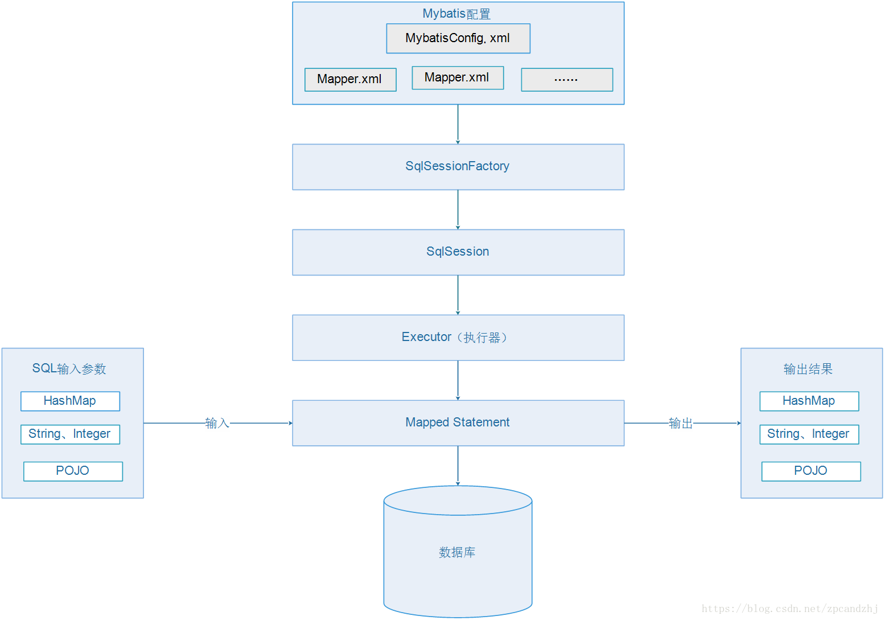
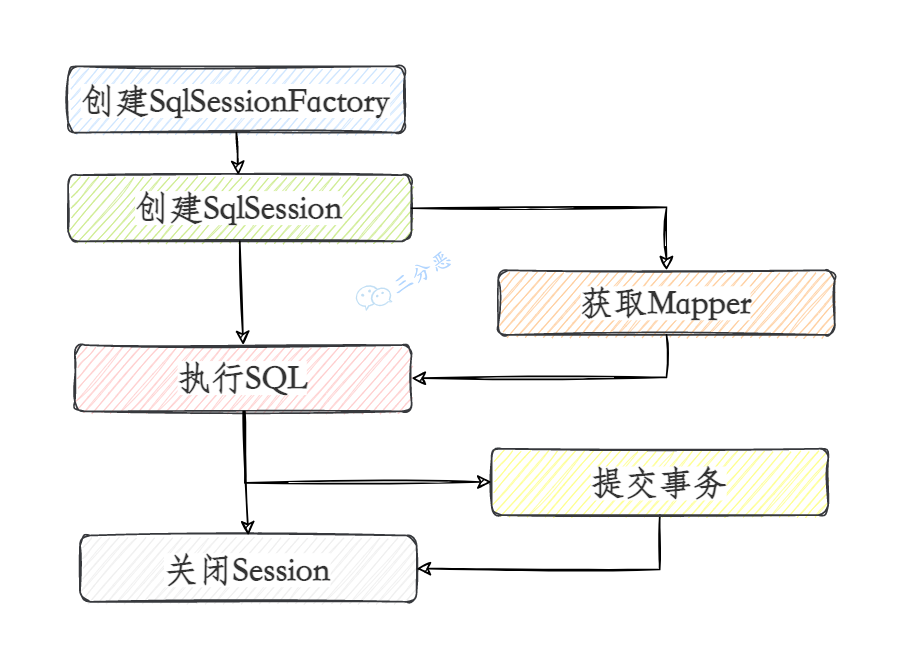
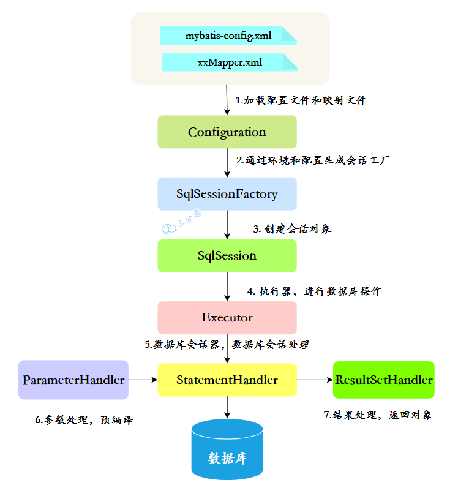
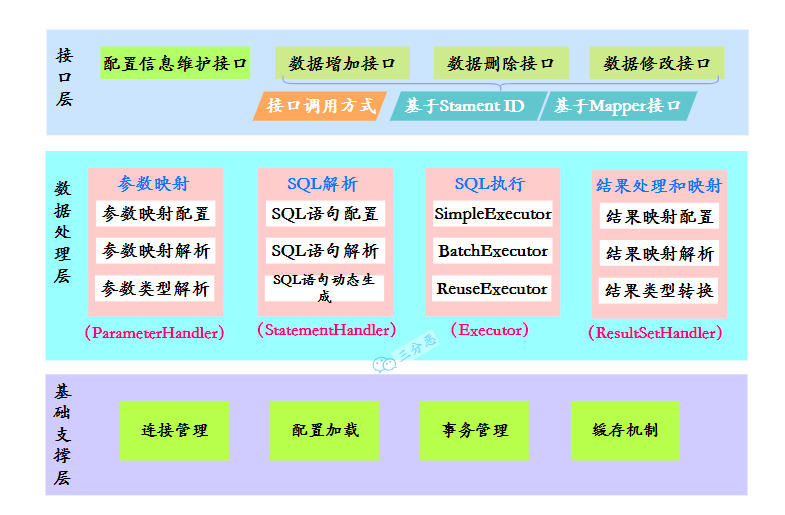
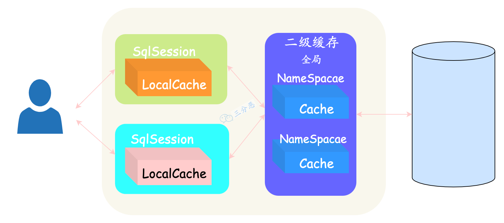

Mybatis 是一个半 ORM（Object Relational Mapping）框架，它内部封装了 JDBC，开发时只需要关注 SQL 语句本身，不需要花费精力去处理加载驱动、创建连接、创建statement 等繁杂的过程。程序员直接编写原生态 sql，可以严格控制 sql 执行性能，灵活度高。
MyBatis 可以使用 XML 或注解来配置和映射原生信息，将 POJO 映射成数据库中的记录，避免了几乎所有的 JDBC 代码和手动设置参数以及获取结果集。

SQL语句的编写工作量较大，尤其当字段多、关联表多时，对开发人员编写SQL语句的功底有一定要求
SQL语句依赖于数据库，导致数据库移植性差，不能随意更换数据库

## MyBatis生命周期

SqlSessionFactoryBuilder
一旦创建了 SqlSessionFactory，就不再需要它了。 因此 SqlSessionFactoryBuilder 实例的生命周期只存在于方法的内部。

SqlSessionFactory
SqlSessionFactory 是用来创建SqlSession的，相当于一个数据库连接池，每次创建SqlSessionFactory都会使用数据库资源，多次创建和销毁是对资源的浪费。所以SqlSessionFactory是应用级的生命周期，而且应该是单例的。

SqlSession
SqlSession相当于JDBC中的Connection，SqlSession 的实例不是线程安全的，因此是不能被共享的，所以它的最佳的生命周期是一次请求或一个方法。

Mapper
映射器是一些绑定映射语句的接口。映射器接口的实例是从 SqlSession 中获得的，它的生命周期在sqlsession事务方法之内，一般会控制在方法级。

## MyBatis工作原理



1. 读取 MyBatis 配置文件——mybatis-config.xml 、加载映射文件——映射文件即 SQL 映射文件，文件中配置了操作数据库的 SQL 语句。最后生成一个配置对象。
2. 构造会话工厂：通过 MyBatis 的环境等配置信息构建会话工厂 SqlSessionFactory。
3. 创建会话对象：由会话工厂创建 SqlSession 对象，该对象中包含了执行 SQL 语句的所有方法。
4. Executor 执行器：MyBatis 底层定义了一个 Executor 接口来操作数据库，它将根据 SqlSession 传递的参数动态地生成需要执行的 SQL 语句，同时负责查询缓存的维护。
5. StatementHandler：数据库会话器，串联起参数映射的处理和运行结果映射的处理。
6. 参数处理：对输入参数的类型进行处理，并预编译。
7. 结果处理：对返回结果的类型进行处理，根据对象映射规则，返回相应的对象

## MyBatis功能架构
API接口层：提供给外部使用的接口API，开发人员通过这些本地API来操纵数据库。接口层一接收到调用请求就会调用数据处理层来完成具体的数据处理。  
数据处理层：负责具体的SQL查找、SQL解析、SQL执行和执行结果映射处理等。它主要的目的是根据调用的请求完成一次数据库操作。  
基础支撑层：负责最基础的功能支撑，包括连接管理、事务管理、配置加载和缓存处理，这些都是共用的东西，将他们抽取出来作为最基础的组件。为上层的数据处理层提供最基础的支撑。



## 在mapper中如何传递多个参数
1. 顺序传参法
```Java 
public User selectUser(String name, int deptId);

<select id="selectUser" resultMap="UserResultMap">
    select * from user
    where user_name = #{0} and dept_id = #{1}
</select>
```
\#{}里面的数字代表传入参数的顺序。
这种方法不建议使用，sql层表达不直观，且一旦顺序调整容易出错。

2. @Param注解传参法
```Java
public User selectUser(@Param("userName") String name, int @Param("deptId") deptId);

<select id="selectUser" resultMap="UserResultMap">
    select * from user
    where user_name = #{userName} and dept_id = #{deptId}
</select>
```
\#{}里面的名称对应的是注解@Param括号里面修饰的名称。
这种方法在参数不多的情况还是比较直观的，（推荐使用）。

3. Map传参法
```Java
public User selectUser(Map<String, Object> params);

<select id="selectUser" parameterType="java.util.Map" resultMap="UserResultMap">
    select * from user
    where user_name = #{userName} and dept_id = #{deptId}
</select>
```
\#{}里面的名称对应的是Map里面的key名称。
这种方法适合传递多个参数，且参数易变能灵活传递的情况。

4. Java Bean传参法
```Java
public User selectUser(User user);

<select id="selectUser" parameterType="com.jourwon.pojo.User" resultMap="UserResultMap">
    select * from user
    where user_name = #{userName} and dept_id = #{deptId}
</select>
```
\#{}里面的名称对应的是User类里面的成员属性。
这种方法直观，需要建一个实体类，扩展不容易，需要加属性，但代码可读性强，业务逻辑处理方便，推荐使用。（推荐使用）。

## 实体类属性名和表中字段名不一样 ，怎么办?
1. 通过在查询的SQL语句中定义字段名的别名，让字段名的别名和实体类的属性名一致。
```SQL
<select id="getOrder" parameterType="int" resultType="com.jourwon.pojo.Order">
       select order_id id, order_no orderno ,order_price price form orders where order_id=#{id};
</select>
```
2. 通过resultMap 中的<result>来映射字段名和实体类属性名的一一对应的关系。
```SQL
<select id="getOrder" parameterType="int" resultMap="orderResultMap">
  select * from orders where order_id=#{id}
</select>

<resultMap type="com.jourwon.pojo.Order" id="orderResultMap">
    <!–用id属性来映射主键字段–>
    <id property="id" column="order_id">
    <!–用result属性来映射非主键字段，property为实体类属性名，column为数据库表中的属性–>
  <result property ="orderno" column ="order_no"/>
  <result property="price" column="order_price" />
</resultMap>
```

## Mybatis二级缓存
一级缓存: 基于 PerpetualCache 的 HashMap 本地缓存，其存储作用域为SqlSession，各个SqlSession之间的缓存相互隔离，当 Session flush 或 close 之后，该 SqlSession 中的所有 Cache 就将清空，MyBatis默认打开一级缓存。

二级缓存与一级缓存其机制相同，默认也是采用 PerpetualCache，HashMap 存储，不同之处在于其存储作用域为 Mapper(Namespace)，可以在多个SqlSession之间共享，并且可自定义存储源，如 Ehcache。默认不打开二级缓存，要开启二级缓存，使用二级缓存属性类需要实现Serializable序列化接口(可用来保存对象的状态),可在它的映射文件中配置。


## ref
(https://javabetter.cn/sidebar/sanfene/mybatis.html)