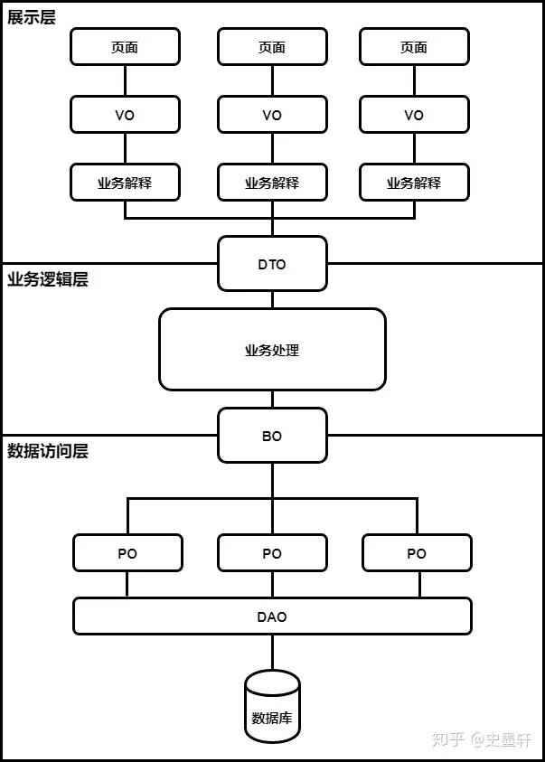

# Object概念


### POJO（Plain Old Java Object）
POJO（Plain Old Java Object）指：那些没有继承任何类、也没有实现任何接口，更没有被其它框架侵入的java对象。

POJO是一个简单的、普通Java对象，它包含业务逻辑处理或持久化逻辑等，但不是JavaBean、EntityBean等，不具有任何特殊角色，不继承或不实现任何其它Java框架的类或接口。 
```Java
//实例
public class DbHello { //简单的Java类，称之为POJO，不继承，不实现接口
   　　private DictionaryDAO dao;
   　　public void setDao(DictionaryDAO dao) {
          　　this.dao = dao;
   　　}
} 
```

### PO(Persistent Object)
O/R Mapping 是 Object Relational Mapping（对象关系映射）的缩写。通俗点讲，就是将对象与关系数据库绑定，用对象来表示关系数据。

PO是在O/R映射的时候出现的概念，如果没有O/R映射，没有这个概念存在了。常用的O/R映射框架有hibernate等。通常对应数据模型(数据库)，本身还有部分业务逻辑的处理。可以看成是与数据库中的表相映射的java对象。最简单的PO就是对应数据库中某个表中的一条记录，多个记录可以用PO的集合。PO中应该不包含任何对数据库的操作。

1、有时也被称为Data对象，对应数据库中的entity，可以简单认为一个PO对应数据库中的一条记录。
2、在hibernate持久化框架中与insert/delet操作密切相关。
3、PO中不应该包含任何对数据库的操作。
4、PO的属性是跟数据库表的字段一一对应的。
5、PO对象需要实现序列化接口。
```Java
//实例
public class User {
    private long id;
    private String name;
    public void setId(long id) {
        this.id = id;
    }
    public void setName(String name) {
        this.name = name;
    }
    public long getId() {
        return id;
    }
    public String getName() {
        return name;
    }
}
```
### DTO/TO(Data Transfer Object)

主要用于远程调用等需要大量传输对象的地方。可以将PO中的部分属性抽取出来，就形成了DTO。

比如我们一张表有100个字段，那么对应的PO就有100个属性。
但是我们界面上只要显示10个字段，客户端用WEB service来获取数据，没有必要把整个PO对象传递到客户端，这时我们就可以用只有这10个属性的DTO来传递结果到客户端，这样也不会暴露服务端表结构.到达客户端以后，如果用这个对象来对应界面显示，那此时它的身份就转为VO（View Object）。

用在需要跨进程或远程传输时，它不应该包含业务逻辑。
比如一张表有100个字段，那么对应的PO就有100个属性（大多数情况下，DTO 内的数据来自多个表）。但view层只需显示10个字段，没有必要把整个PO对象传递到client，这时我们就可以用只有这10个属性的DTO来传输数据到client，这样也不会暴露server端表结构。到达客户端以后，如果用这个对象来对应界面显示，那此时它的身份就转为VO（View Object）。

### VO(Value object)/(View Object)
Value object通常用于业务层之间的数据传递，和PO一样也是仅仅包含数据而已。但应是抽象出的业务对象，可以和表对应，也可以不，这根据业务的需要。个人觉得同DTO(数据传输对象)，在web上传递。

Value object是值对象，精确点讲它是业务对象，是存活在业务层的，是业务逻辑使用的，它存活的目的就是为数据提供一个生存的地方。VO的属性是根据当前业务的不同而不同的，也就是说，它的每一个属性都一一对应当前业务逻辑所需要的数据的名称。
VO是什么？它是值对象，准确地讲，它是业务对象，是生活在业务层的，是业务逻辑需要了解，需要使用的，再简单地讲，它是概念模型转换得到的。 

首先说PO和VO吧，它们的关系应该是相互独立的，一个VO可以只是PO的部分，也可以是多个PO构成，同样也可以等同于一个PO（当然我是指他们的属性）。正因为这样，PO独立出来，数据持久层也就独立出来了，它不会受到任何业务的干涉。又正因为这样，业务逻辑层也独立开来，它不会受到数据持久层的影响，业务层关心的只是业务逻辑的处理，至于怎么存怎么读交给别人吧！不过，另外一点，如果我们没有使用数据持久层，或者说没有使用hibernate，那么PO和VO也可以是同一个东西，虽然这并不好。

---
VO（view object）表现层对象，视图对象。
用一个VO对象对应整个界面的值。

1、主要对应页面显示（web页面/swt、swing界面）的数据对象。
2、可以和表对应，也可以不，这根据业务的需要。
注 ：在struts中，用ActionForm做VO，需要做一个转换，因为PO是面向对象的，而ActionForm是和view对应的，要将几个PO要显示的属性合成一个ActionForm，可以使用BeanUtils的copy方法。

### DAO(Data Access Object)
主要用来封装对数据库的访问。通过它可以把POJO持久化为PO，用PO组装出来VO、DTO。

是一个sun的一个标准j2ee设计模式，这个模式中有个接口就是DAO，它负持久层的操作。为业务层提供接口。此对象用于访问数据库。通常和PO结合使用，DAO中包含了各种数据库的操作方法。通过它的方法，结合PO对数据库进行相关的操作。夹在业务逻辑与数据库资源中间。配合VO，提供数据库的CRUD操作...
1、主要用来封装对DB（数据库）的访问（CRUD操作）。
2、通过接收业务层的数据，把POJO持久化为PO。

### BO（Business Object）
BO就是PO的组合
简单的例子比如说PO是一条交易记录，BO是一个人全部的交易记录集合对象
复杂点儿的例子PO1是交易记录，PO2是登录记录，PO3是商品浏览记录，PO4是添加购物车记录，PO5是搜索记录，BO是个人网站行为对象
BO是一个业务对象，一类业务就会对应一个BO，数量上没有限制，而且BO会有很多业务操作，也就是说除了get，set方法以外，BO会有很多针对自身数据进行计算的方法
为什么BO也画成横跨两层呢？原因是现在很多持久层框架自身就提供了数据组合的功能，因此BO有可能是在业务层由业务来拼装PO而成，也有可能是在数据库访问层由框架直接生成
很多情况下为了追求查询的效率，框架跳过PO直接生成BO的情况非常普遍，PO只是用来增删改使用

# Spring


## Bean
IoC Container管理的是Spring Bean。
Spring里面的bean就类似是定义的一个组件，而这个组件的作用就是实现某个功能的，这里所定义的bean就相当于给了你一个更为简便的方法来调用这个组件去实现你要完成的功能。

```xml
<!-- Constructor-arg with 'value' attribute -->
<bean id="..." class="...">
   <constructor-arg value="..."/>
</bean>
```
### LifeCycle


## IoC(Inversion of Control) 与 DI(Dependency Injection)

### IoC
IoC是一种设计思想，而不是一个具体的技术实现。IoC 的思想就是将原本在程序中手动创建对象的控制权，交由 Spring 框架来管理。为什么叫控制反转？控制：指的是对象创建（实例化、管理）的权力反转：控制权交给外部环境（Spring 框架、IoC 容器）将对象之间的相互依赖关系交给 IoC 容器来管理，并由 IoC 容器完成对象的注入。这样可以很大程度上简化应用的开发，把应用从复杂的依赖关系中解放出来。

传统Java SE程序设计，我们直接在对象内部通过new进行创建对象，是程序主动去创建依赖对象；而IoC是有专门一个容器来创建这些对象，即由Ioc容器来控制对象的创建；谁控制谁？当然是IoC容器控制了对象；控制什么？那就是主要控制了外部资源获取（不只是对象包括比如文件等。为何是反转，哪些方面反转了?有反转就有正转，传统应用程序是由我们自己在对象中主动控制去直接获取依赖对象，也就是正转；而反转则是由容器来帮忙创建及注入依赖对象；为何是反转？因为由容器帮我们查找及注入依赖对象，对象只是被动的接受依赖对象，所以是反转；哪些方面反转了？依赖对象的获取被反转了。

IoC 容器就像是一个工厂一样，当我们需要创建一个对象的时候，只需要配置好配置文件/注解即可，完全不用考虑对象是如何被创建出来的。在实际项目中一个 Service 类可能依赖了很多其他的类，假如我们需要实例化这个 Service，你可能要每次都要搞清这个 Service 所有底层类的构造函数，这可能会把人逼疯。如果利用 IoC 的话，你只需要配置好，然后在需要的地方引用就行了，这大大增加了项目的可维护性且降低了开发难度。在 Spring 中， IoC 容器是 Spring 用来实现 IoC 的载体， IoC 容器实际上就是个 Map（key，value），Map 中存放的是各种对象。Spring 时代我们一般通过 XML 文件来配置 Bean，后来开发人员觉得 XML 文件来配置不太好，于是 SpringBoot 注解配置就慢慢开始流行起来。


### DI
组件之间依赖关系由容器在运行期决定，形象的说，即由容器动态的将某个依赖关系注入到组件之中。依赖注入的目的并非为软件系统带来更多功能，而是为了提升组件重用的频率，并为系统搭建一个灵活、可扩展的平台。通过依赖注入机制，我们只需要通过简单的配置，而无需任何代码就可指定目标需要的资源，完成自身的业务逻辑，而不需要关心具体的资源来自何处，由谁实现。

谁依赖于谁？当然是应用程序依赖于IoC容器；为什么需要依赖？应用程序需要IoC容器来提供对象需要的外部资源；谁注入谁？很明显是IoC容器注入应用程序某个对象，应用程序依赖的对象；注入了什么？就是注入某个对象所需要的外部资源（包括对象、资源、常量数据）。

### IoC和DI关系
其实它们是同一个概念的不同角度描述，由于控制反转概念比较含糊（可能只是理解为容器控制对象这一个层面，很难让人想到谁来维护对象关系），所以2004年大师级人物Martin Fowler又给出了一个新的名字：“依赖注入”，相对IoC 而言，“依赖注入”明确描述了“被注入对象依赖IoC容器配置依赖对象”。通俗来说就是<b><span style="color:red">IoC是设计思想，DI是实现方式</span></b>

### Ioc 配置的三种方式
1. 将bean的信息配置.xml文件里

2. 将类的创建交给配置的JavcConfig类来完成，Spring只负责维护和管理，采用纯Java创建方式。其本质上就是把在XML上的配置声明转移到Java配置类中

3. 通过在类上加注解的方式，来声明一个类交给Spring管理，Spring会自动扫描带有`@Component`，`@Controller`，`@Service`，`@Repository`这四个注解的类，然后帮我们创建并管理，前提是需要先配置Spring的注解扫描器。  
   ` @Component`：通用的注解，可标注任意类为 Spring 组件。如果一个 Bean 不知道属于哪个层，可以使用@Component 注解标注。
    `@Repository` : 对应持久层即 Dao 层，主要用于数据库相关操作。
    `@Service `: 对应服务层，主要涉及一些复杂的逻辑，需要用到 Dao 层。
    `@Controller` : 对应 Spring MVC 控制层，主要用于接受用户请求并调用 Service 层返回数据给前端页面。

### 依赖注入的三种方式
1. setter方式  
在XML配置方式中，property都是setter方式注入

2. 构造函数  
在XML配置方式中，<constructor-arg>是通过构造函数参数注入，比如下面的xml:

3. 注解注入  
     1. - `@Autowired`是Spring自带的注解，通过AutowiredAnnotationBeanPostProcessor 类实现的依赖注入
        - `@Autowired`可以作用在CONSTRUCTOR、METHOD、PARAMETER、FIELD、ANNOTATION_TYPE3
        - `@Autowired`默认是根据类型（byType ）进行自动装配的，如果有多个类型一样的Bean候选者，需要指定按照名称（byName）进行装配，则需要配合@Qualifier。


     2. - `@Resource`是JSR250规范的实现，在javax.annotation包下
        - `@Resource`可以作用TYPE、FIELD、METHOD上
        - `@Resource`是默认根据属性名称进行自动装配的，如果有多个类型一样的Bean候选者，则可以通过name进行指定进行注入`@Resource(name = "BMW")`

     4. - `@Inject`是JSR330 (Dependency Injection for Java)中的规范，需要导入javax.inject.Inject jar包 ，才能实现注入
        - `@Inject`可以作用CONSTRUCTOR、METHOD、FIELD上
        - `@Inject`是根据类型进行自动装配的，如果需要按名称进行装配，则需要配合@Named；
### Spring IoC实现
#### 配置xml
```xml
<?xml version="1.0" encoding="UTF-8"?>
<beans xmlns="http://www.springframework.org/schema/beans"
       xmlns:xsi="http://www.w3.org/2001/XMLSchema-instance"
       xsi:schemaLocation="http://www.springframework.org/schema/beans
        https://www.springframework.org/schema/beans/spring-beans.xsd">

        <!-->IoC配置<-->
        <bean name="lazytype" class="com.example.bean.t3" lazy-init="true"/>
        <bean name="dependstype" class="com.example.bean.t3" depends-on="fathertype"/>
        <bean name="scopetype" class="com.example.bean.t3" scope="singleton/prototype">

        <!-->DI配置<-->
        <bean name="teacher" class="com.test.bean.ProgramTeacher"/>

        <bean name="student1" class="com.test.bean.Student1">
            <property name="teacher" ref="teacher"/>

        <bean name="student2" class="com.test.bean.Student2">
            <property name="teacher" value="Alice"/>
        </bean>

        <bean name="student3" class="com.test.bean.Student3">
            <constructor-arg name="teacher" ref="teacher"/>
        </bean>

        <bean name="student4" class="com.test.bean.Student4">
            <constructor-arg value="1" type="int"/>
            <!-->or
            <constructor-arg value="1" name="age"/>
            <-->
        </bean> 

        <bean name="student5" class="com.test.bean.Student5">
            <!--  对于集合类型，我们可以直接使用标签编辑集合的默认值  -->
            <property name="list">
                <list>
                    <value>AAA</value>
                    <value>BBB</value>
                    <value>CCC</value>
                </list>
            </property>
        </bean>    

        <bean name="student6" class="com.test.bean.Student6">
            <property name="map">
                <map>
                    <entry key="语文" value="100.0"/>
                    <entry key="数学" value="80.0"/>
                    <entry key="英语" value="92.5"/>
                </map>
            </property>
        </bean>
        <!-->自动装配<-->
        <bean name="student" class="com.test.bean.Student" autowire="byType(default)/byName/constructor"/>

</beans>


```
```Java
public class Student1 {
    private Teacher teacher;
  	//要使用依赖注入，我们必须提供一个set方法（无论成员变量的访问权限是什么）命名规则依然是驼峰命名法
    public void setTeacher(Teacher teacher) {
        this.teacher = teacher;
    }
    ...
}

public class Student3 {
    private final Teacher teacher;   //构造方法中完成，所以说是一个final变量

    public Student3(Teacher teacher){   //Teacher属性是在构造方法中完成的初始化
        this.teacher = teacher;
    }
  	...
}
```
- IoC
  - lazy-init：第一次使用时才进行加载
  - depends-on：depends-on加载完毕后才进行加载，保证顺序
  - 作用域: 默认singleton（单例模式）；prototype（原型模式）
- DI
    - property需要setter注入
    - property可以设置常数
    - constructor-arg:构造注入
    - constructor-arg设置常数
    - 集合类注入
    - 集合类注入2
    - 自动装配

#### 注解实现
##### Bean注册注解实现
```Java
//创建配置类
@Configuration
public class MainConfiguration {
}
------
//指定配置类实现
ApplicationContext context = new AnnotationConfigApplicationContext(MainConfiguration.class);
//这个构造方法可以接收多个配置类（更准确的说是多个组件）
```

```Java
@Configuration
public class MainConfiguration {
    //相当于<bean name = "student" class="com.test.bean.Student"/>
    @Bean("student")
    public Student student(){
        return new Student();
    }

    //其他属性的实现
    @Bean(name = "", initMethod = "", destroyMethod = "", autowireCandidate = false)
    @Lazy(true)     //对应lazy-init属性
    @Scope("prototype")    //对应scope属性
    @DependsOn("teacher")    //对应depends-on属性
    public Student student(){
        return new Student();
    }
}
```

##### DI注解实现
需要引入其他Bean进行的注入，我们可以直接将其作为形式参数放到方法
```Java
@Configuration
public class MainConfiguration {
    @Bean
    public Teacher teacher(){
        return new Teacher();
    }

    @Bean
    public Student student(Teacher teacher){
        return new Student(teacher);
    }
}
```
##### 自动装配实现
- @Resource：默认ByName如果找不到则ByType，可以添加到set方法、字段上。
- @Autowired：默认是byType，只会根据类型寻找，可以添加在构造方法、set方法、字段、方法参数上。
```Java
public class Student {
    @Autowired
    private Teacher teacher;

    @Autowired
    public void setTeacher(Teacher teacher) {
        this.teacher = teacher;
    }

    @Autowired
    @Qualifier("a")   //匹配名称为a的Teacher类型的Bean
    private Teacher teacher2;

}
```

- @Component:
  我们可以在需要注册为Bean的类上添加@Component注解来将一个类进行注册**（现在最常用的方式）**，不过要实现这样的方式，我们需要添加一个自动扫描来告诉Spring，它需要在哪些包中查找我们提供的@Component声明的Bean。

```Java
@Component("lbwnb")   //同样可以自己起名字,而默认名使用默认驼峰命名，例子中如果不起名默认名就叫"student"
public class Student {
}

@Configuration
@ComponentScan("com.test.bean")   //包扫描，这样Spring就会去扫描对应包下所有的类
public class MainConfiguration {
}
```
## SpEL
### .properties
我们需要创建以.properties结尾的配置文件，这种配置文件格式很简单，类似于Map，需要一个Key和一个Value，中间使用等号进行连接，这里我们在resource目录下创建一个test.properties文件：
这样，Key就是test.name，Value就是只因，我们可以通过一个注解直接读取到外部配置文件中对应的属性值，首先我们需要引入这个配置文件，我们可以在配置类上添加@PropertySource注解

```Java
@Configuration
@ComponentScan("com.test.bean")
@PropertySource("classpath:test.properties")   //注意，类路径下的文件名称需要在前面加上classpath:
public class MainConfiguration{
}

@Component
public class Student {
    @Value("${test.name}")   //这里需要在外层套上 ${ }
    private String name;   //String会被自动赋值为配置文件中对应属性的值

    public void hello(){
        System.out.println("我的名字是："+name);
    }
}
```

## AOP(Aspect Oriented Programming)
预编译方式和运行期间动态代理实现程序的统一维护的一种技术

### Spring AOP
将那些与业务无关，却为业务模块所共同调用的逻辑或责任（例如事务处理、日志管理、权限控制等）封装起来，便于减少系统的重复代码，降低模块间的耦合度，并有利于未来的可拓展性和可维护性。Spring AOP 就是基于动态代理的，如果要代理的对象，实现了某个接口，那么 Spring AOP 会使用 JDK Proxy，去创建代理对象，而对于没有实现接口的对象，就无法使用 JDK Proxy 去进行代理了，这时候 Spring AOP 会使用 Cglib 生成一个被代理对象的子类来作为代理。 


### AOP术语
- 连接点（Jointpoint）：表示需要在程序中插入横切关注点的扩展点，连接点可能是类初始化、方法执行、方法调用、字段调用或处理异常等等，Spring只支持方法执行连接点，在AOP中表示为在哪里干；
- 切入点（Pointcut）： 选择一组相关连接点的模式，即可以认为连接点的集合，Spring支持perl5正则表达式和AspectJ切入点模式，Spring默认使用AspectJ语法，在AOP中表示为在哪里干的集合；
- 通知（Advice）：在连接点上执行的行为，通知提供了在AOP中需要在切入点所选择的连接点处进行扩展现有行为的手段；包括前置通知（before advice）、后置通知(after advice)、环绕通知（around advice），在Spring中通过代理模式实现AOP，并通过拦截器模式以环绕连接点的拦截器链织入通知；在AOP中表示为干什么；
- 方面/切面（Aspect）：横切关注点的模块化，比如上边提到的日志组件。可以认为是通知、引入和切入点的组合；在Spring中可以使用Schema和@AspectJ方式进行组织实现；在AOP中表示为在哪干和干什么集合；
- 引入（inter-type declaration）：也称为内部类型声明，为已有的类添加额外新的字段或方法，Spring允许引入新的接口（必须对应一个实现）到所有被代理对象（目标对象）, 在AOP中表示为干什么（引入什么）；
- 目标对象（Target Object）：需要被织入横切关注点的对象，即该对象是切入点选择的对象，需要被通知的对象，从而也可称为被通知对象；由于Spring AOP 通过代理模式实现，从而这个对象永远是被代理对象，在AOP中表示为对谁干；
- 织入（Weaving）：把切面连接到其它的应用程序类型或者对象上，并创建一个被通知的对象。这些可以在编译时（例如使用AspectJ编译器），类加载时和运行时完成。Spring和其他纯Java AOP框架一样，在运行时完成织入。在AOP中表示为怎么实现的；
- AOP代理（AOP Proxy）：AOP框架使用代理模式创建的对象，从而实现在连接点处插入通知（即应用切面），就是通过代理来对目标对象应用切面。在Spring中，AOP代理可以用JDK动态代理或CGLIB代理实现，而通过拦截器模型应用切面。在AOP中表示为怎么实现的一种典型方式；

### 通知类型
- 前置通知（Before advice）：在某连接点之前执行的通知，但这个通知不能阻止连接点之前的执行流程（除非它抛出一个异常）。
- 后置通知（After returning advice）：在某连接点正常完成后执行的通知：例如，一个方法没有抛出任何异常，正常返回。
- 异常通知（After throwing advice）：在方法抛出异常退出时执行的通知。
- 最终通知（After (finally) advice）：当某连接点退出的时候执行的通知（不论是正常返回还是异常退出）。
- 环绕通知（Around Advice）：包围一个连接点的通知，如方法调用。这是最强大的一种通知类型。环绕通知可以在方法调用前后完成自定义的行为。它也会选择是否继续执行连接点或直接返回它自己的返回值或抛出异常来结束执行。环绕通知是最常用的通知类型。

### AspectJ
AspectJ是一个java实现的AOP框架，它能够对java代码进行AOP编译（一般在编译期进行），让java代码具有AspectJ的AOP功能（当然需要特殊的编译器）可以这样说AspectJ是目前实现AOP框架中最成熟，功能最丰富的语言，更幸运的是，AspectJ与java程序完全兼容，几乎是无缝关联，因此对于有java编程基础的工程师，上手和使用都非常容易。

Spring AOP 属于运行时增强，而 AspectJ 是编译时增强。 Spring AOP 基于代理(Proxying)，而 AspectJ 基于字节码操作(Bytecode Manipulation)。Spring AOP 已经集成了 AspectJ ，AspectJ 应该算的上是 Java 生态系统中最完整的 AOP 框架了。AspectJ 相比于 Spring AOP 功能更加强大，但是 Spring AOP 相对来说更简单，如果我们的切面比较少，那么两者性能差异不大。但是，当切面太多的话，最好选择 AspectJ ，它比 Spring AOP 快很多。


## Spring MVC(Model View Controller)
MVC 是模型(Model)、视图(View)、控制器(Controller)的简写，一种软件设计规范。本质上也是一种解耦。其核心思想是通过将业务逻辑、数据、显示分离来组织代码。


### 核心组件
- DispatcherServlet：核心的中央处理器，负责接收请求、分发，并给予客户端响应。
- HandlerMapping：处理器映射器，根据 URL 去匹配查找能处理的 Handler ，并会将请求涉及到的拦截器和 Handler 一起封装。
- HandlerAdapter：处理器适配器，根据 HandlerMapping 找到的 Handler ，适配执行对应的 Handler；
- Handler：请求处理器，处理实际请求的处理器。
- ViewResolver：视图解析器，根据 Handler 返回的逻辑视图 / 视图，解析并渲染真正的视图，并传递给 DispatcherServlet 响应客户端

### 运行流程
1. 客户端（浏览器）发送请求， DispatcherServlet拦截请求。
2. DispatcherServlet 根据请求信息调用 HandlerMapping 。HandlerMapping 根据 URL 去匹配查找能处理的 Handler（也就是我们平常说的 Controller 控制器） ，并会将请求涉及到的拦截器和 Handler 一起封装。
3. DispatcherServlet 调用 HandlerAdapter适配器执行 Handler 。
4. Handler 完成对用户请求的处理后，会返回一个 ModelAndView 对象给DispatcherServlet，ModelAndView 顾名思义，包含了数据模型以及相应的视图的信息。Model 是返回的数据对象，View 是个逻辑上的 View。
5. ViewResolver 会根据逻辑 View 查找实际的 View。
6. DispaterServlet 把返回的 Model 传给 View（视图渲染）。
7. 把 View 返回给请求者（浏览器）


## Spring 框架中用到了哪些设计模式？
工厂设计模式 : Spring 使用工厂模式通过 BeanFactory、ApplicationContext 创建 bean 对象。
代理设计模式 : Spring AOP 功能的实现。
单例设计模式 : Spring 中的 Bean 默认都是单例的。
模板方法模式 : Spring 中 jdbcTemplate、hibernateTemplate 等以 Template 结尾的对数据库操作的类，它们就使用到了模板模式。
包装器设计模式 : 我们的项目需要连接多个数据库，而且不同的客户在每次访问中根据需要会去访问不同的数据库。这种模式让我们可以根据客户的需求能够动态切换不同的数据源。
观察者模式: Spring 事件驱动模型就是观察者模式很经典的一个应用。
适配器模式 : Spring AOP 的增强或通知(Advice)使用到了适配器模式、spring MVC 中也是用到了适配器模式适配Controller。


## Spring 事务
### Spring 管理事务的方式有几种？
编程式事务：在代码中硬编码(不推荐使用) : 通过 TransactionTemplate或者 TransactionManager 手动管理事务，实际应用中很少使用，但是对于你理解 Spring 事务管理原理有帮助。
声明式事务：在 XML 配置文件中配置或者直接基于注解（推荐使用） : 实际是通过 AOP 实现（基于@Transactional 的全注解方式使用最多）

### Spring 事务中哪几种事务传播行为?

REQUIRED使用的最多的一个事务传播行为，我们平时经常使用的@Transactional注解默认使用就是这个事务传播行为。如果当前存在事务，则加入该事务；如果当前没有事务，则创建一个新的事务。

REQUIRES_NEW创建一个新的事务，如果当前存在事务，则把当前事务挂起。也就是说不管外部方法是否开启事务，Propagation.REQUIRES_NEW修饰的内部方法会新开启自己的事务，且开启的事务相互独立，互不干扰。

NESTED如果当前存在事务，则创建一个事务作为当前事务的嵌套事务来运行；如果当前没有事务，则该取值等价于TransactionDefinition.PROPAGATION_REQUIRED。

### Spring 事务中的隔离级别有哪几种?

DEFAULT :使用后端数据库默认的隔离级别，MySQL 默认采用的 REPEATABLE_READ 隔离级别 Oracle 默认采用的 READ_COMMITTED 隔离级别.

READ_UNCOMMITTED :最低的隔离级别，使用这个隔离级别很少，因为它允许读取尚未提交的数据变更，可能会导致脏读、幻读或不可重复读TransactionDefinition.ISOLATION_READ_COMMITTED : 允许读取并发事务已经提交的数据，可以阻止脏读，但是幻读或不可重复读仍有可能发生

REPEATABLE_READ : 对同一字段的多次读取结果都是一致的，除非数据是被本身事务自己所修改，可以阻止脏读和不可重复读，但幻读仍有可能发生。TransactionDefinition.

SERIALIZABLE : 最高的隔离级别，完全服从 ACID 的隔离级别。所有的事务依次逐个执行，这样事务之间就完全不可能产生干扰，也就是说，该级别可以防止脏读、不可重复读以及幻读。但是这将严重影响程序的性能。通常情况下也不会用到该级别。
