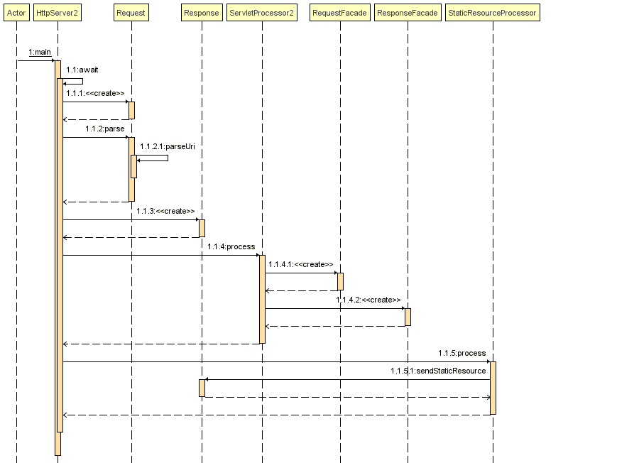

## Web容器
Request - 表示请求，这里表示浏览器发起的HTTP请求  
HttpServer - 表示处理请求的服务器，同时这里使用我们上面铺垫的ServerSocket  
Reponse - 表示处理请求后的响应， 这里表示服务器对HTTP请求的响应结果  




### HttpServer

```Java
public class HttpServer {

  // 存放静态资源的位置
  public static final String WEB_ROOT =
    System.getProperty("user.dir") + File.separator  + "webroot";

  // 关闭Server的请求
  private static final String SHUTDOWN_COMMAND = "/SHUTDOWN";

  // 是否关闭Server
  private boolean shutdown = false;

  // 主入口
  public static void main(String[] args) {
    HttpServer server = new HttpServer();
    server.await();
  }

  public void await() {
    // 启动ServerSocket
    ServerSocket serverSocket = null;
    int port = 8080;
    try {
      serverSocket =  new ServerSocket(port, 1, InetAddress.getByName("127.0.0.1"));
    }
    catch (IOException e) {
      e.printStackTrace();
      System.exit(1);
    }

    // 循环等待一个Request请求
    while (!shutdown) {
      Socket socket = null;
      InputStream input = null;
      OutputStream output = null;
      try {
        // 创建socket
        socket = serverSocket.accept();
        input = socket.getInputStream();
        output = socket.getOutputStream();

        // 封装input至request, 并处理请求
        Request request = new Request(input);
        request.parse();

        // 封装output至response
        Response response = new Response(output);
        response.setRequest(request);
        response.sendStaticResource();

        // 关闭socket
        socket.close();

        // 如果接受的是关闭请求，则设置关闭监听request的标志
        shutdown = request.getUri().equals(SHUTDOWN_COMMAND);
      }
      catch (Exception e) {
        e.printStackTrace();
        continue;
      }
    }
  }
}

```

### Request
```Java
public class Request {

  private InputStream input;
  private String uri;

  // 初始化Request
  public Request(InputStream input) {
    this.input = input;
  }

  // 处理request的方法
  public void parse() {
    // 从socket中读取字符
    StringBuffer request = new StringBuffer(2048);
    int i;
    byte[] buffer = new byte[2048];
    try {
      i = input.read(buffer);
    }
    catch (IOException e) {
      e.printStackTrace();
      i = -1;
    }
    for (int j=0; j<i; j++) {
      request.append((char) buffer[j]);
    }
    System.out.print(request.toString());

    // 获得两个空格之间的内容, 这里将是HttpServer.WEB_ROOT中静态文件的文件名称
    uri = parseUri(request.toString());
  }

  private String parseUri(String requestString) {
    int index1, index2;
    index1 = requestString.indexOf(' ');
    if (index1 != -1) {
      index2 = requestString.indexOf(' ', index1 + 1);
      if (index2 > index1)
        return requestString.substring(index1 + 1, index2);
    }
    return null;
  }

  public String getUri() {
    return uri;
  }

}
```

### Response
```Java
public class Response {

  private static final int BUFFER_SIZE = 1024;
  Request request;
  OutputStream output;

  public Response(OutputStream output) {
    this.output = output;
  }

  // response中封装了request，以便获取request中的请求参数
  public void setRequest(Request request) {
    this.request = request;
  }

  public void sendStaticResource() throws IOException {
    byte[] bytes = new byte[BUFFER_SIZE];
    FileInputStream fis = null;
    try {
      // 读取文件内容
      File file = new File(HttpServer.WEB_ROOT, request.getUri());
      if (file.exists()) {
        fis = new FileInputStream(file);
        int ch = fis.read(bytes, 0, BUFFER_SIZE);
        while (ch!=-1) {
          output.write(bytes, 0, ch);
          ch = fis.read(bytes, 0, BUFFER_SIZE);
        }
      }
      else {
        // 文件不存在时，输出404信息
        String errorMessage = "HTTP/1.1 404 File Not Found\r\n" +
          "Content-Type: text/html\r\n" +
          "Content-Length: 23\r\n" +
          "\r\n" +
          "<h1>File Not Found</h1>";
        output.write(errorMessage.getBytes());
      }
    }
    catch (Exception e) {
      // thrown if cannot instantiate a File object
      System.out.println(e.toString() );
    }
    finally {
      if (fis!=null)
        fis.close();
    }
  }
}
```

### Servlet
Servlet是Sun为了让Java能实现动态可交互的网页，从而进入Web编程领域而制定的一套标准。一个Servlet主要做下面三件事情：创建并填充Request对象，包括：URL、参数、method、请求头信息、请求体信息等创建Response对象执行业务逻辑，将结果通过Response的输出流输出到客户端
